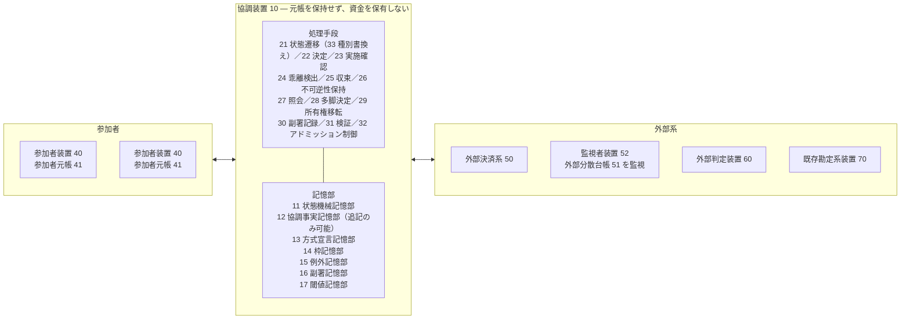
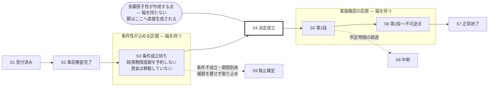
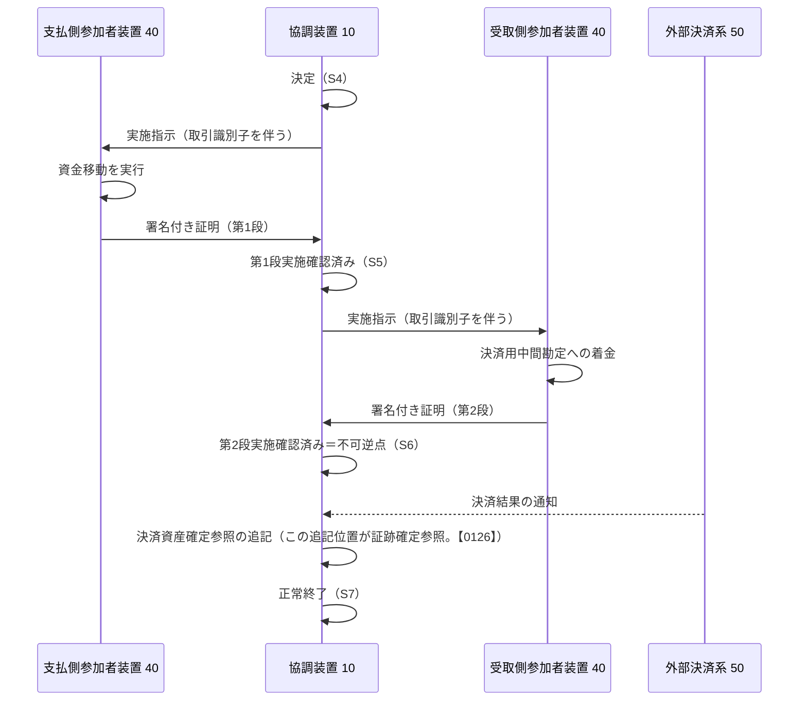
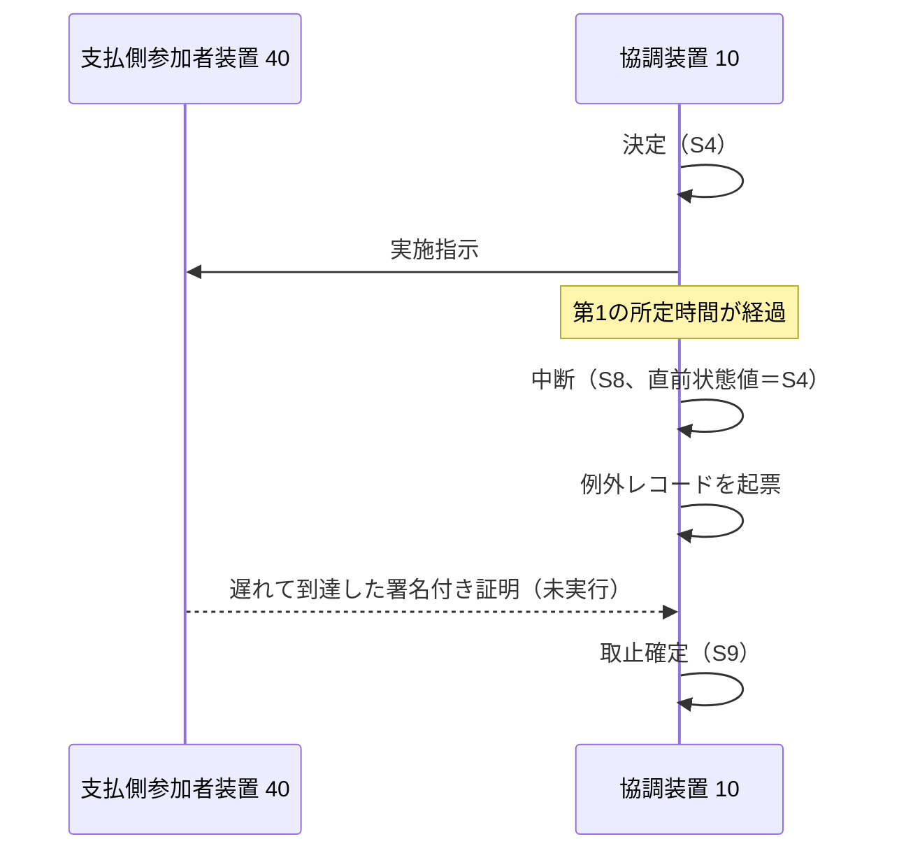

# 決済協調装置、決済協調方法およびプログラム

# 【書類名】明細書

## 【発明の名称】

決済協調装置、決済協調方法およびプログラム

---

## 【技術分野】

【0001】本発明は、複数の参加者の間で行われる資金移動を協調させる情報処理技術に関する。より具体的には、参加者の元帳を保持せず資金を保有しない情報処理装置（決済協調層）が、参加者間の資金移動を、後から説明可能な状態の連なりとして管理する技術に関する。

---

## 【背景技術】

【0002】銀行その他の金融機関（以下「参加者」という）の間で資金を移動させる場合、資金の実体は各参加者が自ら保持する元帳の上で動く。参加者間の資金移動を調整する主体（以下「協調装置」という）は、通常、これらの元帳を保持せず、資金を保有せず、参加者の元帳を直接操作する権限も持たない。参加者間の清算を担う資金清算機関がこの位置にあたる。すなわち当該機関は、参加者の元帳を保持せず資金を保有しないまま、参加者間の債権債務を清算し、純債務限度額その他の限度額を管理する。その結果としての決済は、中央銀行の当座勘定における付替えおよび各参加者の元帳上の記帳として行われる。したがって、元帳を保持せず資金を保有しないことは、この位置にある主体に共通する属性であって、当該主体が担いうる機能の範囲を狭めるものではない。本発明の協調装置は、この位置において、従来の資金清算機関が担ってきた清算・限度額管理・完了の宣言を、決定と実施の分離および有界時間での乖離検出を備えた形で再構成するものであり、当該機能を担う装置として既存の構成を置き換えうる。以下、この構成の下で従来技術が抱える課題を、原子性とその代償（【0003】から【0007】まで）、記録の真正性（【0008】）、異種の決済レールの接続（【0009】）、完了の定義（【0010】）、および機微情報の開示（【0011】）の順に述べる。

【0003】このような構成において、複数の参加者にまたがる資金移動を単一の原子的なトランザクションとして実現することは原理的にできない。協調装置は、参加者に対して実行を要求できるだけであり、実行を強制することも、実行済みの資金移動を巻き戻すこともできないためである。

【0004】従来、この問題に対しては大きく 2 つの方向の技術が用いられてきた。第1は、二相コミット（2PC）に代表される分散トランザクション技術である。参加者に資源を予約させたうえで一括して確定させる方式であるが、調整役の障害時に参加者が資源を保持したまま停止（ブロック）するため、参加者の元帳が長時間拘束される。金融機関の勘定系システムにおいてこれは受容できない。

【0005】第2は、結果整合性（eventual consistency）に委ねる方式である。各参加者が独立に処理を進め、不一致は事後の照合により解消する。この方式は可用性に優れるが、不一致がいつ解消されるのか、誰の責任で解消されるのかを保証しない。決済は事後に争点化しうるため、この保証の欠如は実務上の欠陥となる。

【0006】原子性の代償は、条件付きの資金移動を扱う技術においても同様である。この類型の技術としてハッシュタイムロック契約（HTLC）が知られている（非特許文献6）。HTLC は条件性の実現手段であると同時に、秘密値の一括開示により複数の脚を一括して確定させる、多脚原子性の実現手段でもある。もっとも、HTLC は二相コミット（【0004】）と同様に、原子性の対価を流動性の拘束によって支払う——条件成立待ちの全期間にわたって、中継参加者の資金が拘束される。

【0007】この流動性の拘束を緩和する技術として、特許文献1 は、トランザクションのロック解除情報（電子署名および秘密情報）とロック解除条件（公開鍵、ハッシュ値および時刻）とを台帳上で順序に従って照合させ、対価同時決済（DvP）取引においてタイムアウトの到来を待たずにエスクロー中の資産を引き戻す構成を開示する。しかし、当該構成は資産を保有する決済装置の側でロックと引戻しとを扱うものであり、拘束の期間を短縮するにとどまる。資金を保有しない協調装置において、条件成立待ちの期間に限度額の予約自体を行わないという構成は開示されていない。また、当該構成が扱う状態は資産のロック・引戻し・終了であって、決定が成立したにもかかわらず実施が確認されないという不一致を、有界時間内に検出し帰責して説明する対象とする構成は開示されていない。

【0008】記録の真正性についても課題がある。決済の記録を追記型（append-only）の暗号台帳として保持する技術が知られている。特許文献2 および特許文献3 は、取引報告および清算指示を暗号署名とともにデータブロックへ束ね、階層化・シャード化された複数の追記型台帳へ追記することにより、証券決済を迅速化する構成を開示する。もっとも、これらは記録の真正性を台帳の連鎖および運営者による署名検証に依拠するものであり、当該記録を保持する運営者自身が連鎖ごと作り直す場合には無力である。

【0009】異種の決済レールにまたがる取引にも課題がある。条件付きの状態を保持できる外部分散台帳と、これを保持できない伝統的な決済レール（中央銀行の即時グロス決済、ネット決済サイクル等）とにまたがる取引では、一方の完了を観測して他方を起動する中継層（以下「ブリッジ」という）が置かれてきた。ブリッジの両側は別個の状態機械・証跡・限度額を持ち、ブリッジの上で生じた不一致を説明する主体が存在しない。

【0010】資金移動の完了（決済完了性、settlement finality）の定義にも課題がある（非特許文献5）。「受取人の口座に入金されたこと」を完了とする定義は、受取人口座の解約・凍結という、支払人にも協調装置にも制御できない事象によって完了が妨げられる。また、決済完了性は性質の異なる2つの事実——当事者間で「成立したものとして扱う」という規程上の確定と、決済資産（中央銀行マネー等）の実際の付替え——を含む（非特許文献5）。前者を宣言するのは資金清算機関の規程であり、後者は中央銀行の当座勘定および各参加者の元帳において行われる。すなわち、規程上の確定を宣言する層と決済資産を付け替える層とは、既存の決済インフラにおいても別個の主体に属し、前者を担う主体は後者を保有も制御もしない。

【0011】最後に、協調装置が保持する情報の開示にも課題がある。当該情報の中には、「ある参加者が当日資金不足である」といった、開示の態様を誤ると金融システム全体の安定を損ないうる機微な情報が含まれる。

---

## 【先行技術文献】

### 【特許文献】

【0012】
- 【特許文献1】特開2022-40968号公報（株式会社日立製作所「電子決済システムおよび電子決済方法」。2022年3月11日公開。ハッシュタイムロック契約を拡張し、DvP 取引においてタイムアウトに依存せずロック中の資産を引き戻す構成）
- 【特許文献2】米国特許出願公開第2019/0180372号明細書（Domus Tower, Inc. "Settlement of securities trades using append only ledgers"。2019年6月13日公開。追記型台帳による証券決済）
- 【特許文献3】米国特許第11,410,233号明細書（Domus Tower, Inc. "Blockchain technology to settle transactions"。2022年8月9日登録。特許文献2 と同一の優先権に基づく、階層化された追記型台帳による証券決済）

### 【非特許文献】

【0013】
- 【非特許文献1】Haber, S. and Stornetta, W.S., "How to Time-Stamp a Digital Document", Journal of Cryptology, 1991（ハッシュ連鎖による文書の時刻証明）
- 【非特許文献2】Laurie, B., Langley, A. and Kasper, E., "Certificate Transparency", RFC 6962, 2013（追記型の透明性ログと、その末尾に対する署名）
- 【非特許文献3】Ongaro, D. and Ousterhout, J., "In Search of an Understandable Consensus Algorithm (Raft)", USENIX ATC, 2014（分散合意ログ）
- 【非特許文献4】Garcia-Molina, H. and Salem, K., "Sagas", ACM SIGMOD, 1987（補償による長期トランザクション）
- 【非特許文献5】Committee on Payment and Settlement Systems and Technical Committee of IOSCO, "Principles for Financial Market Infrastructures", Bank for International Settlements, 2012（決済システムの完了性および流動性の要件）
- 【非特許文献6】Poon, J. and Dryja, T., "The Bitcoin Lightning Network: Scalable Off-Chain Instant Payments", 2016（ハッシュタイムロック契約の連鎖による条件付き資金移動と多脚原子性の実現）

---

## 【発明の概要】

### 【発明が解決しようとする課題】

【0014】第1の課題は、原子性が得られない系において、何を保証対象とするかである。背景技術に述べたとおり、参加者間の資金移動に真の原子性は得られない。にもかかわらず原子性を主張する設計は、障害時にその主張が破れたとき、何が起きたのかを説明する語彙を持たない。「決めたのに実行されていない」「実行されたのに決めた記録がない」という状態が、定義されていない中間状態として滞留する。保証対象を宣言することは、何をもって当該資金移動が完了したとするかを定めることを含む。ところが「受取人の口座に入金されたこと」を完了とする一般的な定義は、受取人口座の解約・凍結という、支払人にも協調装置にも制御できない事象によって完了が妨げられる（【0010】）。すなわち、保証の対象が、当事者のいずれもが制御できない外部の事象に依存する。

【0015】第2の課題は、条件性（所定の条件が成立するまで資金移動を保留し、期限到来で自動的に取り止める性質。定義は【0098】）と多脚原子性（複数の資金移動を「全部行うか、全部行わないか」として一括で決める性質。定義は【0098】）の合成である。ブリッジによる合成には次の欠陥がある。(a) ブリッジの両側で状態機械・証跡・限度額が別物になり、ブリッジの上で生じた不一致を説明する主体が存在しない。(b) 観測と起動の間に、両側のいずれにも属さない時間が生じ、そこでの障害がどちらの回復手順にも属さない。(c) 条件性を後から付加または除去する要求に対し、取引種別ごと作り直しになる。他方、ブリッジを用いず、二相コミットまたはハッシュタイムロック契約により両者を合成する構成には、別の欠陥がある。すなわち、いずれも原子性の対価を流動性の拘束によって支払う——条件の成立を待つ全期間にわたり、参加者の元帳または中継参加者の資金が拘束される（【0004】【0006】）。特許文献1 はこの拘束の期間を短縮するが、資金を保有しない協調装置において、当該期間に純債務限度額の予約自体を行わないという構成は開示されていない（【0007】）。したがって、条件性と多脚原子性とを、ブリッジを要せず、かつ条件の成立を待つ期間に流動性を拘束せずに合成する構成が必要である。

【0016】第3の課題は、不一致の検出と収束の保証である。不一致が起きること自体は避けられない以上、(a) すべての不一致が有界な時間内に検出されること、(b) 検出された不一致が必ず人手の処理対象へ到達すること、(c) その説明が事後に改変されていないことを、当該記録を保持する運営者自身による再構成に対しても検証できること（【0008】）、の 3 つを構造として備える必要がある。

【0017】第4の課題は、機微情報の開示制御である。権限のない照会に対して認可の失敗を意味する応答を返し、対象が存在しない照会に対して不存在を意味する応答を返すという、一般的で正しい実装は、応答の差分そのものが答えになる。これは認可の不備ではなく、認可が正しく働いた結果として漏れるため、権限設計を厳格にしても解消しない。

### 【課題を解決するための手段】

【0018】上記の課題を解決するため、本発明の決済協調装置は、原子性の対象を「決定」のみに限定して宣言し、実施の不一致を有界時間内の検出・帰責（原因主体の特定と記録。【0142】1 の原因主体識別子による）・説明の対象として設計するという構成をとる。

【0019】すなわち、本発明の中心となる構成は、資金移動を単一の原子的トランザクションとすることを明示的に放棄し、代わりに「不一致は起きる。ただし、すべての不一致は有界時間内に検出され、帰責され、同一の説明として提示される」ことを保証対象とする点にある。

【0020】この構成は、【表1】に示す 4 層として具体化される。層は実装の順序ではなく、依存の順序である。すなわち上位層は下位層の存在を前提とする。

【0021】

【表1】

| 層 | 保証すること | 主たる構成 |
|---|---|---|
| 第4層 | その説明が事後に作られたものでないこと | 追記型監査ログ（ハッシュ連鎖）、当事者副署、定期アンカー |
| 第3層 | 説明できない状態が必ず一箇所に集まり人へ渡ること | 単一の例外レコードへの全検出経路の合流 |
| 第2層 | 不一致が有界時間内に検出され、その間も純債務限度額（【0039】）が破れないこと | 状態別のタイマ、単一所有者則、二層の予約枠、照合 |
| 第1層 | 何を原子的に扱い、何を扱わないかが宣言されていること | 決定と実施の分離、二段階完了、確定の三層分離 |

【0022】なお、第11の実施形態が扱う機微情報の開示制御、および第25の実施形態が扱う障害シナリオの横断的な整理は、いずれの層の記録に対しても適用されうる横断的な構成であり、上記 4 層のいずれか 1 つには対応しない。

【0023】第1層を宣言せずに第2層以降を構成すると、検出された不一致が「不具合」として扱われ、収束先が設計されない。第3層を持たずに第4層を構成すると、改変不能な記録の中に誰も参照しない未解決状態が蓄積する。

【0024】（第1の課題に対する手段）決済協調装置は、取引がとりうる状態値の集合と許容される遷移の集合とを定義した状態機械と、状態遷移の履歴を追記のみ可能な形式で記憶する協調事実記憶部とを備える。実施指示（協調装置が参加者装置に対して資金移動の実行を求める指示。詳細は【0069】）を発出することの確定（以下「決定」という）を、他の処理と原子的に、かつ全部成立または全部不成立として行い、資金が不可逆に移動したことを示す署名付き証明の受領（以下「実施確認」という）を、少なくとも支払側完了を示す第1段と受取側完了を示す第2段とを含む複数の段に区分し、最終段の追記をもって当該取引の不可逆点とする（基本形態では段数を 2 とし、第2段が最終段を兼ねる。これを二段階完了という。【0080】）。そして、決定が原子的に保証される一方、実施確認の同時性および全部成立が保証されない旨を、取引種別ごとの方式宣言レコードとして宣言して記憶する。

【0025】方式宣言レコードは、宣言としてのみ保持されるのではなく、装置の動作を規定する。すなわち、乖離検出手段が用いる所定時間、収束手段が例外レコードを関連付ける収束点、および照会手段が同期的に返却する応答の意味は、いずれも当該取引の取引種別に対応する方式宣言レコードの値から読み出される。宣言と動作とが同一の値に由来することにより、「宣言された内容と実際の動作とが食い違う」経路が構成上生じない。乖離検出手段・収束手段・照会手段を含む各処理手段の構成は【0055】以降に示す。

【0026】ここで、方式宣言レコードが保持する所定時間および収束先は、装置の挙動を外部から調節するための設定値ではない。設定値としてこれらを外部化する構成は従来も行われているが、その場合、宣言（当該取引種別について何を原子的に扱い、いつ確定し、どこへ収束するかの表明）と、当該宣言を実現する処理の実装とは別個に存在し、両者が一致することは記載の規律によって維持されるにとどまる。すなわち、一方のみが変更されれば宣言と動作は食い違い、その食い違いは、実際に不一致が生じ、宣言と異なる時点で検出され、または宣言と異なる収束先へ帰着したときに初めて顕在化する。本発明は、乖離検出手段が中断状態への遷移を判定する時間、収束手段が例外レコードを関連付ける先、および照会手段が返す応答の意味を、いずれも同一のレコードの同一の値から読み出す唯一の出所とすることにより、宣言と動作とが食い違う経路そのものを構成上生じさせない。したがって当該構成の技術的意義は、値を可変としたこと（パラメータ化）にあるのではなく、宣言と動作の一致を規律の問題から装置の構成の問題へ移した点にある。この意義は、所定時間の値をいかに最適化しても得られない。

【0027】（第2の課題に対する手段）条件成立待ちを示す状態値を、事前検査完了を示す状態値と決定の成立を示す状態値との間に配置する。他方、多脚の原子的確定については、脚を束ねる親取引識別子の水準で決定を確定させ、各脚の取引レコードを決定の成立を示す状態値から直接生成する。これにより、条件性は決定の前の区間を占め、多脚原子性は決定の点を占める。両者は同一の状態機械上で互いに素であるため、ブリッジを要せず層として合成できる。

【0028】（第3の課題に対する手段）決定の追記から所定時間内に第1段の実施確認が追記されない場合、および第1段から所定時間内に第2段が追記されない場合に、当該取引を中断状態へ遷移させる。中断された取引および状態遷移の履歴を状態機械の許容する遷移列として再構成できない取引を、単一の型の例外レコードへ関連付ける。例外レコードには必ず期限を設定し、期限を超過したものを人手の処理対象へエスカレーションさせる。記録の改変不能性は、各エントリが直前のハッシュ値を含む連鎖と、当該連鎖の特定のエントリに対する当事者の副署、および定期的なアンカーにより担保する。

【0029】（第4の課題に対する手段）意味的に異なる複数の拒否事由について互いに区別不能な同一の応答を返す。そのうえで、一部の事由についてのみ違反として記録する。これにより、応答からの推論を不能としつつ、濫用検知の能力を低下させない。

【0030】上記に加えて、以下の各手段を備える。各実施形態が属する層および解決する課題の対応を【表2】に示す。なお、第12から第26までの実施形態が解決する課題および当該課題に対する手段は、【表2】に掲げる各段落（【0178】【0185】【0190】【0195】【0200】【0206】【0212】【0217】【0222】【0227】【0232】【0242】【0249】【0261】【0267】およびこれに続く各段落）において、課題と手段とを対にして記載する。

【0031】
【表2】

| 実施形態 | 属する層 | 解決する課題 |
|---|---|---|
| 第1（決定と実施の分離） | 第1層 | 【0014】 |
| 第2（4 項組の宣言） | 第1層 | 【0082】（方式ごとに確定時点と収束先が個別に決まる） |
| 第3（条件性と多脚原子性の合成） | 第1層 | 【0015】 |
| 第4（不可逆点の分離） | 第1層 | 【0121】（口座の状態に依存する完了の定義。【0014】後段） |
| 第5（確定の三層分離） | 第1層・第4層 | 【0125】（「確定した」の三義の混同） |
| 第6（単一所有者則） | 第2層 | 【0132】（除外条件の列挙による二重処理） |
| 第7（例外の単一収束点） | 第3層 | 【0016】 |
| 第8（二層の予約枠） | 第2層 | 【0151】（限度額の詰みと誤解放） |
| 第9（判定不能の第三の場合） | 第2層 | 【0155】（判定不能の扱い） |
| 第10（当事者副署付きハッシュ連鎖） | 第4層 | 【0016】(c) |
| 第11（機微情報の閉域照会） | 横断（【0022】参照） | 【0017】 |
| 第12（段階的アドミッション制御） | 第2層 | 【0178】（保留時の二律背反） |
| 第13（既存勘定系の無改造接続） | 第2層 | 【0185】（異機種勘定系の能力差） |
| 第14（確定等級と有界な巻戻し） | 第1層 | 【0190】（脚ごとに確定の強度が異なる） |
| 第15（継続収納の宣言レコードによる統括） | 第1層・第2層 | 【0195】（確定時点の定数化、宣言と実効値の乖離、集計後判定の競合） |
| 第16（条件付き再試行系列と単一の部分一意制約） | 第1層 | 【0200】（再試行条件の非開示と事後の付替え、排他機構の二重化） |
| 第17（宣言レコードの二時点照合） | 第1層 | 【0206】（承認から確定までの間の変化、審査主体の不一致） |
| 第18（中継参加者の明示化） | 第1層 | 【0212】（多通貨の均衡検査を実行時判定に委ねること） |
| 第19（辞書式目的関数と採択理由の証跡化） | 第2層・第4層 | 【0217】（単一基準の逆進性と、採択理由の不在） |
| 第20（主体単位の定足数と、矛盾する証言の不成立側への収束） | 第2層 | 【0222】（鍵単位計数、矛盾証言の埋没、深度の自己申告） |
| 第21（日内ローリング清算窓） | 第2層 | 【0227】（清算の保留が受付を停止させること） |
| 第22（人手対応中の例外の優先順位付け・巻戻しの型分け・再オープン） | 第3層 | 【0232】（エスカレーション後の収束の質の空白） |
| 第23（外部保管主体障害時の単一所有者則の回復シーケンス） | 第2層 | 【0242】（回復手順・CAS競合・乖離検出タイマのシナリオの未開示） |
| 第24（副署の要請運用・定足数未達時の収束・アンカー及び鍵管理の変動耐性） | 第4層 | 【0249】（副署が当事者の任意の協力に依存することから生じる運用論点） |
| 第25（代表的障害シナリオ・高負荷時の縮退運用・異機種勘定系接続の運用上の妥協） | 横断（【0022】参照） | 【0261】（個別実施形態を横断した整理の不在） |
| 第26（受付属性の閾値比較による取引種別の受付時書換え） | 第1層 | 【0267】（申告された取引種別と、取引の実際のリスクとの乖離） |

【0032】【表2】において、第5の実施形態を第1層および第4層の双方に属するものとしたのは、確定の三層のうち証跡確定参照（【0126】3）が追記型監査ログ上の位置として第4層の記録に依拠するためである。同実施形態の主たる構成である三義の分離そのものは第1層に属する。

【0033】上記の各実施形態は、いずれも次の同一の技術的特徴を備える。すなわち、(i) 当該装置の各手段の動作を規定する値を、対象の種別ごとに宣言した単一の宣言レコードから読み出す唯一の出所とし、当該値を他の出所から取得しないこと、および (ii) 当該値に基づく判定の結果を、当該判定の実行と同一の原子的な単位において、追記のみ可能な形式の記憶部へ追記することである。ここで「対象の種別」および「宣言レコード」は、実施形態ごとに次のものを指す。

1. 第1から第9まで：取引種別と、方式宣言レコード（【0035】【0083】）。
2. 第10：連鎖の種別と、当該種別ごとに定足数の所定数・基準エントリを定める事象・署名可能な当事者を導出する記憶部を宣言したレコード（【0160】2・6・7、【0162】）。
3. 第11：照会の目的コードと、当該目的コードの値域・目的ごとに返却する項目の集合・違反として記録する事由の集合・一定化する応答特性・当事者性の判定に用いる記憶部を宣言した照会方式宣言レコード（【0170】から【0173】まで）。
4. 第12：決済サイクルの種別と、モードごとに適用する判定・信頼度スコアの所定閾値・予算の算定の基礎を宣言したレコード（【0179】【0181】）。
5. 第13：勘定系装置と、その能力プロファイル（【0186】1）。
6. 第14：脚が用いる決済の基礎の種別と、当該種別に対応する確定等級および条件を伴わない不可逆な脚の所定本数を宣言したレコード（【0191】1・4、【0193】）。
7. 第15：継続収納の契約と、確定期限の導出規則・変更の締切時刻・各上限値を宣言した継続収納契約レコード（【0196】1〜3・7〜8）。
8. 第16：請求費目と、当該費目に係る再試行系列の各回の予定日・金額・遅延に係る加算を宣言したレコード（【0201】1・7）。
9. 第17：受取側の口座と、相手方の限定・金額の上限・許容する用途・適格性の証明の書式を宣言したレコード（【0207】1）。
10. 第18：振替の通貨の対と、当該対について変換を担う中継参加者を宣言したレコード（【0213】1）。
11. 第19：選択の対象となる候補の集合と、基準の順位・待ち時間のバケットの幅・縮退の順序を宣言したレコード（【0218】1・2・5）。
12. 第20：確定の性質の種別と、定足数の所定数および主体の同一性を導出する記憶部を宣言したレコード（【0223】2・5）。
13. 第21：清算サイクルと、営業日および当該営業日内の連番からなる正規形の識別子を宣言したレコード（【0228】1）。
14. 第26：取引種別値と、当該種別に対応する対象属性・閾値・書換え後種別を宣言した種別決定閾値レコード（【0269】1）。

上記1から13までの対応関係は、第1から第21までの実施形態について定めるものである。第22から第25までの実施形態は、いずれも上記1・2・5の宣言レコードを拡張して用いるものであり、新たな種別の宣言レコードを追加するものではない。具体的には、第22の実施形態は1の方式宣言レコードに巻戻しの型（【0235】）および一次対応を担う主体（【0234】）を追加し、第23の実施形態は1の方式宣言レコードが既に保持するリース上限（【0091】）をそのまま用い、第24の実施形態は2の宣言レコードに副署猶予期間・アンカーの発行主体等（【0253】【0255】）を追加し、第25の実施形態は5の能力プロファイルの組み合わせを整理する。第26の実施形態は、上記14の種別決定閾値レコードという新たな種別の宣言レコードを追加するものであり、方式宣言レコードそのものは変更しない。

【0034】上記 (i) および (ii) は、各実施形態に共通する特別な技術的特徴である。(i) がもたらす効果は【0026】に述べるとおり、宣言された内容と実際の動作とが食い違う経路を構成上生じさせないことであり、この効果は、値の外部化そのものではなく、当該値の出所を単一とすることから生じる。(ii) がもたらす効果は、判定が行われたにもかかわらずその記録が存在しない時間窓を生じさせないことであり（【0065】【0070】）、この効果があってはじめて、当該判定を起点とする経過時間の測定と、事後の説明の同一性とが成立する。いずれの実施形態においても、この 2 つを欠くと、当該実施形態が奏する効果——検出の有界性、収束先の一意性、応答の同一性——が失われる。したがって各実施形態は、この共通の技術的特徴を介して単一の技術的思想を構成する。

【0035】取引種別ごとに、(a) 同期的に返却する応答がどの状態値の到達を意味するかを示す同期境界、(b) いずれの事象の成立をもって取消不能とするかを示す不可逆点の定義、(c) 記録を要する証拠参照の集合を示す必須証跡、(d) 例外がいずれの収束点へ帰着するかを示す例外収束先、の 4 項を宣言した方式宣言レコードを保持する。

【0036】第2段の実施確認を、受取人口座への入金ではなく、受取側参加者の管理下にある決済用中間勘定への着金および受領確認として定義する。受取人口座への入金が不能である場合、当該資金を預り状態として保持し、これを理由として取引を失敗させない。

【0037】1 つの取引について、規程上の不可逆点を示す参照、外部の決済系における資産の付替えの事実を示す参照、およびこれらを固定したハッシュ連鎖上の位置を示す参照を、それぞれ別個の記録事実として保持する。前者は後者を主張せず、参照する。

【0038】各取引レコードに、当該取引を遷移させる権限を有する主体を示す単一の所有者列を設ける。バッチ処理は所有者列が自装置を示す値に等しいレコードのみを対象とし、所有権の移転は比較交換操作（CAS）として実行し、同一の原子的な単位で移転イベントを追記する。

【0039】参加者ごとの純債務限度額を、決定前の取消可能な予約層と決定後の凍結層とに区分し、凍結層の解放を、決済の完了、未実行の署名付き証明、または複数人承認のいずれかに限定する。決定の取消を示すイベントを解放の契機としない。

【0040】外部判定の結果値域を該当・非該当・判定不能の 3 値とし、判定不能である場合に、非該当として先へ進めることも該当として取り消すこともせず、判定前の状態値に保留する。

### 【発明の効果】

【0041】本発明によれば、障害時に到達しうる状態の集合が宣言された有限集合に閉じる。「決めたのに実行されていない」という状態が、未定義の中間状態ではなく、検出済みかつ帰責済みの状態値として表現される。また、すべての当事者に対して同一の状態値・同一の理由コード・同一の時刻が応答されるため、当事者間で説明が食い違わない。

【0042】条件性と多脚原子性がブリッジを要せずに合成されるため、両者の境界において不一致を説明する主体が不在となる事態が生じない。さらに、条件の設定時点で純債務限度額を予約しないため、条件成立待ちの期間中に流動性が拘束されず、条件が不成立のまま終了した場合には資金が移動していないため、補償を要せず取り止めのみで終了する。

【0043】機微情報の照会について、外部観測者が得る応答が全事由で同一となるため、応答を反復して取得しても対象事象の有無に関する情報量が得られない。かつ、応答の一様化にもかかわらず違反検知の偽陽性が増加しない。

【0044】上記の各効果は、状態機械、追記型の記憶、タイムアウトの検出、例外の起票、条件付きの応答という各構成を単に併存させることによっては得られない。本発明において、これらは次の因果の連なりとして結合しており、いずれか 1 つを他の周知の構成へ置き換えると、他の構成が奏する効果が失われる。第1に、決定を協調事実記憶部への追記と同一の原子的な単位で確定させる構成（【0068】【0070】）があってはじめて、「決定は成立したが記録がない」区間が存在しないことが保証され、その結果、実施確認の不到達を「決定の追記時刻からの経過時間」として測定できる。当該原子性がない構成では、乖離検出手段が起算点として用いうる時刻自体が信頼できず、有界時間内の検出が成立しない。第2に、乖離検出手段が中断状態への遷移に際して遷移の直前の状態値を付随情報として記録する構成（【0073】）があってはじめて、状態遷移手段が、中断状態から取り止めを示す状態値への遷移を、決定成立の段階では未実行の署名付き証明の受領を条件として許容し、第1段の実施確認が成立した段階では許容しないという分岐を行いうる。付随情報を記録しない構成では、両者はいずれも「決定後に実施確認が到達しない取引」として区別されず、支払側の資金が既に不可逆に移動した取引を取り止めとして終端させる経路が残る。第3に、当該分岐が禁じる救済は、不可逆性保持手段による補償取引（【0076】）へ接続され、補償取引は例外レコードの単一の型（【0142】）を介して有期限の人手の処理対象へ到達する。第4に、これらの検出・分岐・収束の各時点および帰着先は、いずれも【0025】【0026】の方式宣言レコードの値から読み出されるため、取引種別が増加しても分岐は増加せず、宣言と動作の一致が保たれる。

【0045】この結合の結果として、本発明は、原子性が得られない系において到達しうる状態の集合を、宣言された有限集合に閉じさせる。すなわち、決定が成立していない取引は資金が移動していないため取り止めのみで終端し、決定が成立して実施確認が第1段に至らない取引は未実行の証明を条件としてのみ取り止めへ終端し、第1段が成立した取引は取り止めへ終端せず補償によってのみ収束する。これらの区別は、いずれの取引種別についても同一の状態機械上で表現され、種別ごとの差は方式宣言レコードの値の差としてのみ現れる。個々の周知技術（二相コミット、サーガ、ハッシュタイムロック契約、追記型ログ、タイムアウト監視）は、いずれもこの区別を与えない。

### 【図面の簡単な説明】

【0046】
- 【図1】決済協調システム 1 の全体構成を示すブロック図である。
- 【図2】取引の状態機械を示す状態遷移図である。状態値 S1〜S9 と、それらの間で許容される遷移とを示す。
- 【図3】条件性が占める区間と多脚原子性が作用する点との関係を示す模式図である（選択図）。
- 【図4】正常系における決定から正常終了までの処理の流れを示すシーケンス図である。
- 【図5】第1の所定時間の超過により中断状態へ遷移する場合の処理の流れを示すシーケンス図である。

---

## 【発明を実施するための形態】

【0047】以下、本発明を実施するための形態について説明する。本明細書における用語は【0048】に定義する意味で用いる。以下の各実施形態は、いずれも本文の記載のみによって理解し実施することができる。第1〜第26の実施形態は、いずれも独立に実施可能であるが、組み合わせて実施することもできる。組合せの依存関係は【表1】の層構造に従う。ただし第22から第25までの実施形態は、それぞれ第7、第6、第10、および第7・第12・第13の実施形態を基礎とし、これを具体化するものであるため、対応する基礎となる実施形態の構成を前提として実施する。第26の実施形態は、第1の実施形態が備える状態遷移手段21および方式宣言レコードの構成（【0024】【0025】）を前提とするが、第22から第25までとは異なり特定の一実施形態の具体化ではなく、いずれの取引種別にも独立に適用できる。また、第10から第21までの各実施形態は、以下では協調装置 10 の記憶部および処理手段として記載するが、いずれも協調装置 10 とは独立の情報処理装置として実施することができる。この場合、当該実施形態が扱う記録——追記型監査ログ（第10）、照会の対象となる事象の記録（第11）、決済サイクルの状態と原因主体識別子の集合（第12）、勘定系装置の能力プロファイル（第13）、脚ごとの確定等級（第14）、継続収納の契約および消費量（第15）、再試行系列（第16）、受取側の適格性の宣言（第17）、中継参加者および変換の比率（第18）、選択の対象となる候補の集合（第19）、観測者の鍵登録簿および証言（第20）、清算サイクルの識別子（第21）——を当該装置自身が保持し、協調装置 10 との間では当該記録の授受のみを行う。第11の実施形態について、独立の装置として実施する場合の各手段の対応は【0169】に示す。

### 用語の定義

【0048】本明細書で用いる語を【表3】のとおり定義する。対応する英語を併記するのは、本明細書の語のうち一部が説明的な造語であり、既存の技術用語との対応を明示する必要があるためである。

【0049】
【表3】

| 語 | 定義 | 対応する英語 |
|---|---|---|
| 協調装置（決済協調層） | 参加者の元帳を保持せず資金を保有せずに、参加者間の資金移動を調整する情報処理装置。図面における符号は 10 | payment coordination layer |
| 参加者 | 協調装置に接続し、自らの元帳において資金を実際に移動させる主体およびその情報処理装置。符号 40 | participant |
| 決定 | ある取引について「実施指示を発出すること」を協調装置が確定させる行為。資金の移動そのものではない。分散トランザクションにおけるコミットに相当する | decision, commit |
| 取り止め（取止確定） | 実施指示を発出しないことを協調装置が確定させること、および資金移動が成立しないまま当該取引が終端に至った状態。取り止めもまた決定である（【0061】）。図2 および【符号の説明】にいう取止確定 S9 がこれにあたる。特許請求の範囲では「取り止めを示す状態値」と表記するが、明細書にいう取止確定 S9 と同一の状態値を指す | cancellation, cancelled |
| 実施確認 | 参加者が発行する、資金が不可逆に移動したことを示す署名付き証明の受領と検証。少なくとも支払側完了を示す第1段と受取側完了を示す第2段とを含む複数の段に区分する（基本形態では段数を 2 とし、これを二段階完了という。3 段以上に拡張する変形例は【0080】） | execution confirmation, two-stage completion |
| 不可逆点 | 当該取引を取消方向へ遷移させることが禁止される時点。本明細書では実施確認の最終段の成立時点を指す（基本形態では第1段・第2段の 2 段構成をとり、第2段がこれに当たる。3 段以上に拡張する変形例は【0080】）。決済完了性のうち、本装置が観測し保証しうる部分であって、法的な完了性そのものではない（【0131】） | point of irreversibility, settlement finality |
| 条件性 | 所定の条件が成立するまで資金移動を保留し、期限到来で自動的に取り止める性質 | conditionality |
| 多脚原子性 | 複数の資金移動を「全部行うか、全部行わないか」として一括で決める性質 | multi-leg atomicity |
| 脚（あし） | 1 つの取引を構成する、単一の支払側と単一の受取側からなる個々の資金移動。多通貨・多者の取引は複数の脚に分解される | leg |
| 中継参加者 | 多通貨の取引において、通貨の異なる 2 つの脚の両側に立つ参加者。自ら支払側にも受取側にもなるため、脚の一方のみが確定した場合の損失を負う | intermediary |
| 親取引識別子 | 複数の脚を束ね、多脚の決定を単位として確定させるための識別子 | global transaction identifier |
| 純債務限度額 | 参加者ごとに定められた、未決済の債務額の上限。予約層と凍結層の 2 層に区分する | net debit cap |
| 方式宣言レコード | 取引種別ごとに、同期境界・不可逆点の定義・必須証跡・例外収束先の 4 項を宣言し、装置の動作を規定するデータ。当事者間の法的な契約ではない | method declaration record |
| 種別決定閾値レコード | 取引種別ごとに、受付時に参照する対象属性・閾値・書換え後種別を宣言し、要求元の指定にかかわらず受付時点で取引種別を確定させる根拠となるデータ（第26の実施形態） | type-determination threshold record |
| 同期境界 | 同期的に返却する応答が、どの状態値の到達を意味するか | synchronous boundary |
| 必須証跡 | 当該取引種別において記録が必須である証拠参照の集合 | minimum required audit trail |
| 例外収束先 | 当該取引種別の例外が帰着する収束点 | exception convergence point |
| 例外レコード | 説明できない状態を収束させる先となる、単一の型のデータ | exception record |
| エスカレーション | 例外レコードを自動処理の対象から人手の処理対象へ移すこと。解決を意味しない | escalation |
| 保留状態に維持する | 取引を先へ進めず、かつ取り消しもせず、判定前の状態値のまま置くこと | park, hold pending |
| 定期処理 | 記憶部を周期的に読み出し、条件に該当するレコードへ所定の処理を適用すること | sweep |
| 追記型監査ログ | 既存のエントリを更新も削除もせず、末尾への追加のみを許す記憶部 | append-only audit log |
| 末尾エントリ | 追記型監査ログにおいて最後に追記されたエントリ | tip, head |
| 副署 | 追記型監査ログの特定のエントリに対して当事者が行う電子署名 | co-signature |
| 比較交換 | 記憶部の値が指定した期待値と一致する場合に限り新しい値を書き込み、一致しない場合は書き込まずにその旨を返す原子的操作 | compare-and-swap (CAS) |
| 単一所有者則 | 各取引レコードの遷移権限を単一の所有者列で表し、バッチ処理の対象を当該列の等値比較のみで決める規則 | single-owner rule |
| 条件識別子 | 条件の成立を判定するための値。ハッシュロックの場合は秘密値のハッシュ値がこれにあたる | condition identifier, hashlock |
| タイムロック | 所定時刻の到来をもって条件を不成立とし、取引を取り止める仕組み。条件識別子と組み合わせたものがハッシュタイムロック契約である | timelock, hashed timelock (HTLC) |
| 監視者 | 外部分散台帳上の事象を観測して協調装置へ伝達し、または期限内の不履行を監視する主体。符号 52 | watcher, oracle, watchtower |
| 承認数 | 公開型の分散台帳において、当該取引を含むブロックの後続に積まれたブロックの数。確認深度ともいう | confirmations, confirmation depth |
| 非許可型／許可型 | 検証者となるのに許可を要しない台帳を非許可型（パブリック）、許可を要する台帳を許可型（パーミッションド）という。前者の確定は確率的、後者の確定は決定的である | permissionless / permissioned |
| ネット決済サイクル | 一定期間の指図を清算（ネッティング）したうえで、その差額を後刻まとめて決済する仕組み。時点ネット決済ともいう | deferred net settlement (DNS) |
| アドミッション制御（受入制御） | 決済サイクルが保留状態にある間、当該レールへの決済要求の受入可否を段階的に制御すること（第12の実施形態） | admission control |
| 決済用中間勘定 | 受取側参加者の管理下にあり、受取人口座とは区別される勘定。別段預金、サスペンス勘定等がこれにあたる | settlement suspense account |
| 影残高 | 勘定系システムがオンラインでない期間において、協調装置側が保持する残高の写し | shadow balance |
| 勘定系残高 | 勘定系システムが保持する当該口座の実際の残高 | core banking balance |
| 決済の基礎 | 脚に係る資金移動が確定する仕組み。勘定系システムの日中仮記帳、決済機関の規程による債務の確定、非許可型の分散台帳、および中央銀行系・許可型台帳がこれにあたる。その種別ごとに確定等級を対応させる（第14の実施形態） | settlement basis |
| 確定等級 | 脚ごとの確定の強さを表す順序付きの分類値（第14の実施形態） | finality grade |
| バケット | 待ち時間その他の量を所定の幅で区切った区間。当該幅による切捨てにより、同一の区間に属する量を同順として扱う（第19の実施形態） | bucket |
| 有界な巻戻し集合を伴う無損失協調 | 多脚取引が部分的にしか成立しなかった場合に、巻戻しを要する脚の集合が事前に有界であり、かつ資金の損失が生じないという保証内容 | lossless coordination with a bounded unwind set |

【0050】数式中の変数は、脚の総数を n、上流から 0 起点で数えた脚の位置を i と表記する。

【0051】また、以下の各実施形態において「所定時間」「所定数」「所定閾値」と記載する箇所については、その代表値と選定の考え方とを併記する。これらの値は例示であって限定ではなく、運用環境（決済レールの確定遅延、想定取引量、規制上の要求）に応じて変更してよい。

【0052】本明細書において「清算」は指図の伝送・照合およびネッティング（clearing）を指し、「決済」は債務の最終的な履行（settlement）を指す。両者は区別して用いる。

【0053】本明細書における時刻は協調装置が付与するものとする。外部の主体が用いる時刻との差は、当該差を考慮に入れて定める所定の余裕（【0107】のΔ等）に含めて吸収する。

### 全体構成

【0054】図1に、決済協調システム 1 の全体構成を示す。協調装置 10 は、複数の参加者装置 40 と通信可能に接続される。参加者装置 40 は参加者元帳 41 を保持するが、協調装置 10 はこれを保持せず、また資金を保有しない。協調装置 10 は、外部決済系 50、外部分散台帳 51 を監視する監視者装置 52、外部判定装置 60、および既存勘定系装置 70 とも接続されうる。

【0055】協調装置 10 は、記憶部として、状態機械記憶部 11、協調事実記憶部 12、方式宣言記憶部 13、枠記憶部 14、例外記憶部 15 および副署記憶部 16 を備え、第26の実施形態を実施する場合はこれらに加えて閾値記憶部 17（【0269】1）を備える。また、処理手段として、状態遷移手段 21、決定手段 22、実施確認手段 23、乖離検出手段 24、収束手段 25、不可逆性保持手段 26、照会手段 27、多脚決定手段 28、所有権移転手段 29、副署記録手段 30、検証手段 31 およびアドミッション制御手段 32 を備え、第26の実施形態を実施する場合は状態遷移手段 21 が種別書換え手段 33（【0270】）をさらに備える。上記 12 の処理手段は、複数の実施形態にまたがって共通に用いられる主要なものである。これらに加え、個々の実施形態に固有の処理を担う部分（期限記憶手段【0100】、バッチ処理手段【0134】、例外起票手段および定期処理手段【0143】、解放手段【0152】等）を、当該実施形態の記載箇所においてそれぞれ名付ける。これらは上記 12 の処理手段のいずれかの一部として実現され、独立の記憶部を新たに要しない構成であるため、符号を付さない。

【0056】図2に、取引の状態機械を示す。状態値の集合は、受付済み S1、事前検査完了 S2、条件成立待ち S3、決定成立 S4、第1段実施確認済み S5、第2段実施確認済み S6、正常終了 S7、中断 S8、および取止確定 S9 を含む。以下、本段落および図2 は、実施確認の段数を 2 とする基本形態について述べる（3 段以上に拡張する変形例は【0080】）。許容される遷移は図示のとおりであり、正常終了 S7 への入辺は S6 からの 1 本のみである。すなわち最終段の実施確認を経ずに正常終了へ到達する経路は存在しない。S9 も終端の状態値であるが、資金移動が成立しなかったことを表す点で S7 と異なる。本明細書において、ある取引が終端に至ったとは、当該取引について状態機械が許容する出辺がもはや選択されないことをいい、状態値の名称によって定まるものではない。正常終了 S7 および取止確定 S9 は、出辺を持たないことにより常に終端である。中断 S8 は、補償取引の生成により収束した場合に限り終端となり（【0074】）、この場合、終端に至ったことは状態値ではなく、当該取引を関連付けた例外レコードの状態が解決済であることによって表される。したがって S8 にある取引が終端に至っているか否かは、状態値のみからは判別されない。S1 から S2 への遷移は、取引の形式および基本的な内容についての検査（以下「事前検査」という）の合格により生じる。S2 の名称が示すとおり、事前検査は S2 への遷移をもって完了する。

【0057】S1 から S9 への遷移は、次の 2 つの事由により生じる。第1は、実施指示の発出前に発注者自身が行う取消要求である。状態遷移手段 21 は、決定手段 22 による決定の確定前であれば、当該取消要求をそのまま適用する。第2は、事前検査の不合格、および事前検査が所定時間内に完了しないことである。いずれの場合も決定が成立しておらず資金が移動していないため、中断 S8 を経由させず、取止確定 S9 へ直接収束させる（補償を要しない。【0103】(c) と同じ理由による）。

【0058】上記第1の取消要求は、受付済み S1 にある取引に限らず、決定が成立していない状態値（事前検査完了 S2 および条件成立待ち S3）にある取引についても同様に適用され、いずれの場合も取止確定 S9 へ遷移させる。「決定の確定前であれば適用する」という規範が特定の状態値に限られない以上、取消要求の到達しうる状態値のすべてに出辺を定める必要があるためである。ただし条件成立待ち S3 からの遷移は、条件成立との相互排他を要するため、【0109】の比較交換を経て取り止め側へ確定させる。

【0059】S2 から S9 への遷移は、上記の取消要求のほか、次の 2 つの事由により生じる。第1は、外部判定装置 60 への照会が該当を示した場合である（第9の実施形態【0156】）。当該照会は、事前検査の一部ではなく、S2 に到達した取引が S3 または S4 へ進んでよいかを制御するものであるため、その起点は S1 ではなく S2 である。第2は、決定手段 22 が決定に先立って評価する所定の事前条件（【0068】）の不充足である。

【0060】S2 から S8 への遷移は、S2 において外部の応答を待つ間に所定時間を超過した場合に生じる。外部判定が判定不能である場合の保留（【0156】5）のほか、受取人の名義確認の応答待ち、および相手方参加者の稼働時間帯の到来待ち（第13の実施形態【0186】1）がこれに該当する。判定不能の場合に S9 へ遷移させないのは、【0156】3 のとおり、判定不能が該当を意味しないためである。

【0061】なお、取止確定 S9 への遷移も、決定手段 22 が決定として原子的に確定する。すなわち「実施指示を発出しないことの確定」も決定であり、決定の証跡を残さずに終端の状態値へ到達する経路は存在しない。

【0062】中断 S8 は、決定の成立後に実施確認が所定時間内に到達しなかった取引、条件の観測が所定時間を超えて不能となった取引、および事前検査完了 S2 において外部の応答待ちが所定時間を超えた取引（【0156】5 の保留を含む）が到達する状態値である。S8 へ遷移する取引は、遷移の直前の状態値を付随情報として保持する。この付随情報は、S8 からの出辺の選択に用いる（【0073】）。

【0063】付随情報が事前検査完了 S2 を示す取引は、待っていた外部の応答が事後に到達した場合に S2 へ復帰し、応答が得られないまま人手により中止と判断された場合に S9 へ遷移する。決定が成立していないため、この取引について未実行の署名付き証明を要しない。付随情報が条件成立待ち S3 を示す取引は、監視結果が事後に到達した場合に S3 へ復帰し、観測結果が得られないまま人手により条件不成立と判断された場合に限り S9 へ遷移する（【0117】）。付随情報が決定成立 S4 を示す取引は、未実行の証明の受領によって自動的に S9 へ遷移する一方、未実行の証明ではなく遅れて到達した第1段の実施確認を受領した場合は第1段実施確認済み S5 へ遷移する（通常の実施確認の到達が単に遅延した場合に相当する）。ただし、付随情報が決定成立 S4 を示す取引のうち、第1段を持たない多脚の受取側の脚（【0102】）については、第1段の実施確認が到達することがない。当該脚は、遅れて到達した第2段の実施確認の受領によって第2段実施確認済み S6 へ遷移し、取止確定 S9 へは、対応する支払側の脚について未実行の署名付き証明が受領された場合に限り遷移する。当該脚が資金を受けるのは対応する支払側の脚の第1段の実施確認を契機とするものであり、当該支払側の脚が実行されなかったことをもって当該受取側の脚も成立しないためである。付随情報が第1段実施確認済み S5 を示す取引は、S9 へは遷移せず、遅れて到達した第2段の実施確認の受領（第2段実施確認済み S6 への遷移）または補償取引の生成によって収束する（【0074】）。

---

### 第1の実施形態：決定と実施の分離、および非原子性の一級化

【0064】本実施形態は、【0014】の課題（原子性が得られない系において何を保証対象とするか）を解決する。

【0065】状態機械記憶部 11 は、取引がとりうる状態値の集合と、当該状態値の間で許容される遷移の集合とを定義した状態機械を記憶する。状態遷移手段 21 は、取引の状態値を当該状態機械が許容する遷移に限って遷移させ、当該遷移と同一の原子的な単位で当該遷移を協調事実記憶部 12 へ追記する。状態遷移手段 21 は、当該状態機械が許容しない遷移の要求を適用せずに棄却し、棄却の事実を協調事実記憶部 12 へ追記する。これにより「状態のみが進んで記録が残らない時間窓」が構成上生じない。

【0066】（変形例）棄却の事実の追記は、要求元ごとに所定の周期で集約し、当該周期内の件数を単一のエントリとして記録する方式によってもよい。これにより、不正な遷移要求の反復送付が協調事実記憶部 12 の記録量および決定の確定に用いる合意機構の処理量を消費し続けることを防ぐ。

【0067】協調事実記憶部 12 は、取引ごとに、状態値と状態遷移の履歴とを追記のみ可能な形式で記憶する。既存のエントリの更新および削除は行わない。

【0068】決定手段 22 は、取引が所定の事前条件を満たす場合に、当該取引について実施指示を発出することの確定（決定）を、当該決定に伴う協調事実記憶部 12 への追記と同一の原子的な単位において、全部成立または全部不成立として行う。

【0069】決定手段 22 は、決定の確定に伴い、参加者装置 40 に対して、当該取引の識別子を伴う、資金移動の実行を求める指示（実施指示）を送信する。参加者装置 40 が同一の識別子に係る実施指示を二度以上受信した場合、資金移動を重ねて実行せず、最初の実行に係る署名付き証明を再送するものとする。協調装置 10 は、応答が得られない実施指示を第1の所定時間の範囲内で再送してよい。実施指示は、まず支払側参加者装置 40 に対して送信され、これに対応する第1段の実施確認（【0071】）の受領後に、受取側参加者装置 40 に対して送信される（図4）。すなわち受取側への実施指示は、支払側の資金移動が確認されるまで発出されない。

【0070】決定の原子性と協調事実記憶部 12 への追記とを同一の単位とするため、協調事実記憶部 12 は、決定の確定に用いる合意機構の状態機械として実現するか、または当該合意機構のログから決定的に導出される投影として実現する。後者による場合、投影が未完了である間の照会に対しては、当該取引について確定した最新の状態値と、投影が未完了である旨の理由コードとを応答する。決定の確定と協調事実記憶部 12 への追記とを、相互に原子性を持たない 2 つの記憶部への別個の書込みとして実現してはならない。当該構成は「決定は確定しているが記録がない」という状態を生じさせ、本実施形態が排除しようとする状態そのものを装置の内部に再現するためである。

【0071】実施確認手段 23 は、参加者装置 40 から、資金が不可逆に移動したことを示す署名付き証明を受信し、その検証に成功した場合に当該証明を協調事実記憶部 12 へ追記する。実施確認は、少なくとも支払側完了を示す第1段と受取側完了を示す第2段とを含む複数の段に区分され、最終段の追記をもって当該取引の不可逆点とする。基本形態では段数を 2 とし、この場合は第2段が最終段を兼ねる（変形例【0080】のとおり、3 段以上に拡張してもよい）。この区分は、二相コミットにおける準備相と確定相とは異なる。いずれの段においても参加者の資源は拘束されず、また協調装置は各段の実行を強制しない。実施確認手段 23 は、上記の署名付き証明の検証に加えて、外部決済系 50 からの決済結果の通知、または監視者装置 52 による承認数の観測についても検証のうえ協調事実記憶部 12 へ追記する（第5の実施形態【0126】の決済資産確定参照）。前者（署名付き証明）は当事者間の規程上の不可逆点を、後者は外部の決済系における資産の付替えの事実を、それぞれ独立に記録する。

【0072】方式宣言記憶部 13 は、取引種別ごとに、決定が原子的に保証される一方、実施確認の同時性および全部成立が保証されない旨を宣言した方式宣言レコードを記憶する。原子性の範囲を装置の性質としてではなく宣言された内容として保持することにより、実施の不一致は不具合ではなく想定された事象となり、以下の検出・収束・救済の各経路が設計の対象となる。

【0073】乖離検出手段 24 は、決定の追記時刻から第1の所定時間内に対応する第1段の実施確認が追記されない場合、および第1段の追記時刻から第2の所定時間内に第2段が追記されない場合に、当該取引を中断状態 S8 へ遷移させ、遷移の直前の状態値を当該取引の付随情報として記録する。第1および第2の所定時間は、当該取引の取引種別に対応する方式宣言レコードから読み出す（代表値および選定の考え方は【0093】および【0096】）。付随情報が決定成立 S4 を示す取引について、中断状態 S8 から取止確定 S9 への遷移は、支払側参加者が発行した未実行の署名付き証明を受領した場合に限り許容する。付随情報が第1段実施確認済み S5 を示す取引については、支払側の資金が既に不可逆に移動しているため、取止確定 S9 への遷移を許容せず、第2段の実施確認の到達または補償取引の生成によって収束させる。付随情報が条件成立待ち S3 を示す取引についての S8 から S9 への遷移は、第3の実施形態が条件性を適用する場合にのみ生じるものであり、【0117】の定めによる。

【0074】補償取引の生成によって収束させた場合、当該取引の状態値は中断状態 S8 に留まり、これを終端として扱う。収束の完了は、当該取引を関連付けた例外レコードの状態を解決済とすることによって表す。なお、この終端を中断状態 S8 と区別される独立の状態値（実施が確定しないまま終端に至ったことを示す状態値）として設ける構成も本実施形態に含む。いずれの構成による場合も、当該終端を取止確定 S9 と同一の状態値としてはならない。決定が成立した取引を取り止められた取引と同一に表示することは、【0014】が排除しようとする混同そのものである。

【0075】収束手段 25 は、中断状態へ遷移した取引、および協調事実記憶部 12 に記録された状態遷移の履歴を状態機械記憶部 11 が許容する遷移列として再構成できない取引を、例外レコード（第7の実施形態）へ関連付ける。関連付ける先の収束点は、当該取引の取引種別に対応する方式宣言レコードの例外収束先から読み出す。収束点は、例外レコードを収容する別個の記憶域を取引種別ごとに用意することを意味しない。第7の実施形態のとおり例外レコードの型は単一であり、収束点は当該レコードの分類コードの値として表現される。すなわち取引種別が異なっても、例外は同一の例外記憶部 15 の同一の型のレコードへ帰着し、収束点の違いは当該レコードの分類コードの違いとしてのみ現れる。

【0076】不可逆性保持手段 26 は、不可逆点が成立した取引（基本形態では第2段が追記された取引。段数を 3 以上に拡張した変形例では最終段が追記された取引。【0080】）について、状態を取消方向へ遷移させることを禁止し、当該取引に係る救済を、当該取引とは別個の識別子を有する補償取引の追記として実行する。記録を巻き戻せるのであれば、その時点は不可逆ではない。不可逆点の定義を実質的なものとするためには、この構成が必要である。

【0077】照会手段 27 は、任意の当事者装置からの照会に対し、協調事実記憶部 12 から導出した同一の状態値、同一の理由コードおよび同一の時刻を応答する。同期的に返却する応答がどの状態値の到達を意味するかは、当該取引の取引種別に対応する方式宣言レコードの同期境界に従う。全当事者に同一の応答を返しうるのは、応答の導出元が単一の追記専用の列であることによる。

【0078】不可逆点が成立した取引（基本形態では第2段の実施確認が追記された取引。段数を 3 以上に拡張した変形例では最終段が追記された取引。【0080】）は、当該取引に係る証跡確定参照（第5の実施形態）が協調事実記憶部 12 へ追記された時点で正常終了 S7 へ遷移する。S7 は、当該取引について協調装置 10 が行う処理が完了したことを表し、受取人口座への入金の有無とは独立である（第4の実施形態）。図4 に正常系の処理の流れを、図5 に第1の所定時間を超過した場合の処理の流れを、それぞれ示す。

【0079】（変形例）決定の原子的な確定は、Raft（非特許文献3）に限らず、Paxos、ビザンチン故障耐性を有する合意方式、単一リーダによるログ複製、データベースのトランザクション、または分散台帳への記録のいずれによって実現してもよい。いずれの場合も【0070】の要件を満たすことを要する。

【0080】（変形例）実施確認の各段は、支払側／受取側に代えて、送出側／受領側、借方確定／貸方確定、第1レール確定／第2レール確定と読み替えてもよい。また段数を 3 以上に拡張してもよい（請求項4）。この場合、支払側完了を示す第1段および受取側完了を示す第2段はそのまま維持したうえで、その後に段を追加し、最終段の追記をもって当該取引の不可逆点とする。第2段は、段数が 2 のままである基本形態でのみ最終段を兼ね、3 段以上に拡張した場合は不可逆点を意味しない中間段階となる。この場合、追加した各段に対応する状態値を状態機械記憶部 11 の状態値の集合へ加え、段と段との間に適用する所定時間を、第1および第2の所定時間と同じ形式で方式宣言レコードへ保持する。乖離検出手段 24 は、当該所定時間についても【0073】と同様に中断状態 S8 への遷移を行う。正常終了 S7 への遷移は、最終段の実施確認を経た後に行う（【0078】）。

【0081】（変形例）署名付き証明は、デジタル署名、メッセージ認証符号、信頼された第三者装置が発行する参照識別子、または外部台帳における取引識別子および承認数のいずれによって構成してもよい。所定時間は、方式宣言レコードにおいて、固定値、参加者別、金額帯別、時間帯別のいずれで保持してもよく、外部の規程パラメータとして注入されてもよい。補償取引は、逆向きの資金移動、預り金化、または後続の清算サイクルにおける相殺のいずれによって実現してもよい。照会手段は、同期応答、購読型通知、または帳票のいずれによって提供してもよい。

---

### 第2の実施形態：決済方式の 4 項組の宣言への分解

【0082】決済方式の分類は、通常、用途（店舗決済、振込、大口、請求）という利用者から見た区分で行われる。この区分は実装上の分岐と一致しないため、「当該方式ではいつ確定するのか」「障害時にどこへ収束するのか」が方式ごとに個別に決まり、統一的に説明できない。

【0083】そこで方式宣言記憶部 13 は、取引種別ごとに次の 4 項を明示的に宣言したレコードを保持し、受け付けた取引を当該レコードに従って処理する。

1. 同期境界：同期的に返却する応答が、どの状態値の到達を意味するか。
2. 不可逆点の定義：いずれの事象の成立をもって取消不能とするか。
3. 必須証跡：当該種別において記録が必須である証拠参照の集合。
4. 例外収束先：当該種別の例外がいずれの収束点へ帰着するか。

【0084】上記 2 は、不可逆点の位置を第1の実施形態が定める位置（実施確認の最終段の追記。【0071】）から動かすものではない。当該種別においていずれの事象の成立をもって最終段の実施確認が成立するかを特定する項である。したがって【0094】の表が外部台帳連動について「承認数 n の到達」を掲げるのは、当該種別では承認数 n の到達をもって最終段の実施確認が成立する旨の宣言であって、不可逆点を実施確認の外へ移す趣旨ではない（決済資産の確定が債務の確定の成立条件となる構成については【0129】）。

【0085】方式宣言レコードは、上記 4 項とあわせて、乖離検出手段 24 が用いる第1および第2の所定時間を保持する（【0073】。【0094】の表の最右欄がこれにあたる）。上記 4 項は当該種別の「確定と収束の意味」を定める項であり、所定時間はその意味を時間軸へ写す値であるため、両者を同一のレコードに置く。

【0086】このレコードは、宣言としてのみ保持されるのではなく、装置の各手段が参照する値の唯一の出所である。すなわち、収束手段 25 の関連付け先は 4 から、照会手段 27 の応答の意味は 1 から、乖離検出手段 24 の所定時間は当該レコードが 4 項とあわせて保持する第1および第2の所定時間から、それぞれ読み出される（【0025】【0083】）。不可逆性保持手段 26 が禁止の起点とする時点は 2 から、収束手段 25 が例外レコードへ添付を要求する証拠参照の集合は 3 から読み出される。本レコードを「契約」と呼ばず「方式宣言」と呼ぶのは、参加者間の法的な契約と区別するためである。

【0087】さらに、利用者装置が指定可能な取引種別値の集合、装置が内部で生成する取引種別値、および協調事実記憶部の列に格納される取引種別値の集合を、互いに異なりうる 3 つの値域として分離して保持する。これらのいずれかを変更する場合は 3 つを同時に更新する。

【0088】方式宣言レコード自体の変更は、次のとおり構成する。当該構成がない場合、【0086】の「唯一の出所」は、レコードが変更された瞬間に、進行中の取引について破れる。すなわち、決定の前に読み出した所定時間と、乖離検出手段 24 が決定の後に読み出す所定時間とが異なる版に由来し、宣言と動作の一致が、まさに本発明が構成上排除しようとする経路によって失われる。

1. 方式宣言記憶部 13 は、方式宣言レコードを取引種別と版の識別子との組により保持する。既存の版のレコードは更新も削除もせず、変更は新たな版の追記としてのみ行う。すなわち方式宣言記憶部 13 も追記のみ可能な形式による。
2. 各取引のレコードは、当該取引が参照する版の識別子を保持する。当該識別子は、受付済み S1 への遷移の時点において、当該取引種別について有効な最新の版の識別子を書き込むことにより定め、当該取引が終端に至るまで変更しない。
3. 乖離検出手段 24、収束手段 25、不可逆性保持手段 26 および照会手段 27 は、いずれも当該取引のレコードが保持する版の識別子が指す単一のレコードから値を読み出す。最新の版から読み出さない。
4. 上記 2 の書き込みは、S1 への遷移の追記と同一の原子的な単位において行う。別個の単位とした場合、いずれの版に従うかが定まらない取引が生じ、当該取引については宣言と動作の一致がいずれの版についても主張できない。
5. 新たな版の追記は、既に進行中の取引の帰結を変更しない。ある版に従って進行した取引の説明は、当該版のレコードが追記型で保存されている限り、事後においても同一の値により再現される。

【0089】上記【0088】2 の版の識別子は、当該取引についての説明の一部である。照会手段 27 は、照会に対する応答に当該識別子を含め、検証手段 31 による事後の検証においては、当該識別子が指す版のレコードの値を用いて、状態遷移の履歴が当該版の宣言と整合するかを判定する。これにより、宣言が時間とともに変化する系においても、「いつの宣言に照らして正しいのか」が取引ごとに一意に定まる。

【0090】（変形例）上記【0088】2 の版の固定の時点を、受付済み S1 への遷移の時点に代えて、決定の確定の時点としてもよい。この場合、決定より前の区間（S1 から S3 まで）については最新の版に従い、決定の後は固定された版に従う。事前検査および外部判定に係る規律の変更を進行中の取引へ速やかに及ぼす必要がある場合に適する。ただしこの構成による場合、【0083】1 の同期境界のみは、受付の時点で利用者装置へ応答の意味を約束する項であるため、受付の時点の版に固定することを要する。また、版の識別子を取引ごとに保持することに代えて、決定の追記時刻と各版の発効時刻とを比較して版を決定的に導出する構成としてもよい。なお、この変形例による場合、一つの取引が参照する版は単一ではない——同期境界は受付の時点の版、決定より前に読み出す項は最新の版、決定より後に読み出す項は決定の時点の版に、それぞれ由来する。したがって【0088】の要件は「一つの取引が単一の版を参照すること」ではない。いずれの構成による場合も要件とするのは、**項ごとに、いずれの版から読み出すかが、あらかじめ宣言された規則により一意に定まること**である。すなわち、ある項の値が、同一の取引の処理の途中で異なる版へ切り替わることがなく、かつ切替えの有無が処理の時点の状況に依存しないことを要する。【0033】(i) の「唯一の出所」は、取引ごとに単一の版であることを求めるものではなく、**各値について出所が一つに定まること**を求めるものだからである。この規則自体も方式宣言記憶部が保持し、これを満たさない構成——例えば、各手段がその都度その時点の最新の版を読み出す構成——は、本実施形態に含まない。

【0091】（変形例）4 項に加えて、同期応答の待ち時間上限、必要な事前検査の集合、適用される純債務限度額の種類、または外部保管主体に許容するリース上限（第6の実施形態【0136】）を第5〜第8項として宣言してもよい。方式宣言レコードは、テーブル、設定ファイル、型定義、またはスキーマのいずれで保持してもよい。内部生成される種別値を持たない構成（3 つの値域が一致する構成）も本実施形態に含む。

【0092】（効果）新しい決済方式の追加が、処理分岐の追加ではなく方式宣言レコードの追加となる。「当該方式はいつ確定するのか」に、実装を参照せずに答えられる。

【0093】（具体例。【表4】の値は例示である。【0051】）【表4】は、【0083】の 4 項および【0085】のとおり同項とあわせて保持する第1・第2の所定時間が取引種別ごとにどう異なるかを示すものであり、方式宣言レコードの記載事項そのものである。

【0094】
【表4】

| 取引種別 | 同期境界 | 不可逆点の定義 | 必須証跡 | 例外収束先 | 第1／第2の所定時間 |
|---|---|---|---|---|---|
| 国内即時送金 | S4 到達 | 第2段の追記 | 支払側証明・受取側証明・決済結果識別子 | 分類コード X | 30 秒／5 分 |
| ネット決済 | S2 到達 | 決済サイクルの決済事実 | 差額計算書・決済結果識別子 | 分類コード Y | 6 時間／24 時間 |
| 外部台帳連動 | S3 到達 | 承認数 n の到達 | 台帳取引識別子・監視者署名 | 分類コード Z | 24 時間／36 時間 |

【0095】同一の取引が国内即時送金であれば第1の所定時間 30 秒で中断状態へ落ち、ネット決済であれば6 時間、決定成立に留まる。この差は処理の分岐ではなく、【表4】の値の差である。同表の「例外収束先」欄の X／Y／Z は、取引種別ごとに別個に用意される収束先の識別子ではなく、【0075】のとおり単一の例外記憶部 15 が保持する単一の型の例外レコードに書き込まれる分類コードの値である。3 つの取引種別の例外は、いずれも同一の例外記憶部の同一の型のレコードへ帰着し、分類コードの違いによって区別される。また、いずれの取引種別についても、必須証跡には決済資産確定参照（【0126】2）に相当する証拠参照——【表4】では順に決済結果識別子、決済結果識別子、台帳取引識別子——が含まれる。正常終了 S7 への遷移が証跡確定参照の追記を条件とし、証跡確定参照が決済資産確定参照の追記位置そのものである（【0078】【0127】）以上、これを必須証跡に含めない取引種別は正常終了へ到達できないためである。

【0096】第1・第2の所定時間の選定の考え方は次による（【0051】）。第1の所定時間は、支払側参加者が実施指示を受けてから資金移動を実行し署名付き証明を返すまでに要する時間の上限であり、当該取引種別が用いる決済レールの応答特性によって定まる——【表4】の 30 秒・6 時間・24 時間は、それぞれ即時送金レールの同期応答、ネット決済サイクルの周期、および非許可型の分散台帳における承認数の到達時間に対応する。第2の所定時間は、これに受取側の処理と外部の確定の観測に要する時間を加えたものであるため、必ず第1の所定時間より長くとる。いずれについても、正常な処理が完了する時間の上限を下回らない範囲で、可能な限り短くとる——長くとるほど、【0016】(a) の有界時間内の検出がその分だけ遅れるためである。

---

### 第3の実施形態：条件性と多脚原子性の、互いに素な区間への配置による合成

【0097】本実施形態は、【0015】の課題（条件性と多脚原子性の合成）を解決する。

【0098】決済系には、性質の異なる 2 種類の「まとめかた」がある。第1は条件性であり、所定の条件（秘密値の開示、外部事象、第三者の証明）が成立するまで移転を保留し、期限到来で自動的に取り止めるものである。第2は多脚原子性であり、複数の脚を「全部行うか、全部行わないか」として一括で決めるものである。

【0099】図3に、両者が状態機械上で占める位置を示す。本実施形態は次のように配置する。

【0100】(1) 条件性の区間を、決定の成立より前に置く。状態機械記憶部 11 が記憶する状態値の集合は、条件成立待ちを示す条件待ち状態値 S3 をさらに含み、当該状態値は事前検査完了を示す状態値 S2 と決定の成立を示す状態値 S4 との間に位置するよう、許容される遷移の集合が定義される。すなわち条件性は「決定を取ってよいか」を制御する。期限記憶手段は、条件待ち状態値にある取引について、条件の不成立を確定させる期限（タイムロック）を、当該取引の識別子と関連付けて記憶する。

【0101】(2) 多脚原子性を、決定の点に置く。多脚決定手段 28 は、複数の脚を束ねる親取引識別子について決定を原子的に確定し、当該確定の後に、各脚に対応する取引レコードを決定の成立を示す状態値 S4 から直接生成する（脚は S1〜S3 を持たない）。すなわち多脚原子性は「決定を取るとき、何脚まとめて取るか」を制御する。

【0102】上記の各脚のレコードは、親取引識別子に加えて、当該脚が受取側の脚である場合に、対応する支払側の脚の識別子を指す列（以下「対応脚参照」という）を持つ。対応脚参照は、多脚決定手段 28 が脚のレコードを生成する時点で、【0105】の経路上の隣接関係——同一の中継参加者が受取側に立つ脚と支払側に立つ脚との対——から決定的に導出して書き込むものであり、事後に変更しない。本明細書および図2 において「対応する支払側の脚」とは、当該対応脚参照が指す脚をいう。この列を設けず、親取引識別子の共有のみによって支払側と受取側とを関連付ける構成では、脚数が 3 以上である場合にいずれの支払側の脚がいずれの受取側の脚に対応するかが一意に定まらず、【0063】にいう受取側の脚の収束条件（対応する支払側の脚についての未実行の署名付き証明の受領）を評価できない。生成される脚のうち受取側の脚は、対応する支払側の脚の第1段の実施確認を契機として資金を受けるため、自らは第1段を持たない。当該脚は、決定の成立を示す状態値 S4 から第2段実施確認済み S6 へ直接遷移する。したがって当該脚については、乖離検出手段 24 が用いる第1の所定時間（決定から第1段まで。【0073】）を適用せず、第2の所定時間に相当する期間を決定の追記時刻から起算する。この定めを欠くと、第1段を持たない脚が第1の所定時間の経過により必ず中断状態 S8 へ落ちる。

【0103】(3) (1) と (2) は状態機械上で重ならないため、両方を同時に適用できる。適用する場合、条件性の層が上位に載る。すなわち、(a) 条件の設定時点では、親取引識別子の登録も純債務限度額に対する予約も行わない。(b) 条件の成立を検知した時点で初めて多脚決定手段 28 を起動する。(c) 条件不成立で期限が到来した場合、資金は移動していないため、補償を要せず取止確定 S9 への遷移のみで終了する。

【0104】(4) 多脚に条件性を適用する場合、全脚が単一の条件識別子を共有する。一度の条件成立の検知により、全脚の状態値を一括して決定成立 S4 へ遷移させる。脚ごとに個別の条件成立を要しない。

【0105】(5) 期限は脚ごとに段階化する。経路上で上流に位置する脚ほど期限を長くとる。当該多脚取引について単一の基準時刻 t0 を定め、全脚の期限を t0 から導出する。t0 は、当該親取引識別子について条件性の区間を開始した時刻とする。脚の総数を n、上流から 0 起点で数えた脚の位置を i、基準期間を T、段差を Δ として、期限は次式により与えられる。

【0106】
【数1】

$$
\mathrm{期限}(i) = t_0 + T + (n - 1 - i) \times \Delta
$$

【0107】これにより「下流が条件成立したのであれば上流も必ず条件成立させられる」「上流が支払う前に下流の支払いが確定している」が保証され、中継参加者が下流に支払ったのに上流から回収できない事態が生じない。Δ は、各脚の確定に要する遅延時間の最大値、協調装置と各脚の確定を評価する主体との間の時刻のずれの最大値、および期限を検出する定期処理の周期の和以上にとる。基準時刻を脚ごとに評価せず t0 に固定するのは、脚の生成に要する時間が Δ に対して無視できない場合に段階化の順序が逆転することを防ぐためである。

【0108】以下の (6) および (7) においては、親取引識別子のレコードが保持する単一の列——(6) の比較交換の対象となる列（【0109】）——がとる値の名称として、「ロック中」「決済中」「決済済」「取止済」を用いる。当該列の値と状態値との対応は次のとおりである。「ロック中」は条件待ち状態値 S3 に、「決済済」は決定成立状態値 S4 に、「取止済」は取止確定状態値 S9 に、それぞれ対応する。「決済中」は、S3 から S4 への遷移が比較交換により開始されたが、これに後続する複数記憶部にまたがる操作が完了していないことを表す印であり、状態値そのものではなく、当該親取引識別子のレコードが保持する遷移中の標識である。この標識が立っている間、照会に対しては当該取引の状態値を S3 として応答する。なお、ここでいう「ロック中」「決済中」「決済済」「取止済」は、当該列がとる値の名称であって、【0052】にいう決済（債務の最終的な履行）の完了を意味しない。「決済済」が対応する決定成立 S4 は、実施指示を発出することが確定した時点であり、資金はまだ移動していない。なお、「決済中」の標識は状態値ではないから、収束手段 25 が行う再構成可能性の判定（【0075】）の対象とならない。すなわち当該判定は、協調事実記憶部 12 に記録された状態値の遷移の列が状態機械記憶部 11 の許容する遷移列であるか否かのみを問うものであり、当該標識の値の変化はこの列に現れない。標識が「決済中」のまま滞留したことは、再構成の失敗としてではなく、第3の所定時間の超過（【0110】）として検出される。両者はいずれも例外レコードへ収束するが、検出の経路が異なるため相異なる分類コードを付す。

【0109】(6) 条件成立と取り止めの相互排他を、単一レコードの単一列に対する 1 回の比較交換に集約する。両者はいずれも複数の記憶部にまたがる操作（全脚の状態更新、親取引識別子の登録、純債務限度額の予約、脚レコードの生成）を伴い、単一のデータベーストランザクションに包含できない。そこで決定そのものだけを 1 列の比較交換とし、「ロック中 → 決済中 → 決済済」と「ロック中 → 取止済」のいずれか一方のみが「ロック中」を離脱できるようにする。比較交換の通過後の各手順はすべて冪等に構成し、途中で異常終了した場合は「決済中」のまま残って再試行が中断位置から再開する（その間、取り止めは割り込めない）。

【0110】(7) 「決済中」に対して第3の所定時間を設ける。「決済中」へ遷移した時刻から第3の所定時間内に「決済済」へ到達しない場合、当該親取引識別子および関連する全脚を中断状態 S8 へ遷移させ、例外レコードを生成する。この構成がない場合、下流のレールの長期障害により再試行が恒久的に失敗すると、当該脚は取り止めも決済もされないまま無期限に滞留する。このとき (5) の段階化が前提とする「上流の期限までに上流を確定させられる」が成立せず、中継参加者が下流に支払ったのに上流から回収できない事態が生じる。

【0111】第3の所定時間は固定値ではなく、当該取引ごとに、方式宣言レコードが定める上限値と、（当該親取引識別子に係る脚のうち最も上流に位置する脚の期限、すなわち (5) により最も遅い期限から Δ を減じた時刻）から「決済中」へ遷移した時刻を差し引いた残余時間との、いずれか小さい方として算出する。最も上流の脚の期限を基準とするのは、当該期限が当該多脚取引の全体について外部に対して有効な最後の時点であり、これを過ぎると上流からの回収ができなくなるためである。当該残余時間が零以下となる場合、比較交換による条件成立側への遷移を実行せず、取り止め側へ遷移させる。条件成立を検知した時点で既に上流の期限までの余裕が尽きている状態から決済を開始することは、この構成により生じない。

【0112】（本実施形態の要点）条件性と多脚原子性が競合するのは、両者を同じ区間（決定の点）に置いた場合である。条件性を決定の前へ退避させると競合が消え、ブリッジが不要になる。また【0103】(a) の「条件設定時に純債務限度額を予約しない」は、この配置から導かれる帰結であり、同時に実利がある——条件成立待ちの期間中、流動性が拘束されない。条件性を決定の後に置く設計では、条件成立待ちの全期間にわたって限度額が拘束される。

【0113】（代表値）基準期間 T は、例えば 24 時間とする。段差 Δ は、例えば 12 時間とする。Δ の選定基準は【0107】の 3 項（各脚の確定に要する遅延時間の最大値、時刻のずれの最大値、および期限を検出する定期処理の周期）の和以上であり、通常は第1項が支配的である。脚が非許可型の分散台帳を含む場合はその承認数の到達時間が支配的になる。国内の単一レール内で完結する脚のみであれば、T を数分、Δ を数十秒まで縮められる。第3の所定時間の上限値は、例えば 6 時間とする。実際に適用される値は【0111】の算出式により取引ごとに定まり、この上限値を超えない。期限切れのロックを回収する定期処理の周期は、例えば 1 分とする。Δ に対して十分小さいことのみが要件である。

【0114】（変形例）条件は、ハッシュロック（秘密値の開示）に限らず、外部証明者装置による署名付き証明、外部台帳上のイベントの観測、時刻の到来、またはこれらの論理積もしくは論理和からなる木のいずれでもよい。条件の評価に、第9の実施形態の 3 値判定（該当・非該当・判定不能）を用いてもよい。

【0115】（変形例）多脚原子性の単位は、通貨をまたぐ脚、レールをまたぐ脚、同一レール上の複数脚のいずれでもよい。脚数は 2 に限らず、N 対 M のファンイン・ファンアウトでよい。条件性の区間を、決定前ではなく事前検査前に置いてもよい（条件成立まで事前検査も行わない構成）。【0105】の段階化を、等差ではなく脚ごとの実測確定遅延に基づく個別値、または外部から注入される期限表としてもよい。【0109】の比較交換の対象を、状態列ではなく世代番号列、排他ロック行、または分散ロックサービスのリースとしてもよい。

【0116】（変形例）条件性の層を外部台帳側にも同一の条件識別子で置き、外部台帳上の条件成立を監視者装置 52 が観測して協調装置 10 へ伝える構成を含む。この場合、当該取引の所有者を監視者集合とする（第6の実施形態）。監視者装置 52 が所定時間を超えて条件の観測結果を返さない場合、当該取引を条件待ち状態値から中断状態 S8 へ遷移させる。条件が成立していたにもかかわらず観測できなかった場合があるため、取止確定 S9 へ直接遷移させてはならない。また、条件性を適用するか否かを取引ごとに指定される切替パラメータにより決定し、同一の取引種別に対して条件性の有無を選択可能とする構成を含む。

【0117】（変形例）監視者装置 52 が事後に観測結果を返した場合、当該取引を条件待ち状態値 S3 へ復帰させる。観測結果が得られないまま人手により条件不成立と判断された場合に限り、取止確定 S9 への遷移を許容する。

【0118】（効果）伝統的な決済原始要素と分散台帳系の原始要素が、ブリッジを要せずに、同一の状態機械・同一の証跡・同一の限度額・同一の例外収束点の上に載る。「ブリッジの上で生じた不一致を誰も説明できない」という状態が構成上生じない。条件性の付与および除去が、取引種別の作り直しではなくパラメータの切替となる。

【0119】（先行技術との関係）ハッシュタイムロック契約（非特許文献6）、クロスチェーン原子スワップ、二相コミット、サーガ（非特許文献4）、対価同時決済（DVP／PVP）は、いずれも個別には多数の技術が知られている。本実施形態は、これら個々の原始要素ではなく、条件性と多脚原子性とを同一の状態機械上の互いに素な区間へ配置し、かつ原子性の対価を流動性の拘束によらずに達成する点に特徴を有する。

【0120】特許文献1 との関係は次のとおりである。同文献は、条件性（ロック解除条件）と多脚原子性（DvP を構成する 2 つの資産／資金の移転）とを、いずれも台帳上のトランザクションの実行時点、すなわち本明細書にいう決定の点に置いたうえで、当該時点に生じる資産の拘束を、タイムアウトを待たない引戻しによって短縮するものである。これに対し本実施形態は、条件性の区間を決定の成立より前へ退避させ（【0100】）、多脚の原子的確定を決定の点に限局する（【0101】）ことにより、両者を状態機械上で互いに素な区間へ分離する。この配置の帰結として、条件の設定時点では親取引識別子の登録も純債務限度額に対する予約も行わない（【0103】(a)）ため、条件成立待ちの期間中に拘束される流動性が存在せず、条件不成立で期限が到来した場合には引戻しを要せず取止確定 S9 への遷移のみで終了する（【0103】(c)）。すなわち、同文献が「拘束したうえで速やかに解く」ことにより解決する課題を、本実施形態は「拘束しない」ことにより生じさせない。また同文献は、資産／資金を保有する決済装置を前提とし、ロック中の資産の引戻しを主眼とするのに対し、本実施形態の協調装置 10 は元帳を保持せず資金を保有しない（【0054】）ため、引戻しの対象となる資産をそもそも保持しない。さらに、同文献には、上記の配置を宣言として保持し装置の動作を規定する方式宣言レコード（第2の実施形態）、決定と実施の分離および二段階完了（第1の実施形態）、ならびに中断状態 S8 の付随情報により取止確定 S9 への遷移の可否を分岐させる構成（【0073】）は、いずれも開示も示唆もされていない。

---

### 第4の実施形態：不可逆点の口座状態からの分離

【0121】「受取人の口座に入金されたこと」を完了とすると、受取人口座の解約・凍結・不存在といった、支払人にも協調装置にも制御できない事象によって決済が失敗する。これは資金が既に受取側参加者へ到達した後に生じるため、失敗として扱うと資金の所在が説明不能になる。

【0122】そこで実施確認手段 23 は、次のとおり構成する。

1. 第2段の完了（不可逆点）を、受取人口座への入金ではなく、受取側参加者の管理下にある決済用中間勘定（別段預金等）への着金と、受取側参加者による受領確認として定義する。
2. 受取人口座への入金は、不可逆点の成立後における受取側参加者の内部処理とする。
3. 口座の解約・凍結等により入金できない場合、受取側参加者は当該資金を預り状態として保全し、その旨を協調装置 10 へ通知する。協調装置 10 は当該状態を取引の付随状態として保持する。
4. 3 を理由として取引を失敗させ、または補償取引を生成してはならない。当該取引は第2段実施確認済み S6 に留まり、証跡確定参照の追記により正常終了 S7 へ遷移する（【0078】）。すなわち預り状態は正常終了を妨げない。
5. 補償取引が許されるのは、資金移動が物理的に不能であることの署名付き証明が提出された場合に限る。

【0123】（変形例）決済用中間勘定は、別段預金、仮勘定、サスペンス勘定、エスクロー、またはネッティング用の内部勘定のいずれでもよい。預り状態に有効期限を設け、期限到来で供託、返還、または例外レコードへの収束のいずれかへ遷移させてもよい。3 の通知を、専用の状態値ではなく理由コード付きの付随情報として運んでもよい。

【0124】（効果）不可逆点が、決済網から観測も制御もできない事象（口座状態）に依存しなくなる。「資金はどこにあるか」に常に答えがある（送金元、決済用中間勘定、受取人口座、預り金）。

---

### 第5の実施形態：確定の三層分離と、主張しない完了

【0125】「確定した」という語は、少なくとも 3 つの異なる事実を指して用いられ、混同されると法的な説明が破綻する。すなわち(i) 当事者間で取引が成立したものとして扱われること、(ii) 中央銀行マネー等の決済資産が実際に付け替わったこと、(iii) 何が起きたかの記録が改変不能に固定されたこと、である。協調装置が (ii) を保有も制御もしないにもかかわらず (i) をもって (ii) を主張すると、運用上の状態と法的な確定性とを取り違えることになる。ここで (i) を宣言するのは、参加者間の清算を担う資金清算機関の規程であり（【0010】）、当該機関もまた (ii) を保有も制御もしない。すなわち、(ii) を保有せずに (i) を宣言することは、協調装置がこの層を担う既存の主体に対して劣後する点ではなく、当該層を担う主体に共通する属性である。問題は (ii) を保有しないこと自体ではなく、(ii) を保有しないまま (i) をもって (ii) を主張することにある。

【0126】そこで協調装置 10 は、1 つの取引について次の 3 つを別個の記録事実として保持する。

1. 債務確定参照：当事者間の規程上の不可逆点（第1の実施形態の最終段。基本形態では第2段）。状態値として保持する。
2. 決済資産確定参照：外部の決済系における付替えの事実（中央銀行決済の結果識別子、ネット決済サイクルの決済事実、外部台帳の所定の承認数への到達のいずれか）。1 とは別個の列に、別個の値域をもって保持する。
3. 証跡確定参照：1 および 2 を含む事実列を固定した、追記型監査ログ上の位置。

【0127】2 の決済資産確定参照は、実施確認手段 23 が、外部決済系 50 からの決済結果の通知、または監視者装置 52 による外部分散台帳 51 上の承認数の観測を受信し、その検証に成功した場合に、1 とは別個の列として協調事実記憶部 12 へ追記することにより記録する。3 の証跡確定参照は、この追記によって定まる協調事実記憶部 12 上のエントリの位置そのものであり、これを生成するための追記を 2 の追記とは別に要しない。すなわち【0078】にいう「証跡確定参照の追記」とは、決済資産確定参照が協調事実記憶部 12 へ追記された時点を指す。

【0128】そして照会手段 27 は、1 の成立をもって 2 の成立を表明せず、2 を参照する。すなわち「決済資産が確定した」と述べるのではなく、「決済資産の確定として観測された事実はこれである（未観測であれば未観測である）」と述べる。

【0129】（変形例）2 の値域に、確率的確定と決定的確定の区別を含めてもよい（非許可型の分散台帳の承認数による確率的確定と、中央銀行系・許可型台帳の決定的確定）。1 と 2 の時間的順序は種別により異なってよい（2 が 1 に先行する構成、2 が 1 の成立条件である構成、2 が 1 の後に非同期に到来する構成のいずれも含む）。3 を、ハッシュ連鎖に代えて Merkle 木、外部タイムスタンプ、または公証によって構成してもよい。

【0130】（効果）運用上の状態と法的確定性との混同が構造的に生じない。主張を取り下げ、参照に変えたためである。

【0131】（技術では解決しない限界の明示）参加者の破綻手続の開始が既了取引に遡及して効力を及ぼす場合、ハッシュ連鎖は改変を検出できても当該遡及効には対抗できない。不可逆点を法的に実在させるには、法域ごとに定められた決済完了性の保護（欧州連合の決済ファイナリティ指令における指定システム、日本における資金清算機関の免許および一括清算法など）が前提であり、これは制度事項であって技術で代替できない。すなわち、ハッシュ連鎖のみによって法的な決済完了性を実現することはできない。もっとも、当該保護は、本装置を運営する主体が当該法域において資金清算機関その他の指定を受けることによって与えられるものであり、本明細書に記載した装置の構成が当該指定の取得を妨げるものではない。したがって、ここに述べた限界は、装置の構成に由来する上限を示すものではなく、制度上の手当てを要することを示すものである。

---

### 第6の実施形態：単一所有者則

【0132】取引レコードが複数の主体・複数のバッチ処理から並行して更新されうる系では、「いま当該取引を動かしてよいのは誰か」が複数の列の組合せとして暗黙に表現される。例えば「外部決済に提出済みであれば処理しない」「清算サイクルに取り込み済みであれば個別に触らない」「当該種別は対象外」といった除外条件である。この除外条件は事象が増えるたびに増加し、一つでも記載を欠くと二重処理が生じる。

【0133】そこで協調装置 10 は次のとおり構成する。

1. 各取引レコードに、所有者を表す単一の列を設ける。値は、協調装置自身を表す第1の値、または外部の保管主体を表す第2の値（清算サイクル識別子、外部決済機関識別子、外部台帳の監視者集合識別子など）をとる。
2. すべてのバッチ処理および定期処理は、所有者列が第1の値に等しいレコードのみを対象とする。従来の除外条件は、この一条件に置き換える。
3. 所有権の移転は、所有権移転手段 29 により、移転元と移転先を明示した比較交換操作として行い、同一の原子的な単位で所有権移転イベントを協調事実記憶部 12 へ追記する。
4. 状態遷移手段 21 は、比較交換の期待値に「発行者が現所有者に一致すること」を含める。一致しない場合、当該操作を適用せず、その旨を例外として通知する。
5. 外部保管主体に所有権がある期間に対してリース（契約上の期限）を定め、期限到来時は、まず所有権を第1の値へ戻す移転操作を実行し、その成功を条件として後続の状態遷移を実行する。移転の比較交換が失敗した場合（外部主体の応答が競合して先着した場合）、後続の状態遷移を実行しない。

【0134】上記 2 を実行する部分をバッチ処理手段という。バッチ処理手段は、状態遷移手段 21、乖離検出手段 24、収束手段 25 など、複数の取引レコードを一括して読み出す各処理手段が定期処理として動作する際に、所有者列による対象の絞り込みを共通に適用する部分であって、これらの手段とは別個の記憶部や記憶列を新たに要しない。

【0135】上記 2 には、ただ一つの例外を設ける。5 のリースの満了を検出する定期処理は、所有者列の値にかかわらず全レコードを対象とする。この例外がない場合、外部保管主体が応答を返さないまま滞留する取引に対して乖離検出手段 24（【0073】）が働かず、最も検出を要する局面において第2層の有界時間内の検出が成立しなくなる。乖離検出手段 24 が用いる所定時間の計測においては、外部保管主体に所有権がある期間を算入する。

【0136】上記 5 のリースの期限の上限（リース上限）を、当該取引種別に対応する方式宣言レコードの項目として宣言する。乖離検出手段 24 が用いる第1および第2の所定時間の実効の上界は、当該所定時間と当該リース上限との和であり、これを超えて外部保管が継続する場合、上記 5 のリースの満了により当該取引が第1の値へ復帰し、以降は通常の乖離検出の対象となる。

【0137】（本実施形態の要点）上記 2 が本質である。「触ってよいか」の判定を、述語の列挙から単一列の等値比較へ移す。これにより、二重処理の防止が「除外条件の記載を欠かさないこと」という規律の問題から、構造的に不可能であるという性質へ変わる。また 5 の「先に所有権を戻し、後で状態を動かす」という順序は、外部主体の応答との競合を安全に解く。逆順では外部主体の正当な応答を取りこぼす。

【0138】（変形例）外部レールの種別を問わず、所有者値として同一の機構で表現してよい。中央銀行の即時グロス決済（RTGS）システム、日次のネット決済サイクル、非許可型・許可型の外部分散台帳を監視する監視者集合——これらはいずれも「協調装置が結果を待っている外部の保管主体」であって、所有者列の値が異なるだけである。伝統系レールと分散台帳系レールを別個の除外機構で扱う必要はない（第3の実施形態の層化と同じ思想の、保管側での現れである）。

【0139】（変形例）所有者列は、文字列、列挙値、外部キー、またはビットフィールドのいずれで表現してもよい。所有権の粒度は、取引単位、脚単位、またはバッチ単位のいずれでもよい。多数行を 1 命令で更新する一括移転に限り比較交換を経由しない構成も含む。その場合、一括移転を行ってよい更新元を識別子の集合として静的に列挙し、当該集合に含まれない識別子からの直接の更新を禁止する検査手段を設けてよい。5 のリースに、フェンシングトークン（世代番号）を併用してもよい。

【0140】（効果）外部保管中の取引に対する誤ったバッチ処理が、設計上到達不能になる。「いま誰が当該取引を保持しているか」が、説明可能性の一部として照会できる。

---

### 第7の実施形態：説明できない状態の単一収束点

【0141】決済系の例外は多様な経路で検出される（タイムアウト、証明の不一致、再送上限の到達、残高照合の差異、監査記録の不整合、外部系の疎通不能）。これらがそれぞれ別個の仕組みで記録されると、(a) どこを参照すれば未解決の全量が判るのかを誰も答えられず、(b) 「記録はしたが誰も参照しない」経路が必ず生じる。

【0142】そこで例外記憶部 15 および収束手段 25 を次のとおり構成する。

1. 単一の型の例外レコードを定義し、識別子、関連取引、分類コード、原因主体識別子、状態、起票者、期限、証拠参照集合、関連取引の件数および最終発生時刻を持たせる。状態は少なくとも未着手・対応中・人手対応中・解決済の 4 値をとる。前 3 者はいずれも未解決を表し、進捗の段階を表す点で共通する。生成時の状態は未着手とし、自動処理または担当者が当該レコードに係る処理を開始した時点で対応中へ遷移させる。対応中は、当該レコードが自動処理の対象に留まったまま進捗があることを表す点で、自動処理の対象から外れたことを表す人手対応中と異なる。
2. すべての検出経路を当該レコードへ接続する。すなわち、タイムアウトの検出、再送上限の到達（デッドレターキュー、DLQ）、証明の不一致、影残高と勘定系残高との照合差異、追記型監査ログの連鎖検証の失敗、外部系の疎通不能——のいずれも、記録の追加のみで終わらせず、例外レコードを生成する。
3. 生成時に必ず期限を設定する。期限を有しない例外レコードの生成を禁止する。
4. 定期処理が、期限を超過した未着手または対応中のレコードを人手対応中へエスカレーションさせる。エスカレーションは解決ではなく、当該レコードを自動処理の対象から人手の対象へ移すことを意味する。エスカレーションは関連取引の状態値に触れない（例外の生涯と決済の生涯は別軸である）。
5. 同一の原因による大量発生を 1 件へ集約する。集約キーは「原因主体識別子 × 分類コード × 理由コード（理由コードが付与されている場合）」の形をとり、個々の取引は関連付けとして保持する。原因主体が検出時点で特定できない場合、原因主体識別子に代えて検出経路の識別子を集約キーの当該要素として用いる。原因主体が事後に特定された場合、当該識別子への置き換えに伴って例外レコードを分割してよい。集約のたびに関連取引の件数を増分し、最終発生時刻を更新する。
6. 5 の「既に生成済みか」の判定は、解決済以外のすべての状態を対象とする。すなわち未着手・対応中・人手対応中を未解決とみなす。
7. 原因の消滅による自動的な解決は、人手対応中を対象としない。
8. 人手対応中のレコードについて、関連取引の件数が所定閾値を超えた場合、または最終発生時刻が当該レコードの人手対応中への遷移時刻より後に更新され続けている場合に、二次のエスカレーションを行う。二次のエスカレーションは、当該レコードの状態を変えず、あらかじめ定めた通知先へ再度の通知を発することをいう。

【0143】上記 2 のとおり各検出経路を例外レコードの生成へ接続する部分を例外起票手段という。乖離検出手段 24 のタイムアウト検出、副署記録手段 30・検証手段 31 の連鎖検証失敗の検出など、協調装置 10 の各処理手段が検出した事象は、いずれも例外起票手段を介して例外記憶部 15 へ例外レコードとして記録される。上記 4 の期限超過の監視とエスカレーションを実行する部分を定期処理手段という。

【0144】（本実施形態の要点）上記 2 および 3 が「放置されない」を構造にする。「記録はした」で終わる経路を作らない。

【0145】上記 6 は、4 と 5 を同時に備える系では必須である。未着手のみ、または未着手および対応中のみを判定対象としてはならない——4 のエスカレーションは、長く未解決である原因ほど確実に判定対象から外すため、そのような判定はちょうど 1 期限分の経過後に必ず成立しなくなり、以後、同一原因の例外レコードを定期処理のたびに生成し続ける。しかも期限を生き延びる原因は重大なものに偏るため、最も人が注視している案件が最も重複するという結果になる。

【0146】上記 8 は、6 の帰結に対する手当である。6 により、人手対応中のレコードが存在する間は同一原因の新規発生が既存レコードへ関連付けられるのみとなり、7 により自動解決もされない。このため、人が着手しない限り、当該原因による被害の拡大が例外レコードの件数にも状態にも現れない。8 はこれを可視化する。

【0147】上記 4 と 7 は逆向きの規範であり、両方が必要である（機械が人を呼ぶ／機械が人の判断を取り消さない）。

【0148】（代表値）生成時に設定する期限は、例えば 24 時間とする。この値は「人手の当番が 1 巡する時間」に基づいて定めるものである。エスカレーションを判定する定期処理の周期は、例えば 1 分とする。生成時の期限に対して十分小さいことのみが要件であり、【0113】の期限切れロック回収の周期と同じ考え方による。二次のエスカレーションの件数閾値は、例えば 100 件とする。1 名の担当者が同時に把握できる案件数の目安として選ぶものであり、運用実績に応じて変更してよい。

【0149】（変形例）状態値の数および名称は任意でよい（少なくとも「未解決の複数状態」と「解決済」とが区別できればよい）。期限は、分類コード別、金額帯別、参加者別に異なる値をとってよい。エスカレーションの段数を 3 以上としてもよい。集約キーに時間窓（同一時間帯内の同一原因を 1 件とする）を含めてもよい。

【0150】（効果）未解決の全量が単一の問合せで得られる。「検出したが誰も参照しない」経路が存在しない。同一障害による大量発生が人手を線形に増加させない。

---

### 第8の実施形態：二層の予約枠と、証跡に限定した解放

【0151】純債務限度額を予約により管理する系において、決定後に実施が成立しないまま長期化すると、限度額が解放されず当該参加者が新規の決済を発出できなくなる（以下「限度額の膠着」という）。一方、これを避けて限度額を自動的に解放すると、実際には資金が移動していた場合に上限が破れる。

【0152】そこで枠記憶部 14 を次のとおり構成する。

1. 純債務限度額を、決定前の取消可能な予約層と、決定後の凍結層との 2 層に区分する。
2. 協調事実記憶部 12 へ追記されるイベントの種別ごとに、両層の増減の規則を表として保持し、表に含まれないイベント種別は両層を変化させない。
3. 解放手段は、凍結層の解放を、次の 3 経路に限定する。(a) 当該取引に係る決済の完了、(b) 支払側参加者が発行し協調装置が署名検証に成功した未実行の証明の受領、(c) 複数人の承認による解放。承認時に、台帳照合値、照会応答署名、または外部照会結果のいずれかを証拠として添付することを必須とする。
4. 決定の取消を示すイベントを、凍結層の解放の契機としてはならない。決定後の収束は取消ではなく補償による（第1の実施形態【0076】）。
5. 補償取引は純債務限度額の判定の対象外とし、上限超過を理由に拒否してはならない。ただし上限超過状態における補償取引の生成は、複数人の承認の経路へ接続する。
6. 補償取引の成立による凍結層の減少は、2 の規則表において明示的に定める。定めない場合、救済が進むほど当該参加者の限度額が回復せず、新規の決済を発出できなくなる方向に働く。この帰結を意図して選択する場合（保守側に倒す場合）も、その旨を規則表において減少量を零と定めることによって明示する。

【0153】（変形例）層数を 3 以上としてもよい（例：予約、凍結、決済待ち）。3(b) の未実行の証明を、参加者の署名に代えて、第三者監査人の証明、または外部台帳上の不存在証明で置き換えてもよい。承認人数は 2 に限らない。予約層への計上を状態機械の状態値として表し、事前検査完了を示す状態値と決定の成立を示す状態値との間に当該状態値を置き、決定の成立を示す状態値への遷移が必ず当該状態値を経由するよう許容される遷移の集合を定義する構成を含む。この構成によれば、「予約を経ずに決定へ至る経路」が状態機械の水準で存在しなくなる。

【0154】（効果）自動解放（限度額の膠着の回避）と誤解放の防止との両立が、イベント種別ごとの表として形式化され、網羅性を機械的に検査できる。上記 4 により「決定前の取消」と「決定後の取消」とが同一のイベントに帰着して上限が破れる経路が構成上存在しない。上記 5 により、限度額の管理が救済経路を停止させない。上記 6 により、救済の進行が限度額に与える影響が宣言される。

---

### 第9の実施形態：判定不能を第三の場合として扱う構成

【0155】制裁・資金洗浄（マネー・ローンダリング）に係る照会のような外部判定を決済フローに組み込む場合、答えは「該当」「非該当」の 2 つではなく、「答えが返らない」という第三の場合が常に存在する（相手系の疎通不能、サーキットブレーカの作動、応答時間の超過）。これを「該当でなければ通す」と扱うと、到達できなかった照会が非該当と同じ効果を持ち、審査そのものが無効化される。逆に「該当と同じ」と扱うと、一過性の障害で正当な決済が失われる。

【0156】そこで外部判定装置 60 への照会を次のとおり構成する。当該照会の発出および結果の受信は状態遷移手段 21 が行う。状態遷移手段 21 は、事前検査完了を示す状態値 S2 に到達した取引について当該照会を発出し、結果が判定不能である間は S2 から先へ進む遷移要求（条件待ち状態値 S3 または決定の成立を示す状態値 S4 への遷移）を適用せずに保留する。すなわち下記 3 の「判定前の状態値に保留する」は、状態遷移手段 21 が S2 から先への遷移を実行しないことを指し、新たな処理手段を要しない。当該照会を事前検査（S1 から S2 への遷移）の一部としないのは、外部判定が「取引の内容が形式として正しいか」ではなく「当該取引を実行してよいか」を問うものであり、評価の対象も応答の可用性の性質も異なるためである。

1. 結果の値域を該当・非該当・判定不能の 3 値として保持する。
2. 判定不能の場合、取引を先へ進めない（非該当として扱わない）。
3. かつ、その場で取り消しもしない（該当として扱わない）。取引は判定前の状態値に保留し、保留されている旨を状態の理由コードとして記録する。
4. 保留の経過時間の計測に、当該レコードの更新時刻列とは別の専用の保留開始時刻列を設け、保留へ入った時点の時刻を記録する。保留の印（理由コード）を有するレコードのみを定期処理の対象とし、経過時間は当該保留開始時刻列から算出する。汎用の更新時刻列を用いてはならない。当該レコードに他の理由で更新が加わるたびに計測の起点が移動し、保留がいつから継続しているかを復元できなくなるためである。外部判定の保留は最も長期化しやすい経路であり、ここで有界時間内の検出が成立しないと、第2層の保証全体が成立しない。
5. 保留が所定時間を超えた場合に、人が扱える中断状態へ遷移させる。
6. 待機状態を定義できない取引種別（タイムロックと競合するため待てない取引種別など）については、方式宣言レコードにおいて保留を許容しない旨をあらかじめ宣言する。当該宣言がある取引種別では、同じ規範の帰結が保留ではなく当該操作の拒否となる。拒否は取消を伴わず、再試行に委ねられる（証跡のみを記録する）。これにより、保留するか拒否するかの判定が、都度の状況判断ではなく、宣言された値の参照として行われる（【0025】と同じ思想である）。

【0157】（代表値）上記 5 の所定時間は、例えば 4 時間とする。外部判定の応答が一過性の障害から回復するのに要する時間の上限として選び、当該取引種別の同期境界（【0083】1）が定める応答の待ち時間より長くとる。（変形例）3 値に代えて、信頼度スコアと閾値の組で表現してもよい。5 の遷移先を、中断状態ではなく例外レコードの直接の生成としてもよい。

【0158】（効果）外部判定の可用性の障害が、審査の無効化にも正当な決済の喪失にも帰着しない。「答えが返らなかった」という事実が、状態として観測でき、説明できる。

---

### 第10の実施形態：当事者副署付きハッシュ連鎖

【0159】監査記録をハッシュ連鎖とすると過去の改変は検出できるが、運営者自身が連鎖ごと作り直すことには無力である。当事者に連鎖のエントリへ署名させれば運営者単独では作成できない証拠となるが、ここに構成上の困難がある。副署の事実を同じ連鎖へ追記すると末尾エントリが移動するため、第2の当事者は別のエントリに署名することになり、「同一のエントリに対する k 者の副署」という定足数が原理的に成立しない。

【0160】そこで副署記憶部 16、副署記録手段 30 および検証手段 31 を次のとおり構成する。

1. 追記型監査ログの各エントリが、直前のエントリのハッシュ値を含む（第1の連鎖）。
2. 基準決定手段は、定足数の判定の基準となるエントリ（以下「基準エントリ」という）を、所定の事象によって確定した特定のエントリとして定める。具体的には、当該取引の不可逆点を記録したエントリ、または直近のアンカー時点の末尾エントリとする。基準エントリを「現在の末尾エントリ」としてはならない。通常の業務追記により末尾エントリは絶えず移動するため、複数の当事者が同一のエントリへ署名する機会が生じず、定足数 2 以上が達成できないためである。
3. 各当事者は、連鎖識別子と基準エントリのハッシュ値とを含むデータを正規化したものに対して電子署名を行う。副署記録手段 30 は、相異なる複数の当事者の各々について当該署名を受け付け、その検証に成功した場合に格納する。
4. 副署レコードは副署記憶部 16 へ格納し、被署名連鎖へは追記しない。
5. 副署が行われた旨の監査イベントは、被署名連鎖とは異なる第2の連鎖へ追記する。
6. 定足数の判定は「基準エントリに対して署名した相異なる当事者の数 ≧ 所定数」で行う。
7. 副署できる当事者を当該連鎖の当事者に限定し、当事者は連鎖の種別に応じて異なる記憶部から導出する。
8. 検証手段 31 は、連鎖の健全性と副署の充足との論理積が成立する場合にのみ、確定済みを示す検証結果を出力する。
9. 正規化は単射でなければならない。各フィールドの値の前に、当該フィールドの長さを所定の固定長のバイト列として付して連結する。区切り文字による連結は、可変長フィールドに区切り文字を埋め込むことでフィールド境界を移動させ、論理的に異なる 2 つのエントリを同一の列へ写像できるため、用いない。また、長さを十進表記等の可変長で付する方法も用いない。長さフィールド自身の終端が定まらないため、長さの一部を値の先頭として読む別の解釈が生じ、単射性が保証されないためである。
10. 所定時点における全連鎖の末尾エントリのハッシュ値の集合と、当該集合のハッシュ値とをアンカーとして保存し、当該時点までの範囲について末尾エントリのハッシュ値を再計算してアンカーと比較することにより、エントリの末尾からの削除（連鎖の検証のみでは検出できない）を検出する。
11. 副署が固定するのは基準エントリまでの前置部分であり、基準エントリより後に追記されたエントリは、次の基準エントリが定まるまで定足数の保護の外にある。アンカーの生成周期は、この保護されない区間の長さの上界となる。

【0161】（本実施形態の要点）上記 2、4 および 5 がなければ、定足数 2 以上が原理的に成立しない。すなわちこの構成には必然性がある。

【0162】（代表値）定足数（上記 6 の所定数）は、非許可型の外部分散台帳に係る連鎖について例えば 2、決定的に確定する台帳に係る連鎖について例えば 1 とする。選定基準は「単一の主体の故障または不正により結論が覆らないこと」であり、確率的にしか確定しない台帳ほど大きくとる。ハッシュ関数は、例えば SHA-256 とする。署名方式は、例えば ECDSA P-256 または Ed25519 とする。上記 9 の固定長は、例えば 8 バイト（ビッグエンディアン）とする。アンカーの生成周期は、例えば 1 日 1 回とする。

【0163】（変形例）連鎖に代えて Merkle 木としてもよい（基準エントリはルートに相当する）。4 の副署記憶部を、被署名連鎖とは別のテーブル、別のファイル、または外部の透明性ログのいずれで実現してもよい。6 の「相異なる当事者」の計数を、鍵単位ではなく主体単位とする（同一主体の複数の鍵を 1 と数える）構成を含む。9 の正規化を、固定長の長さ前置に代えて、長さの終端を区切る記法（netstring 形式）、または決定的シリアライズ方式（JSON 正規化スキーム、CBOR の決定的符号化）によって実現してもよい。いずれも単射であることを要件とする。10 のアンカーを、外部の公開台帳、タイムスタンプ局、または第三者への配布のいずれで固定してもよい。副署の検証は、署名時点における鍵の有効性に対して行う。署名時点を証するため、当該副署レコードをアンカー（前記 10）の対象に含める。

【0164】（効果）任意の人数の副署が同一の基準エントリに累積できる。運営者単独では副署付きの連鎖を再構成できない。改変と末尾からの削除との双方が検出範囲に入る。

【0165】（先行技術との関係）ハッシュ連鎖による改変検出そのものは非特許文献1 に、追記型ログの末尾に対する署名（Signed Tree Head）を周期的に発行する構成は非特許文献2 に、それぞれ開示されている。本実施形態は、これらと同様に「移動しない基準点に対する署名」を用いる点では軌を一にするが、次の 2 点で異なる。第1に、非特許文献2 の Signed Tree Head はログ運営者のみが署名し、監視者・監査者は当該署名を検証するにとどまり自ら署名は行わないのに対し（同文献第5.3節・第5.4節）、本実施形態の副署は当該取引の当事者自身が行うものであり、複数の相異なる当事者による定足数を要件とする。第2に、基準エントリは、非特許文献2 では周期的な発行間隔によって定まるのに対し、本実施形態では個々の取引の不可逆点に結び付けられる。【0160】2・4・5 の構成（基準エントリを現在の末尾エントリとしないこと、副署を被署名連鎖の外へ記録すること、副署の事実を別連鎖へ記録すること）は、当事者副署という要件から生じる、非特許文献1・2 のいずれにも現れない技術的手当である。

【0166】特許文献2 および特許文献3 との関係は次のとおりである。両文献は、清算指示および取引報告を暗号署名とともにデータブロックへ束ね、階層化された複数の追記型台帳へ追記する構成を開示し、追記型ログ、暗号署名の検証および決済の監査という点で本実施形態と重なる。もっとも、両文献における署名は、個々の指示の発行者が当該指示に対して行うものであって、台帳の特定のエントリに対して複数の当事者が行うものではない。したがって両文献には、定足数の判定の基準となる基準エントリを現在の末尾エントリ以外のエントリ（当該取引の不可逆点を記録したエントリまたは直近のアンカー時点の末尾エントリ）として定める構成（【0160】2）、相異なる複数の当事者による同一の基準エントリに対する副署とその定足数による判定（同 3・6）、副署レコードを被署名連鎖の外へ格納し副署の事実のみを第2の連鎖へ追記する構成（同 4・5）、および全連鎖の末尾エントリのハッシュ値の集合をアンカーとして末尾からの削除を検出する構成（同 10）は、いずれも開示も示唆もされていない。両文献の構成では、台帳を運営する主体が単独で連鎖を作り直した場合にこれを検出できないのに対し、本実施形態では当事者の副署を伴う連鎖を運営者単独では再構成できない（【0164】）。

---

### 第11の実施形態：機微情報の閉域照会

【0167】本実施形態は、【0017】の課題（機微情報の開示制御）を解決する。

【0168】照会手段 27 を次のとおり構成する。

1. 意味的に異なる複数の拒否事由——(a) 照会目的コードの欠落、(b) 照会主体を特定できないこと、(c) 当該対象に係る事象が存在しないこと、(d) 照会主体が当該事象の当事者でないこと——について、同一のステータス、同一の本文および同一のヘッダを返す。
2. 目的コードを伴わない照会は、事後の監査ではなく実時間で遮断し、遮断の事実を追記型監査ログへ記録する。
3. 許可した読み取りについても、主体・目的・対象・時刻とともに記録する。
4. 上記 (a) および (b) を違反として記録し、(c) および (d) は拒否するが違反として記録しない。(c) と (d) の双方について記録を残さないことにより、記録の有無からの判別も生じない。
5. 拒否事由によらず、応答までの経過時間および計上する資源消費量（レート制限の消費、課金カウンタ）を一定化する。

【0169】本実施形態を、協調装置 10 とは独立の情報処理装置として実施する場合、上記の対象識別子と目的コードとを含む照会要求を受け付ける部分を受付手段、上記 (a)〜(d) の判定を行う部分を判定手段、上記 1 および 5 を行う部分を応答手段、上記 2 および 4 の違反記録を行う部分を違反記録手段、上記 3 の許可レコードの記録を行う部分を許可記録手段といい、【0170】の照会方式宣言レコードを記憶する部分を宣言記憶部という。協調装置 10 へ組み込んで実施する場合、これらはいずれも照会手段 27 が担い、宣言記憶部の機能は方式宣言記憶部 13 が担う。

【0170】上記 1 から 5 の動作を規定する値は、照会の目的コードごとに宣言した単一のレコード（以下、本実施形態において「照会方式宣言レコード」という。第2の実施形態の方式宣言レコードと同一の形式による）として宣言記憶部に保持する。当該レコードは、目的コードごとに次の各項を宣言する。

1. 目的コードの値域：照会要求において指定しうる目的コードの集合。当該集合は閉集合であり、当該集合に含まれない目的コードを伴う照会は、上記 1(a) と同一の扱い（同一の応答および違反としての記録）を受ける。
2. 返却項目集合：当該目的コードによる照会が許可された場合に応答へ含める項目の集合。目的が異なれば、同一の対象について返却する項目も異なる。
3. 違反記録対象事由：上記 1 の (a) から (d) までのうち、違反レコードを書き込む事由の集合。基本形態ではこれを {(a), (b)} とし、(c) および (d) を含めない（【0174】）。
4. 一定化する応答特性：上記 5 において拒否事由によらず一定とする、応答までの経過時間の目標値および計上する資源消費量。
5. 当事者性の判定に用いる記憶部：上記 1(d) の判定において照会主体が当該事象の当事者であるか否かを導出する記憶部の識別子。事象の種別により当事者の集合の導出元が異なるためである。

【0171】応答手段は上記 1 および 5 を、違反記録手段は上記 2 および 4 を、許可記録手段は上記 3 を、いずれも当該照会の目的コードに対応する単一の照会方式宣言レコードから読み出し、これら以外の出所から取得しない。判定手段が上記 1(d) の当事者性の判定に用いる記憶部についても同様とする。すなわち、いずれの事由を違反として記録するか、いずれの項目を返却するか、および応答特性をどこまで一定化するかは、処理の分岐として実装されるのではなく、当該レコードの値として宣言される。

【0172】この構成の技術的意義は、第2の実施形態（【0026】）と同一である。本実施形態の保証は「外部から観測しうる応答が全事由で同一であること」であるが、この保証は、応答を生成する経路が事由ごとに分かれている限り、当該経路の記載が一箇所でも食い違えば破れる。しかも破れたことは、応答の差を利用した探索が実際に行われるまで顕在化しない。上記のとおり応答の内容と応答特性とを単一のレコードの値から読み出す構成によれば、事由ごとに異なる応答を生成する経路がそもそも存在しないため、当該保証が記載の規律ではなく装置の構成として維持される。また、上記 3 を宣言として保持することにより、【0174】に述べる「拒否の理由」と「違反として記録するか」との分離が、実装上の判断ではなく宣言された値の参照となる。

【0173】照会方式宣言レコードに基づく判定の結果は、いずれも当該判定の実行と同一の原子的な単位において追記型監査ログへ追記する。すなわち、上記 2 の遮断および 4 の違反レコードの書き込み、ならびに上記 3 の許可レコードの書き込みは、当該判定と別個の単位で行わない。別個の単位とした場合、「遮断したが記録がない」または「記録したが遮断していない」という状態が生じ、濫用検知の基礎となる記録の網羅性が失われる。

【0174】（本実施形態の要点）上記 4 が核である。1 により拒否の理由が応答からは失われるにもかかわらず、違反の検知は理由を区別しなければならない。そこで「拒否の理由」と「違反として記録するか」とを別個の軸に分離し、前者を外部から不可視、後者を内部でのみ可視とする。分離しない場合、正当な非当事者の照会が違反の記録を埋め、本来の違反が埋没して検知できなくなる——応答の一様化の副作用として検知能力が低下する。(d) を違反としないのはこの理由による。他方 (b) は、主体を特定できない照会であって正当な業務照会ではありえず、かつ総当たり探索の典型的な形であるため、違反として記録する。

【0175】上記 5 は、応答の内容を一様化しても残る差から推論されることを防ぐ。(c) は当事者性の判定に到達せずに終わるのに対し (d) は判定まで進むため、応答時間および資源消費に差が生じうる。また上記 3 の許可レコードは (c) と (d) のいずれにおいても生成されないが、監査記録を参照しうる主体に対しては、本実施形態は情報の不可視性を保証しない。本実施形態の保証の範囲は、照会の応答のみを観測しうる外部の主体に対するものである。

【0176】（変形例）ステータスは特定の値に限らず、成功を示すステータスに統一した「見つからない」旨の本文でもよい。照会方式宣言レコード（【0170】）は、テーブル、設定ファイル、型定義、またはスキーマのいずれで保持してもよく、協調装置 10 へ組み込んで実施する場合には、方式宣言記憶部 13 が保持する方式宣言レコードの一部として、取引種別ごとの宣言と同一のレコードに含めて保持してもよい。同レコードの 3（違反記録対象事由）を {(a), (b)} 以外の集合とする構成も含むが、(d) を含める場合には【0174】に述べる検知能力の低下が生じるため、(d) を含めない集合とすることが望ましい。同 1 の値域を閉集合とせず、宣言されていない目的コードを (a) と別に扱う構成も含む。

【0177】（効果）外部の観測者が得る応答が全事由で同一であるため、応答を反復して取得しても、対象事象の有無に関する情報量が得られない。かつ、応答の一様化による違反検知の偽陽性の増加が生じない。

---

### 第12の実施形態：決済保留中の段階的アドミッション制御

【0178】ネット決済が資金不足により保留された場合、同一の中央銀行レールを用いる即時グロス決済（RTGS）をどう扱うかは二律背反となる。全部を停止すると、原因主体の中央銀行における残高は動かないが、無関係な主体の高額決済も停止し、市場全体の資金繰りを悪化させて保留の解消自体を遅らせる。全部を通すと、原因主体が保留中に残高を動かせてしまい、決済額の再計算の基礎が崩れる。さらに「原因主体のみを停止する」まで進めても、残りの主体が先着順でレールを使い切り、早く投入した主体が容量を占有する。

【0179】そこでアドミッション制御手段 32 を次のとおり構成する。保留状態にある決済サイクルに関連付けて、モード値と、原因主体識別子の集合とを記憶部へ記憶し、【表5】のとおりモードごとに異なる判定を適用する。

【0180】
【表5】

| モード | 前提 | 判定 |
|---|---|---|
| 第1（全面停止） | 原因が未特定 | 当該レールの全件を保留する |
| 第2（隔離） | 原因主体が特定済み | いずれかの脚が原因主体である取引を最劣後の繰延キューへ登録し、他は通す |
| 第3（隔離＋予算） | 回復準備額が算定済みで、その信頼度スコアが所定閾値を超えている | 隔離に加え、非原因主体ごとの投入量の予算を設け、超過分を拒否ではなく繰延キューへ登録する |

【0181】構成上の要点は 3 つである。

1. モードの遷移が「情報の増加」により駆動される。原因が特定できたら第2へ、回復準備額が算定でき、その信頼度スコアが所定閾値を超えたら第3へ自動的に遷移する。運用者の手動操作ではなく、系が保持する情報の確度が制御の強さを決める。ここから導かれる帰結として、保留を宣言する時点で既に原因主体が特定されている場合（決済額の計算の実行中に資金不足を検出し、その場で原因主体が確定する場合など）には、第1モードを経ることなく第2モードから開始する。第1モードは原因が未特定であることの帰結であって手順ではないため、原因が判っている局面で全件を停止する理由がない。
2. 超過分を拒否ではなく繰延とする。拒否は呼び出し元に再送を生じさせ、再送の集中が保留中のレールをさらに圧迫する。繰延キューは優先度付きであり、非原因主体の予算超過分を上位に、原因主体の取引を最劣後に置く。すなわち隔離も繰延の一形態として同一のキューで扱い、両者の順序関係を定義可能にする。
3. 繰延と隔離とに相異なる理由コードを付与し、下流の例外の集約（第7の実施形態【0142】5。当該集約を実行する部分を集約手段という）が両者を混同しないようにする。

【0182】アドミッション制御手段 32 は、上記の判定を、モードごとに独立した機能として備える。すなわち、第1モードの判定（当該レールの全件を保留する）を担う部分を保留手段、第2モードの判定（原因主体の取引を最劣後の繰延キューへ登録する）を担う部分を隔離手段、第3モードの判定（非原因主体の予算超過分を繰延キューへ登録する）を担う部分を公平性制御手段、上記 1 のモード遷移そのものを担う部分をモード制御手段という。（代表値）上記 1 の信頼度スコアの所定閾値は、例えば 0.9 とする。回復準備額の算定の誤りがそのまま予算の誤りとなるため、誤って第3モードへ進むことの費用が、第2モードに留まることの費用（レール利用率の低下）を上回らない水準として選ぶ。

【0183】（変形例）段数は 3 に限らない。予算は取引件数、金額、またはその組合せでよい。繰延の再開の契機は、時刻、保留の解消、または容量の回復のいずれでもよい。隔離を繰延キューへの登録ではなく即時の拒否とする構成も含む。その場合、2 の順序関係は定義されない。

【0184】（効果）保留時のレール利用率が全面停止より高く、かつ原因主体の残高の不変性は保たれる。予算により、保留中の容量が先着順ではなく主体間で分配される。繰延は再送を誘発しないため、保留中の到着レートが増幅されない。

---

### 第13の実施形態：異機種の既存勘定系システムの無改造接続

【0185】既存の勘定系装置 70 は、同期的な予約ができない、オンラインの時間帯が限られる、冪等でない、通知を受け取れない、など能力が一様でない。新方式の同期的な方式宣言に接続するには、通常は各勘定系システムの改造を要する。

【0186】そこで次のとおり構成する。

1. 能力プロファイル（役割、予約方式、決済方式、通知方式、同期予約の可否、実時間の名義確認の可否、一括取込の可否、オンライン時間帯）を宣言データとして保持し、呼出しごとに参照して分岐する。
2. 宣言の組合せに矛盾がある場合、強い側ではなく弱い側（実際に履行できる側）へ縮退する。
3. オフラインの勘定系システムに対しては、影残高（利用可能額および予約額）に対して応諾を返し、実際の記帳はキューへ登録してオンライン復帰時に適用する。
4. 影残高を保持する以上ずれは必ず生じるため、各口座について次式の成否を検査し、差異を記録するにとどまらず例外レコードを生成する（第7の実施形態【0142】2）。借方とは当該口座からの引落しを反映する記帳を、貸方とは当該口座への入金を反映する記帳をいう。

【0187】
【数2】

$$
\mathrm{勘定系残高} = \mathrm{影利用可能額} + \mathrm{影予約額} + \sum \mathrm{未適用借方} - \sum \mathrm{未適用貸方}
$$

5. 予約機構を持てない勘定系システムでは、下流の失敗を予約の解放ではなく補償記帳により戻し、元の記帳と補償記帳とを同一の取引識別子により対応付けて追跡可能とする。
6. 冪等でない勘定系システムに対する冪等化は、状態を読み出した後に書き込む方式ではなく、単一の条件付き更新命令による原子的な獲得により行う。

【0188】上記 1 の能力プロファイルは記憶部が保持する。上記 2 を実行する部分を縮退手段、上記 3 を実行する部分を遅延記帳手段、上記 4 の検査および例外レコードの生成を実行する部分を照合手段という。上記 5 および 6 は、縮退手段が能力プロファイルに応じて分岐させた先の個別処理として、それぞれ遅延記帳手段が実行する。

【0189】（効果）既存系を改造せずに同期的な方式宣言へ接続できる範囲が、能力プロファイルの値域として明示される。上記 4 により、影残高方式の代償であるずれが必ず検出され、人手の入口へ接続される。「検出したが誰も参照しない」経路が構成上存在しない。上記 6 により、同時実行下でも二重適用が生じない。

---

### 第14の実施形態：確定等級と有界な巻戻し

【0190】一つの取引を構成する各脚が、相異なる決済の基礎（当該脚に係る資金移動が確定する仕組みをいう。以下同じ）に依拠する取引では、脚ごとに確定の強度が異なる。これを考慮せずに「全部成立か全部不成立か」を主張すると、最も弱い脚が覆ったときにその主張が破れる。

【0191】そこで次のとおり構成する。

1. 各脚に、当該脚が用いる決済の基礎の種別に対応する確定等級を付与する。少なくとも次の 4 段を区別する。すなわち、F0 を取消可能なもの（勘定系システムの日中仮記帳）、F1 を債務が確定したもの（決済機関の規程により債務が確定するもの）、F2 を決済資産が確率的に確定したもの（非許可型の分散台帳。巻戻し確率を伴う）、F3 を決済資産が決定的に確定したもの（中央銀行系、許可型台帳）とする。
2. 上限則：当該多脚取引が主張しうる原子性は、全脚の確定等級の最小値を超えない。装置はこの上限を算出し、照会の応答に含める。
3. 運用則：最も不可逆性の高い脚を最後に確定させる。
4. 無条件に不可逆な脚は、1 取引あたり最大 1 本とする。2 本目以降は、ハッシュロック等により条件付きとするか、通貨同時決済（PVP）の代理主体を経由させる。これを満たさない構成（2 通貨の即時グロス決済を無条件に 2 本並べる等）は、一方が確定し他方が確定しない時間帯を生じさせ、決済リスクを再導入する。ここでいう代理主体は、通貨対通貨の同時決済を担う決済機関を指す。証券対資金の同時決済（DVP）とは対象が異なる。
5. 保証の内容を「全部成立か全部不成立か」ではなく「有界な巻戻し集合を伴う無損失協調」として記述する。すなわち、部分的にしか成立しなかった場合に巻き戻す必要のある脚の集合が事前に有界であることを保証の対象とする。
6. 確率的確定に係る脚が承認数の到達後に覆った場合も、当該取引の状態値は取消方向へ遷移させず、補償取引の生成により処理する。この場合に巻き戻しを要する脚の集合が、5 にいう有界な集合である。

【0192】上記 1 を実行する部分を等級付与手段、上記 2 を実行する部分を上限算出手段、上記 3 を実行する部分を順序制御手段、上記 4 を実行する部分を制限手段という。

【0193】（変形例）等級は 4 段に限らない。確率的確定について、承認数と残存する巻戻し確率とを併記する構成を含む。2 の上限則を、最小値に代えて重み付き最小値、または所定の順序集合上の下限としてもよい。4 の「1 本」を、担保または信用枠により n 本まで許容する構成を含む（この場合、n と担保額との関係を宣言することを要件とする）。

【0194】（効果）多脚取引の保証内容が、実現不可能な主張ではなく達成可能な上限として表現される。上記 4 により、異なる通貨の同時決済における時差のリスクが構成上排除される。

---

### 第15の実施形態：反復的な収納における、宣言レコードによる確定期限・変更締切・累計枠の統括

【0195】受取人が支払人からあらかじめ得た継続的な同意に基づき、都度の応答を求めずに反復して資金を回収する類型（以下「継続収納」という）には、次の課題がある。第1に、いつ失敗が確定するかが収納の方式ごとに異なるにもかかわらず、実装においては定数（例えば「振替日の終端」）として書き込まれるため、確定の時点が異なる方式を追加するたびに判定の分岐が増える。第2に、上限が支払人との合意として宣言される一方、実際に動作を拘束する値が別の記憶部に写しとして保持されるため、上限が契約の途中で変更されたときに、宣言された上限と実際に効いている上限とが食い違う。第3に、上限の判定を「集計してから判定し、然る後に記録する」順序で行うと、並行する収納が判定と記録の間隙で相互に上限を突破する。

【0196】そこで次のとおり構成する。

1. 継続収納契約レコードを、対象種別ごとの宣言レコードとして保持する。当該レコードは、支払人の口座を指す参照、当該収納が何に対するものかを示す対象参照、費目の書式、収納の方式、予告期間の下限、変更の締切時刻を振替日から遡る相対値として示す値、再試行系列の回数の上限、および後述の各上限値を項目として含む。
2. 失敗が確定する時刻を、収納の予告レコード（当該収納の振替日および金額を振替日に先立って支払人へ通知するために保持するレコードをいう。以下同じ）の属性として保持する。当該属性の値は方式ごとに導出する——決済の窓を持つ方式では振替日の終端、同期的に応答が確定する方式では決定の時点である。定数として実装しない。両者を分けるのは「後続の試行がありうるか」であって、応答が同期的か否かではない。
3. 上限値は上記 1 のレコードにのみ保持し、消費量を記録するレコードに写しを置かない。上限の判定は、判定を行う文の中から当該レコードへの相関副問合せとして読み出す。
4. 一つの契約についての消費量を単一のレコードに集約し、すべての上限の検査と消費とを単一の条件付き更新文として実行する。当該更新が行を変更したか否かのみを裁定とする。
5. 計数期間の繰越（暦月・暦日等の区切りをまたいだ計数の初期化）を、上記 4 と同一の更新文の中で条件式により行う。
6. 上限を、計数期間の経過により回復する第1類型と、回復しない第2類型とに区分する。第2類型の使い切りは制限ではなく当該契約の終了条件として扱い、両者の超過に相異なる理由コードを付す。
7. 上限の変更のうち、支払人にとって緩和となる方向は支払人の署名を要件とし、狭める方向は要件としない。いずれの場合も、変更は既に消費された量を初期化しない。
8. 暦月の上限に加えて、連続する 2 つの暦月の合計についての上限を併せて保持する。

【0197】上記 1 を保持する部分を収納契約記憶部、上記 2 の時刻を当該予告レコードへ保持する部分を期限保持手段、上記 4 の消費量を単一のレコードへ集約して保持する部分を消費量記憶部、上記 4 および 5 を実行する部分を枠予約手段、上記 7 を実行する部分を上限変更手段という。

【0198】（変形例）計数期間の区切りは暦月に限らず、暦週、暦年、または契約に宣言された任意の周期でよい。上記 4 の裁定を、更新行数に代えて版数列の比較交換により行ってもよい。上記 6 の第2類型を、金額と回数のいずれか一方のみとしてもよい。上記 8 の連続 2 期間の合計を、より一般の移動期間の近似として用いる構成を含む。

【0199】（効果）上記 2 により、確定の時点が異なる方式を追加しても、期限の到来を掃引する処理は「当該属性の値が現在時刻以下であり、かつ結果が未確定であること」という単一の述語のままである。上記 3 により、宣言された上限と実際に効いている上限とが食い違う経路が構成上生じない。上記 4 により、検査と消費とが同一の文であるため、並行する収納が上限を突破しない。上記 5 により、繰越を別の処理として実行した場合に生じる「繰越と予約とが競合する余地」が存在しない。上記 6 により、支払人に対して「時が経てば再び行える」と説明すべき場合と「当該契約は終了した」と説明すべき場合とが取り違えられない。上記 7 により、緩和と厳格化の往復によって消費済みの量を無効化する経路が構成上存在しない。

---

### 第16の実施形態：事前登録された条件付き再試行系列と、単一の部分一意制約による排他

【0200】継続収納が資金の不足により成立しなかった場合の再試行は、通常、受取人と参加者との相対の取決めとして保持される。このため支払人は、次の再試行がいつ、いくらで行われるのかを、照会しない限り知り得ない。また、不成立の後に受取人が条件（金額、時期、遅延に係る加算）を付け替えることを妨げる構成が無い。さらに、同一の請求について二重に収納されることを防ぐ機構と、先の試行が成立したときに後続の試行を取り止める機構とを別個に設けると、一方のみが変更されたときに二重収納または不要な収納が生じる。

【0201】そこで次のとおり構成する。

1. 一つの請求費目について、複数の試行を、それぞれの予定日と金額とを伴って事前に登録した系列として保持する。以下、当該系列を構成する個々の試行を「回」という（実施確認の「段」（【0071】）とは別の概念である）。
2. 上記 1 の登録に対する応答、および当該費目についての照会に対する応答に、当該系列の全回の予定日および金額を含めて返却する。当該応答は、いずれの回も発火していない時点においても同一の内容を返す。
3. 後続の回の発火の条件を、「先行する回が失敗として確定していること」かつ「当該回の予定日が到来していること」の連言とする。予定日のみを条件としない。
4. **一つの費目について成立に到達しうる収納を高々一つとする部分一意制約**を、成立を示す結果値を条件とする一意索引として保持する。二重収納の防止と、先行する回の成立による後続の回の不成立とを、当該単一の制約から導く。
5. 変更の要求の受否を、変更前後の値の比較により判定する。すなわち、金額の総額が増加する場合、または予定日が繰り上がる場合を該当と判定し、該当する場合は所定の時刻の到来後は受理せず、該当しない場合（減額、取下げ、予定日の繰下げ）は当該時刻の到来後も受理する。
6. 変更は予告レコードを上書きせず、変更前後の値を伴う事象として追記型記憶部へ追記し、現在値は導出する。
7. 遅延に係る加算は回ごとに固定額として登録し、算式として登録しない。当該加算は元本と分離した項目として保持し、合算した総額としては保持しない。
8. 上記 1 の登録時に契約の範囲を超える回については、当該回を却下せず、追加認可を待つ状態へ置く。予定日までに応答が無い場合は拒否として扱い、当該費目に係る系列全体を終了させる。
9. 上記 8 の追加認可は、当該費目・当該金額・一回限りに範囲を限定した独立の委任として、支払人の署名により登録する。既存の委任の子として登録しない。

【0202】上記 1 を保持する部分を再試行系列記憶部、上記 2 の返却を行う部分を開示手段、上記 3 を判定する部分を発火判定手段、上記 4 の部分一意制約を保持する部分を制約記憶部、上記 5 を判定する部分を変更受理手段、上記 8 および 9 を実行する部分を追加認可手段という。

【0203】上記 9 が子の委任として登録しえないのは、委任の連鎖の検証が親の範囲を狭める方向にのみ働くためである。子は親の上限を緩められないことから、範囲を超える収納を通すための同意は、既存の委任とは独立の根として登録するほかない。

【0204】（変形例）系列の回数は 2 以上であればよい。上記 3 の「失敗として確定していること」を、確定に代えて所定回数の試行の完了としてもよい。上記 8 の応答待ちの期限を、予定日ではなく別に宣言した時点としてもよい。上記 9 の限定の粒度を、費目に代えて期間としてもよい。

【0205】（効果）上記 2 および 7 により、再試行の時期と金額とが事前に確定した値として支払人へ開示され、不成立の後に条件を付け替える経路が存在しない。上記 4 により、二重収納の防止と系列の排他とが同一の不変条件から導かれるため、一方のみを変更して他方が破れる経路が構成上生じない。上記 3 により、参加者装置の処理が遅延した場合にも、先行する回が未確定のまま後続の回が発火して二重に収納する事態が生じない。上記 8 により、応答の不作為が同意として扱われないため、当該機構が範囲外の収納を通す経路として用いられない。

---

### 第17の実施形態：受取側起点の事前承認における、宣言レコードの二時点照合

【0206】受取側が起点となる事前承認（承認の時点で金額の上限のみを定め、確定の金額を後日定める類型）では、承認から確定までの間に金額・用途が変化しうる。承認の時点でのみ宣言レコードと照合する構成では、確定の時点において宣言の範囲外の資金移動が成立する。また、受取側の適格性を誰が審査するかが定まらないと、審査の主体が当該受取側について最も乏しい情報しか持たない者となりうる。

【0207】そこで次のとおり構成する。

1. 受取側の適格性を宣言するレコードを保持する。当該レコードは、相手方とする支払側参加者の限定、金額の上限、許容する用途の集合、および適格性の証明に用いる書式の識別子を項目として含む。
2. 承認要求の受理時に、当該要求を上記 1 のレコードと照合する。
3. **確定の時点において、同一のレコードと再度照合し、照合の結果（許容された用途の集合、当該取引の用途、および判定の結果）を追記型記憶部へ追記する。** 照合が成立しない場合、確定を成立させない。
4. 上記 1 のレコードの登録および取消は、当該受取側の口座を保持し、その指図を受理する参加者が行う。協調装置は当該受取側の適格性を自ら審査せず、参加者が署名して主張した適格性について、署名、範囲、および鮮度のみを検証して記録する。
5. 上記 4 の登録は、当該参加者自身が保持する口座に限る。他の参加者が保持する口座を対象とする登録を受理しない。
6. 承認の時点における資金の留保は、支払側参加者の内部勘定において行い、協調装置が管理する純債務限度額（第8の実施形態）に対する予約は行わない。

【0208】上記 1 のレコードを保持する部分を適格性記憶部、上記 2 を実行する部分を承認時照合手段、上記 3 を実行する部分を確定時照合手段、上記 4 を実行する部分を適格性登録手段という。

【0209】上記 6 について付言する。本明細書は【0042】において「条件の設定時点で純債務限度額を予約しない」ことを効果として述べているが、これは協調装置が管理する純債務限度額についての記述であり、支払側参加者が自らの内部勘定において資金を留保することを妨げるものではない。両者は保持する主体も対象も異なる。本実施形態は前者を行わず後者を行う類型であり、第15および第16の実施形態はいずれも行わない類型である（残高の判定は振替日に一度だけ行う）。第3の実施形態はいずれも行わない類型である。

【0210】（変形例）上記 3 の再照合を、確定の時点に加えて所定の周期でも行う構成を含む。上記 1 の項目に有効期限を加え、期限の到来により以後の承認要求を受理しない構成を含む。上記 4 の主張を、参加者の署名に代えて第三者監査人の証明としてもよい。

【0211】（効果）承認と確定との間に生じた金額・用途の変化が、確定の時点で捕捉される。上記 4 および 5 により、適格性の審査が、当該受取側について最も多くの情報を持つ主体——その口座を開設し指図を受理する参加者——に一致し、かつ他の参加者の口座を対象とする登録が構成上できない。

---

### 第18の実施形態：中継参加者の明示化による、多通貨振替の均衡検査の構造的消去

【0212】複数の通貨にまたがる資金移動を単一の多脚取引として扱うと、通貨ごとの均衡——同一通貨についての払出総額と受取総額の一致——を実行時に検査する必要がある。検査を欠くと、異なる通貨の脚が相殺され、いずれの通貨についても均衡しない取引が成立する。他方、検査を実行時の判定として設けると、脚の構成が複雑になるほど判定の分岐が増え、判定の漏れが直ちに誤った決済となる。

【0213】そこで次のとおり構成する。

1. 通貨の変換を担う主体（以下「中継参加者」という）を、脚の当事者として明示的に脚集合へ含める。中継参加者は、変換の対象となる各通貨について自らの勘定を保持する。
2. 多通貨の振替を、受付の時点で、中継参加者を経由する**同一通貨内の 1:1 の部分取引の連鎖**へ分解する。すなわち、支払人から中継参加者への第1通貨の部分取引と、中継参加者から受取人への第2通貨の部分取引とに分ける。中継参加者の内部における通貨の変換は、当該主体自身の勘定上の事象であって脚としない。
3. 分解後の各部分取引は単一の通貨で閉じるため、通貨別の均衡は構成上成立する。実行時に通貨別の均衡を検査する処理を設けない。
4. ある通貨が単独で均衡しない構成は、上記 2 の分解の対象外として受理しない。
5. 上記 2 の連鎖を構成する各部分取引を、共有のハッシュ値により束ね、期限を上流の部分取引ほど遅くなるよう段階的に設定する。
6. 変換の比率は整数の固定小数として保持し、順方向の算出は切捨て、逆方向の算出は切上げとして、丸めの向きを固定する。

【0214】上記 1 の中継参加者が各通貨について保持する勘定を記憶する部分を中継勘定記憶部、上記 2 を実行する部分を分解手段、上記 5 を実行する部分を連鎖束ね手段という。

【0215】（変形例）中継参加者を複数段に連ねてもよい（第1通貨から第3通貨へ、第2通貨を経由する等）。この場合も上記 2 の性質——各部分取引が単一通貨で閉じること——は保たれる。上記 5 のハッシュ値による束ねに代えて、第3の実施形態の多脚決定によってもよい。上記 6 の丸めの向きを、中継参加者の側が不利となる向きに固定してもよい。

【0216】（効果）通貨別の均衡が、実行時の判定から構成時の保証へ移る。上記 3 により、脚の構成が複雑になっても均衡についての判定の分岐は増えず、判定の漏れによる誤った決済が生じない。上記 6 により、丸めの向きが取引ごとに変動しないため、中継参加者が丸めの累積により損失を負わない。

---

### 第19の実施形態：辞書式目的関数による実行集合の選択と、採択理由の証跡化

【0217】限度額または残高の制約の下で実行する取引の集合を選ぶとき、単一の基準による選択にはいずれも欠陥がある。金額の小さい順に選べば成立する件数は最大となるが、期限の迫った取引および長く待たされた取引が後回しになる。とりわけ、不成立の再試行に遅延に係る加算が付される系（第16の実施形態）では、再試行のたびに金額が増えるため、金額のみによる順序は**最も救済を要する取引を最も後回しにする**という逆進性を持つ。他方、期限のみによる選択は成立件数を落とす。さらに、いずれの基準による場合も、なぜ当該集合が選ばれ、他が選ばれなかったのかを事後に説明する手段が無い。

【0218】そこで次のとおり構成する。

1. 候補の集合に対し、順位の付いた複数の基準からなる辞書式の比較を定義する。基準は少なくとも、期限の遵守、待ち時間の公平、および処理件数（金額の昇順）をこの順位で含む。
2. 待ち時間は、所定の幅で区切った区間（以下「バケット」という）へ丸めたうえで比較する。丸めは当該幅による切捨てとし、待ち時間を当該幅で除した商の整数部を比較の値とする。当該値が等しい候補どうしは、待ち時間については同順として扱う。微小な時刻差が処理件数の基準に優先しないようにするためである。
3. 最終の順位の基準を、識別子の辞書順その他の決定的な値とする。到着順または記憶部の行の物理順に依存する順序を用いない。
4. 選択の結果、用いた目的関数の基準の順序、および各候補の採否とその理由を、実行に先立って追記型記憶部へ追記する。
5. 上記 1 の評価が失敗した場合、処理を停止せず、宣言された縮退の順序（到着順、期限のみによる順、および参加者ごとの投入量を所定の割合に制限した到着順）のいずれかへ落とし、縮退した旨と用いた縮退の種別とを上記 4 の記録に含める。
6. 上記 1 の選択は協調装置が行い、参加者装置に対しては選択後の順序に従った集合を引き渡す。参加者装置は与えられた順に処理し、制約を満たさないものを拒否する。参加者装置に最適化の能力を要求しない。

【0219】上記 1 を実行する部分を選択手段、上記 4 を実行する部分を採択記録手段という。（代表値）上記 2 のバケットの幅は、例えば 15 分とする。同一のバケットに属する候補どうしを待ち時間について同順として扱い、処理件数の基準に判断を委ねる趣旨であるため、当該レールにおける通常の待ち時間の分布の幅より十分に小さく、かつ計時の誤差より十分に大きい値を選ぶ。

【0220】（変形例）基準の順位および数は上記に限らない。支払人が申告した優先順位を最上位の基準として加える構成を含む。上記 4 の記録の粒度を、候補ごとではなく採否の境界（採択された最後の候補および採択されなかった最初の候補）に限る構成を含む。

【0221】（効果）成立件数の最大化と、期限の遵守および待ち時間の公平とが、単一の順序として形式化される。上記 1 は金額の昇順を期限の遵守および待ち時間の公平より下位に置いているため、金額の基準は上位の 2 基準について同順となる候補どうしの間でのみ働く。遅延に係る加算により金額が増した再試行は、その時点で待ち時間もまた長くなっているため、金額の増加によって後回しになる逆進性が生じない。上記 4 により、なぜ当該集合が選ばれたのかを事後に説明できる。上記 6 により、参加者装置に対する能力の要求が増えない。すなわち、協調装置が制約の残量を知らない場合であっても、順に処理して制約を満たさないものを拒否するという参加者装置の既存の動作が貪欲な充当と一致するため、順序を引き渡すだけで選択が実現する。

---

### 第20の実施形態：主体単位の定足数と、矛盾する証言の不成立側への収束

【0222】外部のレールにおける確定を、当該レールを観測する主体（以下「観測者」という）の署名付きの証言に依拠して受理する構成には、次の課題がある。第1に、定足数を鍵の数によって数えると、同一の運用主体が複数の鍵を登録することにより単独で定足数を満たしうる。第2に、複数の観測者が同一の事象について相異なる内容を証言した場合の扱いが定まらない。多数決により処理すれば、少数側の証言が示す矛盾が記録されないまま埋没する。第3に、確認の深度を各観測者の自己申告により評価すると、単独の観測者が深度を過大に申告して関門を通しうる。

【0223】そこで次のとおり構成する。

1. 定足数を、鍵の数ではなく**運用主体の数**により計数する。同一の運用主体に属する複数の鍵による署名は一票として数える。
2. 主体の同一性は、鍵登録簿における所有者を指す参照から導出する。
3. 同一の（源、外部参照）の組について相異なる証明の種別または場所を主張する証言は、票として数えず、当該矛盾を示すレコードを起票して例外レコードへ収束させる。当該取引は成立させない（fail-closed）。
4. 確認の深度は、定足数を構成する各観測者の申告値の**最小値**により評価する。
5. 定足数の所定数を、確定の性質（確率的か決定的か）の種別ごとに宣言レコードとして保持し、当該レコードの値から読み出す。当該所定数の代表値および選定の考え方は、第10の実施形態の【0162】と同じである。

【0224】上記 2 の鍵の識別子と運用主体を指す参照とを対応付けて記憶する部分を鍵登録記憶部、上記 1 および 2 を実行する部分を主体計数手段、上記 3 を実行する部分を矛盾検出手段、上記 4 を実行する部分を深度評価手段という。

【0225】（変形例）上記 1 の計数を、主体ごとに重みを付した加重和としてもよい。上記 3 の矛盾の判定の対象を、証明の種別および場所に加えて金額としてもよい。上記 5 の種別を、レールごと・資産ごとに細分してもよい。

【0226】（効果）上記 1 および 2 により、単一の運用主体が鍵を複数登録することによって定足数を満たす経路が構成上存在しない。上記 3 により、矛盾する証言が多数決に吸収されて埋没することがなく、必ず有期限の人手の処理対象へ到達する。上記 4 により、単独の観測者による深度の過大申告が関門を通さない。

---

### 第21の実施形態：日内ローリング清算窓

【0227】清算のサイクルが資金の不足により保留された場合、次のサイクルを開けない実装では、保留の継続中に受付そのものが停止する。とりわけサイクルの識別子が営業日のみによって構成されている場合、同一の営業日に二つ目のサイクルを表現できないため、保留は必然的に翌営業日までの受付停止を意味する。

【0228】そこで次のとおり構成する。

1. 清算サイクルの識別子を、営業日と、当該営業日内の連番との組として正規化する。
2. あるサイクルが保留の状態にあることは、次の連番のサイクルを開くことを妨げない。
3. 保留中のサイクルへ取り込まれた取引の所有権は当該サイクルに留まり（第6の実施形態）、新たに開いたサイクルは、当該サイクルへ取り込まれていない取引のみを対象とする。
4. 保留が解消したとき、当該サイクルは自らの連番のまま決済へ進む。サイクル相互の前後関係は連番により定まり、開始または解消の時刻には依存しない。

【0229】上記 1 を保持する部分をサイクル識別記憶部、上記 2 を実行する部分を窓開設手段という。

【0230】（変形例）連番に代えて、営業日内の時刻帯を表す識別子としてもよい。上記 3 において、保留中のサイクルから新しいサイクルへ取引を移す構成を含む（この場合、移転は第6の実施形態の所有権の移転として行い、移転の事象を追記する）。

【0231】（効果）清算の保留が受付のレールを停止させない。上記 1 および 4 により、同一の営業日に複数のサイクルが並立しても、ある取引がいずれのサイクルに属するかが一意に定まり、かつサイクルの前後関係が時刻の記録に依存せずに定まる。

---

### 第22の実施形態：人手対応中の例外の優先順位付け、収束時の巻戻しの型分け、および解決後の再オープン

【0232】本実施形態は、第7の実施形態が開示する単一収束点の構成を前提として、人手対応中へエスカレーションされた後の運用を具体化する。第7の実施形態は、あらゆる不一致が有期限で人手の処理対象へ到達することを保証するが、到達した後、(a) 複数の例外レコードのうちどれから・誰が処理すべきかの優先順位、(b) 例外の収束（解決）に伴って関連取引をどのように巻き戻し、または補償するかの型分け、(c) 「解決済」とした後に原因が実は残っていたことが判明した場合の再オープンおよび監査上の扱い、(d) 人手対応中のレコードが所定件数を超えて滞留した場合の縮退運用、のいずれについても定めていない。この空白を放置すると、人手対応中のレコードは単なる滞留リストとなり、処理順序が個々の担当者の裁量に委ねられ、事後に「なぜ当該案件を先に処理したか」を説明できない。また「解決済」を終端の状態として扱う構成（第7の実施形態1）は、解決の判断が誤っていた場合（原因の消滅を早計に判定した場合等）に、当該レコードへ立ち戻る経路を持たない。

【0233】そこで例外記憶部15および収束手段25を、次のとおりさらに構成する。

【0234】（優先順位付けおよび一次対応の宣言）人手対応中の例外レコードの処理順序を、第19の実施形態が定める辞書式の比較の枠組み（【0218】）を、取引の実行集合の選択ではなく例外レコードの処理順序の選択に適用することにより定める。基準は少なくとも、(a) 法令または規程上の期限を有する事由であるか否か、(b) 関連取引の件数（【0142】1）、(c) 人手対応中への遷移時刻からの経過時間、をこの順位で含む。基準(a)を最上位に置くのは、規制上の期限が当該規制の枠組みにおいて所定時間（【0148】）とは独立に定まりうるためである。上記の順序を導出する部分を優先順位算出手段という。あわせて、分類コードごとに一次対応を担う主体（協調装置の運営者、当該例外に係る参加者、または外部の運用主体のいずれか）を宣言レコードへ追加し、人手対応中への遷移の時点で、当該分類コードに対応する主体を当該例外レコードへ複写する。優先順位算出手段が導出する順序は、当該主体ごとの表示および通知の優先順位として提示する。

【0235】（収束時の巻戻しの型分け）分類コード（【0142】1）ごとに、当該分類コードの例外が解決済へ遷移する際に適用する巻戻しの型を、少なくとも(i) 逆向きの資金移動による補償取引の生成（【0076】）、(ii) 預り状態への遷移（【0122】3）、(iii) 後続の清算サイクルにおける相殺、(iv) 巻戻しを要しない説明のみでの終結、のいずれかとして宣言レコードに保持する。収束手段25は、例外レコードを解決済へ遷移させる処理の一部として当該分類コードに対応する型を読み出し、いずれの型を適用したかを解決の記録（【0237】）に含める。これにより、同一の分類コードに属する例外が担当者ごとに異なる型で処理される事態を防ぐ。

【0236】（再オープン）状態値「解決済」から「対応中」または「人手対応中」への遷移を、次の2つの契機に限り許可する。

1. 監査（検証手段31または人手による事後の点検）により、当該例外レコードの原因が実際には消滅していなかったことが指摘された場合。この場合の遷移先は人手対応中とする——原因の残存が既に人または検証手段によって具体的に指摘されている以上、自動処理へ差し戻す理由がないためである。
2. 集約キー（【0142】5）が同一である新たな検出が、直近の解決済への遷移から所定時間（以下「再燃猶予期間」）内に生じた場合。この場合の遷移先は対応中とする——新規の発生として通常の自動収束の対象に含めることが、新規の例外レコードを生成する場合と整合するためである。

上記1・2のいずれによる遷移も、解決済への遷移の記録（誰が・いつ・何を根拠に解決としたかを示す記録。以下「解決記録」という）を上書きせず、再オープンの事実を新たな追記として当該解決記録に連ねる。再オープンされた例外レコードの期限は、再オープンの時刻を基準として新たに設定する。再燃猶予期間を超えて生じた同一集約キーの新たな検出は、再オープンではなく新規の例外レコードの生成として扱う——直近の解決から十分な時間を経て生じた同種の事象は、同一原因の再燃ではなく独立した事象である蓋然性が高いためである。

【0237】解決記録は、当該例外レコードに関連付けて追記型の形式で保持し、解決に至った理由、根拠とした証拠参照、および操作者を含む。解決記録そのものの生成は、解決済への状態遷移と同一の原子的な単位で行う。

【0238】（人手対応中の縮退運用）人手対応中の例外レコードの総数が所定閾値を超えた場合、【0234】の優先順位に基づき上位から所定件数のみを通常の表示対象とし、残余を抑制対象としてマークする。抑制対象への遷移は、当該レコードの状態、期限、およびエスカレーションの判定（【0142】4・8）のいずれにも作用しない。すなわち抑制は表示および通知の間引きに限られ、検出・記録・期限管理を省略しない。第7の実施形態8の二次エスカレーションは、抑制対象であるか否かにかかわらず適用する——抑制中であることを理由に被害の拡大が不可視化されることを防ぐためである。（変形例）縮退運用の一種として、特定の分類コードに属する例外のみを優先順位算出の対象に含め、他の分類コードを抑制対象とする運用を選択してもよい。この場合、いずれの分類コードを優先するかを、あらかじめ宣言された順序（例えば規制上の期限を伴う分類コードを常に優先する等）に従って決定する。

【0239】（代表値）再燃猶予期間は、例えば72時間とする。第7の実施形態【0148】の生成時の期限（24時間）の3倍程度とし、通常の再エスカレーション周期より長く、かつ無関係な事象を誤って同一原因として扱わない範囲で選ぶ。人手対応中の縮退運用を発動する所定閾値は、例えば第7の実施形態【0142】8の二次エスカレーションの閾値（100件）より大きい500件とする。

【0240】（変形例）巻戻しの型を分類コードではなく取引種別ごとに宣言してもよい。再オープンの契機に、当事者からの異議申立てを加えてもよい。優先順位の基準に、支払人・受取人の属性（例えば消費者保護の対象であるか否か）を加えてもよい。

【0241】（効果）説明可能性が、例外を検出したという事実だけでなく、どの順序で・誰が処理したか、どのように収束させたか、および収束後に誤りが判明した場合にどう扱われるかにまで及ぶ。人手対応中のレコードが大量に滞留した局面においても、検出および記録を省略しないまま、対応の順序のみが縮退する。

---

### 第23の実施形態：外部保管主体の障害時における単一所有者則の回復シーケンス

【0242】本実施形態は、第6の実施形態が開示する単一所有者則を前提として、外部保管主体が応答を返さなくなった場合の具体的な回復手順を明らかにする。第6の実施形態は、リースの満了により所有権を協調装置へ戻す構成（【0133】5）を開示するが、(a) 検出からリース満了、所有権の回収、通常の乖離検出への復帰に至る一連の手順、(b) 複数の定期処理が同一の取引レコードに対して同時にリース満了を検出した場合（高可用性のために複数のワーカーを並行稼働させる構成において生じる）の挙動、(c) 所有権が外部にある期間、乖離検出手段が用いる所定時間がどのように計測され続けるかのシナリオ、(d) リース上限を方式宣言レコードの新たな版として変更した場合に、既に外部主体へ所有権が移転済みの進行中の取引にいずれの版のリース上限が適用されるか、については開示していない。

【0243】（回復シーケンス）所有権が第2の値（外部保管主体を示す値）にある取引レコードについて、リース満了を検出する定期処理は、次の手順により実行する。

① 所有者列の値を問わず全レコードを対象として（【0135】）、リースの期限列を走査する。
② 期限を超過したレコードについて、所有権移転手段29が、期待値を当該レコードの現在の所有者の値、新値を第1の値（協調装置自身を示す値）とする比較交換を発行する。
③ 比較交換に成功した場合、当該レコードは通常の乖離検出手段24の対象へ復帰する。乖離検出手段24が用いる所定時間の起算点（決定の追記時刻または第1段の追記時刻）はリース満了の前後で変更されないため（【0135】）、外部保管の期間が長いほど、復帰の直後に中断状態S8への遷移が生じる蓋然性が高い。これは意図された挙動である——外部保管の期間に応じて追加の猶予を与える構成は、有界時間内の検出という第2層の保証を、外部保管主体の応答特性に応じて実質的に緩めることになるためである。
④ 比較交換に失敗した場合（外部保管主体からの正当な応答が先着して所有権が既に協調装置へ戻されていた場合、または他の定期処理インスタンスが既に同一の回収を完了していた場合）、当該回の処理を終了し、再試行を行わない。

【0244】（CAS競合の扱い）複数の定期処理インスタンスが同一の取引レコードに対して同時にリース満了を検出することは、高可用性のために当該定期処理を複数並行して稼働させる構成において通常に生じる。この場合の比較交換の失敗は、異常ではなく想定された結果である。所有権移転手段29は、比較交換の失敗を例外として扱わず、当該回のみの終了として扱う。次回の定期処理の周期において、当該レコードのリース期限が依然として超過していれば、再度対象となる。したがって、競合の解消に専用のロック機構、待機、または指数バックオフを要しない——定期処理の周期性そのものが再試行の機構を兼ねる。同一の取引レコードに対する競合が高頻度で生じる場合、これは通常、対象取引の集合が複数の定期処理インスタンス間で重複して割り当てられていることを意味し、対象集合の分割（シャーディング）により競合の頻度を下げることが望ましいが、これは処理効率上の調整であって、正しさは比較交換の原子性のみに依拠するため、分割の有無によって正しさは影響を受けない。

【0245】（乖離検出タイマのシナリオ）所有権が外部保管主体にある期間における乖離検出手段24の挙動を、次の4つの代表的なシナリオにより明示する。

シナリオ1（短期の外部保管）：外部保管の期間が、当該取引種別に対応する所定時間の範囲内に収まる場合。乖離検出手段24は、通常どおり決定の追記時刻または第1段の追記時刻を起算点として経過時間を計測する。外部保管の開始・終了は当該計測に影響しない。
シナリオ2（リース上限までの継続）：外部保管がリース上限（【0136】）に達するまで継続する場合。第2の実施形態【0091】に定めるリース上限が、当該取引種別の所定時間に対する実効の上界（所定時間とリース上限との和。【0136】）を構成し、当該上界に達した時点でリース満了検出の定期処理が所有権を回収し、【0243】③のとおり直後に中断状態S8への遷移が生じる。
シナリオ3（正常な応答による復帰）：外部保管の期間中に外部保管主体からの正当な応答（実施確認、決済結果の通知、または監視結果）が到達した場合。所有権の返還は当該応答を契機とする通常の処理の一部として行われ、乖離検出手段24の所定時間はリース満了検出を経由することなく通常どおり判定される。
シナリオ4（リース満了検出自体の不作動）：リース満了を検出する定期処理自体が、実行の遅延または停止により機能しない場合。この場合、外部保管の期間はリース上限を超過しても検出されない。これに対する手当として、当該定期処理の直近の実行完了時刻を別途記憶し、所定の周期を超えて実行が完了しない場合に、第7の実施形態の例外起票手段を介して例外レコードを生成する構成を含む。

【0246】（リース上限変更の影響範囲）リース上限は方式宣言レコードの項目（【0091】）であるため、その変更は第2の実施形態【0088】の版管理の規則に従う。すなわち、既に外部主体へ所有権が移転済みの取引は、当該取引が受付済みへの遷移の時点において参照を固定した版（【0088】2）のリース上限に従い、新たな版のリース上限を遡って適用しない。新たな版のリース上限は、当該版の発効後に新たに外部主体へ所有権が移転する取引にのみ適用される。この構成がない場合、リース上限を緩める方向の変更（例えば障害時の一時的な運用判断による延長）が、既に長期間外部保管されている進行中の取引の実効の上界を遡及的に押し上げ、当該取引についての有界時間内の検出をさらに遅らせる——変更の時点で想定していなかった取引にまで影響が及ぶことになる。

【0247】（変形例）上記④の比較交換の失敗を、所定回数まで即時に再試行し、それでも失敗する場合に限り当該回を終了する構成としてもよい。ただし再試行の回数は、定期処理の周期に対して十分小さい時間で完了する範囲にとどめる。リース満了検出の対象集合の分割を、取引識別子のハッシュ値による静的な割当て、または動的なリース（定期処理インスタンス自身の稼働をリースとして管理する構成）のいずれによってもよい。

【0248】（効果）外部保管主体の障害時における回復手順が、追加のロック機構を要さず、定期処理の周期性と比較交換の原子性のみから導かれる。所有権が外部にある間の乖離検出の挙動が、代表的なシナリオごとに一意に定まる。リース上限の変更が、変更の時点で既に外部保管中の取引に対して遡及的な影響を及ぼさない。

---

### 第24の実施形態：副署の要請運用、定足数未達時の収束、およびアンカー・鍵管理の変動耐性

【0249】本実施形態は、第10の実施形態が開示する当事者副署付きハッシュ連鎖を前提として、副署が当事者の任意の協力に依存することから生じる運用上の論点を扱う。第10の実施形態は、基準エントリに対する定足数の判定の構造を開示するが、(a) 副署をいつ・どのように当事者へ要請するか、要請しても集まらない場合の扱い、(b) 定足数が未達のまま長時間が経過した場合に、これを取引の停滞として扱うか、それとも取引を進行させたまま別の経路へ収束させるか、(c) アンカーの発行主体・保管場所・検証頻度についての考え方、(d) 署名鍵のローテーションおよび当事者たる主体の合併・分割が生じた場合に既存の副署および定足数の判定へ与える影響、のいずれについても開示していない。とりわけ(b)について、副署の充足を取引の状態遷移の条件とする構成は、副署が集まらないことを取引の停滞に直結させ、本発明が全体を通じて回避しようとする、原子性の対価としての流動性の拘束（【0006】）を、副署という別の経路から再導入することになる。

【0250】そこで副署記録手段30、検証手段31および宣言記憶部を、次のとおりさらに構成する。

【0251】（状態遷移からの独立）副署記録手段30による副署の受付および検証手段31による定足数の判定は、状態遷移手段21が行う取引の状態遷移の条件としない。すなわち、定足数が未達であっても、取引は通常の状態機械に従って正常終了S7まで進行しうる。副署は当該取引の証跡の強度（改変耐性の水準）を表す、決済の完了を表す状態値の軸とは独立の属性として管理する。

【0252】（副署要請のタイミング）副署記録手段30は、当該連鎖の基準エントリ（【0160】2）が定まった時点を契機として、当該連鎖の当事者装置へ副署の要請を送信する。要請は基準エントリのハッシュ値および連鎖識別子を含み、当事者装置からの署名の返送を待つ。応答が得られない要請は、実施指示の再送（【0069】）と同様に、所定回数まで所定間隔で再送してよい。

【0253】（定足数未達時の収束）連鎖の種別ごとの宣言レコード（【0160】7）に、副署の要請から定足数の充足までに許容する猶予時間（以下「副署猶予期間」）を項目として追加する。副署猶予期間の超過は、当該連鎖に対応する取引の状態機械には作用させず、第7の実施形態の例外記憶部15へ、当該連鎖の識別子および不足している定足数を示す分類コードを付した例外レコードを生成する。当該例外レコードは、取引の完了を妨げない「証跡強度の不足」を示す分類として扱う。検証手段31は、定足数が未達である連鎖について、確定済みを示す検証結果に代えて、連鎖の健全性（ハッシュ値の再計算による一致）のみが確認済みであり、当事者副署による定足数は未達である旨を示す中間的な検証結果を返す。すなわち検証結果の値域を、確定済み・連鎖健全性のみ確認済み・不健全、の3値とする。

【0254】上記の構成により、定足数の未達は取引を停滞させる障害としてではなく、証跡の強度が本来の水準に達していないことを示す、監査対象の事象として収束する。

【0255】（アンカーの発行主体・保管場所・検証頻度）アンカーの発行主体を、(i) 協調装置自身による自己発行、(ii) 相互に独立した複数の外部主体への配布、または(iii) 公開の透明性ログへの掲載、のいずれかとして宣言レコードに保持する。(i) の場合、運営者単独による連鎖の再構成に対する耐性は当事者副署にのみ依拠し（【0164】）、アンカー自体は末尾からのエントリの削除の検出（【0160】10）にのみ資する。(ii) または (iii) の場合、アンカーの内容自体も運営者単独では改変できない証跡として機能する。検証頻度は、アンカーの生成周期（代表値は【0162】のとおり1日1回）とは独立の項目として宣言し、当該検証が少なくとも一つの生成周期を跨って行われることを要件とする——単一の生成周期の内部でのみ検証すると、直近のアンカーとその前のアンカーとの間の連鎖検証が行われない区間が生じる。

【0256】（鍵ローテーション）副署の検証は、署名時点における鍵の有効性に対して行う（【0163】）。鍵登録簿（第20の実施形態【0224】の鍵登録記憶部と共用してよい）は、鍵の失効を、既存のエントリの更新としてではなく、当該エントリの有効期間の終了時刻を追記することにより記録する。したがって、ある鍵によって過去に行われた副署の有効性は、その後の当該鍵のローテーションによって遡及的に影響を受けない。

【0257】（主体の合併・分割）定足数の計数を主体単位で行う構成（【0163】、第20の実施形態【0223】1）を前提とし、次のとおり定める。

1. 主体の合併：2つの主体が合併した場合、合併後の単一主体に帰属する鍵による署名は、合併の効力発生時刻以後、一票として計数する。合併前に相異なる主体として行われた副署は、合併を理由として遡及的に減算しない。過去の定足数判定は、判定当時の主体構成に従って評価済みであり、事後の組織再編によって書き換えない。
2. 主体の分割：分割後のいずれの承継主体が当該連鎖の当事者としての地位を承継するかを、当事者を導出する記憶部（【0033】2）の更新として明示的に記録する。承継の記録がない状態で分割前の主体を宛先とする副署の要請は、宛先不定として、【0253】の副署猶予期間の超過に含める。

【0258】（変形例）副署猶予期間を、連鎖の種別に代えて取引種別ごとに宣言してもよい。検証結果の3値に加えて、定足数のうち充足済みの人数を併記してもよい。アンカーの発行主体を、運用の段階に応じて(i)から(iii)へ段階的に移行する構成を含む。

【0259】（代表値）副署猶予期間は、例えば当該連鎖の基準エントリが確定してから72時間とする。アンカーの検証頻度は、例えば生成周期（1日1回）に対して週次とし、これにより少なくとも6回分の生成周期を跨って検証される。

【0260】（効果）副署が当事者の任意の協力に依存することを前提として、協力が得られない場合の帰結（取引を停滞させず、証跡強度の低下として収束させる）があらかじめ宣言される。アンカーおよび鍵の運用が、単発の代表値としてではなく、組織の変化（合併・分割・鍵の失効）を跨いで一貫した規則として与えられる。

---

### 第25の実施形態：代表的な障害シナリオ、高負荷時の縮退運用、および異機種勘定系接続における運用上の妥協

【0261】個々の実施形態は、それぞれが対象とする構成要素の単独の挙動を開示するが、実際の障害は複数の実施形態にまたがって観測される。これらを横断して、いずれの実施形態のいずれの構成が奏功するかを整理した記載がなければ、装置を導入する主体は、代表的な障害が生じた場合にいずれの実施形態を参照すべきかを個別に探索せざるを得ない。また、例外が同時多発する局面（広域障害、参加者側の大規模障害）における装置全体としての縮退運用の方針、および異機種の既存勘定系との接続における実際の運用上の妥協点は、個々の実施形態の効果からは直接には導かれない。

【0262】
【表7】

| シナリオ | 検出する構成 | 収束先 |
|---|---|---|
| 支払側の実施確認が到達しない | 乖離検出手段24、第1の所定時間（第1の実施形態） | 中断S8。未実行の証明を条件に取止確定S9 |
| 外部保管主体（監視者・清算サイクル・決済venue）が応答しない | リース満了検出の定期処理（第6・第23の実施形態） | 所有権の回収後、通常の乖離検出手段24の対象へ復帰 |
| 副署の定足数が集まらない | 副署猶予期間の超過（第24の実施形態） | 証跡強度不足を示す例外レコード。取引自体は停滞しない |
| 既存勘定系がオフラインのまま長期化する | 照合手段による残高照合（第13の実施形態【0186】4） | 影残高と勘定系残高との差異を示す例外レコード |
| 同一原因で大量の例外が発生する（広域障害） | 例外起票手段の集約（第7の実施形態【0142】5） | 単一の例外レコードへの集約、所定閾値超過時の二次エスカレーション |
| 人手対応中の例外が閾値を超えて滞留する | 優先順位算出（第22の実施形態） | 優先順位に基づく表示の縮退。検出・記録・期限は継続 |
| ネット決済保留中に同一レールの即時グロス決済が輻輳する | アドミッション制御手段32（第12の実施形態） | モードに応じた段階的な隔離・繰延 |
| 清算サイクルが保留のまま受付が止まる | 構造的に不発生（第21の実施形態） | 次の連番のサイクルが並行して受付を継続 |

【0263】（高負荷時の縮退運用の一般原則）上記【表7】に共通する設計上の原則は、次の3点に整理される。

1. いずれの縮退も、参加者の元帳側の実際の制約（既存勘定系のオフライン、外部レールの輻輳）に起因する場合を除き、装置内部の混雑（例外の大量発生、人手対応の滞留）を理由に取引の状態機械の進行を止めない。
2. 縮退の対象は、常に処理の順序または通知の間引きであり、検出・記録・期限管理の省略ではない（第7の実施形態2・3、第12の実施形態2、第19の実施形態5、第22の実施形態【0238】に共通する）。
3. 縮退の発動および解除は、宣言された閾値に基づき自動的に行われ、運用者の手動操作を要件としない（第12の実施形態1）が、発動した縮退の種別を追記型記憶部へ記録することにより、事後にどの縮退が働いていたかを説明できる。

【0264】（異機種勘定系接続における運用上の妥協。第13の実施形態の追加変形例）能力プロファイル（【0186】1）の組み合わせのうち、実務上生じやすい制約の組を次のとおり例示する。

1. 同期予約が不可であり、かつ通知方式が一括バッチに限られる場合：影残高による応諾（【0186】3）に加え、通知の到達が当該勘定系のバッチ周期に応じて遅延するため、乖離が例外レコードとして検出されるまでの期限（【0142】3）を、当該バッチ周期に合わせて長めに宣言する必要が生じる。これにより、当該勘定系に係る有界時間内の検出の「有界」の幅は、他の勘定系よりも広くなる。これは装置の欠陥ではなく、当該勘定系の能力が宣言に反映された結果である。
2. オンライン時間帯が限定的であり、かつ冪等性を持たない場合：遅延記帳手段によるキュー登録（【0186】3）と単一の条件付き更新命令による冪等化（【0186】6）とを組み合わせても、オンライン時間帯の到来を待つ間、当該勘定系に係る乖離の検出（【0187】）は長時間にわたり保留される。この保留は第9の実施形態の判定不能と同型に扱い、判定前の状態（影残高による応諾）に保留したまま取り消さない。
3. 一括取込が可能であり、かつ実時間の名義確認ができない場合：取込の時点では確定させず、名義確認の結果が事後に判明した時点で、不一致が判明した分について補償記帳（【0186】5）へ接続する。

【0265】上記の妥協点は、いずれも能力プロファイルの値の組み合わせとして宣言され、処理の分岐としては実装されない（【0033】5）。したがって新たな勘定系を接続する際、その能力プロファイルを宣言するのみで、上記1から3までのいずれの組み合わせに該当するかが自動的に定まり、当該勘定系に固有の接続ロジックの追加を要しない。

【0266】（効果）代表的な障害について、検出から収束までの経路を装置全体の視点から確認できる。高負荷時の縮退が、取引の進行を止める縮退と止めない縮退とに区別され、後者を原則とすることが明示される。異機種勘定系接続における妥当な期待値（検出までの有界の幅が勘定系ごとに異なりうること）が、処理の分岐によってではなく宣言によって示される。

---

### 第26の実施形態：受付属性の閾値比較による取引種別の受付時書換え

【0267】取引の種別は、通常、要求元の参加者装置が申告する値によって定まる（【0087】。利用者装置が指定可能な取引種別値の集合）。しかし、申告された取引種別に対応する方式宣言レコードが定める同期境界・必須証跡・例外収束先の水準が、当該取引の実際のリスク（典型的には金額の大小）に見合わない場合が生じうる。要求元が即時性を優先する種別を申告することで、より重い証跡・確認を要求する種別に本来帰属すべき取引が、軽い種別の規律のもとで処理されてしまう。この判断を要求元の申告のみに委ねると、装置側の制度的な統制（リスクの大きい取引には重い証跡・確認を課すという方針）が、要求元の意図により回避されうる。他方、申告と異なる取引種別を装置が採用する構成を、取引種別ごとの処理分岐として実装すると、対象となる属性・閾値・書換え後の種別の組が増えるたびに分岐が増加し、【0026】が排除しようとした「宣言と動作の食い違う経路」を、この局面において再び生じさせる。

【0268】そこで、状態遷移手段を次のとおりさらに構成する。

【0269】

1. 対象とする取引種別値ごとに、受付時に参照する属性（以下「対象属性」。代表的には金額であるが、これに限らない）と、当該属性についての閾値と、当該閾値以上であった場合に確定させる取引種別値（以下「書換え後種別」）とを宣言した記録（以下「種別決定閾値レコード」）を、方式宣言記憶部とは別個に保持する。
2. 受付済みを示す状態値への遷移の時点において、要求元が指定した取引種別値に対応する種別決定閾値レコードが存在する場合、当該レコードが定める対象属性の値を取得し、これを当該レコードが定める閾値と比較する。
3. 対象属性の値が閾値以上である場合、要求元が指定した取引種別値によらず、当該種別決定閾値レコードが定める書換え後種別を、協調事実記憶部の当該取引の列に格納する取引種別値として確定させる。この確定は、受付済みを示す状態値への遷移と同一の原子的な単位において行う。
4. 上記3による確定の後は、乖離検出手段、収束手段および照会手段を含む各処理手段は、いずれも確定した取引種別値に対応する方式宣言レコードのみを参照し、要求元が指定した取引種別値を参照しない。
5. 同期的に返却する応答は、確定した取引種別値に対応する方式宣言レコードが定める同期境界に従う。したがって、要求元が申告した取引種別値から通常期待される応答の形と、実際に返却される応答の形とが異なりうる。

【0270】上記1を実行する部分を閾値記憶部17、上記2から上記4までを実行する部分を種別書換え手段33という。種別書換え手段33は、請求項7に記載する構成のうち、装置が内部で生成する取引種別値の集合に属する値を、要求元の指定を上書きする形で協調事実記憶部12の列へ確定させるものであり、内部生成される取引種別値が新規の取引を単位として生成される場合（例えば多脚取引を束ねる親取引識別子。第3の実施形態）と異なり、要求元が申告した既存の取引そのものの取引種別値を置き換える点で区別される。

【0271】（代表値）種別決定閾値レコードが保持する閾値は、次の優先順位により解決する。(a) 参加者ごとに個別に宣言された値が存在する場合はこれを採用する。(b) 個別の宣言がない場合、システム共通の既定値を採用する。(c) システム共通の既定値も宣言されていない場合、装置に組み込まれた既定値を採用する。この解決順位自体は、種別決定閾値レコードの一項目として宣言され、処理の分岐としては実装しない。

【0272】（変形例）対象属性は金額に限らず、参加者の属性、目的コード、または複数の属性の組み合わせであってもよい。書換え後種別は単一の値に限らず、対象属性の値に応じた複数段の閾値と、それぞれに対応する書換え後種別の組として宣言してもよい。種別決定閾値レコードの変更は、第2の実施形態の版管理規則（【0088】）に従って版として追記され、既に受付済みを示す状態値へ遷移した取引には遡及して適用しない。

【0273】（運用上の統制。設計判断であって装置の構成要件ではない）種別決定閾値レコードの閾値の変更権限を、要求元の参加者とは別の主体に限定し、変更の履歴を証跡として記録する運用、混雑回避を目的とした閾値の動的な変更を禁止する運用、および特定の要求元に対してのみ異なる閾値を適用しない運用は、いずれも本実施形態の構成と両立する代表的な運用例であって、本実施形態の構成要件ではない。

【0274】（効果）取引の実際のリスクに応じた統制の水準を、要求元の申告に依存させず装置側で確定できる。確定は受付済みを示す状態値への遷移と同一の原子的な単位で行われるため、確定前の申告値に基づく処理と確定後の書換え後種別に基づく処理とが混在する窓が生じない。確定後は既存の乖離検出手段・収束手段・照会手段が、確定した取引種別値に対応する方式宣言レコードを参照するのみであり、対象属性・閾値・書換え後種別の組が増加しても、これらの処理手段に新たな分岐は生じない。要求元からは、申告した取引種別から通常期待される応答と異なる応答が観測されうるが、これは【0025】【0026】の構成により、宣言された方式宣言レコードの内容が一貫して適用された結果であって、装置の不整合ではない。

---

### 本発明が保証しない事項

【0275】以上の各実施形態を通じて、本発明が保証する範囲を離れて誤解されやすい点を、次のとおり整理する。既に個別の実施形態において述べた限界（【0131】【0175】）を含め、まとめて示す。

【0276】

1. 本発明が原子的に保証するのは決定（実施指示を発出することの確定）のみであり、実施（資金移動の実行）の同時性および全部成立は保証しない（【0018】【0019】）。これは本発明の中心的な設計判断であり、運用上「実質的にはほぼ同時に実行される」という期待に読み替えてはならない。
2. 副署（第10・第24の実施形態）は取引の完了要件ではない。定足数が恒久的に未達のままであっても取引は完了しうる。副署を「集まらなければ取引を止める安全弁」として運用に組み込むことは、本発明が想定する構成ではない。
3. リースの満了による所有権の回収（第6・第23の実施形態）は、協調装置側の記録上の所有権を戻すものであり、外部保管主体側で既に実行された、または実行中の処理を取り消すものではない。外部保管主体側における冪等性の確保は、当該主体自身の責任範囲であり、本発明の構成の対象外である。
4. 例外レコードの「解決済」（第7の実施形態）は、原因が除去されたとする運用上の判断であり、原因の不存在を技術的に証明するものではない。第22の実施形態が再オープンの経路を設けているのは、この判断が誤りうることを前提とするためである。
5. 縮退運用（第22・第25の実施形態）は検出および記録を省略しないが、対応の実時間性は、縮退時には人手の実処理能力に依存する。本発明が保証するのは期限超過の記録およびエスカレーションであって、期限内の解決そのものではない。
6. 既存勘定系の能力プロファイル（第13の実施形態）の宣言は、当該勘定系が宣言どおりに動作することを検証するものではない。宣言と実際の挙動との乖離は、通常の照合手段の対象として検出される（【0189】）が、これは乖離が生じないことを意味しない。
7. アンカーの外部配布（第24の実施形態）による改変耐性は、配布先が相互に独立した複数の主体であるという運用上の前提に依存する。当該前提の確保（配布先の選定、独立性の維持）は制度設計・運用契約の問題であり、技術的構成のみでは保証しない。
8. 純債務限度額その他の上限（第8の実施形態）は、参加者の実際の支払能力を保証するものではなく、協調装置が把握しうる範囲内での取消可能な予約にとどまる。
9. 不可逆点（第1・第5の実施形態）は、本装置が観測し保証しうる範囲での完了を意味し、法的な決済完了性そのものではない（【0131】）。
10. 種別決定閾値レコードによる取引種別の書換え（第26の実施形態）は、書換え自体が受付済みを示す状態値への遷移と同一の原子的な単位で確定することを保証するものであり、当該レコードが定める閾値そのものの妥当性（統制の強度として適切かどうか）を保証するものではない。閾値の設定・変更の適正性は、【0273】に示すとおり制度設計・運用統制の問題である。

【0277】上記の各点は、いずれも本発明の保証範囲を狭める限界ではなく、保証の対象を宣言によって明確にすることの帰結である。第14の実施形態（【0194】）と同じく、本発明は達成不可能な主張を掲げるのではなく、達成可能な範囲を宣言し、その宣言の内容を装置の構成そのものによって裏付けるという設計方針を、運用面についても一貫させるものである。

---

## 【符号の説明】

【0278】【表6】に、本明細書および図面において用いる符号と、その名称との対応を示す。

【0279】
【表6】

| 符号 | 名称 | 符号 | 名称 |
|---|---|---|---|
| 1 | 決済協調システム | 25 | 収束手段 |
| 10 | 協調装置 | 26 | 不可逆性保持手段 |
| 11 | 状態機械記憶部 | 27 | 照会手段 |
| 12 | 協調事実記憶部 | 28 | 多脚決定手段 |
| 13 | 方式宣言記憶部 | 29 | 所有権移転手段 |
| 14 | 枠記憶部 | 30 | 副署記録手段 |
| 15 | 例外記憶部 | 31 | 検証手段 |
| 16 | 副署記憶部 | 32 | アドミッション制御手段 |
| 17 | 閾値記憶部 | 33 | 種別書換え手段 |
| 21 | 状態遷移手段 | 40 | 参加者装置 |
| 22 | 決定手段 | 41 | 参加者元帳 |
| 23 | 実施確認手段 | 50 | 外部決済系 |
| 24 | 乖離検出手段 | 51 | 外部分散台帳 |
| S1 | 受付済み | 52 | 監視者装置 |
| S2 | 事前検査完了 | 60 | 外部判定装置 |
| S3 | 条件成立待ち | 70 | 既存勘定系装置 |
| S4 | 決定成立 | S7 | 正常終了 |
| S5 | 第1段実施確認済み | S8 | 中断 |
| S6 | 第2段実施確認済み | S9 | 取止確定 |

---
---

# 【書類名】特許請求の範囲

【請求項1】複数の参加者装置と通信可能に接続され、当該参加者装置に対応する参加者の元帳を保持せず資金を保有しない決済協調装置であって、

- 取引がとりうる状態値の集合と、当該状態値の間で許容される遷移の集合とを定義した状態機械を記憶する状態機械記憶部であって、当該状態値の集合が少なくとも、受付済みを示す状態値、事前検査完了を示す状態値、決定の成立を示す状態値、第1段の実施確認を示す状態値、第2段の実施確認を示す状態値、中断を示す状態値、取り止めを示す状態値、および正常終了を示す状態値を含むものと、
- 取引ごとに、状態値と状態遷移の履歴とを追記のみ可能な形式で記憶する協調事実記憶部と、
- 取引の状態値を、前記状態機械が許容する遷移に限って遷移させ、当該遷移と同一の原子的な単位で当該遷移を前記協調事実記憶部へ追記する状態遷移手段であって、前記状態機械が許容しない遷移の要求を適用せずに棄却し、当該棄却を前記協調事実記憶部へ追記するものと、
- 取引が所定の事前条件を満たす場合に、当該取引について実施指示を発出することの確定（以下「決定」という）を、当該決定に伴う前記協調事実記憶部への追記と同一の原子的な単位において、全部成立または全部不成立として行う決定手段と、
- 参加者装置から、資金が不可逆に移動したことを示す署名付き証明を受信し、その検証に成功した場合に当該証明を前記協調事実記憶部へ追記する実施確認手段であって、当該実施確認を少なくとも支払側完了を示す第1段と受取側完了を示す第2段とを含む複数の段に区分し、最終段の追記をもって当該取引の不可逆点とするものと、
- 取引種別ごとに、前記決定が原子的に保証される一方、前記実施確認の同時性および全部成立が保証されない旨と、第1および第2の所定時間と、例外の収束先と、同期的に返却する応答が意味する状態値とを宣言した方式宣言レコードを記憶する方式宣言記憶部と、
- 前記決定の追記時刻から、当該取引の取引種別に対応する前記方式宣言レコードが定める前記第1の所定時間内に対応する第1段の実施確認が追記されない場合、および第1段の追記時刻から前記第2の所定時間内に第2段が追記されない場合に、当該取引を中断を示す状態値へ遷移させ、当該遷移の直前の状態値を当該取引の付随情報として記録する乖離検出手段と、
- 前記乖離検出手段により中断を示す状態値へ遷移した取引、および前記協調事実記憶部に記録された状態遷移の履歴を前記状態機械が許容する遷移列として再構成できない取引を、当該取引の取引種別に対応する前記方式宣言レコードが定める前記収束先の、例外を示すレコードへ関連付ける収束手段と、
- 前記不可逆点が成立した取引について、状態値を取消方向へ遷移させることを禁止し、当該取引に係る救済を、当該取引とは別個の識別子を有する補償取引の追記として実行する不可逆性保持手段と、
- 任意の当事者装置からの照会に対し、前記協調事実記憶部から導出した同一の状態値、同一の理由コードおよび同一の時刻を、当該取引の取引種別に対応する前記方式宣言レコードが定める前記状態値の到達を意味するものとして応答する照会手段と、

を備え、前記状態遷移手段が、前記中断を示す状態値から前記取り止めを示す状態値への遷移を、前記付随情報が前記決定の成立を示す状態値である場合には、支払側参加者が発行した未実行の署名付き証明を受領した場合に限って適用し、前記付随情報が前記第1段の実施確認を示す状態値である場合には適用せず、かつ、前記乖離検出手段が用いる前記第1および第2の所定時間、前記収束手段が関連付ける前記収束先、ならびに前記照会手段が返却する応答が意味する状態値が、いずれも当該取引の取引種別に対応する単一の前記方式宣言レコードから読み出され、これら以外の出所から取得されない、決済協調装置。

【請求項2】請求項1に記載の決済協調装置において、前記決定手段が、前記決定を分散合意ログへのコミットとして行い、前記協調事実記憶部が、当該分散合意ログの状態機械として、または当該分散合意ログから決定的に導出される投影として構成される、決済協調装置。

【請求項3】請求項1に記載の決済協調装置において、前記第1および第2の所定時間が、状態値ごとに異なる値を有する表として前記方式宣言レコードに保持され、かつ当該表が、参加者ごと、金額帯ごとまたは時間帯ごとに異なる値を有する、決済協調装置。

【請求項4】請求項1に記載の決済協調装置において、前記実施確認手段が区分する段数を 3 以上とし、各段に確定の意味を定義する、決済協調装置。

【請求項5】請求項1に記載の決済協調装置において、前記署名付き証明が、デジタル署名、メッセージ認証符号、第三者装置が発行する参照識別子、または外部台帳における取引識別子および承認数のいずれかを含む、決済協調装置。

【請求項6】請求項1に記載の決済協調装置において、前記方式宣言レコードが、取引種別ごとに、(a) 同期的に返却する応答がどの状態値の到達を意味するかを示す同期境界、(b) いずれの事象の成立をもって取消不能とするかを示す不可逆点の定義、(c) 当該種別において記録が必須である証拠参照の集合を示す必須証跡、および(d) 当該種別の例外がいずれの収束点へ帰着するかを示す例外収束先、の 4 項を明示的に宣言したレコードであり、前記乖離検出手段、前記収束手段および前記照会手段が、いずれも当該レコードの値に従って動作する、決済協調装置。

【請求項7】請求項6に記載の決済協調装置において、利用者装置が指定可能な取引種別値の集合と、当該装置が内部で生成する取引種別値と、前記協調事実記憶部の列に格納される取引種別値の集合とを、互いに異なりうる 3 つの値域として分離して保持する、決済協調装置。

【請求項8】請求項1に記載の決済協調装置において、

- 前記状態値の集合が、条件成立待ちを示す条件待ち状態値をさらに含み、当該条件待ち状態値が、前記事前検査完了を示す状態値と前記決定の成立を示す状態値との間に位置するよう前記許容される遷移の集合が定義され、
- 前記条件待ち状態値にある取引について、条件の不成立を確定させる期限を記憶する期限記憶手段と、
- 複数の脚を束ねる親取引識別子について前記決定を原子的に確定し、当該確定の後に、各脚に対応する取引レコードを前記決定の成立を示す状態値から直接生成する多脚決定手段を備え、
- これにより、条件成立の制御と多脚の原子的確定とが、前記状態機械上の互いに素な区間において作用する、

決済協調装置。

【請求項9】請求項8に記載の決済協調装置において、参加者ごとに未決済の債務額の上限を示す純債務限度額を記憶する枠記憶部をさらに備え、前記親取引識別子の登録、前記純債務限度額に対する予約、および前記多脚決定手段の起動を、いずれも条件の成立を検知した時点において実行する、決済協調装置。

【請求項10】請求項9に記載の決済協調装置において、条件が不成立のまま前記期限が到来した場合の当該取引の終了を、前記取り止めを示す状態値への遷移のみによって行う、決済協調装置。

【請求項11】請求項8に記載の決済協調装置において、前記複数の脚の全てが単一の条件識別子を共有し、当該条件識別子に対する条件成立の検知により、全脚の状態値を一括して前記決定の成立を示す状態値へ遷移させる、決済協調装置。

【請求項12】請求項11に記載の決済協調装置において、前記親取引識別子について単一の基準時刻 t0 を定め、脚ごとの前記期限を、経路上で上流に位置する脚ほど長くなるよう、脚の総数を n、上流から 0 起点で数えた脚の位置を i、基準期間を T、段差を Δ として、次式により当該基準時刻から導出する、決済協調装置。

【数1】

$$
\mathrm{期限}(i) = t_0 + T + (n - 1 - i) \times \Delta
$$

【請求項13】請求項11に記載の決済協調装置において、条件成立による前記決定の成立と前記期限の到来による取り止めとの相互排他を、単一のレコードの単一の列に対する 1 回の比較交換操作により実現し、当該比較交換に成功した処理のみが後続の複数記憶部にまたがる操作を実行し、当該後続の操作が冪等に構成されることにより、当該操作の中断後の再実行が中断位置から再開する、決済協調装置。

【請求項14】請求項13に記載の決済協調装置において、前記比較交換により条件成立の側へ遷移した時刻から第3の所定時間内に当該後続の操作が完了しない場合に、当該親取引識別子および関連する全脚を前記中断を示す状態値へ遷移させ、前記例外を示すレコードを生成し、かつ、前記比較交換の実行に先立ち、当該親取引識別子に係る脚のうち最も上流に位置する脚の前記期限から所定の遅延時間を減じた時刻までの残余時間が零以下である場合に、当該比較交換による条件成立の側への遷移を実行しない、決済協調装置。

【請求項15】請求項8に記載の決済協調装置において、前記条件が、秘密値の開示に対するハッシュ値の一致、外部証明者装置による署名付き証明の受領、外部台帳における事象の観測、時刻の到来、またはこれらの論理積もしくは論理和からなる木のいずれかである、決済協調装置。

【請求項16】請求項15に記載の決済協調装置において、外部台帳における事象を観測する監視者装置が所定時間を超えて観測結果を返さない場合に、当該取引を前記条件待ち状態値から前記中断を示す状態値へ遷移させ、前記取り止めを示す状態値へは遷移させない、決済協調装置。

【請求項17】請求項8に記載の決済協調装置において、条件性を適用するか否かが、取引ごとに指定される切替パラメータにより決定され、同一の取引種別に対して条件性の有無を選択可能である、決済協調装置。

【請求項18】請求項1に記載の決済協調装置において、前記第2段の実施確認が、受取側参加者の管理下にあり受取人口座とは区別される決済用中間勘定への着金および当該参加者による受領確認を示すものであり、受取人口座への入金は前記不可逆点の成立後における受取側参加者の内部処理として扱われる、決済協調装置。

【請求項19】請求項18に記載の決済協調装置において、受取人口座への入金が不能である旨の通知を受信した場合に、当該資金を預り状態として保持する旨を当該取引の付随状態として記憶するとともに、当該取引の状態値を前記第2段の実施確認を示す状態値のまま維持し、当該取引に係る証跡確定参照が前記協調事実記憶部へ追記された時点で前記正常終了を示す状態値へ遷移させる、決済協調装置。

【請求項20】請求項19に記載の決済協調装置において、補償取引の生成を、資金移動が物理的に不能である旨の署名付き証明を受信した場合に限って許可する、決済協調装置。

【請求項21】請求項1に記載の決済協調装置において、1 の取引について、(a) 当事者間の規程上の不可逆点を示す第1の参照と、(b) 外部の決済系における資産の付替えの事実を示す第2の参照であって、前記第1の参照とは別個の列に別個の値域をもって記憶されるものと、(c) 前記(a)および(b)を含む事実列を固定した追記型監査ログ上の位置を示す第3の参照と、をそれぞれ別個の記録事実として記憶し、前記照会手段が、前記(a)の成立をもって前記(b)の成立を表明することなく、前記(b)として観測された事実の有無および内容をそのまま応答する、決済協調装置。

【請求項22】請求項21に記載の決済協調装置において、前記第2の参照の値域が、外部台帳における承認数に基づく確率的確定と、中央銀行系または許可型台帳における決定的確定とを区別する分類値を含む、決済協調装置。

【請求項23】請求項1に記載の決済協調装置において、

- 各取引レコードが、当該取引を遷移させる権限を有する主体を示す単一の所有者列を有し、その値が、当該決済協調装置自身を示す第1の値、または外部の保管主体を示す第2の値をとり、
- 複数の取引レコードを対象とするバッチ処理手段が、前記所有者列が前記第1の値に等しいレコードのみを処理対象とし、
- 所有権の移転が、移転元および移転先の値を指定した比較交換操作として実行され、当該比較交換と同一の原子的な単位において所有権移転を示すイベントが前記協調事実記憶部へ追記され、
- 前記状態遷移手段が、比較交換の期待値に発行者が現所有者に一致することを含み、一致しない場合に当該遷移を適用しない、

決済協調装置。

【請求項24】請求項23に記載の決済協調装置において、前記第2の値が保持される期間についてリースの期限が定められ、当該期限の到来時に、まず所有権を前記第1の値へ戻す比較交換操作を実行し、当該操作の成功を条件として後続の状態遷移を実行し、当該比較交換が失敗した場合に後続の状態遷移を実行しない、決済協調装置。

【請求項25】請求項24に記載の決済協調装置において、前記リースの期限の到来を検出する定期処理を、前記所有者列の値にかかわらず全てのレコードを対象として実行し、かつ前記乖離検出手段が用いる前記第1および第2の所定時間の計測において、前記第2の値が保持されている期間を算入する、決済協調装置。

【請求項26】請求項23に記載の決済協調装置において、前記第2の値が、中央銀行の即時グロス決済システムを示す値、ネット決済サイクルを示す値、および外部分散台帳を監視する監視者集合を示す値を含み、前記バッチ処理手段が、当該取引の所有者がこれらのいずれであるかにかかわらず、前記所有者列が前記第1の値に等しいか否かのみに基づいて処理対象を決定する、決済協調装置。

【請求項27】請求項23に記載の決済協調装置において、複数の取引レコードの所有者列を単一の命令で更新することを許可する更新元の識別子の集合を保持し、更新の要求に付随する当該識別子が当該集合に含まれない場合に、前記所有者列への直接の更新を適用しない検査手段を備える、決済協調装置。

【請求項28】請求項1に記載の決済協調装置において、

- 前記例外を示すレコードが、識別子、関連取引、分類コード、原因主体識別子、状態、起票者、期限、証拠参照集合、関連取引の件数および最終発生時刻を有する単一の型のレコードであり、当該状態が少なくとも未着手、対応中、人手対応中および解決済の4 値をとるものと、
- 前記例外を示すレコードを記憶する例外記憶部と、
- タイムアウトの検出、再送上限の到達、証明の不一致、および追記型監査ログの連鎖検証の失敗のいずれについても、記録の追加にとどまらず前記例外を示すレコードを生成する例外起票手段と、
- 前記例外を示すレコードの生成時に必ず期限を設定し、期限を有しない前記例外を示すレコードの生成を禁止する手段と、
- 前記期限を超過した、状態が未着手または対応中である前記例外を示すレコードを人手対応中へ遷移させる定期処理手段であって、当該遷移が当該レコードを解決済とせず、かつ関連取引の状態値を変更しないものと、

を備える、決済協調装置。

【請求項29】請求項28に記載の決済協調装置において、同一の原因により生じた複数の取引について、原因主体識別子と分類コードとの組を集約キーとして単一の前記例外を示すレコードへ集約し、個々の取引を当該レコードへの関連付けとして保持するとともに、集約のたびに前記関連取引の件数を増分し、前記最終発生時刻を更新する、決済協調装置。

【請求項30】請求項29に記載の決済協調装置において、集約に際して既存の前記例外を示すレコードの有無を判定する条件が、状態が解決済でないすべての値、すなわち未着手、対応中および人手対応中を対象とする、決済協調装置。

【請求項31】請求項29に記載の決済協調装置において、状態が人手対応中である前記例外を示すレコードについて、前記関連取引の件数が所定閾値を超えた場合、または前記最終発生時刻が当該レコードの人手対応中への遷移時刻より後に更新された場合に、当該レコードの状態を変えることなく、あらかじめ定めた通知先へ二次の通知を発する、決済協調装置。

【請求項32】請求項28に記載の決済協調装置において、原因の消滅に基づく前記例外を示すレコードの自動的な解決の対象を、状態が未着手または対応中である前記例外を示すレコードに限定する、決済協調装置。

【請求項33】請求項1に記載の決済協調装置において、

- 参加者ごとの純債務限度額を、決定前の取消可能な予約層と、決定後の凍結層との2 層に区分して記憶する枠記憶部と、
- 前記協調事実記憶部へ追記されるイベントの種別ごとに、前記予約層および前記凍結層の増減の規則を定めた規則表であって、当該表に含まれないイベント種別が両層を変化させないものと、
- 前記凍結層の解放を、(a) 当該取引に係る決済の完了、(b) 支払側参加者が発行し当該装置が署名検証に成功した未実行の証明の受領、または (c) 複数人の承認であって台帳照合値、照会応答署名もしくは外部照会結果のいずれかを証拠として伴うもの、のいずれかに限定する解放手段と、

を備え、前記規則表において、決定の取消を示すイベントに対応する前記凍結層の増減量を零とする、決済協調装置。

【請求項34】請求項33に記載の決済協調装置において、補償取引を前記純債務限度額の判定の対象外とし、上限超過を理由として補償取引を拒否せず、上限超過状態における補償取引の生成を前記複数人の承認の経路へ接続し、かつ補償取引の成立に対応する前記凍結層の増減量を前記規則表において明示的に定める、決済協調装置。

【請求項35】請求項1に記載の決済協調装置において、外部判定装置への照会の結果を該当、非該当および判定不能の 3 値として保持し、判定不能である場合に、当該取引を非該当として先へ進めることなく、かつ該当として取り消すこともなく、前記方式宣言レコードにおいて保留を許容しない旨が宣言されている取引種別を除き、判定前の状態値に保留し、保留されている旨を当該取引の理由コードとして記録する、決済協調装置。

【請求項36】請求項35に記載の決済協調装置において、当該レコードの更新時刻列とは別の保留開始時刻列を設けて保留へ入った時点の時刻を記録し、前記理由コードを有するレコードのみを定期処理の対象とし、かつ保留の経過時間を当該保留開始時刻列から算出する、決済協調装置。

【請求項37】請求項35に記載の決済協調装置において、前記保留を許容しない旨が宣言された取引種別について、判定不能である場合の帰結を当該操作の拒否とし、当該拒否が取消を伴わず証跡の記録のみを行う、決済協調装置。

【請求項38】追記型監査ログを有する情報処理装置であって、

- 各エントリが直前のエントリのハッシュ値を含む第1の連鎖を記憶する記憶部と、
- 定足数の判定の基準となる基準エントリを、当該第1の連鎖のうち、所定の事象を記録したエントリ、または所定時点におけるアンカーが指すエントリとして定める基準決定手段であって、現在の末尾エントリを当該基準エントリとしないものと、
- 前記基準エントリのハッシュ値と連鎖識別子とを含むデータに対する電子署名を、相異なる複数の主体の各々について受け付け、その検証に成功した場合に、当該署名を前記第1の連鎖とは別の記憶部へ格納するとともに、副署が行われた旨のエントリを前記第1の連鎖とは異なる第2の連鎖へ追記する副署記録手段と、
- 前記基準エントリのハッシュ値に対して署名した相異なる主体の数が所定数以上であり、かつ前記第1の連鎖の各エントリのハッシュ値の再計算が記憶された値に一致する場合に限り、確定済みを示す検証結果を出力する検証手段と、
- 連鎖の種別ごとに、前記所定数と、前記基準エントリを定める事象と、署名可能な主体を導出する記憶部とを宣言した宣言レコードを記憶する宣言記憶部と、

を備え、前記基準決定手段、前記副署記録手段および前記検証手段が、前記所定数、前記基準エントリを定める事象および前記署名可能な主体を、いずれも当該連鎖の種別に対応する単一の前記宣言レコードから読み出し、これら以外の出所から取得せず、かつ前記検証手段が、前記検証結果の出力と同一の原子的な単位において当該検証結果を前記第2の連鎖へ追記する、情報処理装置。

【請求項39】請求項38に記載の情報処理装置において、各エントリのハッシュ値の計算対象となる列が、各フィールドの値の前に当該フィールドの長さを所定の固定長のバイト列として付して連結したものであり、これにより当該列への写像が単射である、情報処理装置。

【請求項40】請求項38に記載の情報処理装置において、所定時点における全連鎖の末尾エントリのハッシュ値の集合と当該集合のハッシュ値とをアンカーとして記憶し、当該時点までの範囲について末尾エントリのハッシュ値を再計算して前記アンカーと比較することにより、エントリの末尾からの削除を検出する、情報処理装置。

【請求項41】請求項38に記載の情報処理装置において、署名可能な主体を当該連鎖の当事者に限定し、当該当事者を連鎖の種別に応じて異なる記憶部から導出し、かつ前記相異なる主体の数を鍵の数ではなく主体の数として計数する、情報処理装置。

【請求項42】複数の当事者に係る事象の記録を保持し、照会主体の当事者性に応じて開示の範囲が異なる情報処理装置であって、

- 対象識別子と目的コードとを含む照会要求を受け付ける受付手段と、
- (a) 目的コードが欠落していること、(b) 照会主体を特定できないこと、(c) 当該対象に係る事象が存在しないこと、(d) 照会主体が当該事象の当事者でないこと、の各判定を行う判定手段と、
- 前記(a)から(d)のいずれかに該当する場合に、互いに区別不能な同一の応答データ（同一のステータス、同一の本文および同一のヘッダ）を生成して返却する応答手段と、
- 前記(a)または(b)に該当する場合に違反レコードを追記型監査ログへ書き込み、前記(c)または(d)に該当する場合には違反レコードを書き込まない違反記録手段と、
- 前記判定が許可となる場合に、主体、目的、対象および時刻を含む許可レコードを前記追記型監査ログへ書き込む許可記録手段と、
- 前記目的コードがとりうる値の集合と、目的コードごとに返却する項目の集合とを宣言した宣言レコードを記憶する宣言記憶部と、

を備え、前記判定手段および前記応答手段が、前記目的コードの値域および返却する項目の集合を、いずれも単一の前記宣言レコードから読み出し、これら以外の出所から取得せず、かつ前記違反記録手段および前記許可記録手段が、前記判定の実行と同一の原子的な単位において当該レコードを前記追記型監査ログへ書き込む、情報処理装置。

【請求項43】請求項42に記載の情報処理装置において、前記応答手段が、前記(a)から(d)のいずれに該当する場合においても、応答までの経過時間および計上する資源消費量を一定化して返却する、情報処理装置。

【請求項44】決済要求の受入可否を判定する情報処理装置であって、

- 保留状態にある決済サイクルに関連付けられたモード値と原因主体識別子の集合とを記憶する記憶部と、
- 前記モード値が第1の値である場合に、当該決済サイクルに係るレールへの決済要求の全件を保留する保留手段と、
- 前記モード値が第1の値でない場合であって、決済要求の支払側または受取側のいずれかが前記原因主体識別子の集合に属するときに、当該要求を優先度付きの繰延キューの最劣後へ登録する隔離手段と、
- いずれも属さない場合であって、前記モード値が第3の値であり、かつ当該支払側の当該保留期間内の累積投入額と当該要求の額との和が当該支払側に割り当てられた予算を超える場合に、当該要求を拒否することなく、前記繰延キューのうち前記隔離手段が登録する位置より上位へ登録する公平性制御手段と、
- 前記モード値を、原因主体が特定されたことを条件として第1の値から第2の値へ、回復準備額の信頼度スコアが所定閾値を超えたことを条件として第2の値から第3の値へ遷移させるモード制御手段であって、当該決済サイクルを保留状態とする時点において前記原因主体識別子の集合が既に確定している場合には、前記モード値の初期値を前記第1の値ではなく前記第2の値とするものと、
- 決済サイクルの種別ごとに、前記モード値ごとに適用する判定と、前記信頼度スコアの前記所定閾値と、前記予算の算定の基礎とを宣言した宣言レコードを記憶する宣言記憶部と、

を備え、前記保留手段、前記隔離手段、前記公平性制御手段および前記モード制御手段が、適用する判定、前記所定閾値および前記予算を、いずれも当該決済サイクルの種別に対応する単一の前記宣言レコードから読み出し、これら以外の出所から取得せず、かつ前記モード値の遷移を、当該遷移の記録の追記と同一の原子的な単位において行う、情報処理装置。

【請求項45】請求項44に記載の情報処理装置において、同一の原因により生じた複数の要求を単一の例外レコードへ集約する集約手段をさらに備え、前記隔離手段による登録と前記公平性制御手段による登録とに相異なる理由コードを付与し、当該理由コードを前記集約のキーの一部として用いる、情報処理装置。

【請求項46】既存の勘定系装置と接続する情報処理装置であって、

- 当該勘定系装置の能力（同期予約の可否、オンライン時間帯、通知方式、一括取込の可否）を宣言した能力プロファイルを記憶する記憶部と、
- 前記能力プロファイルの宣言の組合せに矛盾がある場合に、実際に履行可能な側の能力へ縮退して動作する縮退手段と、
- 前記勘定系装置がオンラインでない期間において、影残高に対して応諾を返し、実際の記帳をキューへ登録し、オンライン復帰時に適用する遅延記帳手段と、
- 各口座について、勘定系残高が、影利用可能額と影予約額と未適用借方の総和との和から未適用貸方の総和を減じた値に等しいか否かを検査し、差異が生じた場合に、記録の追加にとどまらず例外レコードを生成する照合手段と、

を備え、前記縮退手段、前記遅延記帳手段および前記照合手段が、分岐の先および縮退の先を、いずれも当該勘定系装置に対応する単一の前記能力プロファイルから読み出し、これら以外の出所から取得せず、かつ前記照合手段が、前記例外レコードの生成を前記検査の結果の追記と同一の原子的な単位において行う、情報処理装置。

【請求項47】請求項46に記載の情報処理装置において、予約機構を有しない勘定系装置について、下流の失敗を予約の解放ではなく補償記帳により戻し、元の記帳と当該補償記帳とを同一の取引識別子により対応付けて記憶する、情報処理装置。

【請求項48】請求項46に記載の情報処理装置において、冪等性を有しない勘定系装置に対する冪等化を、単一の条件付き更新命令による原子的な獲得により行う、情報処理装置。

【請求項49】複数の脚を有する取引を処理する情報処理装置であって、

- 各脚に、取消可能、規程上の債務確定、決済資産の確率的確定、および決済資産の決定的確定を少なくとも含む確定等級を付与する等級付与手段と、
- 当該取引が主張しうる原子性の上限を、全脚の確定等級の最小値として算出し、当該上限を照会の応答に含める上限算出手段と、
- 最も不可逆性の高い脚を最後に確定させる順序制御手段と、
- 条件を伴わない不可逆な脚を、1 取引あたり所定本数以下に制限し、当該本数を超える脚については条件付きとするか、または通貨対通貨の同時決済を担う代理主体を経由させる制限手段と、
- 脚が用いる決済の基礎の種別ごとに、当該種別に対応する前記確定等級と、前記所定本数とを宣言した宣言レコードを記憶する宣言記憶部と、

を備え、前記等級付与手段、前記上限算出手段および前記制限手段が、前記確定等級および前記所定本数を、いずれも当該種別に対応する単一の前記宣言レコードから読み出し、これら以外の出所から取得せず、かつ前記確定等級の付与を、当該付与の記録の追記と同一の原子的な単位において行う、情報処理装置。

【請求項50】請求項49に記載の情報処理装置において、前記所定本数が 1 である、情報処理装置。

【請求項51】請求項49に記載の情報処理装置において、前記確率的確定に係る脚について、承認数および残存する巻戻し確率を併せて記憶し、照会の応答に含める、情報処理装置。

【請求項52】受取人が支払人からあらかじめ得た継続的な同意に基づき反復して資金を回収する処理を行う情報処理装置であって、

- 当該同意に係る契約ごとに、収納の方式、変更の受付を停止する時刻を振替日から遡る相対値として示す値、および複数の上限値を宣言した契約レコードを記憶する収納契約記憶部と、
- 個々の収納について、失敗が確定する時刻を、当該収納の方式に対応して導出した値として当該収納のレコードへ保持する期限保持手段と、
- 一つの前記契約についての消費量を単一のレコードへ集約して記憶する消費量記憶部と、
- 前記複数の上限値のすべてについての検査と、当該消費量の加算と、計数期間の区切りをまたいだ計数の初期化とを、単一の条件付き更新文として実行し、当該更新が行を変更したか否かをもって受否の裁定とする枠予約手段と、

を備え、前記枠予約手段が、前記複数の上限値を、いずれも当該契約に対応する単一の前記契約レコードから、当該更新文の内部における相関副問合せとして読み出し、他の記憶部に保持された写しから取得しない、情報処理装置。

【請求項53】請求項52に記載の情報処理装置において、前記複数の上限値が、計数期間の経過により回復する第1類型と回復しない第2類型とを含み、前記第2類型の使い切りを当該契約の終了条件として扱い、前記第1類型の超過と前記第2類型の超過とに相異なる理由コードを付す、情報処理装置。

【請求項54】請求項52に記載の情報処理装置において、前記上限値を変更する上限変更手段をさらに備え、当該上限変更手段が、前記支払人にとって緩和となる方向の変更については当該支払人の署名の検証の成功を要件とし、狭める方向の変更については当該要件を課さず、いずれの場合においても既に加算された前記消費量を初期化しない、情報処理装置。

【請求項55】受取人が支払人からあらかじめ得た継続的な同意に係る契約に基づき、一つの請求費目について反復して資金を回収する処理を行う情報処理装置であって、

- 当該費目について、複数の試行を、それぞれの予定日および金額とともに事前に登録した系列として記憶する再試行系列記憶部と、
- 当該系列の各回のうち、先行する回が失敗として確定していること、かつ当該回の予定日が到来していること、の双方が満たされた場合に限り当該回を発火させる発火判定手段と、
- 一つの前記費目について成立を示す結果値に到達しうるレコードを高々一つに制限する、当該結果値を条件とする部分一意制約を保持する制約記憶部と、

を備え、当該部分一意制約が、同一の費目についての二重の回収の防止と、先行する回の成立による後続の回の不成立との双方を規定する、情報処理装置。

【請求項56】請求項55に記載の情報処理装置において、前記系列の全回を、当該系列の最初の登録の時点で前記支払人へ開示する開示手段と、当該登録の後の変更のうち当該支払人にとって不利益となる変更を所定の時刻の後に拒否し、利益となる変更を当該時刻の後も受理する変更受理手段とをさらに備え、当該変更を前記系列のレコードへ上書きせず、変更前後の値を伴う事象として追記型の記憶部へ追記する、情報処理装置。

【請求項57】請求項55に記載の情報処理装置において、前記契約の範囲を超える回について、当該回を却下せず追加認可を待つ状態値へ遷移させ、所定の時点までに応答が得られない場合に当該応答の不存在を拒否として扱って当該費目に係る前記再試行系列の全体を終了させ、当該追加認可を、当該費目および当該金額に範囲を限定した、前記契約に係る委任とは独立の委任として、前記支払人の署名の検証の成功を条件に登録する、情報処理装置。

【請求項58】受取側の要求により支払側の資金移動を事前に承認し、確定の金額を後に定める処理を行う情報処理装置であって、

- 受取側ごとに、相手方とする支払側の限定、金額の上限、および許容する用途の集合を宣言した適格性レコードを記憶する適格性記憶部と、
- 承認の要求の受理時に、当該要求を当該適格性レコードと照合する承認時照合手段と、
- 確定の時点において、当該要求を同一の前記適格性レコードと再度照合し、当該照合の結果を追記型の記憶部へ追記し、照合が成立しない場合に当該確定を成立させない確定時照合手段と、

を備える、情報処理装置。

【請求項59】請求項58に記載の情報処理装置において、前記適格性レコードの登録が、当該受取側の口座を保持する参加者装置からの要求に限って受理され、かつ当該参加者装置が保持しない口座を対象とする登録を受理せず、当該装置が当該受取側の適格性を自ら判定せず、当該参加者が署名して主張した適格性について署名、範囲および鮮度の検証のみを行う、情報処理装置。

【請求項60】複数の通貨にまたがる資金移動を処理する情報処理装置であって、

- 通貨の変換を担う中継参加者を脚の当事者として含め、当該中継参加者が変換の対象となる各通貨について保持する勘定を記憶する中継勘定記憶部と、
- 当該資金移動を、受付の時点で、当該中継参加者を経由する同一通貨内の 1 対 1 の部分取引の連鎖へ分解する分解手段と、

を備え、当該分解の後の各部分取引が単一の通貨において閉じ、通貨別の均衡が受付の時点で確定する、情報処理装置。

【請求項61】請求項60に記載の情報処理装置において、前記連鎖を構成する各部分取引を共有のハッシュ値により束ね、期限を上流の部分取引ほど遅くなるよう段階的に設定し、変換の比率を整数の固定小数として保持して順方向の算出を切捨て、逆方向の算出を切上げとする、情報処理装置。

【請求項62】制約の下で実行する取引の集合を選択する情報処理装置であって、

- 候補の集合について、期限の遵守、待ち時間の公平、および金額の昇順を少なくともこの順位で含む、順位の付いた複数の基準からなる辞書式の比較により実行の集合を選択する選択手段と、
- 当該選択の結果、用いた基準の順位、および各候補の採否とその理由を、当該実行に先立って追記型の記憶部へ追記する採択記録手段と、

を備え、前記待ち時間を所定の幅のバケットへ丸めたうえで比較し、最終の順位の基準を識別子の辞書順その他の決定的な値とする、情報処理装置。

【請求項63】請求項62に記載の情報処理装置において、前記辞書式の比較の評価が失敗した場合に処理を停止せず、宣言された縮退の順序へ移行し、縮退した旨および用いた縮退の種別を前記採択記録手段による追記へ含める、情報処理装置。

【請求項64】外部のレールにおける確定を、当該レールを観測する複数の観測者の署名付きの証言に基づいて受理する情報処理装置であって、

- 鍵の識別子と当該鍵の運用主体を指す参照とを対応付けて記憶する鍵登録記憶部と、
- 定足数を、鍵の数ではなく、当該参照から導出した運用主体の数により計数する主体計数手段と、
- 同一の源および外部参照の組について相異なる証明の種別または場所を主張する証言を、票として計数せず、当該矛盾を示すレコードを起票して例外を示すレコードへ関連付け、当該取引を成立させない矛盾検出手段と、

を備える、情報処理装置。

【請求項65】請求項64に記載の情報処理装置において、確認の深度を、前記定足数を構成する各観測者の申告値の最小値により評価する深度評価手段をさらに備える、情報処理装置。

【請求項66】清算サイクルを管理する情報処理装置であって、

- 清算サイクルの識別子を、営業日と当該営業日内の連番との組として保持するサイクル識別記憶部と、
- あるサイクルが保留の状態にある間においても、次の連番のサイクルを開設する窓開設手段と、

を備え、保留中のサイクルへ取り込まれた取引の所有権が当該サイクルに留まり、新たに開設したサイクルが当該サイクルへ取り込まれていない取引のみを対象とし、サイクル相互の前後関係が前記連番により定まる、情報処理装置。

【請求項67】複数の参加者装置と通信可能に接続され、当該参加者装置に対応する参加者の元帳を保持せず資金を保有しない決済協調装置が実行する決済協調方法であって、

- 取引の状態値を、状態機械が許容する遷移に限って遷移させ、当該遷移と同一の原子的な単位で当該遷移を追記型の協調事実記憶部へ追記する状態遷移工程と、
- 取引について実施指示を発出することの確定（決定）を、当該決定に伴う前記追記と同一の原子的な単位において、全部成立または全部不成立として行う決定工程と、
- 資金が不可逆に移動したことを示す署名付き証明を受信して検証し、少なくとも支払側完了を示す第1段と受取側完了を示す第2段とを含む複数の段に区分して追記する実施確認工程と、
- 取引種別ごとに、前記決定が原子的に保証される一方、前記実施確認の同時性および全部成立が保証されない旨を宣言した方式宣言レコードを参照する参照工程と、
- 前記方式宣言レコードが定める所定時間内に前記実施確認が追記されない場合に、当該取引を中断を示す状態値へ遷移させる乖離検出工程と、
- 前記中断を示す状態値へ遷移した取引を、前記方式宣言レコードが定める収束先の、例外を示すレコードへ関連付ける収束工程と、
- 前記実施確認の最終段が追記された取引について、状態値を取消方向へ遷移させることを禁止し、救済を別個の識別子を有する補償取引の追記として実行する不可逆性保持工程と、
- 任意の当事者装置からの照会に対し、前記協調事実記憶部から導出した同一の状態値、同一の理由コードおよび同一の時刻を、当該取引の取引種別に対応する前記方式宣言レコードが定める前記状態値の到達を意味するものとして応答する照会工程と、

を含み、前記乖離検出工程において用いる前記所定時間、前記収束工程において関連付ける前記収束先、および前記照会工程において返却する応答が意味する状態値を、いずれも当該取引の取引種別に対応する単一の前記方式宣言レコードから読み出し、これら以外の出所から取得しない、決済協調方法。

【請求項68】コンピュータを、請求項1から66または70のいずれか一項に記載の装置の各手段として機能させるための、またはコンピュータに請求項67に記載の方法の各工程を実行させるための、コンピュータプログラム。

【請求項69】コンピュータを、請求項1から66または70のいずれか一項に記載の装置の各手段として機能させるための、またはコンピュータに請求項67に記載の方法の各工程を実行させるためのコンピュータプログラムを記録した、コンピュータ読み取り可能な記録媒体。

【請求項70】請求項7に記載の決済協調装置において、要求元が指定しうる取引種別値ごとに、受付時に参照する対象属性、当該属性についての閾値、および当該閾値以上であった場合に確定させる書換え後種別を宣言した種別決定閾値レコードを記憶する閾値記憶部をさらに備え、前記状態遷移手段が種別書換え手段をさらに備え、前記種別書換え手段が、前記受付済みを示す状態値への遷移の時点において、要求元が指定した取引種別値に対応する前記種別決定閾値レコードが定める対象属性の値を取得し、これを当該種別決定閾値レコードが定める閾値と比較し、当該対象属性の値が当該閾値以上である場合に、前記要求元が指定した取引種別値によらず、当該種別決定閾値レコードが定める書換え後種別を、前記協調事実記憶部の当該取引の列に格納する取引種別値として確定させ、当該確定を前記受付済みを示す状態値への遷移と同一の原子的な単位で行い、当該確定の後は、前記乖離検出手段、前記収束手段および前記照会手段が、いずれも当該確定した取引種別値に対応する前記方式宣言レコードを参照し、前記要求元が指定した取引種別値を参照しない、決済協調装置。

---
---

# 【書類名】要約書

## 【要約】

### 【課題】

複数の参加者にまたがる資金移動を単一の原子的トランザクションとして実現することはできない。とりわけ、条件性と多脚原子性の双方を必要とする取引では、両者を橋渡しするブリッジの両側で状態機械・証跡・限度額が別物となり、ブリッジの上で生じた不一致を説明する主体が存在しない。

### 【解決手段】

決済協調装置 10 は、条件成立待ちを示す状態値 S3 を、事前検査完了 S2 と決定成立 S4 との間に配置し、条件性が占める区間を決定の成立より前に限る。他方、多脚の原子的確定は決定の点に限局し、各脚の取引レコードを決定成立 S4 から直接生成する。両者は同一の状態機械上で互いに素な区間を占めるため、ブリッジを要せず層として合成される。条件の設定時点では純債務限度額を予約しないため、条件成立待ちの期間中に流動性が拘束されず、条件が不成立のまま期限が到来した場合は取り止めのみで終了する。

### 【選択図】

図3

---
---

# 【書類名】図面

## 【図1】決済協調システムの全体構成

## 【図2】取引の状態機械

```mermaid
%%{init: {"flowchart": {"nodeSpacing": 60, "rankSpacing": 140, "curve": "linear"}} }%%
flowchart LR
  classDef startEnd fill:#000,stroke:#000,stroke-width:1px;
  classDef endState fill:#fff,stroke:#333,stroke-width:2px;

  START((" ")):::startEnd --> S1
  S1["S1 受付済み"]
  S2["S2 事前検査完了"]
  S3["S3 条件成立待ち"]
  S4["S4 決定成立"]
  S5["S5 第1段実施確認済み"]
  S6["S6 第2段実施確認済み＝不可逆点"]
  S7["S7 正常終了"]
  S8["S8 中断<br/>（直前状態値を付随情報として保持）"]
  S9["S9 取止確定"]

  S1 -->|事前検査に合格| S2
  S1 -->|受付後の取消要求／事前検査の不合格・期限超過| S9
  S2 -->|条件性を適用する場合| S3
  S2 -->|適用しない場合| S4
  S2 -->|外部判定の該当／決定時の事前条件の不充足／決定前の取消要求| S9
  S2 -->|外部の応答待ちが所定時間を超過| S8
  S3 -->|条件成立| S4
  S3 -->|条件不成立・期限到来／決定前の取消要求（比較交換を経る）| S9
  S3 -->|条件の観測が不能| S8
  S4 --> S5
  S4 -->|多脚の受取側の脚（第1段を持たない）| S6
  S4 -->|第1の所定時間内に第1段が無い| S8
  S5 --> S6
  S5 -->|第2の所定時間内に第2段が無い| S8
  S6 -->|証跡確定参照の追記| S7
  S8 -->|直前状態値が S4 であり、第1段が遅れて到達| S5
  S8 -->|直前状態値が S5、または第1段を持たない受取側の脚（直前状態値が S4）であり、第2段が遅れて到達| S6
  S8 -->|外部の応答が事後に到達（直前状態値が S2）| S2
  S8 -->|監視結果が事後に到達（直前状態値が S3）| S3
  S8 -->|直前状態値が S2 であり、かつ人手により中止と判断| S9
  S8 -->|直前状態値が S4 であり、かつ未実行の証明| S9
  S8 -->|直前状態値が S3 であり、かつ人手により条件不成立と判断| S9
  S7 --> END1((" ")):::endState
  S9 --> END1
```

本図は実施確認の段数を 2 とする基本形態を示す。段数を 3 以上に拡張する変形例（【0080】）では、S6 は不可逆点ではなく中間段階となり、追加した各段に対応する状態値が S6 と S7 との間に置かれる。

補償取引の生成によって収束した中断 S8（直前状態値が S5）は、状態値としては S8 に留まり、これを終端として扱う。収束の完了は、関連する例外レコードの状態が解決済となることによって表す（【0074】）。

## 【図3】条件性が占める区間と、多脚原子性が作用する点（選択図）

## 【図4】正常系のシーケンス

## 【図5】第1の所定時間を超過した場合のシーケンス

