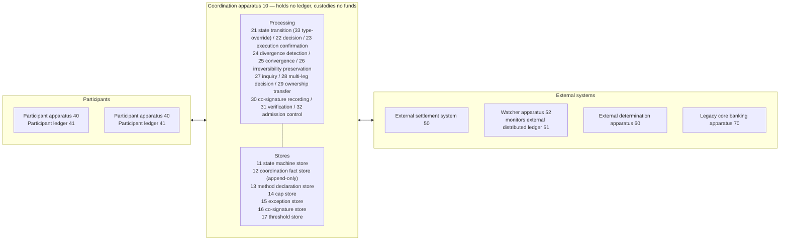
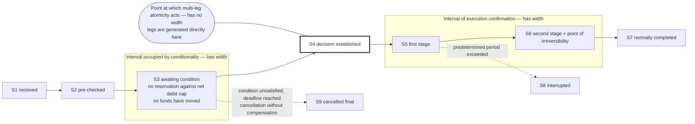
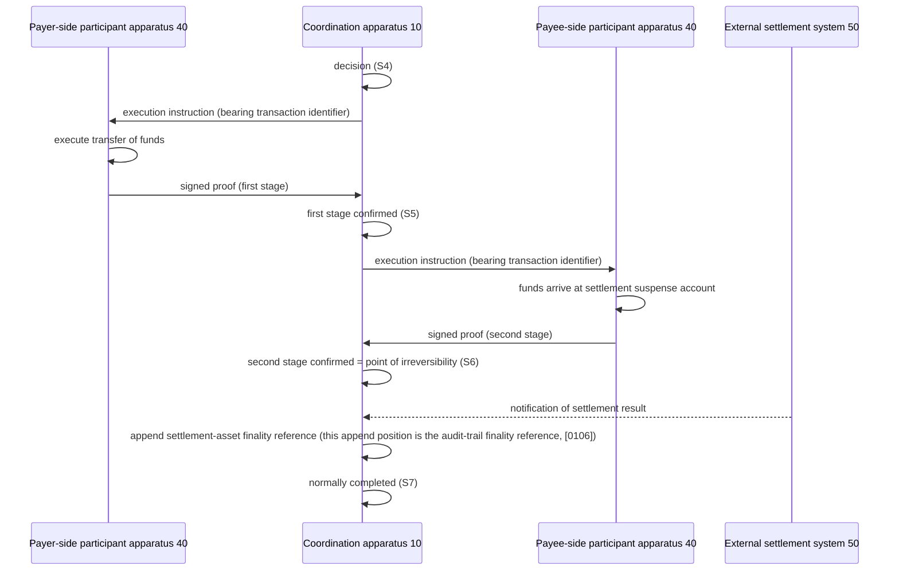
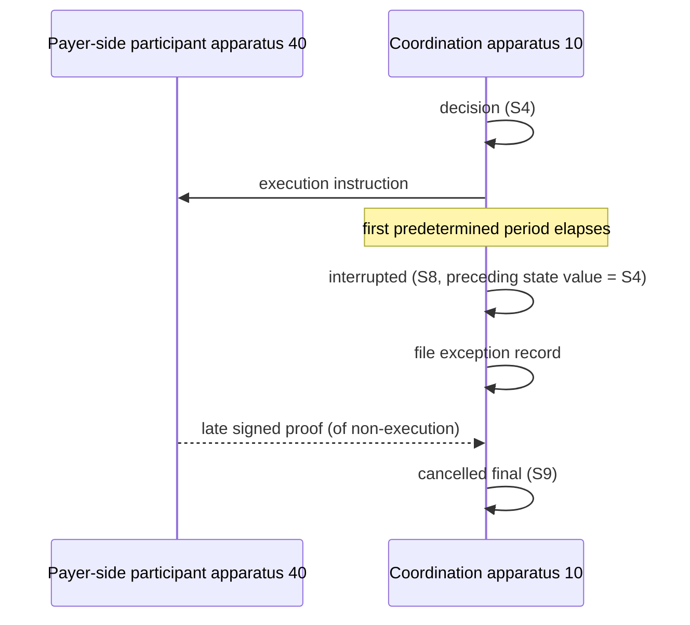

# SPECIFICATION

## TITLE OF THE INVENTION

**PAYMENT COORDINATION APPARATUS, PAYMENT COORDINATION METHOD, AND NON-TRANSITORY COMPUTER-READABLE MEDIUM**

## STATEMENT REGARDING FEDERALLY SPONSORED RESEARCH OR DEVELOPMENT

[0001] Not applicable.

---

## BACKGROUND

### Field

[0002] The present disclosure relates to information processing techniques for coordinating transfers of funds among a plurality of participants. More specifically, it relates to techniques by which an information processing apparatus that holds no participant ledger and custodies no funds (a "payment coordination layer") manages transfers of funds among participants as a sequence of states that can be explained after the fact.

### Description of the Related Art

[0003] When funds are moved among banks and other financial institutions (each, a "participant"), the funds themselves move on ledgers that each participant maintains. An entity that coordinates transfers among participants (a "coordination apparatus") ordinarily holds none of those ledgers, custodies no funds, and has no authority to operate a participant's ledger directly. A funds clearing institution that performs clearing among participants occupies this position: it clears the claims and obligations among participants and administers net debit caps and other limits while holding no participant ledger and custodying no funds, the resulting settlement being effected as a transfer across accounts at the central bank and as postings on each participant's own ledger. Holding no ledger and custodying no funds is accordingly an attribute common to entities in this position, and does not narrow the range of functions such an entity may perform. The coordination apparatus of the present invention reconstructs the clearing, limit administration, and finality declaration that traditional funds clearing institutions bear, in a form equipped with separation of decision from execution and bounded-time divergence detection, and can substitute for existing configurations as an apparatus bearing such functions. The problems that the related art presents under this configuration are described below in the following order: atomicity and what is paid for it ([0004] to [0008]); authenticity of the record ([0009]); connection of dissimilar payment rails ([0010]); the definition of completion ([0011]); and disclosure of sensitive information ([0012]).

[0004] In such a configuration, it is not possible in principle to realize a transfer of funds spanning multiple participants as a single atomic transaction. The coordination apparatus can only request execution from a participant; it can neither compel execution nor unwind a transfer that has already been executed.

[0005] Two families of technique have conventionally been applied to this problem. The first is distributed transaction technology typified by two-phase commit (2PC), in which participants reserve resources and the reservations are committed together. Because participants block while holding resources when the coordinator fails, a participant's ledger is encumbered for a prolonged period. In the core banking systems of financial institutions this is not acceptable.

[0006] The second is to rely on eventual consistency. Each participant proceeds independently and divergences are resolved by later reconciliation. This approach has good availability, but it guarantees neither when a divergence will be resolved nor who is responsible for resolving it. Because payments may become the subject of a dispute after the fact, the absence of that guarantee is a practical defect.

[0007] What is paid for atomicity is the same in techniques for handling conditional transfers of funds. Hashed timelock contracts (HTLCs) are known as such a technique (Non-Patent Literature 6). An HTLC is simultaneously a means of realizing conditionality and a means of realizing multi-leg atomicity, since disclosure of a single preimage settles multiple legs together. However, like two-phase commit, an HTLC pays for atomicity with encumbered liquidity: the funds of intermediary participants are encumbered for the entire period during which the condition remains unsatisfied.

[0008] Patent Literature 1 discloses a configuration in which unlocking information (an electronic signature and a secret) and unlocking conditions (a public key, a hash value, and a time) are collated in order on a ledger, so that in a delivery-versus-payment (DvP) transaction an escrowed asset can be pulled back without waiting for a timeout. That configuration, however, handles locking and pull-back at a settlement apparatus that custodies the asset, and merely shortens the period of encumbrance. It does not disclose a configuration in which, at a coordination apparatus that custodies no funds, no reservation against a net debit cap is made at all during the period in which the condition remains unsatisfied. Nor does it disclose treating, as an object of bounded-time detection, attribution, and explanation, the divergence in which a decision has been established but execution is not confirmed; the states it handles are locking, pull-back, and termination of an asset.

[0009] The authenticity of the record presents a further problem. It is known to keep payment records as append-only cryptographic ledgers. Patent Literature 2 and Patent Literature 3 disclose bundling trade reports and clearing instructions with cryptographic signatures into data blocks and appending them to a plurality of tiered, sharded append-only ledgers, thereby accelerating securities settlement. These, however, rest the authenticity of the record on the chaining of the ledger and on signature verification by the operator, and are powerless where the operator that keeps the record reconstructs the chain itself.

[0010] Transactions spanning dissimilar payment rails present a further problem. In transactions that span an external distributed ledger capable of holding conditional state and a traditional payment rail that is not (a central bank real-time gross settlement system, a deferred net settlement cycle, and the like), an intermediating layer (a "bridge") has been interposed to observe completion on one side and trigger the other. The two sides of a bridge have separate state machines, separate audit trails, and separate caps, and there is no party that explains a divergence arising on the bridge.

[0011] The definition of settlement finality itself likewise presents a problem (Non-Patent Literature 5). A definition under which completion means "the payee's account has been credited" allows completion to be obstructed by events that neither the payer nor the coordination apparatus can control, such as closure or freezing of the payee's account. Moreover, settlement finality comprises two facts of a different character: a determination under institutional rules that a transaction is to be treated as concluded among the parties, and the actual transfer of a settlement asset such as central bank money (Non-Patent Literature 5). The former is declared by the rules of a funds clearing institution; the latter is effected across accounts at the central bank and on each participant's own ledger. The layer that declares finality under institutional rules and the layer that transfers the settlement asset therefore belong to separate entities even in existing settlement infrastructure, and the entity bearing the former neither custodies nor controls the latter.

[0012] Finally, disclosure of the information held by a coordination apparatus presents a problem. That information includes sensitive information — for example, that a particular participant is short of funds on a given day — that, if disclosed in the wrong manner, can impair the stability of the financial system as a whole.

### References

[0013] Patent Literature

- Patent Literature 1: JP 2022-40968 A (Hitachi, Ltd., "Electronic Settlement System and Electronic Settlement Method," published March 11, 2022) — an extension of hashed timelock contracts by which a locked asset in a DvP transaction is pulled back without relying on a timeout.
- Patent Literature 2: US 2019/0180372 A1 (Domus Tower, Inc., "Settlement of securities trades using append only ledgers," published June 13, 2019).
- Patent Literature 3: US 11,410,233 B2 (Domus Tower, Inc., "Blockchain technology to settle transactions," issued August 9, 2022) — securities settlement using tiered append-only ledgers, claiming the same priority as Patent Literature 2.

[0014] Non-Patent Literature

- NPL 1: S. Haber and W. S. Stornetta, "How to Time-Stamp a Digital Document," Journal of Cryptology, 1991.
- NPL 2: B. Laurie, A. Langley and E. Kasper, "Certificate Transparency," RFC 6962, 2013.
- NPL 3: D. Ongaro and J. Ousterhout, "In Search of an Understandable Consensus Algorithm (Raft)," USENIX ATC, 2014.
- NPL 4: H. Garcia-Molina and K. Salem, "Sagas," ACM SIGMOD, 1987.
- NPL 5: CPSS and Technical Committee of IOSCO, "Principles for Financial Market Infrastructures," Bank for International Settlements, 2012.
- NPL 6: J. Poon and T. Dryja, "The Bitcoin Lightning Network: Scalable Off-Chain Instant Payments," 2016.

---

## SUMMARY

### Problems to be Solved

[0015] A first problem is what to make the subject of a guarantee in a system in which atomicity is unattainable. As described above, true atomicity is unattainable for transfers of funds among participants. A design that nevertheless asserts atomicity has no vocabulary with which to explain what happened when that assertion breaks during a failure. States such as "it was decided but was not executed" and "it was executed but there is no record of a decision" accumulate as undefined intermediate states. Declaring the subject of the guarantee includes fixing what is to count as completion of the transfer. Yet the general definition — that completion means "the payee's account has been credited" — allows completion to be obstructed by events that neither the payer nor the coordination apparatus can control, namely closure or freezing of the payee's account ([0011]). The subject of the guarantee thus depends on an external event that no party to the transaction controls.

[0016] A second problem is the composition of conditionality (the property of withholding a transfer until a predetermined condition is satisfied and automatically cancelling it upon expiry of a deadline) with multi-leg atomicity (the property of deciding a plurality of transfers together, as all-or-none). Composition by way of a bridge has the following defects. (a) The state machines, audit trails, and caps on the two sides of the bridge are different objects, and no party exists that can explain a divergence arising on the bridge. (b) A span of time arises between observation and triggering that belongs to neither side, and a failure there belongs to neither side's recovery procedure. (c) A requirement to add or remove conditionality after the fact entails rebuilding the transaction type. Composing the two without a bridge, by two-phase commit or by a hashed timelock contract, has a different defect: each pays for atomicity with encumbered liquidity, in that a participant's ledger or an intermediary's funds are encumbered for the entire period during which the condition remains unsatisfied ([0005], [0007]). Patent Literature 1 shortens that period, but discloses no configuration in which a coordination apparatus that custodies no funds makes no reservation against a net debit cap at all during that period ([0008]). What is required is therefore a composition of conditionality with multi-leg atomicity that needs no bridge and encumbers no liquidity while the condition remains unsatisfied.

[0017] A third problem is guaranteeing detection of, and convergence upon, divergences. Since divergences cannot be prevented from occurring at all, three properties must be present as structure: (a) every divergence is detected within a bounded time; (b) a detected divergence necessarily reaches a human work queue; and (c) it can be verified that the explanation of the divergence has not been altered after the fact, including against reconstruction by the operator that keeps the record itself ([0009]).

[0018] A fourth problem is disclosure control for sensitive information. The general and otherwise correct implementation — returning a response meaning authorization failure to an unauthorized inquiry and a response meaning non-existence to an inquiry about a non-existent object — makes the difference between the responses itself the answer. Because this leaks as a result of authorization working correctly rather than through any defect in authorization, tightening the authorization design does not eliminate it.

### Technical Improvement Provided

[0019] The configurations described herein are not directed to an economic or legal practice of coordinating payments. They are directed to specific improvements in the operation of a coordinating computer itself, namely: (i) eliminating, as a matter of machine structure rather than of programming discipline, any time window in which a determination has been made but no record of it exists, by performing each determination and the append of its record in the same atomic unit; (ii) eliminating, as a matter of machine structure, any execution path along which the behavior of the apparatus can diverge from what the apparatus declares, by causing the timers, the convergence targets, and the meanings of synchronous responses all to be read from a single record as their sole source; and (iii) thereby rendering the set of states reachable under failure a declared finite set, so that every divergence is detected within a bounded time measured from a timestamp that is itself guaranteed to exist. These improvements are effective regardless of the economic content of any particular payment, and they cannot be obtained by performing the same coordination mentally or on paper, because they consist precisely in properties of how records are written and read by the machine.

### Solution

[0020] To solve the above problems, the payment coordination apparatus described herein adopts a configuration in which the scope of atomicity is declared to be limited to the *decision* alone, and divergences in *execution* are designed as objects of bounded-time detection, attribution (identification and recording of the responsible party, by the responsible-party identifier of [0120]), and explanation.

[0021] That is, the central configuration abandons, explicitly, any attempt to make a transfer of funds a single atomic transaction, and instead makes the subject of its guarantee the following proposition: divergences occur; but every divergence is detected within a bounded time, attributed, and presented as one and the same explanation to every party.

[0022] This configuration is embodied as the four layers of TABLE 1. The layers are an order of dependency, not an order of implementation; an upper layer presupposes the existence of the layers below it.

TABLE 1

| Layer | What it guarantees | Principal configuration |
|---|---|---|
| Layer 4 | That the explanation was not fabricated after the fact | Append-only audit log (hash chain), party co-signature, periodic anchors |
| Layer 3 | That inexplicable states necessarily collect in one place and are handed to a human | Convergence of every detection path onto a single exception record |
| Layer 2 | That divergences are detected within a bounded time, and that the net debit cap ([0031]) is not breached in the meantime | Per-state timers, single-owner rule, two-layer reservation, reconciliation |
| Layer 1 | That what is treated atomically, and what is not, has been declared | Separation of decision from execution, two-stage completion, three-way separation of finality |

[0023] The disclosure control for sensitive information addressed by the eleventh embodiment, and the cross-layer survey of failure scenarios addressed by the twenty-fifth embodiment, are each cross-cutting configurations that may be applied to the records of any of the layers, and do not correspond to any single one of the four layers above.

[0024] Where Layer 2 and above are built without declaring Layer 1, a detected divergence is treated as a defect and no target of convergence is designed for it. Where Layer 4 is built without Layer 3, unresolved states that nobody consults accumulate inside an unalterable record.

[0025] *(Solution to the first problem.)* The payment coordination apparatus includes a state machine that defines a set of state values a transaction may take and a set of permitted transitions, and a coordination fact store that stores the history of state transitions in an append-only form. Establishment of the determination to issue an execution instruction (an instruction by which the coordination apparatus requests a participant apparatus to execute a transfer of funds; see [0059]) — herein a "decision" — is performed atomically with the other processing and as all-or-none. Receipt of a signed proof that funds have irreversibly moved — herein an "execution confirmation" — is divided into a plurality of stages including at least a first stage indicating payer-side completion and a second stage indicating payee-side completion, and the append of the final stage constitutes the point of irreversibility of the transaction. In the basic form, the number of stages is two and the second stage also serves as the final stage; this is termed two-stage completion ([0069]). It is then declared and stored, as a method declaration record per transaction type, that the decision is atomically guaranteed whereas simultaneity and all-or-none completion of the execution confirmation are not guaranteed.

[0026] The method declaration record is not held merely as a declaration; it governs the operation of the apparatus. The predetermined periods used by the divergence detection processing, the convergence point to which the convergence processing relates an exception record, and the meaning of the response the inquiry processing returns synchronously are all read from the values of the method declaration record corresponding to the transaction type of the transaction concerned. Because the declaration and the behavior derive from the same values, no execution path exists along which what is declared and what is done can diverge.

[0027] The predetermined periods and convergence targets held by the method declaration record are not configuration values by which the behavior of the apparatus is tuned from outside. Externalizing such values as configuration is itself conventional; but where that is done, the declaration (the statement of what is treated atomically for a given transaction type, when it becomes final, and where it converges) and the implementation that realizes it exist separately, and their agreement is maintained only by drafting discipline. If one alone is changed, the declaration and the behavior diverge, and the divergence becomes manifest only when a divergence actually occurs and is detected at a time other than the declared time, or converges to a target other than the declared target. In the present configuration the period after which the divergence detection processing transitions a transaction to the interrupted state, the target to which the convergence processing relates an exception record, and the meaning of the response returned by the inquiry processing are all read from the same values of the same record as their sole source, so that the path along which declaration and behavior can diverge does not exist in the structure of the apparatus. The technical significance of the configuration therefore lies not in making the values variable (parameterization) but in moving agreement between declaration and behavior from a matter of discipline to a matter of machine structure. That significance is unobtainable by any optimization of the value of the predetermined period.

[0028] *(Solution to the second problem.)* A state value indicating that a condition is awaited is placed between the state value indicating completion of the pre-check and the state value indicating establishment of the decision. Atomic multi-leg establishment, on the other hand, is performed at the level of a parent transaction identifier that binds the legs, and the transaction record of each leg is generated directly from the state value indicating establishment of the decision. Conditionality thereby occupies the interval preceding the decision, and multi-leg atomicity occupies the point of the decision. Being mutually disjoint on the same state machine, the two compose as layers without any bridge.

[0029] *(Solution to the third problem.)* Where the first-stage execution confirmation is not appended within a predetermined period of the append of the decision, and where the second stage is not appended within a predetermined period of the first stage, the transaction is transitioned to an interrupted state. Interrupted transactions, and transactions whose recorded transition history cannot be reconstructed as a sequence of transitions permitted by the state machine, are related to exception records of a single type. Every exception record is given a deadline, and those that exceed their deadline are escalated to a human work queue. Non-alterability of the record is secured by a chain in which each entry contains the hash value of the immediately preceding entry, by party co-signatures upon particular entries of that chain, and by periodic anchors.

[0030] *(Solution to the fourth problem.)* A response that is identical, and mutually indistinguishable, is returned for a plurality of semantically distinct refusal grounds; and, of those grounds, only some are recorded as violations. Inference from the response is thereby made impossible without degrading abuse-detection capability.

[0031] In addition, the following are provided.

- *(Four-item declaration.)* A method declaration record is held for each transaction type declaring four items: (a) a synchronous boundary indicating which state value's attainment is meant by a synchronously returned response; (b) a definition of the point of irreversibility, indicating which event's occurrence renders the transaction non-cancellable; (c) a minimum required audit trail, being the set of evidence references whose recording is required; and (d) an exception convergence target, indicating the convergence point to which exceptions of that type resolve.
- *(Point of irreversibility separated from account state.)* The second-stage execution confirmation is defined not as crediting of the payee's account but as arrival of funds at a settlement suspense account under the control of the payee-side participant together with confirmation of receipt by that participant; where crediting of the payee's account is impossible, the funds are held in a held-funds state and the transaction is not failed for that reason.
- *(Three-way separation of finality.)* For one transaction, a reference indicating the contractual point of irreversibility, a reference indicating the fact of transfer of an asset in an external settlement system, and a reference indicating a position in a hash chain at which these are fixed, are each held as separate recorded facts; the former does not assert the latter but refers to it.
- *(Single-owner rule.)* Each transaction record is given a single owner column indicating the entity authorized to transition it; batch processing targets only records whose owner column equals a value indicating the apparatus itself; transfers of ownership are executed as compare-and-swap operations, appending a transfer event in the same atomic unit.
- *(Two-layer reservation.)* A net debit cap per participant is divided into a cancellable reservation layer before the decision and a frozen layer after the decision, and release from the frozen layer is limited to completion of settlement, a signed proof of non-execution, or multi-person approval; an event indicating cancellation of the decision is not a trigger for release.
- *(Indeterminate as a third case.)* The value domain of an external determination is made three-valued — applicable, not applicable, and indeterminate — and, where indeterminate, the transaction is neither advanced as not applicable nor cancelled as applicable, but is parked at the state value preceding the determination.

[0032] The correspondence of each embodiment to the layer to which it belongs and to the problem it solves is shown in TABLE 2.

TABLE 2

| Embodiment | Layer | Problem solved |
|---|---|---|
| 1 (separation of decision from execution) | 1 | [0015] |
| 2 (declaration of the four-item tuple) | 1 | [0070] |
| 3 (composition of conditionality and multi-leg atomicity) | 1 | [0016] |
| 4 (separation of the point of irreversibility) | 1 | [0101] (a definition of completion dependent on account state; see also [0015]) |
| 5 (three-way separation of finality) | 1 and 4 | [0105] |
| 6 (single-owner rule) | 2 | [0111] |
| 7 (single convergence point for exceptions) | 3 | [0017] |
| 8 (two-layer reservation) | 2 | [0127] |
| 9 (indeterminate as a third case) | 2 | [0131] |
| 10 (hash chain with party co-signatures) | 4 | [0017](c) |
| 11 (closed inquiry for sensitive information) | cross-cutting ([0023]) | [0018] |
| 12 (staged admission control) | 2 | [0152] |
| 13 (connection of unmodified legacy core banking systems) | 2 | [0158] |
| 14 (finality grades and bounded unwind) | 1 | [0162] |
| 15 (declaration record governing continuous collection) | 1 and 2 | [0167] |
| 16 (conditional retry series and a single partial uniqueness constraint) | 1 | [0172] |
| 17 (verification against a declaration record at two points) | 1 | [0177] |
| 18 (making the intermediary explicit) | 1 | [0182] |
| 19 (lexicographic objective and evidencing of adoption) | 2 and 4 | [0187] |
| 20 (quorum by operating party; fail-closed on equivocation) | 2 | [0192] |
| 21 (intraday rolling clearing window) | 2 | [0197] |
| 22 (prioritization of exceptions in manual handling; classification of remediation; reopening) | 3 | [0202] |
| 23 (recovery sequence of the single-owner rule upon failure of an external custodian) | 2 | [0212] |
| 24 (co-signature request operation; convergence on quorum shortfall; resilience of anchors and keys to change) | 4 | [0219] |
| 25 (representative failure scenarios; degraded operation under load; operational trade-offs in legacy connections) | cross-cutting ([0023]) | [0231] |
| 26 (override of the declared transaction type by threshold comparison of a request attribute at receipt) | 1 | [0237] |

[0033] The fifth embodiment is shown as belonging to both Layer 1 and Layer 4 because the audit-trail finality reference among the three finalities ([0106], item 3) depends on a position in the append-only audit log, which is a Layer 4 record. The separation of the three senses, which is that embodiment's principal configuration, belongs to Layer 1.

[0034] All of the above embodiments share the following same technical features: (i) the values that govern the operation of each processing element of the apparatus are read from a single declaration record declared per kind of object, as their sole source, and are not obtained from any other source; and (ii) the result of a determination based on such a value is appended to an append-only store in the same atomic unit as the execution of that determination. Here, the "kind of object" and the "declaration record" are, for each embodiment:

(1) For the first through ninth, the transaction type and the method declaration record ([0031], [0071]).
(2) For the tenth, the kind of chain and a record declaring the predetermined quorum count, the event that fixes the base entry, and the store from which signature-eligible parties are derived ([0137], items 2, 6 and 7; [0139]).
(3) For the eleventh, the purpose code of an inquiry and an inquiry method declaration record declaring the value domain of purpose codes, the set of items returned per purpose, the set of grounds recorded as violations, the response characteristics to be equalized, and the store used to determine party status ([0145]).
(4) For the twelfth, the kind of settlement cycle and a record declaring the determination applied per mode, the predetermined threshold for the confidence score, and the basis on which the budget is computed ([0153], [0154]).
(5) For the thirteenth, the core banking apparatus and its capability profile ([0159], item 1).
(6) For the fourteenth, the kind of settlement basis used by a leg and a record declaring the corresponding finality grade and the predetermined number of unconditional irreversible legs ([0163], items 1 and 4; [0165]).
(7) For the fifteenth, the continuous-collection contract and a contract record declaring the rule deriving the confirmation deadline, the amendment cut-off time, and each limit value ([0168], items 1 to 3 and 6 to 7).
(8) For the sixteenth, the charge item and a record declaring the scheduled date, amount and addition for delay of each rung of its retry series ([0173], items 1 and 7).
(9) For the seventeenth, the payee's account and a record declaring the limitation of counterparties, the upper bound on amount, the permitted purposes, and the format evidencing eligibility ([0178], item 1).
(10) For the eighteenth, the currency pair of the transfer and a record declaring the intermediary that performs conversion for that pair ([0183], item 1).
(11) For the nineteenth, the candidate set subject to selection and a record declaring the rank order of criteria, the bucket width for waiting time, and the degradation order ([0188], items 1, 2 and 5).
(12) For the twentieth, the kind of finality and a record declaring the predetermined quorum count and the store from which identity of party is derived ([0193], items 2 and 5).
(13) For the twenty-first, the clearing cycle and a record declaring the normalized identifier composed of the business date and a sequence number within that business date ([0198], item 1).
(14) For the twenty-sixth, the transaction-type value and a type-determination threshold record declaring, for that value, the target attribute read at receipt, the threshold, and the overriding type ([0238], item 1).

The correspondence of items (1) through (13) above is given for the first through twenty-first embodiments. The twenty-second through twenty-fifth embodiments each extend the declaration record of item (1), (2), or (5) above rather than adding a new kind of declaration record. Specifically: the twenty-second embodiment adds a kind of remediation ([0205]) and a first-line responsible party ([0204]) to the method declaration record of item (1); the twenty-third embodiment uses, unchanged, the lease ceiling the method declaration record of item (1) already holds ([0082]); the twenty-fourth embodiment adds a co-signature grace period and an anchor issuer, among other items ([0223], [0225]), to the declaration record of item (2); and the twenty-fifth embodiment surveys combinations of the capability profile of item (5). The twenty-sixth embodiment adds the type-determination threshold record of item (14) above, a new kind of declaration record, and leaves the method declaration record itself unchanged.

[0035] Features (i) and (ii) above are special technical features common to the embodiments. The effect of (i) is as stated in [0027]: no execution path exists along which what is declared and what is done can diverge, and this effect arises not from externalizing the values but from making their source single. The effect of (ii) is that no time window arises in which a determination has been made but no record of it exists ([0055], [0068]); only given that effect do measurement of elapsed time from the determination, and sameness of the explanation given afterwards, hold at all. In every embodiment, the absence of these two features destroys the effect that embodiment produces — boundedness of detection, uniqueness of the convergence target, and sameness of the response. The embodiments therefore constitute a single technical concept by way of this common technical feature.

### Advantageous Effects

[0036] With the configurations described herein, the set of states reachable under failure closes to a declared finite set. The state "it was decided but was not executed" is expressed not as an undefined intermediate state but as a state value that has been detected and attributed. Because the same state value, the same reason code, and the same timestamp are returned to every party, explanations do not diverge among parties.

[0037] Because conditionality and multi-leg atomicity are composed without a bridge, no situation arises in which no party can explain a divergence at their boundary. Further, because no net debit cap is reserved at the time the condition is set, liquidity is not encumbered while the condition is awaited; and where the condition is never satisfied and the deadline arrives, no funds have moved, so the transaction ends by cancellation alone, without any compensation.

[0038] As to inquiries for sensitive information, the response obtained by an external observer is identical for all grounds, so no information about the existence of the object event is obtained by repeating the inquiry; and, notwithstanding the equalization of responses, false positives in violation detection do not increase.

[0039] The above effects are not obtained by the mere coexistence of a state machine, an append-only store, timeout detection, exception filing, and conditional responses. Here they are joined as the following causal chain, and replacing any one of them with a conventional counterpart destroys the effect produced by the others. First, only because the decision is established in the same atomic unit as the append to the coordination fact store ([0058], [0068]) is it guaranteed that no interval exists in which the decision has been established but no record exists; and only then can non-arrival of the execution confirmation be measured as elapsed time from the timestamp at which the decision was appended. Without that atomicity, the very timestamp the divergence detection would use as its origin is untrustworthy, and detection within a bounded time does not hold. Second, only because the divergence detection records, as ancillary information, the state value immediately preceding the transition to the interrupted state ([0062]) can the state transition processing branch — permitting a transition from the interrupted state to the cancelled state, at the decision-established stage, conditioned on receipt of a signed proof of non-execution, and not permitting it once the first-stage execution confirmation has been established. Without that ancillary information the two are indistinguishable as "transactions for which no execution confirmation arrived after the decision," and a path remains by which a transaction whose payer-side funds have already moved irreversibly is terminated as cancelled. Third, the remedy that this branch forbids is connected to a compensating transaction by the irreversibility preservation processing ([0065]), and the compensating transaction reaches a human work queue with a deadline by way of the single type of exception record ([0120]). Fourth, the times of these detections and branches and their destinations are all read from the values of the method declaration record of [0026] and [0027], so that as transaction types increase the branches do not, and agreement between declaration and behavior is preserved.

[0040] As a result of this joining, the set of states reachable in a system in which atomicity is unattainable is closed to a declared finite set. A transaction for which no decision has been established has moved no funds and therefore terminates by cancellation alone; a transaction for which a decision has been established but whose execution confirmation has not reached the first stage terminates as cancelled only upon a proof of non-execution; and a transaction whose first stage has been established does not terminate as cancelled and converges only by compensation. These distinctions are expressed on the same state machine for every transaction type, and the difference between types appears only as a difference in the values of the method declaration record. None of the individually known techniques (two-phase commit, sagas, hashed timelock contracts, append-only logs, timeout monitoring) yields this distinction.

---

## BRIEF DESCRIPTION OF THE DRAWINGS

[0041]

- FIG. 1 is a block diagram showing an overall configuration of a payment coordination system 1.
- FIG. 2 is a state transition diagram showing a state machine of a transaction, indicating state values S1 through S9 and the transitions permitted among them.
- FIG. 3 is a schematic diagram showing the relationship between the interval occupied by conditionality and the point at which multi-leg atomicity acts.
- FIG. 4 is a sequence diagram showing a flow of processing from decision to normal completion in the normal case.
- FIG. 5 is a sequence diagram showing a flow of processing where a first predetermined period is exceeded.

---

## DETAILED DESCRIPTION

[0042] Embodiments will now be described. Terms used herein have the meanings defined in [0044]. Each embodiment described below can be understood and practiced from the text of this specification alone. The first through twenty-sixth embodiments can each be practiced independently and can also be practiced in combination; dependencies among combinations follow the layer structure of [0022]. The twenty-second through twenty-fifth embodiments, however, each build upon and give concrete effect to a prior embodiment — the seventh, the sixth, the tenth, and the seventh, twelfth and thirteenth, respectively — and are practiced on the premise of the configuration of that prior embodiment. The twenty-sixth embodiment presupposes the state transition processing 21 and the method declaration record of the first embodiment ([0025], [0026]), but, unlike the twenty-second through twenty-fifth embodiments, is not the concretization of any single prior embodiment and applies independently to any transaction type. The tenth through twenty-first embodiments are described below as stores and processing elements of the coordination apparatus 10, but each may also be practiced as an information processing apparatus independent of the coordination apparatus 10. In that case the apparatus itself holds the records that embodiment handles — the append-only audit log (tenth), the records of events subject to inquiry (eleventh), the state of a settlement cycle and the set of responsible-party identifiers (twelfth), the capability profile of a core banking apparatus (thirteenth), the finality grade of each leg (fourteenth), the continuous-collection contract and its consumption (fifteenth), the retry series (sixteenth), the declaration of payee eligibility (seventeenth), the intermediary and conversion ratio (eighteenth), the candidate set subject to selection (nineteenth), the key registry and attestations of observers (twentieth), and the clearing cycle identifier (twenty-first) — and exchanges only those records with the coordination apparatus 10.

[0043] The embodiments described below are illustrative and are not limiting. Statements herein that a given element is required, or that a given path is not to be taken, describe the requirements of the embodiment then being described and the technical reasons for them; they are not to be read as limitations upon any claim that does not recite them. Values given as representative are examples and may be varied according to the operating environment (finality latency of the payment rail, expected transaction volume, regulatory requirements).

### Definitions

[0044] The terms used herein have the meanings given in TABLE 3.

TABLE 3

| Term | Definition |
|---|---|
| coordination apparatus (payment coordination layer) | An information processing apparatus that coordinates transfers of funds among participants while holding no participant ledger and custodying no funds. Reference numeral 10 |
| participant | An entity that connects to the coordination apparatus and actually moves funds on its own ledger, and its information processing apparatus. Reference numeral 40 |
| decision | The act by which the coordination apparatus establishes, for a transaction, that an execution instruction is to be issued. Not the movement of funds itself. Corresponds to commit in a distributed transaction |
| cancellation | Establishment by the coordination apparatus that no execution instruction is to be issued, and the state in which a transaction has reached termination without a transfer of funds having occurred. A cancellation is also a decision ([0052]). Corresponds to cancelled-final S9 |
| execution confirmation | Receipt and verification of a signed proof, issued by a participant, that funds have irreversibly moved. Divided into a plurality of stages including at least a first stage indicating payer-side completion and a second stage indicating payee-side completion (in the basic form the number of stages is two, termed two-stage completion; for a variation with three or more stages see [0069]) |
| point of irreversibility | The time from which transitioning the transaction in the direction of cancellation is prohibited; herein, the time at which the final stage of the execution confirmation is established. That part of settlement finality which the apparatus can observe and guarantee, and not legal finality itself ([0110]) |
| conditionality | The property of withholding a transfer of funds until a predetermined condition is satisfied and automatically cancelling it upon expiry of a deadline |
| multi-leg atomicity | The property of deciding a plurality of transfers of funds together, as all-or-none |
| leg | An individual transfer of funds, consisting of a single payer side and a single payee side, that forms part of one transaction. Multi-currency and multi-party transactions decompose into a plurality of legs |
| intermediary | In a multi-currency transaction, a participant standing on both sides of two legs of different currencies. Being both payer and payee, it bears the loss where only one leg is established |
| parent transaction identifier | An identifier that binds a plurality of legs so that a multi-leg decision is established as a unit |
| net debit cap | The upper limit of unsettled obligations set for each participant. Divided into a reservation layer and a frozen layer |
| method declaration record | Data declaring, per transaction type, the four items of synchronous boundary, definition of the point of irreversibility, minimum required audit trail, and exception convergence target, and governing the operation of the apparatus. Not a legal contract among the parties |
| type-determination threshold record | Data declaring, per transaction-type value, the target attribute read at receipt, a threshold for that attribute, and the overriding type, forming the basis on which the transaction type is fixed at receipt irrespective of the requester's specification (twenty-sixth embodiment) |
| synchronous boundary | Which state value's attainment is meant by a synchronously returned response |
| minimum required audit trail | The set of evidence references whose recording is required for the transaction type |
| exception convergence target | The convergence point to which exceptions of the transaction type resolve |
| exception record | Data of a single type serving as the target upon which inexplicable states converge |
| escalation | Moving an exception record from the scope of automatic processing to a human work queue. Does not mean resolution |
| to park | To neither advance nor cancel a transaction, but leave it at the state value preceding the determination |
| sweep | Periodically reading a store and applying predetermined processing to records meeting a condition |
| append-only audit log | A store that permits only appends at the tail, updating and deleting no existing entry |
| tip | The entry most recently appended to an append-only audit log |
| co-signature | An electronic signature made by a party upon a particular entry of an append-only audit log |
| compare-and-swap (CAS) | An atomic operation that writes a new value only if the value in the store equals a specified expected value, and otherwise writes nothing and so reports |
| single-owner rule | The rule that the authority to transition each transaction record is expressed by a single owner column and that the scope of batch processing is determined solely by an equality comparison on that column |
| condition identifier | A value by which satisfaction of a condition is determined. For a hashlock, the hash value of the preimage |
| timelock | A mechanism by which arrival of a predetermined time renders a condition unsatisfied and cancels the transaction. Combined with a condition identifier, this constitutes a hashed timelock contract |
| watcher (also termed an oracle or a watchtower) | An entity that observes events on an external distributed ledger and conveys them to the coordination apparatus, or that monitors for non-performance within a deadline. Reference numeral 52 |
| confirmations | In a public distributed ledger, the number of blocks stacked after the block containing the transaction. Also termed confirmation depth |
| permissionless / permissioned | A ledger for which becoming a validator requires no permission is permissionless; one for which it does is permissioned. Finality on the former is probabilistic, on the latter deterministic |
| deferred net settlement (DNS) | A mechanism by which instructions over a period are cleared (netted) and the net amounts settled together at a later time |
| admission control | Staged control of whether payment requests to a rail are admitted while a settlement cycle is in a held state (twelfth embodiment) |
| settlement suspense account | An account under the control of the payee-side participant and distinct from the payee's account |
| shadow balance | A copy of a balance held on the coordination apparatus side during periods when a core banking system is not online |
| core banking balance | The actual balance of the account held by the core banking system |
| settlement basis | The mechanism by which the transfer of funds of a leg becomes final: intraday provisional posting in a core banking system, fixing of an obligation by the rules of a settlement institution, a permissionless distributed ledger, and a central bank system or permissioned ledger. A finality grade is associated with each kind (fourteenth embodiment) |
| finality grade | An ordered classification value expressing the strength of finality of each leg (fourteenth embodiment) |
| bucket | An interval into which waiting time or another quantity is divided at a predetermined width; by truncation at that width, quantities falling in the same interval are treated as equal in rank (nineteenth embodiment) |
| lossless coordination with a bounded unwind set | The guarantee that, where a multi-leg transaction is only partly established, the set of legs requiring unwind is bounded in advance and no loss of funds occurs |

[0045] In formulas, the total number of legs is denoted n and the position of a leg counted from upstream from zero is denoted i.

[0046] Herein, "clearing" refers to transmission, matching, and netting of instructions, and "settlement" to final discharge of obligations; the two are used distinctly. Times herein are those assigned by the coordination apparatus; differences from times used by external entities are absorbed within predetermined margins determined with those differences in mind (such as Δ in [0065]).

### Overall Configuration

[0047] FIG. 1 shows the overall configuration of a payment coordination system 1. A coordination apparatus 10 is communicably connected to a plurality of participant apparatuses 40. A participant apparatus 40 holds a participant ledger 41, whereas the coordination apparatus 10 holds no such ledger and custodies no funds. The coordination apparatus 10 may also be connected to an external settlement system 50, a watcher apparatus 52 that monitors an external distributed ledger 51, an external determination apparatus 60, and a legacy core banking apparatus 70.

[0048] The coordination apparatus 10 includes, as stores, a state machine store 11, a coordination fact store 12, a method declaration store 13, a cap store 14, an exception store 15, and a co-signature store 16, and, where the twenty-sixth embodiment is practiced, a threshold store 17 ([0238], item 1). Each store is realized by one or more memories or storage devices. The coordination apparatus 10 further includes one or more processors configured to perform state transition processing 21, decision processing 22, execution confirmation processing 23, divergence detection processing 24, convergence processing 25, irreversibility preservation processing 26, inquiry processing 27, multi-leg decision processing 28, ownership transfer processing 29, co-signature recording processing 30, verification processing 31, and admission control processing 32; where the twenty-sixth embodiment is practiced, the state transition processing 21 further includes type-override processing 33 ([0239]). These twelve are the principal processing elements used across a plurality of embodiments. Processing specific to individual embodiments (deadline storage [0085], batch processing [0113], exception filing and sweep processing [0122], release processing [0128], and the like) is named where that embodiment is described; each is realized as part of one of the twelve above and requires no additional store.

[0049] FIG. 2 shows the state machine of a transaction. The set of state values includes received S1, pre-checked S2, awaiting-condition S3, decision-established S4, first-stage-confirmed S5, second-stage-confirmed S6, normally-completed S7, interrupted S8, and cancelled-final S9. This paragraph and FIG. 2 describe the basic form in which the number of execution confirmation stages is two (for three or more stages, see [0069]). The permitted transitions are as illustrated; the sole in-edge to normally-completed S7 is the one from S6, so that no path exists by which S7 is reached without the final-stage execution confirmation. S9 is likewise terminal, but differs from S7 in expressing that no transfer of funds was established. As used herein, a transaction has reached a terminus when no out-edge permitted by the state machine will any longer be taken; this is not fixed by the name of the state value. S7 and S9, having no out-edges, are always termini. S8 becomes a terminus only where convergence occurred by generation of a compensating transaction ([0063]), in which case the fact of termination is expressed not by the state value but by the state of the related exception record being resolved. Whether a transaction at S8 has reached a terminus is therefore not determinable from the state value alone. The transition from S1 to S2 arises upon passing a check of the form and basic content of the transaction (a "pre-check"); as its name indicates, the pre-check is complete upon the transition to S2.

[0050] The transition from S1 to S9 arises on two grounds. The first is a cancellation request made by the originator itself before the execution instruction is issued; the state transition processing 21 applies such a request as it stands so long as the decision processing 22 has not yet established a decision. The second is failure of the pre-check, or non-completion of the pre-check within a predetermined period. In either case no decision has been established and no funds have moved, so the transaction converges directly to S9 without passing through S8, and no compensation is required. The first ground applies not only to transactions at S1 but equally to transactions at state values at which no decision has been established (S2 and S3), each of which transitions to S9; since the norm "apply the request so long as the decision is not yet established" is not confined to any particular state value, out-edges are defined at every state value the request can reach. A transition from S3, however, requires mutual exclusion with satisfaction of the condition and therefore is fixed on the cancellation side by way of the compare-and-swap of [0093].

[0051] The transition from S2 to S9 further arises where an inquiry to the external determination apparatus 60 indicates applicability (ninth embodiment, [0132]) — that inquiry is not part of the pre-check but controls whether a transaction that has reached S2 may proceed to S3 or S4, so its origin is S2 rather than S1 — and where a predetermined precondition evaluated by the decision processing 22 prior to the decision ([0058]) is unsatisfied. The transition from S2 to S8 arises where a predetermined period is exceeded while awaiting an external response at S2: parking on an indeterminate external determination ([0107], item 5), awaiting a payee name-verification response, and awaiting the arrival of a counterparty participant's operating window (thirteenth embodiment, [0159], item 1). An indeterminate determination does not cause a transition to S9, because indeterminate does not mean applicable ([0133], item 3).

[0052] The transition to cancelled-final S9 is likewise established atomically by the decision processing 22 as a decision. That is, "establishing that no execution instruction is to be issued" is also a decision, and no path exists that reaches a terminal state value without leaving a record of a decision.

[0053] Interrupted S8 is the state value reached by transactions for which no execution confirmation arrived within a predetermined period after establishment of the decision, transactions for which observation of the condition became impossible beyond a predetermined period, and transactions at S2 for which an external response was awaited beyond a predetermined period. A transaction transitioning to S8 retains the immediately preceding state value as ancillary information, which is used to select the out-edge from S8 ([0062]). A transaction whose ancillary information indicates S2 returns to S2 if the awaited external response arrives later, and transitions to S9 if a human determines to abandon it without a response. A transaction whose ancillary information indicates S3 returns to S3 if an observation result arrives later, and transitions to S9 only where a human determines the condition to be unsatisfied ([0098]). A transaction whose ancillary information indicates S4 transitions automatically to S9 upon receipt of a proof of non-execution, and transitions to S5 where, instead of such a proof, a first-stage execution confirmation arrives late (the case of a merely delayed execution confirmation). However, among transactions whose ancillary information indicates S4, a payee-side leg of a multi-leg transaction that has no first stage ([0087]) never receives a first-stage confirmation; such a leg transitions to S6 upon a late second-stage confirmation, and transitions to S9 only where a proof of non-execution is received for the corresponding payer-side leg — because such a leg receives funds upon the first-stage confirmation of the corresponding payer-side leg, and therefore is not established if that payer-side leg was not executed. A transaction whose ancillary information indicates S5 does not transition to S9, and converges either by a late second-stage confirmation (transition to S6) or by generation of a compensating transaction ([0063]).

---

### First Embodiment: Separation of Decision from Execution, and First-Class Treatment of Non-Atomicity

[0054] This embodiment solves the problem of [0015].

[0055] The state machine store 11 stores a state machine defining the set of state values a transaction may take and the set of permitted transitions among them. The state transition processing 21 transitions the state value of a transaction only by transitions the state machine permits, and appends the transition to the coordination fact store 12 in the same atomic unit as the transition. A requested transition the state machine does not permit is rejected without being applied, and the fact of rejection is appended to the coordination fact store 12. No time window therefore arises in which only the state has advanced and no record remains.

[0056] *(Variation.)* Appends of rejections may be aggregated per requesting source at a predetermined period, one entry recording the count within the period. This prevents repeated transmission of invalid transition requests from continually consuming the record volume of the coordination fact store 12 and the processing capacity of the consensus mechanism used to establish decisions.

[0057] The coordination fact store 12 stores, per transaction, the state value and the history of state transitions in append-only form; existing entries are neither updated nor deleted.

[0058] The decision processing 22, where a transaction satisfies predetermined preconditions, performs the establishment of the determination to issue an execution instruction (the decision) in the same atomic unit as the accompanying append to the coordination fact store 12, and as all-or-none.

[0059] Upon establishing the decision, the decision processing 22 transmits to a participant apparatus 40 an instruction requesting execution of the transfer of funds (an execution instruction) bearing the identifier of the transaction. Where a participant apparatus 40 receives an execution instruction bearing the same identifier two or more times, it does not execute the transfer again but retransmits the signed proof of the first execution. The coordination apparatus 10 may retransmit an execution instruction for which no response is obtained, within the first predetermined period. The execution instruction is first transmitted to the payer-side participant apparatus 40, and only after receipt of the corresponding first-stage execution confirmation ([0060]) is it transmitted to the payee-side participant apparatus 40 (FIG. 4); the instruction to the payee side is thus not issued until the payer-side transfer is confirmed.

[0060] The execution confirmation processing 23 receives from a participant apparatus 40 a signed proof that funds have irreversibly moved and, upon successful verification, appends the proof to the coordination fact store 12. The execution confirmation is divided into a plurality of stages including at least a first stage indicating payer-side completion and a second stage indicating payee-side completion, and the append of the final stage constitutes the point of irreversibility of the transaction. In the basic form the number of stages is two, in which case the second stage also serves as the final stage; three or more stages may be used as in [0069]. This division differs from the prepare and commit phases of two-phase commit: at no stage are the participant's resources encumbered, and the coordination apparatus does not compel execution of any stage. In addition to verifying signed proofs, the execution confirmation processing 23 verifies and appends to the coordination fact store 12 notifications of settlement results from the external settlement system 50 and observations of confirmation counts by the watcher apparatus 52 (the settlement-asset finality reference of the fifth embodiment, [0106]). The former records the contractual point of irreversibility between the parties; the latter records, independently, the fact of transfer of an asset in an external settlement system.

[0061] The method declaration store 13 stores, per transaction type, a method declaration record declaring that the decision is atomically guaranteed whereas simultaneity and all-or-none completion of the execution confirmation are not. By holding the scope of atomicity as declared content rather than as a property of the apparatus, divergence in execution becomes an anticipated event rather than a defect, and the paths of detection, convergence, and remedy below become objects of design.

[0062] The divergence detection processing 24 transitions a transaction to interrupted S8, recording the immediately preceding state value as ancillary information, where the corresponding first-stage execution confirmation is not appended within a first predetermined period of the time at which the decision was appended, and where the second stage is not appended within a second predetermined period of the time at which the first stage was appended. The first and second predetermined periods are read from the method declaration record corresponding to the transaction type (representative values and selection criteria at [0075] and [0077]). For a transaction whose ancillary information indicates S4, a transition from S8 to S9 is permitted only upon receipt of a signed proof of non-execution issued by the payer-side participant. For a transaction whose ancillary information indicates S5, because the payer-side funds have already moved irreversibly, a transition to S9 is not permitted, and convergence occurs by arrival of the second-stage confirmation or by generation of a compensating transaction. Where the ancillary information indicates S3, the transition from S8 to S9 arises only where the third embodiment applies conditionality, and is as provided in [0098].

[0063] Where convergence occurs by generation of a compensating transaction, the state value of the transaction remains at S8 and is treated as terminal; completion of convergence is expressed by setting the state of the exception record to which the transaction is related to resolved. A configuration in which this terminus is provided as an independent state value distinct from S8 (a state value indicating that termination was reached without execution being established) is also within this embodiment. In either configuration the terminus is kept distinct from S9, because displaying a transaction for which a decision was established identically to a transaction that was cancelled is the very confusion [0015] seeks to exclude.

[0064] The convergence processing 25 relates, to an exception record (seventh embodiment), transactions that have transitioned to the interrupted state and transactions whose transition history recorded in the coordination fact store 12 cannot be reconstructed as a sequence of transitions permitted by the state machine store 11. The convergence point to which they are related is read from the exception convergence target of the method declaration record corresponding to the transaction type. A convergence point does not mean a separate storage area per transaction type: as provided by the seventh embodiment, the exception record is of a single type, and the convergence point is expressed as the value of a classification code on that record. Exceptions of differing transaction types resolve to records of the same type in the same exception store 15, and the difference of convergence point appears only as a difference in that classification code.

[0065] The irreversibility preservation processing 26 prohibits, for a transaction whose point of irreversibility has been established (in the basic form, one whose second stage has been appended; in the variation with three or more stages, one whose final stage has been appended), transitioning the state in the direction of cancellation, and executes any remedy for the transaction as the append of a compensating transaction bearing an identifier separate from that of the transaction. If the record could be rewound, that time would not be irreversible; this configuration is what makes the definition of the point of irreversibility substantive.

[0066] The inquiry processing 27 responds to an inquiry from any party apparatus with the same state value, the same reason code, and the same timestamp derived from the coordination fact store 12. Which state value's attainment is meant by a synchronously returned response follows the synchronous boundary of the method declaration record corresponding to the transaction type. The same response can be returned to all parties because the source from which responses are derived is a single append-only sequence.

[0067] A transaction whose point of irreversibility has been established transitions to normally-completed S7 at the time the audit-trail finality reference for that transaction (fifth embodiment) is appended to the coordination fact store 12. S7 expresses that the processing performed by the coordination apparatus 10 for the transaction is complete, and is independent of whether the payee's account has been credited (fourth embodiment). FIG. 4 shows the flow of processing in the normal case, and FIG. 5 the flow where the first predetermined period is exceeded.

[0068] So that the atomicity of the decision and the append to the coordination fact store 12 form one unit, the coordination fact store 12 is realized as the state machine of the consensus mechanism used to establish decisions, or as a projection deterministically derived from the log of that consensus mechanism. In the latter case, an inquiry made while the projection is incomplete is answered with the latest state value established for the transaction together with a reason code indicating that the projection is incomplete. In this embodiment, establishment of the decision and the append to the coordination fact store 12 are not realized as two separate writes to two stores having no atomicity with respect to each other, because such a configuration produces the state "the decision is established but there is no record" — reproducing inside the apparatus the very state this embodiment excludes.

[0069] *(Variations.)* Atomic establishment of the decision may be realized by Raft (NPL 3), Paxos, a Byzantine fault tolerant consensus method, single-leader log replication, a database transaction, or recording on a distributed ledger, so long as [0068] is satisfied. The stages of the execution confirmation may be read as sending side / receiving side, debit finality / credit finality, or first rail finality / second rail finality. The number of stages may be extended to three or more; in that case the first stage indicating payer-side completion and the second stage indicating payee-side completion are retained as such, further stages are added after them, and the append of the final stage constitutes the point of irreversibility, the second stage becoming an intermediate stage that does not signify irreversibility. State values corresponding to the added stages are added to the state machine store 11, the predetermined periods applied between successive stages are held in the method declaration record in the same form as the first and second predetermined periods, and the divergence detection processing 24 transitions to S8 upon those periods in the same manner as in [0062]. A signed proof may comprise a digital signature, a message authentication code, a reference identifier issued by a trusted third-party apparatus, or a transaction identifier and confirmation count on an external ledger. A predetermined period may be held in the method declaration record as a fixed value, per participant, per amount band, or per time band, or may be injected as an external policy parameter. A compensating transaction may be realized by a reverse transfer of funds, conversion to held funds, or offset in a subsequent clearing cycle. Inquiry may be provided by synchronous response, subscription notification, or report.

---

### Second Embodiment: Decomposition of a Payment Method into a Declared Four-Item Tuple

[0070] Payment methods are ordinarily classified by use case (point-of-sale payment, credit transfer, large value, request-to-pay), a division seen from the user's side. Because that division does not coincide with the branches in the implementation, "when does this method become final?" and "where does it converge on failure?" are decided separately for each method and cannot be explained uniformly.

[0071] The method declaration store 13 therefore holds, per transaction type, a record explicitly declaring the following four items, and processes accepted transactions in accordance with that record: (1) the synchronous boundary — which state value's attainment is meant by a synchronously returned response; (2) the definition of the point of irreversibility — which event's occurrence renders the transaction non-cancellable; (3) the minimum required audit trail — the set of evidence references whose recording is required for the type; and (4) the exception convergence target — the convergence point to which exceptions of the type resolve.

[0072] Item 2 does not move the point of irreversibility from the position fixed by the first embodiment (the append of the final stage of the execution confirmation, [0060]). It is the item that specifies which event's occurrence constitutes establishment of that final stage for the type. Accordingly, where TABLE 4 gives "attainment of confirmation count n" for external-ledger-linked transactions, that is a declaration that for that type the final-stage execution confirmation is established upon attainment of confirmation count n, and does not move the point of irreversibility outside the execution confirmation ([0109] addresses configurations in which settlement-asset finality is a condition of obligation finality).

[0073] Together with the four items, the method declaration record holds the first and second predetermined periods used by the divergence detection processing 24 ([0062]; the rightmost column of TABLE 4). The four items fix the meaning of finality and convergence for the type, and the predetermined periods map that meaning onto the time axis; the two are therefore placed in the same record.

[0074] This record is not held merely as a declaration: it is the sole source of the values referred to by each processing element. The target related by the convergence processing 25 is read from item 4; the meaning of the response of the inquiry processing 27 from item 1; the predetermined periods of the divergence detection processing 24 from the first and second predetermined periods the record holds alongside the four items; the origin of the prohibition imposed by the irreversibility preservation processing 26 from item 2; and the set of evidence references the convergence processing 25 requires to be attached to an exception record from item 3. The record is called a method *declaration* rather than a *contract* so as to distinguish it from legal contracts among participants.

[0075] TABLE 4 illustrates how the four items and the accompanying predetermined periods differ by transaction type; it is itself the content of the method declaration record. The values in TABLE 4 are examples ([0043]).

TABLE 4

| Transaction type | Synchronous boundary | Definition of point of irreversibility | Minimum required audit trail | Exception convergence target | First / second predetermined period |
|---|---|---|---|---|---|
| Domestic instant credit transfer | attainment of S4 | append of the second stage | payer proof, payee proof, settlement result identifier | classification code X | 30 s / 5 min |
| Deferred net settlement | attainment of S2 | settlement fact of the settlement cycle | net position statement, settlement result identifier | classification code Y | 6 h / 24 h |
| External-ledger-linked | attainment of S3 | attainment of confirmation count n | ledger transaction identifier, watcher signature | classification code Z | 24 h / 36 h |

[0076] The same transaction falls to the interrupted state after 30 seconds if it is a domestic instant credit transfer, and remains at decision-established for 6 hours if it is a deferred net settlement. That difference is a difference in the values of TABLE 4, not a branch in the processing. The X, Y and Z of the exception convergence target column are not identifiers of separate convergence targets prepared per transaction type but, as provided in [0064], values of the classification code written on records of the single type held by the single exception store 15. Further, for every transaction type the minimum required audit trail includes an evidence reference corresponding to the settlement-asset finality reference ([0106], item 2) — in TABLE 4, respectively the settlement result identifier, the settlement result identifier, and the ledger transaction identifier — because the transition to S7 is conditioned on the append of the audit-trail finality reference, and that reference is the append position of the settlement-asset finality reference itself ([0067], [0107]); a transaction type omitting it from the minimum required audit trail could not reach S7.

[0077] The criteria for selecting the first and second predetermined periods are as follows. The first predetermined period is an upper bound on the time taken by the payer-side participant to execute the transfer and return a signed proof after receiving the execution instruction, and is fixed by the response characteristics of the payment rail the type uses: the 30 seconds, 6 hours and 24 hours above correspond respectively to the synchronous response of an instant credit transfer rail, the period of a deferred net settlement cycle, and the time to attain the confirmation count on a permissionless distributed ledger. The second predetermined period adds to that the payee-side processing and the observation of external finality, and is therefore always longer than the first. Both are taken as short as possible without falling below the upper bound of the time in which normal processing completes, because the longer they are taken the later the bounded-time detection of [0017](a) occurs.

[0078] Further, the set of transaction type values a user apparatus may specify, the transaction type values the apparatus generates internally, and the set of transaction type values stored in a column of the coordination fact store are held separately as three value domains that may differ from one another; where any one is changed, all three are updated together.

[0079] Amendment of the method declaration record itself is configured as follows. Absent this configuration, the "sole source" of [0074] breaks, for transactions already in flight, at the instant the record is amended: the predetermined period read before the decision and the predetermined period read by the divergence detection processing 24 after the decision would derive from different versions, and agreement between declaration and behavior would be lost by precisely the path the present configuration exists to exclude. (1) The method declaration store 13 holds method declaration records keyed by the pair of transaction type and version identifier. Records of existing versions are neither updated nor deleted; amendment is performed only as the append of a new version, so that the method declaration store 13 is likewise append-only. (2) Each transaction record holds the version identifier the transaction refers to. That identifier is fixed by writing, at the time of the transition to received S1, the identifier of the version then in effect for the transaction type, and is not altered until the transaction reaches a terminus. (3) The divergence detection processing 24, the convergence processing 25, the irreversibility preservation processing 26, and the inquiry processing 27 all read their values from the single record designated by the version identifier held on the transaction record, and not from the latest version. (4) The write of (2) is performed in the same atomic unit as the append of the transition to S1; were it a separate unit, transactions would arise for which the governing version is undetermined, and for such transactions agreement between declaration and behavior could not be asserted for any version. (5) The append of a new version does not change the outcome of transactions already in flight; so long as the record of a version is retained in append-only form, the explanation of a transaction that proceeded under that version is reproducible afterwards from the same values.

[0080] The version identifier of [0079](2) forms part of the explanation of the transaction. The inquiry processing 27 includes that identifier in its responses, and in later verification the verification processing 31 uses the values of the version the identifier designates to determine whether the transition history is consistent with the declaration of that version. In a system whose declarations change over time, "as against which declaration is this correct?" is thereby uniquely fixed per transaction.

[0081] *(Variations.)* The point at which the version is fixed under [0079](2) may be the establishment of the decision rather than the transition to received S1; in that case the interval before the decision (S1 through S3) follows the latest version and the interval after the decision follows the fixed version, which suits cases where amendments to pre-check and external-determination discipline must take effect promptly on transactions in flight. Under that configuration, however, the synchronous boundary of [0071], item 1 alone must be fixed to the version in effect at acceptance, since it is the item by which the meaning of the response is promised to the user apparatus at acceptance. In place of holding a version identifier per transaction, the version may be derived deterministically by comparing the append time of the decision with the effective time of each version. Under this variation the versions a single transaction refers to are not one: the synchronous boundary derives from the version in effect at acceptance, items read before the decision from the latest version, and items read after the decision from the version in effect at the decision. The requirement of [0079] is therefore not that a transaction refer to a single version. What is required under any of these configurations is that, for each item, the version from which it is read be uniquely fixed by a rule declared in advance — that is, that the value of a given item never switch to a different version partway through the processing of the same transaction, and that whether it switches not depend on the circumstances obtaining at the time of processing. The "sole source" of [0034], item (i) does not require a single version per transaction; it requires that the source of each value be fixed to one. That rule is itself held by the method declaration store, and configurations not satisfying it — for example one in which each processing element reads whatever version is latest at the moment it reads — are not within this embodiment.

[0082] *(Variations.)* In addition to the four items, a maximum synchronous response wait, the set of required pre-checks, the kind of net debit cap applied, or the lease ceiling permitted to an external custodian (sixth embodiment, [0115]) may be declared as fifth through eighth items. The method declaration record may be held as a table, a configuration file, a type definition, or a schema. A configuration having no internally generated type values (the three value domains coinciding) is also within this embodiment.

[0083] *(Effect.)* Adding a new payment method becomes the addition of a method declaration record rather than the addition of a processing branch, and "when does this method become final?" can be answered without consulting the implementation.

---

### Third Embodiment: Composition by Placement of Conditionality and Multi-Leg Atomicity in Mutually Disjoint Intervals

[0084] This embodiment solves the problem of [0016]. Payment systems have two kinds of "grouping" with differing properties. The first is conditionality: withholding transfer until a predetermined condition (disclosure of a preimage, an external event, a third-party attestation) is satisfied, and automatically cancelling upon expiry of a deadline. The second is multi-leg atomicity: deciding a plurality of legs together, as all-or-none. FIG. 3 shows the positions the two occupy on the state machine. This embodiment places them as follows.

[0085] *(1) The interval of conditionality is placed before establishment of the decision.* The set of state values stored by the state machine store 11 further includes an awaiting-condition state value S3, and the set of permitted transitions is defined so that S3 lies between the pre-checked state value S2 and the decision-established state value S4. Conditionality thus controls "whether a decision may be taken." Deadline storage processing stores, in association with the transaction identifier, the deadline (timelock) at which the condition is fixed as unsatisfied for a transaction at S3.

[0086] *(2) Multi-leg atomicity is placed at the point of the decision.* The multi-leg decision processing 28 atomically establishes the decision for a parent transaction identifier binding a plurality of legs and, after that establishment, generates the transaction record of each leg directly from the decision-established state value S4 (legs have no S1 through S3). Multi-leg atomicity thus controls "how many legs are taken together when a decision is taken."

[0087] Each leg record holds, in addition to the parent transaction identifier and where the leg is a payee-side leg, a column referencing the identifier of the corresponding payer-side leg (a "corresponding-leg reference"). The corresponding-leg reference is written by the multi-leg decision processing 28 at the time the leg records are generated, derived deterministically from the adjacency along the route of [0090] — the pairing of the leg on which a given intermediary stands as payee with the leg on which that same intermediary stands as payer — and is not altered afterwards. As used herein and in FIG. 2, the "corresponding payer-side leg" means the leg that reference designates. In a configuration lacking this column, in which payer and payee sides are related only by sharing the parent transaction identifier, it is not uniquely determined which payer-side leg corresponds to which payee-side leg where there are three or more legs, and the convergence condition for a payee-side leg stated in [0053] (receipt of a signed proof of non-execution for the corresponding payer-side leg) cannot be evaluated. Among the legs so generated, a payee-side leg receives funds upon the first-stage execution confirmation of the corresponding payer-side leg and therefore has no first stage of its own; such a leg transitions directly from S4 to S6. Accordingly, the first predetermined period used by the divergence detection processing 24 (decision to first stage, [0062]) is not applied to such a leg, and a period corresponding to the second predetermined period is measured from the time at which the decision was appended. Without this provision, a leg having no first stage would necessarily fall to S8 upon expiry of the first predetermined period.

[0088] *(3)* Because (1) and (2) do not overlap on the state machine, both may be applied simultaneously; when they are, the conditionality layer sits above. Accordingly: (a) at the time the condition is set, neither the parent transaction identifier is registered nor any reservation is made against the net debit cap; (b) the multi-leg decision processing 28 is triggered only upon detection that the condition is satisfied; and (c) where the condition is not satisfied and the deadline arrives, no funds have moved, so the transaction ends by transition to S9 alone, without compensation.

[0089] *(4)* Where conditionality is applied to a multi-leg transaction, all legs share a single condition identifier. One detection that the condition is satisfied transitions the state values of all legs to S4 together; no per-leg satisfaction is required.

[0090] *(5) Deadlines are staggered per leg,* legs further upstream on the path being given later deadlines. A single reference time t0 is fixed for the multi-leg transaction and the deadlines of all legs are derived from it; t0 is the time at which the interval of conditionality began for the parent transaction identifier. With n the total number of legs, i the position of a leg counted from upstream from zero, T a base period and Δ a step, the deadline is given by:

```latex
\[
\mathrm{deadline}(i) = t_0 + T + (n - 1 - i) \times \Delta
\]
```

[0091] This guarantees that "if a downstream leg's condition was satisfied, the upstream leg's condition can certainly still be satisfied" and that "before an upstream leg pays, the downstream payment is already fixed," so that an intermediary does not pay downstream without being able to collect upstream. Δ is taken to be at least the sum of the maximum finality latency of each leg, the maximum clock skew between the coordination apparatus and the entities evaluating finality of the legs, and the period of the sweep that detects deadlines. The reference time is fixed at t0 rather than evaluated per leg so that the order of staggering cannot invert where the time taken to generate legs is not negligible relative to Δ.

[0092] In (6) and (7) below, the names "locked," "settling," "settled" and "cancelled" are used for the values taken by a single column of the record of the parent transaction identifier — the column that is the object of the compare-and-swap of (6). Their correspondence to state values is: "locked" to S3, "settled" to S4, and "cancelled" to S9. "Settling" indicates that the transition from S3 to S4 has been begun by compare-and-swap but that the subsequent operations spanning multiple stores are incomplete; it is not a state value but a marker of a transition in progress held on that record. While it is set, inquiries are answered with S3 as the state value. These names denote values of that column and do not signify completion of settlement in the sense of [0046]; S4, to which "settled" corresponds, is the time at which issuing execution instructions became fixed, and funds have not yet moved. Because the "settling" marker is not a state value, it is not subject to the reconstructability determination made by the convergence processing 25 ([0064]): that determination asks only whether the sequence of state values recorded in the coordination fact store 12 is a sequence of transitions permitted by the state machine store 11, and changes in the value of the marker do not appear in that sequence. A transaction left at "settling" is detected not as a failure of reconstruction but as exceeding the third predetermined period ([0094]). Both converge on an exception record, but they are given distinct classification codes because the detection paths differ.

[0093] *(6) Mutual exclusion between satisfaction of the condition and cancellation is concentrated in one compare-and-swap upon one column of one record.* Both entail operations spanning multiple stores (updating the state of all legs, registering the parent transaction identifier, reserving against the net debit cap, generating leg records) that cannot be contained in a single database transaction. Only the decision itself is therefore made a one-column compare-and-swap, so that exactly one of "locked → settling → settled" and "locked → cancelled" can leave "locked." Every step after the compare-and-swap is made idempotent, so that an abnormal termination leaves the record at "settling" and a retry resumes from the point of interruption, during which cancellation cannot interpose.

[0094] *(7) A third predetermined period is provided for "settling."* Where "settled" is not reached within the third predetermined period of the time of transition to "settling," the parent transaction identifier and all related legs are transitioned to S8 and an exception record is generated. Without this, a prolonged failure of a downstream rail that makes retries permanently fail would leave the leg neither cancelled nor settled indefinitely; the premise of the staggering of (5) — that an upstream leg can be fixed by its deadline — would then not hold, and an intermediary would pay downstream without being able to collect upstream.

[0095] The third predetermined period is not a fixed value but is computed per transaction as the lesser of an upper bound fixed by the method declaration record, and the remaining time obtained by subtracting the time of transition to "settling" from the time obtained by subtracting Δ from the deadline of the most upstream leg of the parent transaction identifier (that is, from the latest deadline under (5)). The most upstream leg's deadline is used as the reference because it is the last time effective toward the outside for the multi-leg transaction as a whole, beyond which collection upstream becomes impossible. Where that remaining time is zero or less, the compare-and-swap toward the condition-satisfied side is not executed and the transaction is transitioned to the cancellation side; the configuration therefore never begins settlement from a state in which the margin to the upstream deadline is already exhausted at the time satisfaction of the condition is detected.

[0096] *(Principal point.)* Conditionality and multi-leg atomicity conflict only when placed in the same interval, namely at the point of the decision. Retreating conditionality ahead of the decision removes the conflict and makes a bridge unnecessary. The provision of [0088](a) — no reservation against the net debit cap at the time the condition is set — is a consequence of that placement and simultaneously a practical benefit: liquidity is not encumbered while the condition is awaited. A design placing conditionality after the decision encumbers the cap for the whole of that period.

[0097] *(Representative values.)* The base period T is, for example, 24 hours, and the step Δ is, for example, 12 hours. Δ is selected as at least the sum of the three quantities of [0091], of which the first is ordinarily dominant; where legs include a permissionless distributed ledger, its confirmation-count latency dominates. Where all legs complete within a single domestic rail, T can be reduced to minutes and Δ to tens of seconds. The upper bound of the third predetermined period is, for example, 6 hours; the value actually applied is fixed per transaction by [0095] and does not exceed that bound. The period of the sweep that reclaims expired locks is, for example, 1 minute (the only requirement being that it be sufficiently small relative to Δ).

[0098] *(Variations.)* The condition may be a hashlock (disclosure of a preimage), a signed attestation by an external attester apparatus, observation of an event on an external ledger, arrival of a time, or a tree of conjunctions or disjunctions thereof. The three-valued determination of the ninth embodiment may be used to evaluate the condition. The unit of multi-leg atomicity may be legs crossing currencies, legs crossing rails, or multiple legs on one rail; the number of legs is not limited to two and may be an N-to-M fan-in/fan-out. The interval of conditionality may be placed before the pre-check rather than before the decision (no pre-check until the condition is satisfied). The staggering of [0090] may use per-leg values based on measured finality latency, or an externally injected deadline table, rather than an arithmetic progression. The object of the compare-and-swap of [0093] may be a generation-number column, an exclusive lock row, or a lease from a distributed lock service rather than a state column. A conditionality layer may also be placed on the external ledger side under the same condition identifier, the watcher apparatus 52 observing satisfaction there and conveying it to the coordination apparatus 10; in that case the owner of the transaction is the watcher set (sixth embodiment), and where the watcher apparatus 52 does not return an observation result beyond a predetermined period the transaction is transitioned from S3 to S8 — not directly to S9, since the condition may have been satisfied without being observable. Where the watcher apparatus 52 later returns an observation result, the transaction returns to S3; only where no observation result is obtained and a human determines the condition unsatisfied is a transition to S9 permitted. Whether conditionality is applied may be determined by a switch parameter specified per transaction, making conditionality selectable for the same transaction type.

[0099] *(Effect.)* Traditional payment primitives and distributed-ledger primitives sit, without a bridge, on the same state machine, the same audit trail, the same caps, and the same exception convergence point. The state "nobody can explain a divergence arising on the bridge" does not arise. Adding and removing conditionality becomes a switch of a parameter rather than a rebuild of a transaction type.

[0100] *(Relation to the prior art.)* Hashed timelock contracts (NPL 6), cross-chain atomic swaps, two-phase commit, sagas (NPL 4), and delivery-versus-payment (DvP) / payment-versus-payment (PvP) are each individually well known. This embodiment is characterized not by those primitives but by placing conditionality and multi-leg atomicity in mutually disjoint intervals on the same state machine and thereby achieving the ends of atomicity without paying for them in encumbered liquidity. As to Patent Literature 1: that document places conditionality (unlocking conditions) and multi-leg atomicity (the two asset/fund transfers constituting a DvP) both at the time of execution of a ledger transaction — the point herein called the decision — and shortens the encumbrance of assets arising at that time by a pull-back that does not await a timeout. This embodiment instead retreats the interval of conditionality ahead of establishment of the decision ([0085]) and confines atomic multi-leg establishment to the point of the decision ([0086]), separating the two into mutually disjoint intervals on the state machine. As a consequence of that placement, neither the parent transaction identifier is registered nor any reservation is made against the net debit cap at the time the condition is set ([0088](a)); no liquidity is therefore encumbered while the condition is awaited, and where the condition is not satisfied and the deadline arrives the transaction ends by transition to S9 alone, without any pull-back ([0088](c)). What that document solves by "encumbering and then promptly releasing," this embodiment prevents from arising by not encumbering. Further, that document presupposes a settlement apparatus that custodies the assets or funds and is directed principally to pulling back locked assets, whereas the coordination apparatus 10 herein holds no ledger and custodies no funds ([0047]) and therefore holds no asset capable of being pulled back. Finally, that document neither discloses nor suggests the method declaration record that holds this placement as a declaration governing the operation of the apparatus (second embodiment), the separation of decision from execution and two-stage completion (first embodiment), or branching the permissibility of a transition to S9 on the ancillary information of S8 ([0062]).

---

### Fourth Embodiment: Separation of the Point of Irreversibility from Account State

[0101] If completion is taken to mean "the payee's account has been credited," settlement fails upon events that neither the payer nor the coordination apparatus can control, such as closure, freezing, or non-existence of the payee's account. Because these arise after the funds have already reached the payee-side participant, treating them as failure renders the location of the funds inexplicable. The execution confirmation processing 23 is therefore configured as follows.

[0102] (1) Completion of the second stage (the point of irreversibility) is defined not as crediting of the payee's account but as arrival of funds at a settlement suspense account under the control of the payee-side participant, together with confirmation of receipt by that participant. (2) Crediting of the payee's account is treated as internal processing of the payee-side participant after the point of irreversibility has been established. (3) Where crediting is impossible owing to closure, freezing, or the like, the payee-side participant preserves the funds in a held-funds state and notifies the coordination apparatus 10, which retains that as an ancillary state of the transaction. (4) Item (3) is not a ground for failing the transaction or generating a compensating transaction: the transaction remains at S6 and transitions to S7 upon the append of the audit-trail finality reference ([0067]). The held-funds state therefore does not obstruct normal completion. (5) A compensating transaction is permitted only where a signed proof is submitted that the transfer of funds is physically impossible.

[0103] *(Variations.)* The settlement suspense account may be a segregated deposit, a temporary account, a suspense account, an escrow, or an internal netting account. The held-funds state may be given a validity period, upon whose expiry it transitions to deposit with an authority, return, or convergence upon an exception record. The notification of (3) may be carried as ancillary information bearing a reason code rather than as a dedicated state value.

[0104] *(Effect.)* The point of irreversibility no longer depends on an event the payment network can neither observe nor control (account state). "Where are the funds?" always has an answer: at the sender, in the settlement suspense account, in the payee's account, or in held funds.

---

### Fifth Embodiment: Three-Way Separation of Finality, and Completion That Does Not Assert

[0105] The word "final" is used of at least three distinct facts, and confusing them breaks the legal account: (i) that the transaction is treated as concluded among the parties; (ii) that a settlement asset such as central bank money has actually been transferred; and (iii) that the record of what happened has been fixed against alteration. Where a coordination apparatus that neither custodies nor controls (ii) asserts (ii) on the strength of (i), operational state and legal finality are conflated. What declares (i) is the rules of a funds clearing institution performing clearing among participants ([0011]), and that institution likewise neither custodies nor controls (ii). Declaring (i) without custodying (ii) is accordingly not a respect in which a coordination apparatus is subordinate to the existing entities bearing this layer, but an attribute common to entities that bear it. The defect lies not in not custodying (ii), but in asserting (ii) on the strength of (i) while not custodying it.

[0106] The coordination apparatus 10 therefore holds, for one transaction, the following three as separate recorded facts. (1) *Obligation finality reference*: the contractual point of irreversibility among the parties (the final stage of the first embodiment; in the basic form, the second stage), held as a state value. (2) *Settlement-asset finality reference*: the fact of transfer in an external settlement system (a central bank settlement result identifier, the settlement fact of a deferred net settlement cycle, or attainment of a predetermined confirmation count on an external ledger), held in a column separate from (1) with a separate value domain. (3) *Audit-trail finality reference*: a position in the append-only audit log at which a sequence of facts including (1) and (2) is fixed.

[0107] Reference (2) is recorded by the execution confirmation processing 23 receiving a notification of a settlement result from the external settlement system 50, or an observation of a confirmation count on the external distributed ledger 51 by the watcher apparatus 52, verifying it, and appending it to the coordination fact store 12 as a column separate from (1). Reference (3) is the position of the entry in the coordination fact store 12 thereby determined; no append separate from that of (2) is required to generate it. The "append of the audit-trail finality reference" of [0067] therefore denotes the time at which the settlement-asset finality reference was appended to the coordination fact store 12.

[0108] The inquiry processing 27 does not assert the establishment of (2) on the strength of the establishment of (1), but refers to (2). That is, it does not state "the settlement asset is final" but "this is the fact observed as finality of the settlement asset (or: none has been observed)."

[0109] *(Variations.)* The value domain of (2) may include a distinction between probabilistic finality (confirmation counts on a permissionless distributed ledger) and deterministic finality (central bank systems, permissioned ledgers). The temporal order of (1) and (2) may differ by type: configurations in which (2) precedes (1), in which (2) is a condition of the establishment of (1), and in which (2) arrives asynchronously after (1) are all included. Reference (3) may be constituted by a Merkle tree, an external timestamp, or notarization instead of a hash chain.

[0110] *(Effect, and an explicit limit not solved by technology.)* Conflation of operational state with legal finality does not arise structurally, because the assertion has been withdrawn and replaced by a reference. Where the opening of insolvency proceedings against a participant takes retroactive effect upon completed transactions, a hash chain can detect alteration but cannot resist that retroactive effect. Making a point of irreversibility legally real presupposes the settlement finality protections of each jurisdiction (designated systems under the EU Settlement Finality Directive, licensing of funds clearing institutions and close-out netting legislation in Japan, and the like); those are institutional matters for which technology is not a substitute. Legal settlement finality cannot be achieved by a hash chain alone. Such protection is, however, conferred by the entity operating the apparatus obtaining designation as a funds clearing institution or the like in the jurisdiction concerned, and nothing in the configuration described herein precludes obtaining that designation. The limit stated here accordingly indicates that institutional provision is required, not a ceiling arising from the configuration of the apparatus.

---

### Sixth Embodiment: Single-Owner Rule

[0111] Where transaction records may be updated concurrently by multiple entities and multiple batch processes, "who may move this transaction now?" is expressed implicitly as a combination of columns — exclusion conditions such as "do not process if already submitted to external settlement," "do not touch individually if already taken into a clearing cycle," "this type is out of scope." Such exclusion conditions multiply as events multiply, and omitting even one produces double processing. The coordination apparatus 10 is therefore configured as follows.

[0112] (1) Each transaction record is given a single column representing its owner, taking either a first value representing the coordination apparatus itself or a second value representing an external custodian (a clearing cycle identifier, an external settlement institution identifier, an external ledger watcher set identifier, and the like). (2) Every batch and sweep targets only records whose owner column equals the first value; conventional exclusion conditions are replaced by this single condition. (3) Transfers of ownership are performed by the ownership transfer processing 29 as compare-and-swap operations specifying source and destination, appending an ownership transfer event to the coordination fact store 12 in the same atomic unit. (4) The state transition processing 21 includes, in the expected value of the compare-and-swap, that the issuer matches the current owner; where it does not, the operation is not applied and this is notified as an exception. (5) A lease (a contractual deadline) is fixed for the period during which an external custodian holds ownership; upon its expiry, a transfer operation returning ownership to the first value is executed first, and the subsequent state transition is executed only upon its success — where the compare-and-swap fails (because a response from the external entity won the race), the subsequent state transition is not executed.

[0113] The element executing (2) is termed batch processing. It is the element that applies the common narrowing by owner column when the state transition processing 21, the divergence detection processing 24, the convergence processing 25 and other elements that read a plurality of transaction records operate as sweeps; it requires no separate store or column of its own.

[0114] Item (2) has exactly one exception: the sweep that detects expiry of the lease of (5) targets all records irrespective of the owner column. Without that exception, the divergence detection processing 24 ([0062]) would not act upon transactions stagnating while an external custodian fails to respond, and bounded-time detection at Layer 2 would fail in precisely the situation in which detection is most needed. In measuring the predetermined periods used by the divergence detection processing 24, the period during which an external custodian holds ownership is counted.

[0115] The ceiling on the lease deadline of (5) is declared as an item of the method declaration record corresponding to the transaction type. The effective upper bound of the first and second predetermined periods is the sum of that period and that lease ceiling; where external custody continues beyond it, the lease expiry of (5) returns the transaction to the first value and it becomes subject to ordinary divergence detection thereafter.

[0116] *(Principal point.)* Item (2) is the essence: the determination "may I touch this?" is moved from an enumeration of predicates to an equality comparison on a single column, so that prevention of double processing changes from a matter of discipline ("never omit an exclusion condition") into a structural impossibility. The order in (5) — return ownership first, move the state afterwards — resolves races with the external entity safely; the reverse order drops legitimate responses from the external entity.

[0117] *(Variations.)* External rails of any kind may be represented by the same mechanism as owner values: a central bank RTGS system, a daily deferred net settlement cycle, and watcher sets monitoring permissionless or permissioned external distributed ledgers are all "external custodians from which the coordination apparatus is awaiting a result," differing only in the value of the owner column; no separate exclusion mechanism is needed for traditional rails and distributed-ledger rails (the custody-side manifestation of the same idea as the layering of the third embodiment). The owner column may be a string, an enumerated value, a foreign key, or a bit field. The granularity of ownership may be per transaction, per leg, or per batch. A configuration is included in which bulk transfers updating many rows in one statement bypass the compare-and-swap; in that case the update sources permitted to perform bulk transfers may be statically enumerated as a set of identifiers, with checking processing that prohibits direct updates from identifiers outside the set. A fencing token (generation number) may be used together with the lease of (5).

[0118] *(Effect.)* Erroneous batch processing of transactions under external custody becomes unreachable by design, and "who holds this transaction now?" becomes part of what can be queried as explanation.

---

### Seventh Embodiment: Single Convergence Point for Inexplicable States

[0119] Exceptions in a payment system are detected along many paths (timeouts, proof mismatches, retry limits, balance reconciliation differences, audit record inconsistencies, loss of connectivity to external systems). Where each is recorded by a separate mechanism, (a) nobody can say where to look for the total of what is unresolved, and (b) paths necessarily arise along which something is "recorded but never consulted." The exception store 15 and the convergence processing 25 are therefore configured as follows.

[0120] (1) An exception record of a single type is defined, having an identifier, related transactions, a classification code, a responsible-party identifier, a state, a filer, a deadline, a set of evidence references, a count of related transactions, and a time of last occurrence. The state takes at least the four values not-started, in-progress, manual-handling, and resolved. The first three all denote unresolved and are alike in denoting stages of progress. A record is created in the not-started state and moves to in-progress when automatic processing or a person begins working it; in-progress differs from manual-handling in that the record remains within the scope of automatic processing while progressing, whereas manual-handling denotes removal from that scope.

[0121] (2) Every detection path is connected to that record: timeout detection, attainment of a retry limit (dead letter queue, DLQ), proof mismatch, a reconciliation difference between shadow balance and core banking balance, failure of chain verification of the append-only audit log, and loss of connectivity to an external system all generate an exception record rather than ending with the addition of a record. (3) A deadline is always set at creation; creating an exception record without a deadline is not permitted. (4) A sweep escalates records past their deadline whose state is not-started or in-progress to manual-handling. Escalation is not resolution: it moves the record from automatic processing to a human queue, and does not touch the state value of the related transaction (the life of an exception and the life of a payment are separate axes). (5) Mass occurrences from one cause are aggregated into one record. The aggregation key takes the form "responsible-party identifier × classification code × reason code (where a reason code is assigned)," individual transactions being retained as relations; where the responsible party cannot be identified at detection time, the identifier of the detection path is used in place of the responsible-party identifier as that element of the key, and where the responsible party is later identified the record may be split upon substitution of that identifier. On each aggregation the count of related transactions is incremented and the time of last occurrence updated. (6) The determination in (5) of whether a record already exists targets every state other than resolved; that is, not-started, in-progress and manual-handling all count as unresolved. (7) Automatic resolution upon disappearance of the cause does not target manual-handling. (8) For a record in manual-handling, where the count of related transactions exceeds a predetermined threshold, or where the time of last occurrence continues to be updated after the time the record entered manual-handling, a secondary escalation is performed: the state of the record is not changed and a further notification is issued to a predetermined destination.

[0122] The element connecting each detection path to the generation of an exception record as in (2) is termed exception filing; events detected by the processing elements of the coordination apparatus 10, such as timeout detection by the divergence detection processing 24 and detection of chain verification failure by the co-signature recording processing 30 and the verification processing 31, are all recorded in the exception store 15 by way of it. The element performing the deadline monitoring and escalation of (4) is termed sweep processing.

[0123] *(Principal points.)* Items (2) and (3) make "nothing is left lying" structural: no path is created that ends at "it was recorded." Item (6) is indispensable in a system having both (4) and (5). Were the determination to target only not-started, or only not-started and in-progress, it would necessarily cease to match one deadline period after the fact — because the escalation of (4) reliably removes from the scope of the determination exactly those causes that have been unresolved longest — and thereafter a fresh exception record would be created for the same cause on every sweep. Since causes that survive a deadline are skewed toward the serious, the result is that the cases a person is watching most closely are the ones most duplicated. Item (8) is the counterpart to the consequence of (6): by (6), while a manual-handling record exists, new occurrences of the same cause are only related to it, and by (7) it is not auto-resolved; unless a person takes it up, the growth of harm from that cause appears neither in the count nor in the state of exception records, and (8) makes it visible. Items (4) and (7) are norms in opposite directions and both are needed: the machine calls a person; the machine does not overrule a person's judgment.

[0124] *(Representative values.)* The deadline set at creation is, for example, 24 hours; the value is derived from "the time in which the human on-call rotation comes round once." The period of the escalation sweep is, for example, 1 minute (the only requirement being that it be sufficiently small relative to the creation deadline, on the same reasoning as [0097]). The count threshold for secondary escalation is, for example, 100 (chosen as a guide to the number of cases one person can hold at once, and variable with operating experience).

[0125] *(Variations.)* The number and names of the state values are arbitrary, provided that "a plurality of unresolved states" and "resolved" can be distinguished. The deadline may take different values by classification code, amount band, or participant. The number of escalation stages may be three or more. The aggregation key may include a time window (treating the same cause within the same time band as one).

[0126] *(Effect.)* The total of what is unresolved is obtained by a single query; no path exists along which something is detected but never consulted; and mass occurrence from one failure does not increase human workload linearly.

---

### Eighth Embodiment: Two-Layer Reservation and Release Limited to Evidence

[0127] In a system managing net debit caps by reservation, where execution is not established for a prolonged period after the decision, the cap is not released and the participant becomes unable to originate new payments. Releasing the cap automatically to avoid that, however, breaches the cap where the funds did in fact move. The cap store 14 is therefore configured as follows.

[0128] (1) The net debit cap is divided into two layers: a cancellable reservation layer before the decision and a frozen layer after it. (2) The rules by which each layer increases and decreases are held as a table per kind of event appended to the coordination fact store 12; event kinds absent from the table change neither layer. (3) Release processing limits release from the frozen layer to three paths: (a) completion of settlement for the transaction, (b) receipt of a proof of non-execution issued by the payer-side participant and successfully signature-verified by the coordination apparatus, and (c) release by multi-person approval — approval requiring attachment, as evidence, of a ledger reconciliation value, a signed inquiry response, or an external inquiry result. (4) An event indicating cancellation of the decision is not a trigger for release from the frozen layer; convergence after a decision is by compensation, not cancellation ([0065]). (5) Compensating transactions are outside the scope of cap determination and are not refused for exceeding the cap; generation of a compensating transaction while the cap is exceeded is, however, connected to the multi-person approval path. (6) The decrease of the frozen layer upon establishment of a compensating transaction is defined explicitly in the rule table of (2); where it is not, the more remedy progresses the less the participant's cap recovers, tending to prevent it from originating new payments. Where that consequence is chosen deliberately (erring conservative), it is likewise made explicit by defining the decrease as zero in the rule table.

[0129] *(Variations.)* Three or more layers may be used (for example reservation, frozen, awaiting settlement). The proof of non-execution of (3)(b) may be replaced by an attestation of a third-party auditor or a proof of non-existence on an external ledger. The number of approvers is not limited to two. A configuration is included in which entry into the reservation layer is represented as a state value of the state machine, placed between the pre-checked state value and the decision-established state value, the set of permitted transitions being defined so that the transition to the decision-established state value necessarily passes through it; a path reaching the decision without a reservation then does not exist at the level of the state machine.

[0130] *(Effect.)* Automatic release (avoiding deadlock) and prevention of erroneous release are reconciled as a table per event kind whose completeness can be checked mechanically. By (4), no path exists along which cancellation before the decision and cancellation after the decision resolve to the same event and breach the cap. By (5), cap management does not halt the remedy path. By (6), the effect of the progress of remedy upon the cap is declared.

---

### Ninth Embodiment: Treating Indeterminate as a Third Case

[0131] Where an external determination such as a sanctions or anti-money-laundering inquiry is embedded in a payment flow, the answer is not two-valued but three: "applicable," "not applicable," and "no answer returned" (loss of connectivity, tripping of a circuit breaker, exceeding a response time). Treating the third as "pass if not applicable" gives an inquiry that never arrived the same effect as a negative determination, nullifying the screening itself; treating it as "same as applicable" loses legitimate payments to transient failures.

[0132] Inquiries to the external determination apparatus 60 are therefore configured as follows. Issuing the inquiry and receiving the result are performed by the state transition processing 21, which issues the inquiry for a transaction that has reached S2 and, while the result is indeterminate, parks the transaction by not applying requested transitions beyond S2 (to S3 or S4). Parking at the state value preceding the determination in item (3) below denotes exactly that the state transition processing 21 does not execute the transition beyond S2; no new processing element is required. The inquiry is not made part of the pre-check (the transition from S1 to S2) because an external determination asks not "is the content of the transaction formally correct?" but "may this transaction be executed?", differing both in what is evaluated and in the availability characteristics of the response.

[0133] (1) The value domain of the result is held as the three values applicable, not applicable, and indeterminate. (2) Where indeterminate, the transaction is not advanced (not treated as not applicable). (3) Nor is it cancelled there and then (not treated as applicable); it is parked at the state value preceding the determination, and the fact of parking is recorded as a reason code of the state. (4) For measuring elapsed parking time, a dedicated park-start column separate from the record's update-time column is provided and the time of entering the parked state is recorded there; only records bearing the parking marker (reason code) are targeted by the sweep, and elapsed time is computed from the park-start column. A general-purpose update-time column is not used, because every other update to the record would move the origin of measurement and make it impossible to reconstruct since when parking has continued. External-determination parking is the path most prone to prolongation, and if bounded-time detection fails there, the whole of the Layer 2 guarantee fails. (5) Where parking exceeds a predetermined period, the transaction is transitioned to an interrupted state a person can work. (6) For transaction types for which no waiting state can be defined (types that cannot wait because waiting conflicts with a timelock), the method declaration record declares in advance that parking is not permitted; for such types the consequence of the same norm is refusal of the operation rather than parking. Refusal entails no cancellation and is left to retry, only the audit trail being recorded. Whether to park or to refuse is thereby made a reference to a declared value rather than a case-by-case judgment (the same idea as [0026]).

[0134] *(Representative values.)* The predetermined period of (5) is, for example, 4 hours, selected as an upper bound on the time in which an external determination recovers from a transient failure, and taken longer than the response wait fixed by the synchronous boundary of the transaction type ([0071], item 1). *(Variations.)* The three values may be expressed instead as a confidence score and a threshold. The destination in (5) may be direct generation of an exception record rather than an interrupted state.

[0135] *(Effect.)* A failure of availability of the external determination results neither in nullification of screening nor in loss of legitimate payments, and the fact that "no answer was returned" becomes observable and explicable as a state.

---

### Tenth Embodiment: Hash Chain with Party Co-Signatures

[0136] Keeping audit records as a hash chain permits detection of past alteration but is powerless where the operator itself reconstructs the chain. Having parties sign entries of the chain yields evidence the operator alone cannot manufacture, but this presents a structural difficulty: appending the fact of a co-signature to the same chain moves the tip, so a second party signs a different entry, and a quorum of "k parties upon the same entry" cannot in principle be formed. The co-signature store 16, the co-signature recording processing 30 and the verification processing 31 are therefore configured as follows.

[0137] (1) Each entry of the append-only audit log contains the hash value of the immediately preceding entry (a first chain). (2) Base determination processing fixes the entry serving as the basis of the quorum determination (a "base entry") as a particular entry determined by a predetermined event — specifically, the entry recording the point of irreversibility of the transaction, or the tip at the time of the most recent anchor. The base entry is not the current tip, because ordinary business appends move the tip continually, so that no occasion arises for multiple parties to sign the same entry and a quorum of two or more cannot be attained. (3) Each party electronically signs a normalization of data containing the chain identifier and the hash value of the base entry; the co-signature recording processing 30 accepts such a signature from each of a plurality of distinct parties and stores it upon successful verification. (4) Co-signature records are stored in the co-signature store 16 and are not appended to the signed chain. (5) The audit event that a co-signature occurred is appended to a second chain distinct from the signed chain. (6) The quorum determination is "the number of distinct parties that signed the base entry ≥ a predetermined number." (7) Parties eligible to co-sign are limited to parties to the chain concerned, and are derived from different stores according to the kind of chain. (8) The verification processing 31 outputs a verification result indicating finality only where the conjunction of chain soundness and quorum satisfaction holds. (9) The normalization is injective: the value of each field is prefixed with the length of that field as a byte string of a predetermined fixed length, and the results are concatenated. Concatenation by a delimiter is not used, because embedding the delimiter in a variable-length field moves field boundaries and can map two logically distinct entries onto the same string; nor is a variable-length decimal representation of the length used, because the end of the length field itself is then undetermined, admitting an alternative parse that reads part of the length as the start of the value, so that injectivity is not guaranteed. (10) The set of hash values of the tips of all chains at a predetermined time, together with the hash value of that set, is stored as an anchor; recomputing tip hash values over the range up to that time and comparing them with the anchor detects deletion of entries from the tail, which chain verification alone cannot detect. (11) A co-signature fixes the prefix up to the base entry; entries appended after the base entry lie outside the protection of the quorum until the next base entry is fixed, and the anchor generation period is the upper bound on the length of that unprotected interval.

[0138] *(Principal point.)* Without (2), (4) and (5), a quorum of two or more cannot in principle be formed; the configuration is therefore necessary rather than arbitrary.

[0139] *(Representative values.)* The quorum (the predetermined number of (6)) is, for example, 2 for chains relating to permissionless external distributed ledgers and 1 for chains relating to deterministically final ledgers. The selection criterion is "the conclusion is not overturned by the failure or misconduct of a single entity," so the more probabilistic the finality of the ledger, the larger the quorum. The hash function is, for example, SHA-256. The signature scheme is, for example, ECDSA P-256 or Ed25519. The fixed length of (9) is, for example, 8 bytes, big-endian. The anchor generation period is, for example, once per day.

[0140] *(Variations.)* A Merkle tree may replace the chain (the base entry corresponding to the root). The co-signature store of (4) may be a separate table, a separate file, or an external transparency log. The counting of "distinct parties" in (6) may be per entity rather than per key (multiple keys of one entity counting as one). The normalization of (9) may be realized by a length-delimited notation (netstring form) or a deterministic serialization scheme (a JSON canonicalization scheme, deterministic CBOR encoding) instead of fixed-length length prefixing, injectivity being required in every case. The anchor of (10) may be fixed on an external public ledger, at a timestamping authority, or by distribution to third parties. Co-signatures are verified against the validity of the key at the time of signing; to evidence that time, co-signature records are included among the objects of the anchor of (10).

[0141] *(Effect and relation to the prior art.)* Co-signatures by any number of parties can accumulate upon the same base entry; the operator alone cannot reconstruct a co-signed chain; and both alteration and deletion from the tail fall within the scope of detection. Alteration detection by hash chaining as such is disclosed in NPL 1, and periodic issuance of a signature over the tail of an append-only log (a Signed Tree Head) in NPL 2. This embodiment is of a piece with those in using "a signature upon a base point that does not move," but differs in two respects. First, the Signed Tree Head of NPL 2 is signed by the log operator alone, monitors and auditors merely verifying it and not signing themselves (that document, §§5.3 and 5.4), whereas the co-signature here is made by the parties to the transaction themselves and requires a quorum of distinct parties. Second, the base entry is fixed in NPL 2 by a periodic issuance interval, whereas here it is tied to the point of irreversibility of an individual transaction. Items (2), (4) and (5) of [0137] are technical measures arising from the requirement of party co-signature that appear in neither NPL 1 nor NPL 2. As to Patent Literature 2 and Patent Literature 3, both disclose bundling clearing instructions and trade reports with cryptographic signatures into data blocks appended to tiered append-only ledgers, and overlap with this embodiment in the use of append-only logs, verification of cryptographic signatures, and auditing of settlement. The signatures in those documents, however, are made by the issuer of each individual instruction upon that instruction, and not by a plurality of parties upon a particular entry of the ledger. Those documents therefore neither disclose nor suggest fixing the base entry of a quorum determination as an entry other than the current tip ([0137], item 2), co-signature by a plurality of distinct parties upon the same base entry and determination by their quorum (items 3 and 6), storing co-signature records outside the signed chain while appending only the fact of co-signature to a second chain (items 4 and 5), or detecting deletion from the tail by anchoring the set of tip hash values of all chains (item 10). Under the configurations of those documents, reconstruction of a chain by the entity operating the ledger cannot be detected.

---

### Eleventh Embodiment: Closed Inquiry for Sensitive Information

[0142] This embodiment solves the problem of [0018]. The inquiry processing 27 is configured as follows.

[0143] (1) For a plurality of semantically distinct refusal grounds — (a) absence of an inquiry purpose code, (b) inability to identify the inquiring entity, (c) non-existence of an event relating to the object, and (d) the inquiring entity not being a party to the event — the same status, the same body and the same headers are returned. (2) Inquiries bearing no purpose code are blocked in real time rather than at a later audit, and the fact of blocking is recorded in the append-only audit log. (3) Permitted reads are likewise recorded, together with entity, purpose, object and time. (4) Grounds (a) and (b) are recorded as violations, while (c) and (d) are refused but not recorded as violations; because no record is left for either (c) or (d), no discrimination arises from the presence or absence of a record either. (5) Irrespective of the ground, the elapsed time before responding and the resource consumption accounted (rate-limit consumption, billing counters) are equalized.

[0144] Where this embodiment is practiced as an information processing apparatus independent of the coordination apparatus 10, the element accepting an inquiry request containing an object identifier and a purpose code is termed acceptance processing; the element making the determinations (a) through (d) is termed determination processing; the element performing (1) and (5) is termed response processing; the element performing the violation recording of (2) and (4) is termed violation recording processing; the element performing the recording of the permission records of (3) is termed permission recording processing; and the element storing the inquiry method declaration record of [0145] is termed a declaration store. Where practiced within the coordination apparatus 10, all of these are performed by the inquiry processing 27, the function of the declaration store being performed by the method declaration store 13.

[0145] The values governing the operation of (1) through (5) are held in the declaration store as a single record declared per inquiry purpose code (herein an "inquiry method declaration record," in the same form as the method declaration record of the second embodiment). That record declares, per purpose code: (i) the *value domain of purpose codes* — the set of purpose codes that may be specified in an inquiry request; that set is closed, and an inquiry bearing a purpose code outside it receives the same treatment as (a) of (1) (the same response, and recording as a violation); (ii) the *set of returned items* — the set of items included in the response where an inquiry under that purpose code is permitted, differing by purpose even for the same object; (iii) the *grounds recorded as violations* — the subset of (a) through (d) for which a violation record is written, being {(a), (b)} in the basic form and excluding (c) and (d) ([0149]); (iv) the *response characteristics to be equalized* — the target value for elapsed time before responding and the resource consumption accounted, held constant irrespective of ground under (5); and (v) the *store used to determine party status* — the identifier of the store from which it is derived whether the inquiring entity is a party to the event, under (1)(d), the source of the set of parties differing by kind of event.

[0146] The response processing reads items (1) and (5), the violation recording processing items (2) and (4), and the permission recording processing item (3), each from the single inquiry method declaration record corresponding to the purpose code of the inquiry, and from no other source; the same applies to the store used by the determination processing for the party-status determination of (1)(d). Which grounds are recorded as violations, which items are returned, and how far response characteristics are equalized are thus declared as values of that record rather than implemented as processing branches.

[0147] The technical significance of this configuration is the same as that of the second embodiment ([0027]). The guarantee here is that "the externally observable response is identical for all grounds"; but so long as the paths generating the response are divided by ground, that guarantee breaks if the drafting of even one path diverges — and the break does not become manifest until a search exploiting the difference in responses is actually mounted. Where the content of the response and the response characteristics are read from the values of a single record, no path generating a different response per ground exists at all, and the guarantee is maintained as a property of the machine rather than of drafting discipline. Holding item (iii) as a declaration likewise makes the separation between "the reason for refusal" and "whether it is recorded as a violation," described in [0149], a reference to a declared value rather than an implementation judgment.

[0148] Results of determinations based on the inquiry method declaration record are appended to the append-only audit log in the same atomic unit as the execution of the determination. That is, the blocking of (2), the writing of the violation record of (4), and the writing of the permission record of (3) are not performed in a unit separate from the determination; were they separate, the states "blocked but not recorded" and "recorded but not blocked" would arise, and the comprehensiveness of the records on which abuse detection rests would be lost.

[0149] *(Principal point.)* Item (4) is the core. Although (1) removes the reason for refusal from the response, violation detection must distinguish reasons. "The reason for refusal" and "whether it is recorded as a violation" are therefore separated onto distinct axes, the former made invisible externally and the latter visible only internally. Without that separation, legitimate inquiries by non-parties would fill the violation records and true violations would be buried and undetectable — detection capability degraded as a side effect of equalizing responses. That is why (d) is not treated as a violation. Ground (b), by contrast, is an inquiry whose entity cannot be identified, which cannot be a legitimate business inquiry and is the typical form of exhaustive search, and is therefore recorded as a violation. Item (5) prevents inference from differences remaining after the content of the response is equalized: (c) terminates without reaching the party-status determination whereas (d) proceeds to it, so response time and resource consumption could otherwise differ. The permission record of (3) is generated in neither (c) nor (d); as against entities able to consult the audit records, however, this embodiment does not guarantee invisibility of information — the scope of its guarantee is against external entities able to observe only the responses to inquiries.

[0150] *(Variations.)* The status is not limited to a particular value; a body meaning "not found" under a status indicating success may be used. The inquiry method declaration record may be held as a table, a configuration file, a type definition, or a schema, and where practiced within the coordination apparatus 10 may be held within the same record as the per-transaction-type declaration held by the method declaration store 13. Configurations in which item (iii) is a set other than {(a), (b)} are included, although including (d) produces the degradation of detection capability described in [0149], so a set excluding (d) is preferred. A configuration in which the value domain of item (i) is not closed, unlisted purpose codes being treated separately from (a), is also included.

[0151] *(Effect.)* Because the response obtained by an external observer is identical for all grounds, repeating the inquiry yields no information about the existence of the object event; and equalizing responses does not increase false positives in violation detection.

---

### Twelfth Embodiment: Staged Admission Control While Settlement Is Held

[0152] Where a deferred net settlement is held for want of funds, how to treat real-time gross settlement (RTGS) over the same central bank rail is a dilemma. Halting everything keeps the balance of the responsible party at the central bank unchanged but also halts large-value payments of unrelated parties, worsening market-wide funding and delaying resolution of the hold itself. Passing everything lets the responsible party move its balance while held, destroying the basis on which settlement amounts are recomputed. Even halting only the responsible party leaves the remaining parties to consume the rail first-come-first-served, so that whoever submits earliest occupies the capacity.

[0153] The admission control processing 32 is therefore configured as follows. A mode value and a set of responsible-party identifiers are stored in association with a settlement cycle in a held state, and a different determination is applied per mode.

TABLE 5

| Mode | Premise | Determination |
|---|---|---|
| 1 (full halt) | cause not identified | hold all requests on the rail |
| 2 (ring-fence) | cause identified | enqueue transactions either of whose legs is a responsible party at the lowest priority of a deferral queue, and pass the rest |
| 3 (ring-fence + budget) | a recovery reserve amount has been computed and its confidence score exceeds a predetermined threshold | in addition to ring-fencing, set a per-non-responsible-party budget of submitted volume and enqueue the excess on the deferral queue rather than rejecting it |

[0154] There are three structural points. (1) Mode transitions are driven by *increase of information*: upon identification of the cause the mode moves to 2, and upon computation of a recovery reserve amount whose confidence score exceeds the predetermined threshold it moves automatically to 3. The strength of control is fixed by the confidence of the information the system holds, not by manual operation. It follows that where the responsible party is already identified at the time the hold is declared (for example where a shortage is detected during computation of settlement amounts and the responsible party is thereby fixed), operation begins at mode 2 without passing through mode 1: mode 1 is a consequence of the cause being unidentified, not a procedural step, and there is no reason to halt everything where the cause is known. (2) The excess is deferred rather than rejected. Rejection causes the caller to retry, and concentrated retries further press a rail that is already held. The deferral queue is prioritized, the budget excess of non-responsible parties being placed above and the transactions of responsible parties at the lowest priority; ring-fencing is thus itself handled as a form of deferral on the same queue, which is what makes their relative order definable at all. (3) Deferral and ring-fencing are given distinct reason codes so that downstream aggregation of exceptions ([0121], item 5; the element performing that aggregation being termed aggregation processing) does not conflate them.

[0155] The admission control processing 32 provides these determinations as independent functions per mode: the element performing the mode 1 determination (holding all requests on the rail) is termed hold processing; that performing the mode 2 determination (enqueuing the responsible party's transactions at the lowest priority of the deferral queue) is termed ring-fence processing; that performing the mode 3 determination (enqueuing the budget excess of non-responsible parties) is termed fairness control processing; and that performing the mode transitions of (1) is termed mode control processing. *(Representative values.)* The predetermined threshold for the confidence score of (1) is, for example, 0.9, chosen at a level at which the cost of advancing to mode 3 in error does not exceed the cost of remaining at mode 2 (reduced rail utilization), since an error in the recovery reserve amount passes directly into the budget.

[0156] *(Variations.)* The number of stages is not limited to three. The budget may be expressed in transaction counts, amounts, or a combination. Resumption from deferral may be triggered by a time, by resolution of the hold, or by recovery of capacity. A configuration in which ring-fencing is an immediate rejection rather than an enqueue is included; the ordering relation of (2) is then undefined.

[0157] *(Effect.)* Rail utilization while held is higher than under a full halt, while the invariance of the responsible party's balance is preserved. The budget distributes capacity among parties rather than by order of arrival. Because deferral does not induce retries, the arrival rate during a hold is not amplified.

---

### Thirteenth Embodiment: Connection of Heterogeneous, Unmodified Legacy Core Banking Systems

[0158] Legacy core banking apparatuses 70 differ in capability: some cannot reserve synchronously, some are online only during limited hours, some are not idempotent, some cannot receive notifications. Connecting them to a synchronous method declaration ordinarily requires modification of each core banking system. The following configuration is therefore adopted.

[0159] (1) A capability profile (role, reservation method, settlement method, notification method, whether synchronous reservation is possible, whether real-time name verification is possible, whether bulk ingestion is possible, and online hours) is held as declared data and referred to on each invocation to branch. (2) Where the combination of declarations is contradictory, operation degrades to the weaker side (the side that can actually be performed) rather than the stronger. (3) For a core banking system that is offline, acceptance is returned against the shadow balance (available amount and reserved amount) and the actual posting is enqueued and applied upon return to online. (4) Because a shadow balance necessarily diverges, the following identity is checked for each account and, where it fails, an exception record is generated rather than the difference being merely recorded ([0121], item 2). In that identity a debit is a posting reflecting a withdrawal from the account and a credit a posting reflecting a deposit to it:

```latex
\[
\mathrm{core\ banking\ balance} =
  \mathrm{shadow\ available} + \mathrm{shadow\ reserved}
  + \sum \mathrm{unapplied\ debits} - \sum \mathrm{unapplied\ credits}
\]
```

(5) For a core banking system that cannot hold a reservation mechanism, a downstream failure is reversed by a compensating posting rather than by release of a reservation, the original posting and the compensating posting being associated by the same transaction identifier so as to remain traceable. (6) Idempotence for a core banking system that lacks it is achieved by atomic acquisition through a single conditional update statement, rather than by a read-then-write scheme.

[0160] The capability profile of (1) is held by a store. The element performing (2) is termed degradation processing, that performing (3) delayed posting processing, and that performing the checking and exception generation of (4) reconciliation processing. Items (5) and (6) are executed by the delayed posting processing as the individual processing to which the degradation processing branches according to the capability profile.

[0161] *(Effect.)* The range over which a legacy system can be connected to a synchronous method declaration without modification is made explicit as the value domain of the capability profile. By (4) the divergence that is the price of the shadow balance scheme is necessarily detected and connected to the human entry point, so that no path exists along which it is detected but never consulted. By (6) no double application occurs under concurrency.

---

### Fourteenth Embodiment: Finality Grades and Bounded Unwind

[0162] In a transaction whose constituent legs rest on settlement bases that differ from one another — a settlement basis being the mechanism by which the transfer of funds of a leg becomes final — the strength of finality differs by leg. Asserting "all-or-none" without regard to that breaks the assertion when the weakest leg is overturned. The following configuration is therefore adopted.

[0163] (1) Each leg is assigned a finality grade corresponding to the kind of settlement basis that leg uses, distinguishing at least four: F0 = cancellable (intraday provisional posting in a core banking system); F1 = obligation finality (fixed by the rules of a settlement institution); F2 = probabilistic finality of a settlement asset (permissionless distributed ledger, carrying an unwind probability); F3 = deterministic finality of a settlement asset (central bank system, permissioned ledger). (2) *Ceiling rule*: the atomicity the multi-leg transaction may assert does not exceed the minimum finality grade over all legs; the apparatus computes that ceiling and includes it in inquiry responses. (3) *Operating rule*: the most irreversible leg is made final last. (4) Legs that are unconditionally irreversible are limited to at most one per transaction; second and subsequent such legs are made conditional (by a hashlock or the like) or routed through an agent for payment-versus-payment (PvP) settlement. A configuration not satisfying this (for example placing two unconditional real-time gross settlements in two currencies side by side) produces an interval in which one is final and the other is not, reintroducing settlement risk. The agent here is a settlement institution effecting currency-against-currency simultaneous settlement, and is distinct in object from delivery-versus-payment. (5) The content of the guarantee is expressed not as "all-or-none" but as "lossless coordination with a bounded unwind set": what is guaranteed is that, where only part is established, the set of legs requiring unwind is bounded in advance. (6) Where a leg of probabilistic finality is overturned after attaining its confirmation count, the state value of the transaction is not transitioned in the direction of cancellation but is handled by generation of a compensating transaction; the set of legs requiring unwind in that case is the bounded set of (5).

[0164] The element performing (1) is termed grade assignment processing, that performing (2) ceiling computation processing, that performing (3) order control processing, and that performing (4) restriction processing.

[0165] *(Variations.)* The grades are not limited to four. A configuration recording, for probabilistic finality, the confirmation count together with the residual unwind probability is included. The ceiling rule of (2) may use a weighted minimum, or an infimum on a predetermined ordered set, instead of the minimum. A configuration permitting up to n unconditional irreversible legs by collateral or a credit line is included, in which case the relation between n and the collateral amount is required to be declared.

[0166] *(Effect.)* The guarantee of a multi-leg transaction is expressed as an attainable ceiling rather than an unrealizable assertion. By (4), the time-difference risk of simultaneous settlement in different currencies is structurally excluded.

---

### Fifteenth Embodiment: Governing Confirmation Deadline, Amendment Cut-Off and Cumulative Limits from a Declaration Record in Continuous Collection

[0167] In arrangements where a payee repeatedly collects funds on a standing consent obtained in advance from a payer, without soliciting a response on each occasion ("continuous collection"), three difficulties arise. First, the time at which failure becomes final differs by collection method, yet in implementations it is written as a constant (for example "the end of the due date"), so that each further method with a different point of finality adds a branch to the determination. Second, while limits are declared as terms agreed with the payer, the values that actually constrain operation are held as copies in a separate store, so that when a limit is changed during the life of the contract the declared limit and the enforced limit diverge. Third, where the limit determination proceeds in the order "aggregate, then determine, then record," concurrent collections each pass through the interval between the determination and the record and together exceed the limit.

[0168] In this embodiment the apparatus is configured as follows. (1) A continuous-collection contract record is held as a declaration record per kind of object, comprising a reference designating the payer's account, a reference indicating the object of the collection, the format of the charge item, the collection method, a lower bound on the notice period, a value expressing as an offset from the due date the time at which amendment ceases, an upper bound on the number of rungs in the retry series, and the limit values described below. (2) The time at which failure becomes final is held as an attribute of the collection notice record (the record held so as to notify the payer, in advance of the due date, of the due date and amount of that collection), its value being derived per method — the end of the due date for a method having a settlement window, and the point of decision for a method whose response is confirmed synchronously — and is not implemented as a constant. What distinguishes the two is whether a further attempt remains possible, not whether the response is synchronous. (3) The limit values are held only in the record of (1) and no copy is placed in the record of consumption; the limit determination reads them by a correlated subquery into that record from within the statement performing the determination. (4) Consumption for one contract is aggregated into a single record, and the examination of all limits together with the increment of consumption and the reinitialization of counters across a counting-period boundary are executed as a single conditional update statement, whether that update changed a row being the sole arbiter. (5) Limits are divided into a first kind that recovers as the counting period passes and a second kind that does not; exhaustion of the second kind is treated as a termination condition of the contract rather than a restriction, and distinct reason codes are attached. (6) A raising of a limit is conditioned on verification of the payer's signature, whereas a narrowing is not; in neither case is consumption already accrued reinitialized. (7) In addition to a monthly limit, a limit on the sum over two consecutive months is held.

[0169] The element holding (1) is termed a collection contract store; the element holding the time of (2) on the collection notice record, deadline holding processing; the element aggregating the consumption of (4) into a single record, a consumption store; the element performing (4), limit reservation processing; and the element performing (6), limit amendment processing.

[0170] *(Variations.)* The counting period is not limited to a calendar month and may be a week, a year, or any period declared in the contract. The arbitration of (4) may be by comparison of a version column rather than by rows changed. The second kind of (5) may be either amount or count alone. Configurations using the two-period sum of (7) as an approximation of a more general rolling period are included.

[0171] *(Effect.)* By (2), a further method with a different point of finality leaves the sweep for elapsed deadlines as the single predicate "the value of that attribute is at or before the current time and the result is not yet final." By (3), no path exists along which the declared limit and the enforced limit can diverge. By (4), examination and consumption being one statement, concurrent collections do not exceed a limit. By (5), the case to be explained to a payer as "this may be done again in time" is not confused with the case to be explained as "this contract has ended." By (6), no path exists by which alternately raising and narrowing a limit nullifies consumption already accrued.

---

### Sixteenth Embodiment: A Pre-Registered Conditional Retry Series, and Exclusion by a Single Partial Uniqueness Constraint

[0172] Retry after a continuous collection fails for want of funds is ordinarily held as a bilateral arrangement between payee and participant. The payer therefore cannot learn when, and for how much, the next attempt will occur without making an inquiry, and nothing prevents the payee from altering the terms — amount, timing, additions for delay — after the failure. Further, where the mechanism preventing double collection of the same charge and the mechanism cancelling later attempts once an earlier one succeeds are provided separately, altering one alone produces either double collection or an unwanted collection.

[0173] In this embodiment the apparatus is configured as follows. (1) For one charge item, plural attempts are held as a series registered in advance, each with its scheduled date and amount. (2) The response to the registration of (1), and the response to an inquiry concerning that charge item, each include the scheduled date and amount of every rung of the series; the response is the same before any rung has fired as after. (3) The firing condition of a later rung is the conjunction of "the preceding rung has become final as a failure" and "the scheduled date of that rung has arrived"; the scheduled date alone is not a condition. (4) **A partial uniqueness constraint limiting to at most one the records that may reach a result value indicating success for one charge item** is held as a unique index conditioned on that result value; both the prevention of double collection and the non-establishment of later rungs upon success of an earlier one are derived from that single constraint. (5) Whether an amendment request is accepted is determined by comparing the values before and after: an increase in the total amount, or a bringing forward of the scheduled date, is determined to fall within the class refused after a predetermined time; a request not within that class (reduction, withdrawal, postponement) continues to be accepted after that time. (6) An amendment does not overwrite the notice record but is appended to an append-only store as an event carrying the values before and after, the current value being derived. (7) Additions for delay are registered as fixed amounts per rung rather than as a formula, and are held as an item separate from principal rather than as a combined total. (8) A rung exceeding the scope of the contract is not rejected but placed in a state awaiting additional authorization; where no response is obtained by a predetermined time, the absence of a response is treated as refusal and the whole series for that charge item is ended. (9) The additional authorization of (8) is registered, upon verification of the payer's signature, as a mandate independent of the mandate of the contract, limited in scope to that charge item and that amount, and not as a child of the existing mandate.

[0174] The element holding (1) is termed a retry series store; the element performing (2), disclosure processing; the element determining (3), firing determination processing; the element holding the partial uniqueness constraint of (4), a constraint store; the element determining (5), amendment acceptance processing; and the element performing (8) and (9), additional authorization processing. That (9) cannot be registered as a child mandate follows from the verification of a mandate chain operating only in the direction of narrowing the scope of a parent: a child cannot relax the limit of a parent, so consent permitting a collection beyond that scope can only be registered as a root independent of the existing mandate.

[0175] *(Variations.)* The number of rungs need only be two or more. "Has become final as a failure" in (3) may be replaced by completion of a predetermined number of attempts. The deadline for the response in (8) may be a separately declared time rather than the scheduled date. The granularity of the limitation in (9) may be a period rather than a charge item.

[0176] *(Effect.)* By (2) and (7), the timing and amount of retry are disclosed to the payer as values already fixed, and no path exists for altering the terms after a failure. By (4), the prevention of double collection and the exclusion within the series are derived from one and the same invariant, so no path exists by which changing one breaks the other. By (3), a delay in the processing of a participant apparatus does not produce a state in which a later rung fires and collects twice while the preceding rung is still open. By (8), inaction is not treated as consent, so the mechanism is not usable as a path for collections beyond the declared scope.

---

### Seventeenth Embodiment: Verification Against a Declaration Record at Two Points in a Payee-Initiated Pre-Authorization

[0177] Where the payee initiates a pre-authorization that fixes only an upper bound at authorization and fixes the final amount later, the amount and purpose may change between authorization and capture. A configuration verifying against the declaration record only at authorization allows a fund movement outside the declared scope to become established at capture. Further, unless it is settled who assesses the payee's eligibility, the assessing party may be the one holding the least information about that payee.

[0178] In this embodiment the apparatus is configured as follows. (1) An eligibility record is held per payee, comprising the limitation of counterpart payer participants, an upper bound on amount, the set of permitted purposes, and an identifier of the format used to evidence eligibility. (2) On receipt of an authorization request, the request is verified against that record. (3) **At the point of capture, the request is verified again against the same eligibility record, and the result of that verification — the set of permitted purposes, the purpose of the transaction, and the outcome — is appended to an append-only store**; where verification does not succeed, the capture is not established. (4) Registration and withdrawal of the record of (1) are performed by the participant that holds the payee's account and accepts its instructions. The apparatus does not itself assess the eligibility of the payee, and verifies only the signature, scope and freshness of the eligibility asserted under signature by that participant. (5) Registration under (4) is limited to accounts held by that participant itself; a registration designating an account held by another participant is not accepted. (6) Reservation of funds at authorization is performed in an internal account of the payer participant, and no reservation is made against the net debit cap administered by the coordination apparatus (eighth embodiment).

[0179] The element holding the record of (1) is termed an eligibility store; the element performing (2), authorization-time verification processing; the element performing (3), capture-time verification processing; and the element performing (4), eligibility registration processing. As to (6): [0037] states as an effect that "no net debit cap is reserved at the time the condition is set." That statement concerns the net debit cap administered by the coordination apparatus and does not preclude a payer participant from reserving funds in its own internal account; the two differ in both the party holding them and their object. The present embodiment is of the kind that does the latter but not the former; the fifteenth and sixteenth embodiments are of the kind that does neither, the balance being tested once on the due date; and the third embodiment is likewise of the kind that does neither.

[0180] *(Variations.)* Configurations performing the re-verification of (3) at a predetermined period in addition to capture are included. Configurations adding a validity period to the items of (1), after which further authorization requests are not accepted, are included. The assertion of (4) may be replaced by a certification of a third-party auditor.

[0181] *(Effect.)* A change of amount or purpose arising between authorization and capture is caught at capture. By (4) and (5), assessment of eligibility coincides with the party holding the most information about that payee — the participant that opened its account and accepts its instructions — and registration designating another participant's account is structurally unavailable.

---

### Eighteenth Embodiment: Structural Elimination of the Balance Check for Multi-Currency Transfer by Making the Intermediary Explicit

[0182] Treating a fund movement spanning plural currencies as a single multi-leg transaction requires checking balance per currency — the equality of total paid and total received within one currency — at execution time. Omitting the check allows legs in different currencies to offset one another and a transaction to be established that balances in no currency at all. Providing the check as an execution-time determination, on the other hand, multiplies the branches as leg structures grow more complex, and an omitted branch is immediately an erroneous settlement.

[0183] In this embodiment the apparatus is configured as follows. (1) The party performing currency conversion (the "intermediary") is included explicitly in the leg set as a party to the legs, and holds its own account in each currency subject to conversion. (2) At the time of receipt, the multi-currency movement is decomposed into a chain of one-to-one sub-transactions within a single currency passing through that intermediary: a sub-transaction from payer to intermediary in the first currency, and one from intermediary to payee in the second currency. Conversion within the intermediary is an event on that party's own books and is not a leg. (3) Each sub-transaction after decomposition closes within a single currency, so that in this embodiment balance per currency is fixed at the time of receipt rather than determined at execution time. (4) A structure in which some currency does not balance on its own is not accepted, being outside the decomposition of (2). (5) The sub-transactions constituting the chain of (2) are bound by a shared hash value, with deadlines staggered so that upstream sub-transactions expire later. (6) The conversion ratio is held as an integer fixed-point value, forward computation rounding down and reverse computation rounding up, so that the direction of rounding is fixed.

[0184] The element storing the accounts the intermediary of (1) holds in each currency is termed an intermediary account store; the element performing (2), decomposition processing; and the element performing (5), chain binding processing.

[0185] *(Variations.)* Intermediaries may be chained in plural stages (from a first currency to a third by way of a second), the property of (2) — that each sub-transaction closes within a single currency — being preserved. The binding by a shared hash value of (5) may be replaced by the multi-leg decision of the third embodiment. The direction of rounding in (6) may be fixed so as to disfavor the intermediary.

[0186] *(Effect.)* Balance per currency moves from an execution-time determination to a construction-time guarantee. By (3), branches for balance do not multiply as leg structures grow more complex, and erroneous settlement through an omitted branch does not occur. By (6), the direction of rounding does not vary between transactions, so the intermediary does not bear a loss through accumulated rounding.

---

### Nineteenth Embodiment: Selection of an Execution Set by a Lexicographic Objective, and Evidencing of the Adoption Rationale

[0187] Where a set of transactions to execute must be chosen under a limit or balance constraint, every single-criterion selection is defective. Choosing in ascending order of amount maximizes the number established, but defers transactions whose deadline is near and those that have waited longest. In particular, in a system where retries after non-establishment carry additions for delay (sixteenth embodiment), the amount grows with each retry, so ordering by amount alone is regressive: **it defers furthest the transactions most in need of relief.** Selection by deadline alone, conversely, lowers the number established. And under any single criterion there is no means of explaining afterwards why that set was chosen and others were not.

[0188] In this embodiment the apparatus is configured as follows. (1) A lexicographic comparison composed of plural ranked criteria is defined over the candidate set, the criteria including at least adherence to deadline, fairness in waiting time, and number processed (ascending amount) in that rank order. (2) Waiting time is compared after rounding into intervals of a predetermined width, each such interval being termed a bucket; the rounding is truncation at that width, so that the integer quotient of the waiting time divided by the width is the value compared and candidates whose values are equal are treated as equal in rank as to waiting time. This is so that a minute difference in time does not outrank the criterion of number processed. (3) The criterion of last rank is the lexical order of an identifier or another deterministic value; an order dependent on arrival sequence or on the physical order of rows in a store is not used. (4) The result of selection, the rank order of the objective employed, and the adoption or rejection of each candidate together with its reason, are appended to an append-only store before execution. (5) Where evaluation of (1) fails, processing does not halt but falls back to one of a declared degradation order — arrival order, deadline order alone, or arrival order with each participant's input capped at a predetermined proportion — and the fact of degradation and the kind employed are included in the record of (4). (6) The selection of (1) is performed by the coordination apparatus, which hands the participant apparatus a set already in the selected order; the participant apparatus processes in the order given and rejects those not satisfying its constraint. No optimization capability is required of the participant apparatus.

[0189] The element performing (1) is termed selection processing, and the element performing (4), adoption recording processing. *(Representative values.)* The bucket width of (2) is, for example, 15 minutes, taken well below the spread of ordinary waiting times on the rail and well above the timing error, since its purpose is to treat candidates falling in the same bucket as equal in rank as to waiting time and leave the decision to the criterion of number processed.

[0190] *(Variations.)* The rank order and number of criteria are not limited to the above. Configurations adding a priority declared by the payer as the highest-ranked criterion are included. Configurations confining the granularity of the record of (4) to the boundary of adoption — the last candidate adopted and the first candidate not adopted — rather than to every candidate, are included.

[0191] *(Effect.)* Maximization of the number established, adherence to deadline, and fairness in waiting time are formalized as a single order. Because (1) ranks ascending amount below adherence to deadline and fairness in waiting time, the criterion of amount operates only between candidates equal in rank on those two higher criteria; and a retry whose amount has grown by an addition for delay has by then also waited longer, so the regressiveness whereby a growing amount defers a transaction does not arise. By (4), why a given set was chosen can be explained afterwards. By (6), the capability required of a participant apparatus does not increase: even where the coordination apparatus does not know the remaining constraint, the participant apparatus's existing behavior — processing in order and rejecting what does not satisfy the constraint — coincides with a greedy fill, so handing over the order alone realizes the selection.

---

### Twentieth Embodiment: Quorum Counted by Operating Party, and Fail-Closed Treatment of Equivocating Attestations

[0192] Accepting finality on an external rail on the basis of signed attestations by parties observing that rail ("observers") presents three difficulties. First, counting the quorum by number of keys allows a single operating party to satisfy it alone by registering plural keys. Second, the treatment of plural observers attesting different content about the same event is unsettled; disposing of it by majority buries the divergence the minority attestation evidences. Third, evaluating confirmation depth from each observer's own declaration allows a single observer to overstate depth and pass the gate.

[0193] In this embodiment the apparatus is configured as follows. (1) The quorum is counted by **number of operating parties** rather than number of keys; signatures by plural keys belonging to the same operating party count as one vote. (2) Identity of party is derived from the reference designating the owner in the key registry. (3) An attestation asserting a different kind or venue of proof for the same pair of source and external reference is not counted as a vote; a record evidencing the equivocation is filed and associated with an exception record, and the transaction is not established (fail-closed). (4) Confirmation depth is evaluated by the **minimum** of the values declared by the observers constituting the quorum. (5) The predetermined quorum count is held as a declaration record per kind of finality — probabilistic or deterministic — and read from the values of that record; representative values and the criterion for selecting them are as for the tenth embodiment ([0139]).

[0194] The element storing the association of (2) between a key identifier and the reference designating its operating party is termed a key registry store; the element performing (1) and (2), party counting processing; the element performing (3), equivocation detection processing; and the element performing (4), depth evaluation processing.

[0195] *(Variations.)* The counting of (1) may be a weighted sum with a weight per party. The object of the equivocation determination of (3) may include amount in addition to kind and venue of proof. The kinds of (5) may be subdivided per rail and per asset.

[0196] *(Effect.)* By (1) and (2), no path exists by which a single operating party satisfies the quorum through registering plural keys. By (3), equivocating attestations are not absorbed into a majority and buried, but always reach a human work queue with a deadline. By (4), overstatement of depth by a single observer does not pass the gate.

---

### Twenty-First Embodiment: Intraday Rolling Clearing Window

[0197] Where a clearing cycle is held for want of funds, an implementation unable to open the next cycle halts acceptance itself for the duration of the hold. In particular, where the cycle identifier is composed of the business date alone, a second cycle within the same business date cannot be expressed, so a hold necessarily means suspension of acceptance until the next business date.

[0198] In this embodiment the apparatus is configured as follows. (1) The identifier of a clearing cycle is normalized as a pair of the business date and a sequence number within that business date. (2) That a cycle is in a held state does not preclude opening the cycle of the next sequence number. (3) Ownership of transactions taken into a held cycle remains with that cycle (sixth embodiment), and a newly opened cycle covers only transactions not taken into it. (4) When the hold is resolved, that cycle proceeds to settlement under its own sequence number; the ordering among cycles is determined by sequence number and does not depend on the time of opening or of resolution.

[0199] The element holding (1) is termed a cycle identifier store, and the element performing (2), window opening processing.

[0200] *(Variations.)* The sequence number may be replaced by an identifier denoting a time band within the business date. Configurations moving transactions from a held cycle to a new one are included, the move being performed as the ownership handoff of the sixth embodiment with the event appended.

[0201] *(Effect.)* A hold in clearing does not halt the acceptance rail. By (1) and (4), even where plural cycles coexist within one business date, which cycle a transaction belongs to is uniquely determined, and the ordering among cycles is determined without depending on recorded times.

---

### Twenty-Second Embodiment: Prioritization of Exceptions Awaiting Manual Handling, Classification of Remediation Upon Convergence, and Reopening After Resolution

[0202] This embodiment builds on the single convergence point of the seventh embodiment and gives substance to what happens after an exception has been escalated to manual handling. The seventh embodiment guarantees that every divergence reaches a human work queue within a bounded time, but does not address, once it has arrived: (a) the order, and the responsible party, by which competing exception records are to be worked; (b) the kind of remediation to apply to related transactions upon convergence (resolution) of an exception; (c) how to treat a case in which, after a record has been marked resolved, its cause is later found not to have been eliminated; or (d) how operation degrades once records in manual handling accumulate beyond capacity. Absent these, records in manual handling become an undifferentiated backlog, worked at the discretion of whichever person picks them up, with no basis afterwards for explaining why one was worked before another; and because resolved is treated as terminal ([0120], item 1), no path exists back to a record once a resolution later proves to have been premature.

[0203] The exception store 15 and the convergence processing 25 are therefore further configured as follows.

[0204] *(Prioritization and declaration of first-line responsibility.)* The order in which records in manual handling are worked is fixed by applying the lexicographic framework of the nineteenth embodiment ([0188]) — there used to select a set of transactions for execution — to the ordering of exception records instead, under criteria including at least, in this rank order: (a) whether the ground carries a statutory or regulatory deadline; (b) the count of related transactions ([0120], item 1); and (c) elapsed time since the transition to manual handling. Ground (a) is ranked highest because a regulatory deadline may be fixed independently of the predetermined period of [0124]. The element deriving this order is termed priority-ranking processing. The declaration record is further extended with, per classification code, the party bearing first-line responsibility (the operator of the coordination apparatus, a participant party to the exception, or an external operating party), copied onto the exception record at the time of transition to manual handling; the order priority-ranking processing derives is presented as the display and notification priority for that party.

[0205] *(Classification of remediation upon convergence.)* Per classification code, the kind of remediation applied when an exception of that classification transitions to resolved is held in a declaration record as one of: (i) generation of a compensating transaction by reverse transfer of funds ([0065]); (ii) transition to a held-funds state ([0102], item 3); (iii) offset in a subsequent clearing cycle; or (iv) termination by explanation alone, without remediation. As part of transitioning an exception record to resolved, the convergence processing 25 reads the kind corresponding to that classification code and includes which kind was applied in the resolution record of [0207]. This prevents exceptions of the same classification from being remediated inconsistently by different handlers.

[0206] *(Reopening.)* A transition from resolved to in-progress or to manual-handling is permitted only upon one of two triggers. First, where an audit (by the verification processing 31 or by a person, after the fact) finds that the cause of an exception record was not in fact eliminated; the destination is then manual-handling, there being no reason to return to automatic processing once the persistence of the cause has already been identified specifically by a person or by verification processing. Second, where a new occurrence sharing the same aggregation key ([0120], item 5) arises within a predetermined period (the "recurrence grace period") of the most recent transition to resolved; the destination is then in-progress, consistent with treating it as a fresh occurrence subject to ordinary automatic convergence, in the same way a newly generated exception record would be. Neither trigger overwrites the record of the transition to resolved (who resolved it, when, and on what evidence — the "resolution record"); reopening is appended to that record rather than replacing it. A reopened exception record is given a new deadline measured from the time of reopening. A new occurrence sharing the same aggregation key but arising after the recurrence grace period has elapsed is treated not as a reopening but as the generation of a new exception record, on the view that an occurrence so distant in time from the last resolution is more likely an independent event than a recurrence of the same cause.

[0207] The resolution record is stored in association with the exception record, in append-only form, and includes the reason for resolution, the evidence relied upon, and the operator; its generation is performed in the same atomic unit as the transition to resolved.

[0208] *(Degraded operation while in manual handling.)* Where the total number of exception records in manual handling exceeds a predetermined threshold, only a predetermined count taken from the top of the order of [0204] is kept as the ordinary display target, the remainder being marked suppressed. Marking a record suppressed does not affect its state, its deadline, or the escalation determination of [0120], items 4 and 8; suppression is confined to the thinning of display and notification and does not omit detection, recording, or deadline management. The secondary escalation of [0120], item 8 applies irrespective of suppression, so that the growth of harm is not rendered invisible merely because a record is suppressed. *(Variation.)* As one form of degraded operation, only exceptions of particular classification codes may be included in the scope of priority-ranking processing, the remainder being suppressed, the priority among classification codes itself being fixed by a declared order (for example, always preferring classification codes carrying a regulatory deadline).

[0209] *(Representative values.)* The recurrence grace period is, for example, 72 hours — roughly three times the creation deadline of [0124] (24 hours), long enough to exceed the ordinary re-escalation period while short enough not to misattribute an unrelated event to the same cause. The threshold triggering degraded manual-handling operation is, for example, 500, larger than the secondary-escalation count threshold of [0120], item 8 (100).

[0210] *(Variations.)* The kind of remediation may be declared per transaction type rather than per classification code. A trigger for reopening may be added for an objection raised by a party. The criteria for priority may be extended with attributes of the payer or payee (for example, whether consumer protection applies).

[0211] *(Effect.)* Explicability extends beyond the fact that an exception was detected, to the order and the party by which it was worked, the manner of its convergence, and the treatment of a case in which an error is found after convergence. Even where records in manual handling accumulate heavily, detection and recording are not omitted; only the order of handling degrades.

---

### Twenty-Third Embodiment: Recovery Sequence of the Single-Owner Rule Upon Failure of an External Custodian

[0212] This embodiment builds on the single-owner rule of the sixth embodiment and sets out the concrete recovery procedure where an external custodian stops responding. The sixth embodiment discloses returning ownership to the coordination apparatus upon lease expiry ([0112], item 5), but does not disclose: (a) the sequence of steps from detection, through lease expiry, to reclaiming ownership and returning the transaction to ordinary divergence detection; (b) the behavior where multiple sweeps detect the same lease expiry concurrently on the same transaction record, as occurs where that sweep is run as multiple workers for high availability; (c) scenario-by-scenario behavior of the predetermined periods used by the divergence detection processing 24 while ownership is held externally; or (d) the scope of impact where the lease ceiling is amended as a new version of the method declaration record while transactions are already under external custody.

[0213] *(Recovery sequence.)* For a transaction record whose owner column holds the second value (indicating an external custodian), the sweep detecting lease expiry executes as follows. (i) It scans the lease-deadline column over all records irrespective of the owner column ([0114]). (ii) For a record past its deadline, the ownership transfer processing 29 issues a compare-and-swap whose expected value is the record's current owner and whose new value is the first value (indicating the coordination apparatus itself). (iii) Where the compare-and-swap succeeds, the record returns to the scope of the ordinary divergence detection processing 24. Because the origin from which its predetermined periods are measured (the append time of the decision, or of the first stage) is unchanged by lease expiry ([0114]), the longer external custody lasted, the more likely the record is to fall to interrupted S8 immediately upon its return; this is intended, since granting additional grace in proportion to the duration of external custody would relax, in proportion to the response characteristics of the external custodian, the very bounded-time detection Layer 2 exists to guarantee. (iv) Where the compare-and-swap fails — because a legitimate response from the external custodian won the race and had already returned ownership, or because another sweep instance had already completed the same reclaim — that pass ends without retry.

[0214] *(Compare-and-swap contention.)* Concurrent detection of the same lease expiry on the same transaction record by multiple sweep instances arises routinely where that sweep is run in parallel for high availability. A failed compare-and-swap in that circumstance is not an error but an expected outcome. The ownership transfer processing 29 treats such a failure as the end of that pass rather than as an exception, and takes no further action; the record remains subject to the next sweep cycle and is targeted again if its lease deadline is still past due. No dedicated locking, waiting, or exponential backoff is therefore needed to resolve the contention — the periodicity of the sweep itself serves as the retry mechanism. Where contention on one record is frequent, that ordinarily indicates overlapping assignment of the target set among sweep instances, and partitioning (sharding) that set is a desirable efficiency measure; correctness, however, depends only on the atomicity of the compare-and-swap and is unaffected by whether such partitioning is used.

[0215] *(Scenarios for the divergence-detection timer.)* The behavior of the divergence detection processing 24 while ownership is held by an external custodian is set out in four representative scenarios. *Scenario 1 (brief external custody):* the period of external custody falls within the predetermined period for the transaction type; the divergence detection processing 24 measures elapsed time from the append time of the decision or of the first stage as usual, unaffected by the start or end of external custody. *Scenario 2 (custody continuing to the lease ceiling):* external custody continues until the lease ceiling of [0115] is reached, the effective upper bound of the predetermined period being the sum of that period and the lease ceiling; upon reaching that bound, the lease-expiry sweep reclaims ownership and, as in [0213](iii), transition to S8 follows immediately. *Scenario 3 (recovery by a normal response):* a legitimate response from the external custodian (an execution confirmation, a settlement-result notification, or an observation) arrives during external custody; the return of ownership is then performed as part of ordinary processing triggered by that response, and the predetermined period of the divergence detection processing 24 is evaluated as usual without passing through lease-expiry detection. *Scenario 4 (failure of the lease-expiry sweep itself):* the sweep detecting lease expiry fails to execute, whether delayed or halted; external custody may then exceed the lease ceiling without being detected. As a remedy, the time of the sweep's most recent completed execution is recorded separately, and where execution has not completed within a predetermined period, an exception record is generated by way of the exception filing of the seventh embodiment ([0122]).

[0216] *(Scope of impact of a change to the lease ceiling.)* Because the lease ceiling is an item of the method declaration record ([0082]), its amendment follows the version-management rule of the second embodiment ([0079]). A transaction for which ownership has already been transferred to an external custodian therefore follows the lease ceiling of the version fixed, at the time of its transition to received S1, as the version it refers to ([0079], item 2), and does not apply a new version's lease ceiling retroactively; a new version's lease ceiling applies only to transactions for which ownership is transferred to an external custodian for the first time after that version takes effect. Absent this, relaxing the lease ceiling — for example, by an operator's temporary decision during an incident — would retroactively raise the effective upper bound for transactions already long under external custody, further delaying bounded-time detection for transactions the change was never intended to reach.

[0217] *(Variations.)* The failure of (iv) may instead be retried immediately up to a predetermined count before ending the pass, provided the retries complete within a time small relative to the sweep period. The target set for lease-expiry detection may be partitioned by a static assignment based on a hash of the transaction identifier, or by a dynamic lease under which sweep instances themselves hold leases on their assignments.

[0218] *(Effect.)* The recovery procedure upon failure of an external custodian follows from the periodicity of the sweep and the atomicity of compare-and-swap alone, without any dedicated locking mechanism. The behavior of divergence detection while ownership is held externally is fixed uniquely for each representative scenario. A change to the lease ceiling has no retroactive effect on transactions already under external custody at the time of the change.

---

### Twenty-Fourth Embodiment: Co-Signature Request Operation, Convergence on Quorum Shortfall, and Resilience of Anchors and Keys to Change

[0219] This embodiment builds on the tenth embodiment's hash chain with party co-signatures and addresses the operational questions that arise because co-signature depends on the voluntary cooperation of the parties. The tenth embodiment discloses the structure of the quorum determination against a base entry, but does not disclose: (a) when and how co-signatures are requested from parties, or the fallback where a request goes unanswered; (b) whether a prolonged shortfall of the quorum is to be treated as stalling the transaction or is instead to let the transaction proceed and converge by a different path; (c) an approach to who issues anchors, where they are kept, and how often they are verified; or (d) the effect of rotation of a signing key, and of a merger or split of a party, upon an existing co-signature and quorum determination. As to (b) in particular, conditioning a transaction's state transitions on satisfaction of the quorum would make a shortfall of co-signatures stall the transaction directly, reintroducing — by the separate path of co-signature — the very payment made for atomicity in encumbered liquidity that this invention as a whole is designed to avoid ([0007]).

[0220] The co-signature recording processing 30, the verification processing 31, and the relevant declaration store are therefore further configured as follows.

[0221] *(Independence from state transition.)* Acceptance of co-signatures by the co-signature recording processing 30, and the quorum determination by the verification processing 31, are not conditions of the transitions the state transition processing 21 performs on a transaction: a transaction may proceed through the ordinary state machine to normally-completed S7 whether or not the quorum is satisfied. Co-signature is managed as an attribute — the evidentiary strength (the level of tamper resistance) of the transaction's audit trail — on an axis independent of the state-value axis that expresses completion of settlement.

[0222] *(Timing of a co-signature request.)* The co-signature recording processing 30 sends a co-signature request to the party apparatuses of a chain upon the fixing of that chain's base entry ([0137], item 2). The request contains the hash value of the base entry and the chain identifier, and awaits the return of a signature from each party apparatus. A request that receives no response may be retransmitted, as with an execution instruction ([0059]), up to a predetermined count at predetermined intervals.

[0223] *(Convergence upon quorum shortfall.)* The declaration record per kind of chain ([0137], item 7) is extended with an item declaring the period allowed, from the co-signature request, for the quorum to be satisfied (the "co-signature grace period"). Expiry of the co-signature grace period does not act upon the state machine of the transaction corresponding to that chain; instead it generates, in the exception store 15 of the seventh embodiment, an exception record bearing a classification code identifying the chain and the extent of the quorum shortfall. That exception record is treated under a classification denoting an evidentiary shortfall that does not obstruct completion of the transaction. The verification processing 31, for a chain whose quorum is unsatisfied, returns not a verification result indicating finality but an intermediate result indicating that chain soundness (agreement of recomputed hash values) alone has been confirmed and that the quorum of party co-signatures remains unsatisfied — that is, the value domain of the verification result is made three-valued: final, chain-soundness-only confirmed, and unsound.

[0224] By this configuration, a quorum shortfall converges not as a failure that stalls the transaction, but as an audited event indicating that the evidentiary strength has not yet reached its intended level.

[0225] *(Issuer, custody, and verification frequency of anchors.)* The issuer of an anchor is held in the declaration record as one of: (i) self-issuance by the coordination apparatus itself; (ii) distribution to a plurality of mutually independent external parties; or (iii) posting to a public transparency log. Under (i), resilience against reconstruction of the chain by the operator alone rests entirely on party co-signature ([0141]), the anchor itself serving only to detect deletion of entries from the tail ([0137], item 10). Under (ii) or (iii), the content of the anchor itself also functions as evidence the operator alone cannot alter. Verification frequency is declared as an item independent of the anchor's generation period (representatively once per day, [0139]), with the requirement that verification span at least one full generation period: verifying only within a single generation period leaves unverified the chain checked between one anchor and its immediate predecessor.

[0226] *(Key rotation.)* Co-signatures are verified against the validity of the key at the time of signing ([0140]). The key registry (which may be shared with the key registry store of the twentieth embodiment, [0194]) records revocation of a key not as an update to the existing entry but as an append of the end of that entry's period of validity. A co-signature previously made with a given key is therefore not retroactively affected by a subsequent rotation of that key.

[0227] *(Merger and split of a party.)* Given quorum counted by operating party ([0140]; twentieth embodiment, [0193], item 1): (1) *Merger.* Where two parties merge, signatures by keys belonging to the resulting single party count as one vote from the effective time of the merger onward; co-signatures made by the parties as distinct entities before the merger are not retroactively subtracted on account of the merger — a past quorum determination was evaluated against the party structure in effect at the time, and is not rewritten by a later reorganization. (2) *Split.* Which successor entity succeeds to party status for a given chain is recorded explicitly as an update to the store from which parties are derived ([0034], item (2)). A co-signature request addressed, absent such a record, to a party that has since split is treated as undeliverable and counted toward expiry of the co-signature grace period of [0223].

[0228] *(Variations.)* The co-signature grace period may be declared per transaction type rather than per kind of chain. The three-valued verification result may be accompanied by the count of parties already satisfying the quorum. The anchor issuer may migrate from (i) toward (ii) or (iii) in stages as operation matures.

[0229] *(Representative values.)* The co-signature grace period is, for example, 72 hours from fixing of the chain's base entry. Verification frequency is, for example, weekly against a generation period of once per day, spanning at least six generation periods.

[0230] *(Effect.)* Given that co-signature depends on the voluntary cooperation of the parties, the consequence where that cooperation is not obtained — the transaction is not stalled, and evidentiary shortfall converges as an audited event — is declared in advance. Operation of anchors and keys is given as a rule consistent across organizational change (merger, split, key revocation) rather than as an isolated representative value.

---

### Twenty-Fifth Embodiment: Representative Failure Scenarios, Degraded Operation Under Heavy Load, and Operational Trade-Offs in Legacy Connections

[0231] Each embodiment discloses the behavior of the element it addresses in isolation, whereas an actual failure is observed across several embodiments at once. Without a cross-cutting account of which embodiment's configuration is effective where, an implementer must search individually for the relevant embodiment each time a representative failure occurs. Nor does the effect of any single embodiment directly yield a policy for degraded operation of the apparatus as a whole where exceptions occur concurrently at scale (a wide-area outage, a large-scale failure at a participant), or the practical operational trade-offs of connecting to heterogeneous legacy core banking and clearing systems.

[0232]

TABLE 6

| Scenario | Detecting configuration | Convergence |
|---|---|---|
| Payer-side execution confirmation does not arrive | Divergence detection processing 24, first predetermined period (first embodiment) | Interrupted S8; cancelled S9 only upon proof of non-execution |
| An external custodian (watcher, clearing cycle, settlement venue) stops responding | Lease-expiry sweep (sixth and twenty-third embodiments) | Return to ordinary divergence detection processing 24 after reclaim of ownership |
| Co-signature quorum is not reached | Expiry of the co-signature grace period (twenty-fourth embodiment) | Exception record indicating evidentiary shortfall; the transaction itself is not stalled |
| A legacy core banking system remains offline for a prolonged period | Reconciliation processing against the balance identity (thirteenth embodiment, [0159], item 4) | Exception record for the divergence between shadow balance and core banking balance |
| Mass occurrence of exceptions from one cause (a wide-area outage) | Aggregation by exception filing (seventh embodiment, [0121], item 5) | Aggregation into a single exception record; secondary escalation past a predetermined threshold |
| Exceptions in manual handling accumulate past a threshold | Priority-ranking processing (twenty-second embodiment) | Degraded display by priority; detection, recording, and deadlines continue |
| Congestion of real-time gross settlement on the same rail during a deferred-net-settlement hold | Admission control processing 32 (twelfth embodiment) | Staged ring-fencing and deferral by mode |
| A clearing cycle remains held, halting acceptance | Structurally does not arise (twenty-first embodiment) | Acceptance continues under the next sequence number in parallel |

[0233] *(General principles of degraded operation under heavy load.)* Three principles common to TABLE 6 may be stated. (1) No form of degradation halts the progress of a transaction's state machine on account of congestion internal to the apparatus (mass exceptions, a backlog in manual handling); it is halted only where that is attributable to an actual constraint on the participants' ledger side (a legacy system offline, congestion on an external rail). (2) What degrades is always the order of processing or the thinning of notification, never the omission of detection, recording, or deadline management (common to [0121], items 2–3; [0154], item 2; [0188], item 5; and [0208] of the twenty-second embodiment). (3) The onset and lifting of degradation are automatic, driven by declared thresholds, and do not require manual operator action ([0154], item 1), while the kind of degradation in effect is appended to an append-only store so that which degradation was operating can be explained afterwards.

[0234] *(Operational trade-offs in connecting heterogeneous legacy core banking systems — a further variation of the thirteenth embodiment.)* Among the combinations of the capability profile ([0159], item 1), the following are the constraints most often encountered in practice. (1) *No synchronous reservation, and notification only by batch:* in addition to acceptance against the shadow balance ([0159], item 3), the arrival of a notification is delayed to the batch cycle of that core banking system, so the deadline by which a divergence is detected as an exception record ([0121], item 3) must be declared longer to match that cycle; the bound of bounded-time detection is thereby wider for that core banking system than for others — not a defect of the apparatus, but the capability of that system reflected in the declaration. (2) *Limited online hours, and no idempotence:* even combining queued posting by the delayed posting processing ([0159], item 3) with atomic acquisition by a single conditional update ([0159], item 6), detection of divergence for that core banking system ([0159], item 4) is parked for a prolonged period while online hours are awaited; this parking is treated as of the same kind as the indeterminate case of the ninth embodiment, remaining parked at the state preceding the determination (acceptance against the shadow balance) and not cancelled. (3) *Bulk ingestion possible, but no real-time name verification:* capture is not finalized at the time of ingestion; once the result of name verification is known after the fact, any mismatch found is connected to a compensating posting ([0159], item 5).

[0235] These trade-offs are all declared as combinations of values of the capability profile and are not implemented as processing branches ([0034], item (5)). Connecting a new core banking system therefore requires only declaring its capability profile; which of (1) through (3) applies is thereby fixed automatically, with no addition of connection logic specific to that system.

[0236] *(Effect.)* The path from detection to convergence for representative failures can be confirmed from the perspective of the apparatus as a whole. Degradation under heavy load is distinguished into degradation that halts progress and degradation that does not, the latter being the rule. Reasonable expectations for connecting heterogeneous legacy core banking systems — that the bound of detection may differ by system — are conveyed by declaration rather than by a processing branch.

---

### Twenty-Sixth Embodiment: Override of the Declared Transaction Type by Threshold Comparison of a Request Attribute at Receipt

[0237] The type of a transaction is ordinarily fixed by the value declared by the requesting participant apparatus (see [0078]: the set of transaction type values a user apparatus may specify). The synchronous boundary, minimum required audit trail, and exception convergence target that the method declaration record corresponding to a declared transaction type sets, however, may fail to match the actual risk of the transaction — typically its amount. Where a requester declares a type favoring immediacy, a transaction that should properly be governed by a type demanding heavier evidence and confirmation is instead processed under the discipline of the lighter type. Leaving this determination to the requester's declaration alone lets an institutional control the apparatus is meant to enforce — a policy of imposing heavier evidence and confirmation on higher-risk transactions — be bypassed by the requester's own intent. On the other hand, implementing an apparatus-side departure from the declared type as a processing branch per transaction type reintroduces, in this particular, the very divergence between declaration and behavior that [0027] is configured to exclude: each added combination of attribute, threshold, and overriding type would add a branch.

[0238] The state transition processing 21 is therefore further configured as follows.

1. For each transaction-type value subject to override, a record separate from the method declaration store 13 (a "type-determination threshold record") is held, declaring the attribute to be read at receipt (the "target attribute" — representatively an amount, but not limited to one), a threshold for that attribute, and the transaction-type value to be fixed where the target attribute meets or exceeds the threshold (the "overriding type").
2. At the time of the transition to received S1, where a type-determination threshold record exists for the transaction-type value the requester specified, the value of the target attribute that record declares is obtained and compared against the threshold that record declares.
3. Where the value of the target attribute is equal to or greater than the threshold, the overriding type declared by that type-determination threshold record — and not the transaction-type value the requester specified — is fixed as the transaction-type value stored in the coordination fact store's column for that transaction. This fixing is performed in the same atomic unit as the transition to received S1.
4. After the fixing of item 3, every processing element that reads a transaction-type value — including the divergence detection processing 24, the convergence processing 25, and the inquiry processing 27 — refers only to the method declaration record corresponding to the fixed transaction-type value, and does not refer to the value the requester specified.
5. A synchronously returned response follows the synchronous boundary declared by the method declaration record corresponding to the fixed transaction-type value. The form of response ordinarily expected from the transaction-type value the requester declared may therefore differ from the form of response actually returned.

[0239] The element holding item 1 is termed the threshold store 17; the element performing items 2 through 4 is termed the type-override processing 33. The type-override processing 33 realizes, among the three separate value domains of claim 7 (the set of transaction-type values a requesting apparatus may specify, the set of transaction-type values the apparatus generates internally, and the set of values stored in the coordination fact store's column), a case in which a value belonging to the internally generated set is fixed into the coordination fact store's column in a manner that overrides the requester's specification. This is distinct from the case in which an internally generated transaction-type value is generated for a new transaction (for example, the parent transaction identifier binding a multi-leg transaction; third embodiment): here, the transaction-type value of an existing transaction the requester has itself declared is replaced.

[0240] *(Representative values.)* The threshold held by a type-determination threshold record is resolved by the following order of precedence: (a) a value declared individually per participant, where one exists; (b) failing that, a system-wide default value; (c) failing that, a default value built into the apparatus. This order of precedence is itself declared as an item of the type-determination threshold record and is not implemented as a processing branch.

[0241] *(Variations.)* The target attribute is not limited to amount; it may be an attribute of a participant, a purpose code, or a combination of several attributes. The overriding type need not be a single value; it may be declared as a set of several threshold tiers keyed to the value of the target attribute, each tier associated with its own overriding type. Amendment of a type-determination threshold record follows the version-management rule of the second embodiment ([0079]) and is appended as a new version; it is not applied retroactively to a transaction that has already transitioned to received S1.

[0242] *(Operational governance — a design choice, not a requirement of the apparatus's configuration.)* Limiting the authority to change the threshold of a type-determination threshold record to a party distinct from the requesting participant and recording a change history as an audit trail, prohibiting dynamic changes to the threshold made for the purpose of avoiding congestion, and not applying a different threshold selectively to a particular requester, are all representative operating practices compatible with the configuration of this embodiment; none is a requirement of that configuration.

[0243] *(Effect.)* The level of control appropriate to a transaction's actual risk can be fixed by the apparatus without depending on the requester's declaration. Because the fixing occurs in the same atomic unit as the transition to received S1, no window arises in which processing based on the declared value before fixing and processing based on the overriding type after fixing coexist. After fixing, the existing divergence detection processing 24, convergence processing 25, and inquiry processing 27 need only refer to the method declaration record corresponding to the fixed transaction-type value; no new branch is introduced into these processing elements as the set of target attributes, thresholds, and overriding types grows. The requester may observe a response differing from what is ordinarily expected from the type it declared, but this is the consistent application of the declared method declaration record's content under the configuration of [0026] and [0027], not an inconsistency in the apparatus.

---

### Matters Not Guaranteed by This Invention

[0244] Points at which the scope of this invention's guarantee is prone to misunderstanding are collected here, drawing together limits already stated within individual embodiments ([0110], [0149]) with additional points arising from the twenty-second through twenty-sixth embodiments.

[0245] (1) What is atomically guaranteed is the decision (establishment of the determination to issue an execution instruction) alone; simultaneity and all-or-none completion of execution are not guaranteed ([0020], [0021]). This is the central design choice of the invention and is not to be read operationally as "in practice, execution occurs at substantially the same time." (2) Co-signature (tenth and twenty-fourth embodiments) is not a condition of completion; a transaction may complete though the quorum remains permanently unsatisfied. Building co-signature into operation as a safety valve that halts a transaction absent sufficient signatures is not a configuration this invention contemplates. (3) Reclaiming ownership upon lease expiry (sixth and twenty-third embodiments) returns ownership as recorded by the coordination apparatus; it does not undo processing already performed, or in progress, on the side of the external custodian. Securing idempotence on the external custodian's side is that party's own responsibility and is outside the scope of this invention's configuration. (4) An exception record marked "resolved" (seventh embodiment) reflects an operational judgment that the cause has been removed; it is not a technical proof that the cause does not exist. The reopening path of the twenty-second embodiment exists precisely because that judgment can be mistaken. (5) Degraded operation (twenty-second and twenty-fifth embodiments) does not omit detection or recording, but the timeliness of the response, under degradation, depends on the actual capacity of the human handlers; what is guaranteed is the recording of deadline overrun and its escalation, not resolution within the deadline itself. (6) Declaration of a capability profile for a legacy core banking system (thirteenth embodiment) does not verify that the system in fact behaves as declared; a divergence between declaration and actual behavior is detected by the ordinary reconciliation processing ([0161]), but that does not mean divergence cannot occur. (7) Tamper resistance from external distribution of anchors (twenty-fourth embodiment) depends on the operational premise that the distribution targets are mutually independent parties; securing that premise (selecting distribution targets, maintaining their independence) is a matter of institutional design and operating agreement, not something the technical configuration alone guarantees. (8) The net debit cap and other limits (eighth embodiment) do not guarantee a participant's actual capacity to pay; they are no more than a cancellable reservation within what the coordination apparatus can observe. (9) The point of irreversibility (first and fifth embodiments) denotes completion only to the extent this apparatus observes and can guarantee it, and is not legal settlement finality itself ([0110]). (10) Override of the declared transaction type by threshold comparison (twenty-sixth embodiment) guarantees only that the override is fixed in the same atomic unit as the transition to received S1; it does not guarantee the propriety of the threshold itself as a level of control. The propriety of setting and changing that threshold is a matter of institutional design and operational governance, as set out at [0242].

[0246] None of the foregoing narrows the scope of what this invention guarantees; each is a consequence of making the object of the guarantee explicit by declaration. As with the fourteenth embodiment ([0166]), this invention states an attainable scope rather than an unattainable assertion, and backs the content of that statement with the structure of the apparatus itself — a design discipline this embodiment carries through to operational matters as well.

---

### Reference Numerals

[0247] 1 payment coordination system; 10 coordination apparatus; 11 state machine store; 12 coordination fact store; 13 method declaration store; 14 cap store; 15 exception store; 16 co-signature store; 17 threshold store; 21 state transition processing; 22 decision processing; 23 execution confirmation processing; 24 divergence detection processing; 25 convergence processing; 26 irreversibility preservation processing; 27 inquiry processing; 28 multi-leg decision processing; 29 ownership transfer processing; 30 co-signature recording processing; 31 verification processing; 32 admission control processing; 33 type-override processing; 40 participant apparatus; 41 participant ledger; 50 external settlement system; 51 external distributed ledger; 52 watcher apparatus; 60 external determination apparatus; 70 legacy core banking apparatus; S1 received; S2 pre-checked; S3 awaiting condition; S4 decision established; S5 first stage confirmed; S6 second stage confirmed; S7 normally completed; S8 interrupted; S9 cancelled final.

[0248] Although embodiments have been described, they are illustrative and do not limit the scope of the claims. Various modifications and combinations may be made without departing from the scope of the invention, and all such modifications are intended to be within the scope of the appended claims.

---
---

# CLAIMS

**What is claimed is:**

**1.** A payment coordination apparatus communicably connected to a plurality of participant apparatuses, the payment coordination apparatus holding no ledger of the participants corresponding to the participant apparatuses and custodying no funds, the payment coordination apparatus comprising:

a state machine store storing a state machine defining a set of state values a transaction may take and a set of transitions permitted among the state values, the set of state values including at least a state value indicating received, a state value indicating pre-checked, a state value indicating that a decision is established, a state value indicating a first-stage execution confirmation, a state value indicating a second-stage execution confirmation, a state value indicating interrupted, a state value indicating cancelled, and a state value indicating normally completed;

a coordination fact store storing, per transaction, a state value and a history of state transitions in an append-only form;

a method declaration store storing, per transaction type, a method declaration record declaring that the decision is atomically guaranteed whereas simultaneity and all-or-none completion of an execution confirmation are not guaranteed, and further declaring a first predetermined period, a second predetermined period, a convergence target for exceptions, and a state value meant by a synchronously returned response; and

one or more processors configured to:

transition a state value of a transaction only by a transition the state machine permits and append the transition to the coordination fact store in a same atomic unit as the transition, and reject a requested transition that the state machine does not permit without applying it and append the rejection to the coordination fact store;

perform, where a transaction satisfies a predetermined precondition, establishment of a determination to issue an execution instruction for the transaction, the establishment being the decision, in a same atomic unit as an append to the coordination fact store accompanying the decision and as all-or-none;

receive from a participant apparatus a signed proof that funds have irreversibly moved and, upon successful verification of the signed proof, append the signed proof to the coordination fact store, the execution confirmation being divided into a plurality of stages including at least a first stage indicating payer-side completion and a second stage indicating payee-side completion, an append of a final stage of the plurality of stages constituting a point of irreversibility of the transaction;

transition the transaction to the state value indicating interrupted and record a state value immediately preceding that transition as ancillary information of the transaction, where the first-stage execution confirmation corresponding to the decision is not appended within the first predetermined period from a time at which the decision was appended, and where the second stage is not appended within the second predetermined period from a time at which the first stage was appended;

relate, to a record indicating an exception at the convergence target declared by the method declaration record corresponding to the transaction type of the transaction, a transaction that has been transitioned to the state value indicating interrupted and a transaction whose history of state transitions recorded in the coordination fact store cannot be reconstructed as a sequence of transitions permitted by the state machine;

prohibit, for a transaction for which the point of irreversibility has been established, transitioning the state value in a direction of cancellation, and execute a remedy for that transaction as an append of a compensating transaction having an identifier separate from an identifier of that transaction; and

respond to an inquiry from any party apparatus with a same state value, a same reason code and a same timestamp derived from the coordination fact store, as meaning attainment of the state value declared by the method declaration record corresponding to the transaction type of the transaction,

wherein the one or more processors are further configured to apply a transition from the state value indicating interrupted to the state value indicating cancelled only upon receipt of a signed proof of non-execution issued by a payer-side participant where the ancillary information is the state value indicating that the decision is established, and not to apply that transition where the ancillary information is the state value indicating the first-stage execution confirmation, and

wherein the first predetermined period, the second predetermined period, the convergence target, and the state value meant by the response are all read from a single method declaration record corresponding to the transaction type of the transaction and are not obtained from any other source.

**2.** The payment coordination apparatus of claim 1, wherein the one or more processors are configured to perform the decision as a commit to a distributed consensus log, and the coordination fact store is constituted as a state machine of the distributed consensus log or as a projection deterministically derived from the distributed consensus log.

**3.** The payment coordination apparatus of claim 1, wherein the plurality of stages numbers three or more, a meaning of finality is defined for each stage, a state value corresponding to each stage is included in the set of state values, and a predetermined period applied between successive stages is held in the method declaration record in a same form as the first predetermined period and the second predetermined period.

**4.** The payment coordination apparatus of claim 1, wherein the method declaration record declares, per transaction type, (a) a synchronous boundary indicating which state value's attainment is meant by a synchronously returned response, (b) a definition of the point of irreversibility indicating which event's occurrence renders the transaction non-cancellable, (c) a minimum required audit trail being a set of evidence references whose recording is required for the transaction type, and (d) an exception convergence target indicating a convergence point to which an exception of the transaction type resolves.

**5.** The payment coordination apparatus of claim 1, wherein the set of state values further includes a condition-awaiting state value indicating that satisfaction of a condition is awaited, the set of permitted transitions is defined such that the condition-awaiting state value lies between the state value indicating pre-checked and the state value indicating that the decision is established, and the one or more processors are further configured to store a deadline at which non-satisfaction of the condition is fixed for a transaction at the condition-awaiting state value, and to establish the decision atomically for a parent transaction identifier binding a plurality of legs and, after that establishment, generate a transaction record of each leg directly from the state value indicating that the decision is established, whereby control of satisfaction of the condition and atomic establishment of the plurality of legs act in mutually disjoint intervals on the state machine.

**6.** The payment coordination apparatus of claim 5, further comprising a cap store storing a net debit cap indicating an upper limit of unsettled obligations per participant, wherein the one or more processors are configured to perform registration of the parent transaction identifier, reservation against the net debit cap, and the establishment of the decision for the parent transaction identifier all at a time at which satisfaction of the condition is detected, and to end the transaction, where the deadline arrives with the condition unsatisfied, solely by a transition to the state value indicating cancelled.

**7.** The payment coordination apparatus of claim 5, wherein all of the plurality of legs share a single condition identifier, and the one or more processors are configured to transition state values of all of the plurality of legs together to the state value indicating that the decision is established upon detection of satisfaction of the condition for that condition identifier.

**8.** The payment coordination apparatus of claim 7, wherein the one or more processors are configured to fix a single reference time t0 for the parent transaction identifier and to derive the deadline of each leg from the reference time such that a leg positioned further upstream on a path has a later deadline, in accordance with

```latex
\[
\mathrm{deadline}(i) = t_0 + T + (n - 1 - i) \times \Delta
\]
```

where n is a total number of the legs, i is a position of the leg counted from upstream from zero, T is a base period, and Δ is a step.

**9.** The payment coordination apparatus of claim 7, wherein the one or more processors are configured to realize mutual exclusion between establishment of the decision upon satisfaction of the condition and cancellation upon arrival of the deadline by a single compare-and-swap operation upon a single column of a single record, such that only processing that succeeds in the compare-and-swap executes subsequent operations spanning a plurality of stores, the subsequent operations being idempotent such that re-execution after interruption resumes from a point of interruption.

**10.** The payment coordination apparatus of claim 9, wherein the one or more processors are configured to transition the parent transaction identifier and all related legs to the state value indicating interrupted and to generate the record indicating an exception where the subsequent operations are not completed within a third predetermined period from a time of transition by the compare-and-swap to a side on which the condition is satisfied, and, prior to execution of the compare-and-swap, not to execute the transition by the compare-and-swap to the side on which the condition is satisfied where a remaining time until a time obtained by subtracting a predetermined delay from the deadline of a most upstream leg among legs of the parent transaction identifier is zero or less.

**11.** The payment coordination apparatus of claim 1, wherein the second-stage execution confirmation indicates arrival of funds at a settlement suspense account under control of a payee-side participant and distinct from a payee account, together with confirmation of receipt by that participant, and crediting of the payee account is treated as internal processing of the payee-side participant after establishment of the point of irreversibility.

**12.** The payment coordination apparatus of claim 11, wherein the one or more processors are configured, upon receipt of a notification that crediting of the payee account is impossible, to store as an ancillary state of the transaction that the funds are held in a held-funds state, to maintain the state value of the transaction at the state value indicating the second-stage execution confirmation, and to transition the transaction to the state value indicating normally completed at a time at which an audit-trail finality reference for that transaction is appended to the coordination fact store.

**13.** The payment coordination apparatus of claim 1, wherein the one or more processors are configured to store, for one transaction, (a) a first reference indicating a contractual point of irreversibility among parties, (b) a second reference indicating a fact of transfer of an asset in an external settlement system, the second reference being stored in a column separate from the first reference and with a separate value domain, and (c) a third reference indicating a position in an append-only audit log at which a sequence of facts including (a) and (b) is fixed, each as a separate recorded fact, and to respond to an inquiry with presence or absence and content of the fact observed as (b) as such, without asserting establishment of (b) on a basis of establishment of (a).

**14.** The payment coordination apparatus of claim 13, wherein the value domain of the second reference includes a classification value distinguishing probabilistic finality based on a confirmation count on an external ledger from deterministic finality in a central bank system or a permissioned ledger.

**15.** The payment coordination apparatus of claim 1, wherein each transaction record has a single owner column indicating an entity authorized to transition that transaction, the owner column taking a first value indicating the payment coordination apparatus itself or a second value indicating an external custodian, and the one or more processors are configured to target, in batch processing over a plurality of transaction records, only records whose owner column equals the first value, to execute a transfer of ownership as a compare-and-swap operation specifying a source value and a destination value and to append an event indicating the transfer of ownership to the coordination fact store in a same atomic unit as that compare-and-swap, and to include in an expected value of a compare-and-swap of a state transition that an issuer matches a current owner and not to apply the state transition where the issuer does not match.

**16.** The payment coordination apparatus of claim 15, wherein a lease deadline is fixed for a period during which the second value is held, and the one or more processors are configured, upon arrival of the lease deadline, first to execute a compare-and-swap operation returning ownership to the first value and to execute a subsequent state transition only upon success of that operation, to execute a sweep detecting arrival of the lease deadline over all records irrespective of a value of the owner column, and to count the period during which the second value is held in measuring the first predetermined period and the second predetermined period.

**17.** The payment coordination apparatus of claim 1, further comprising a cap store storing a net debit cap per participant divided into a cancellable reservation layer before the decision and a frozen layer after the decision, and a rule table defining, per kind of event appended to the coordination fact store, increase and decrease of the reservation layer and of the frozen layer, an event kind absent from the rule table changing neither layer, wherein the one or more processors are configured to limit release from the frozen layer to (a) completion of settlement for the transaction, (b) receipt of a proof of non-execution issued by a payer-side participant and successfully signature-verified by the payment coordination apparatus, or (c) approval by a plurality of persons accompanied by, as evidence, a ledger reconciliation value, a signed inquiry response, or an external inquiry result, and wherein the rule table defines, for an event indicating cancellation of the decision, an amount of change of the frozen layer of zero.

**18.** The payment coordination apparatus of claim 1, wherein the one or more processors are configured to hold a result of an inquiry to an external determination apparatus as three values of applicable, not applicable, and indeterminate, and, where the result is indeterminate, to park the transaction at a state value preceding the determination without advancing the transaction as not applicable and without cancelling the transaction as applicable, except for a transaction type for which the method declaration record declares that parking is not permitted, to record parking as a reason code of the transaction, to provide a park-start column separate from an update-time column of that record and record therein a time at which parking was entered, to target by a sweep only records having that reason code, and to compute an elapsed parking time from the park-start column.

**19.** A payment coordination method executed by a payment coordination apparatus communicably connected to a plurality of participant apparatuses, the payment coordination apparatus holding no ledger of the participants corresponding to the participant apparatuses and custodying no funds, the method comprising:

transitioning a state value of a transaction only by a transition a state machine permits and appending the transition to an append-only coordination fact store in a same atomic unit as the transition;

performing establishment of a determination to issue an execution instruction for a transaction, the establishment being a decision, in a same atomic unit as an append accompanying the decision and as all-or-none;

receiving and verifying a signed proof that funds have irreversibly moved, and appending the signed proof as divided into a plurality of stages including at least a first stage indicating payer-side completion and a second stage indicating payee-side completion;

referring to a method declaration record declaring, per transaction type, that the decision is atomically guaranteed whereas simultaneity and all-or-none completion of an execution confirmation are not guaranteed;

transitioning the transaction to a state value indicating interrupted where the execution confirmation is not appended within a predetermined period declared by the method declaration record;

relating the transaction that has been transitioned to the state value indicating interrupted to a record indicating an exception at a convergence target declared by the method declaration record;

prohibiting, for a transaction for which a final stage of the execution confirmation has been appended, transitioning a state value in a direction of cancellation, and executing a remedy as an append of a compensating transaction having a separate identifier; and

responding to an inquiry from any party apparatus with a same state value, a same reason code and a same timestamp derived from the coordination fact store, as meaning attainment of a state value declared by the method declaration record corresponding to the transaction type of the transaction,

wherein the predetermined period used in the transitioning to the state value indicating interrupted, the convergence target used in the relating, and the state value meant by the response returned in the responding are all read from a single method declaration record corresponding to the transaction type of the transaction and are not obtained from any other source.

**20.** A non-transitory computer-readable medium storing instructions that, when executed by one or more processors of a payment coordination apparatus communicably connected to a plurality of participant apparatuses, the payment coordination apparatus holding no ledger of the participants corresponding to the participant apparatuses and custodying no funds, cause the payment coordination apparatus to perform the method of claim 19.

**21.** The payment coordination apparatus of claim 1, wherein the one or more processors are configured to hold a type-determination threshold record declaring, for a transaction-type value a requesting participant apparatus may specify, a target attribute to be read at receipt, a threshold for that attribute, and an overriding transaction-type value; at a time of transition to the state value indicating received, to obtain a value of the target attribute and compare it against the threshold; where the value of the target attribute is equal to or greater than the threshold, to fix the overriding transaction-type value, rather than the transaction-type value specified by the requesting participant apparatus, as the transaction-type value stored in a column of the coordination fact store for that transaction, the fixing being performed in a same atomic unit as the transition to the state value indicating received; and, after that fixing, to refer, in each of the divergence detection processing, the convergence processing, and the inquiry processing, only to the method declaration record corresponding to the fixed transaction-type value, and not to the transaction-type value specified by the requesting participant apparatus.

---
---

# ABSTRACT

A payment coordination apparatus holds no participant ledger and custodies no funds. It limits what is guaranteed atomically to the decision to issue an execution instruction, and declares that limit, per transaction type, in a method declaration record that also declares predetermined periods, an exception convergence target, and the state value meant by a synchronous response. Each decision and the append of its record occur in one atomic unit, so no window exists in which a decision has no record. Execution confirmation is divided into stages, the final stage fixing a point of irreversibility. Where a confirmation does not arrive within the declared period, the transaction is interrupted, its prior state recorded, and it converges on a single type of exception record having a deadline. Conditionality is placed before the decision and multi-leg atomicity at the decision, composing them without a bridge.

---
---

# DRAWINGS

## FIG. 1 — Overall configuration of the payment coordination system



## FIG. 2 — State machine of a transaction

```mermaid
%%{init: {"flowchart": {"nodeSpacing": 60, "rankSpacing": 140, "curve": "linear"}} }%%
flowchart LR
  classDef startEnd fill:#000,stroke:#000,stroke-width:1px;
  classDef endState fill:#fff,stroke:#333,stroke-width:2px;

  START((" ")):::startEnd --> S1
  S1["S1 received"]
  S2["S2 pre-checked"]
  S3["S3 awaiting condition"]
  S4["S4 decision established"]
  S5["S5 first stage confirmed"]
  S6["S6 second stage confirmed = point of irreversibility"]
  S7["S7 normally completed"]
  S8["S8 interrupted<br/>(retains immediately preceding state value)"]
  S9["S9 cancelled final"]

  S1 -->|pre-check passed| S2
  S1 -->|cancellation request after receipt / pre-check failed or timed out| S9
  S2 -->|conditionality applied| S3
  S2 -->|not applied| S4
  S2 -->|external determination applicable / precondition unsatisfied / cancellation before decision| S9
  S2 -->|await for external response exceeded predetermined period| S8
  S3 -->|condition satisfied| S4
  S3 -->|condition unsatisfied and deadline reached / cancellation before decision (via compare-and-swap)| S9
  S3 -->|condition cannot be observed| S8
  S4 --> S5
  S4 -->|payee-side leg of a multi-leg transaction, having no first stage| S6
  S4 -->|no first stage within first predetermined period| S8
  S5 --> S6
  S5 -->|no second stage within second predetermined period| S8
  S6 -->|append of audit-trail finality reference| S7
  S8 -->|preceding value was S4 and first stage arrived late| S5
  S8 -->|preceding value was S5, or a payee-side leg having no first stage whose preceding value was S4, and second stage arrived late| S6
  S8 -->|external response arrived later (preceding value S2)| S2
  S8 -->|observation result arrived later (preceding value S3)| S3
  S8 -->|preceding value was S2 and a human determined to abandon| S9
  S8 -->|preceding value was S4 and a proof of non-execution was received| S9
  S8 -->|preceding value was S3 and a human determined the condition unsatisfied| S9
  S7 --> END1((" ")):::endState
  S9 --> END1
```

This figure shows the basic form in which the number of execution confirmation stages is two. In the variation with three or more stages ([0069]), S6 is an intermediate stage rather than the point of irreversibility, and the state values corresponding to the added stages lie between S6 and S7. An interrupted S8 (preceding value S5) that has converged by generation of a compensating transaction remains at S8 as a terminus; completion of convergence is expressed by the state of the related exception record becoming resolved ([0063]).

## FIG. 3 — Interval occupied by conditionality and point at which multi-leg atomicity acts



## FIG. 4 — Sequence in the normal case



## FIG. 5 — Sequence where the first predetermined period is exceeded


