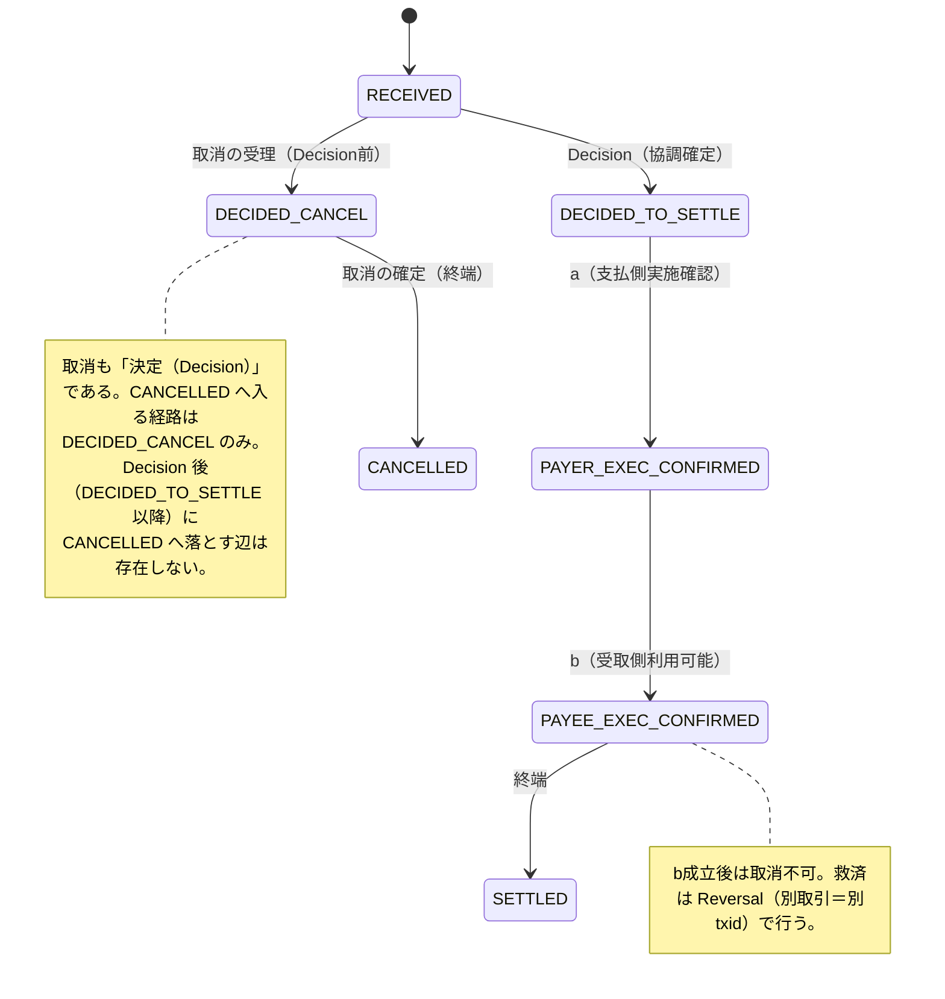
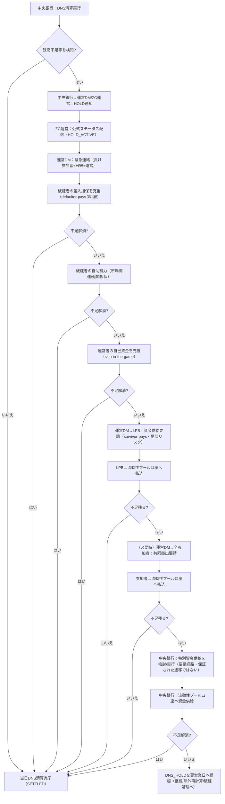
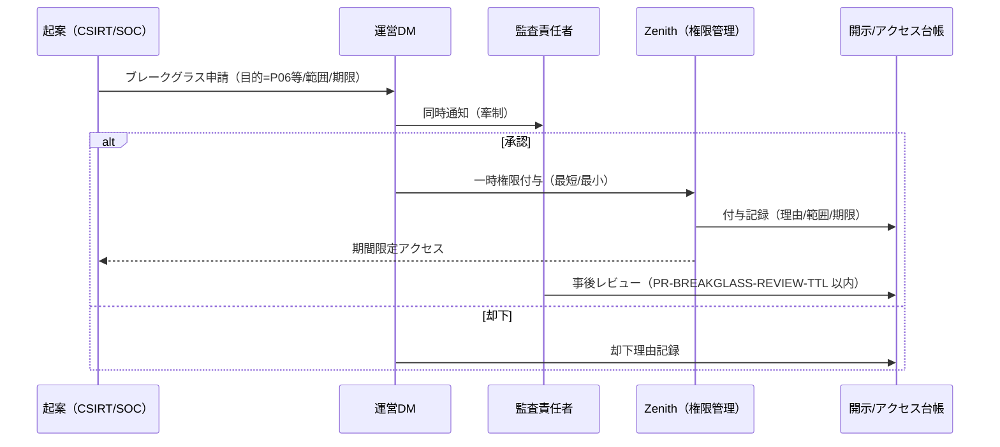
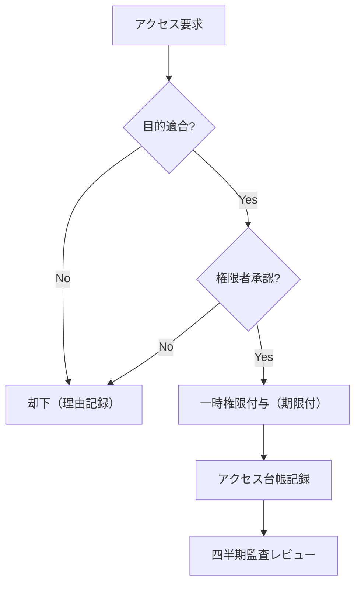

# 要件定義書（Requirements Definition）

> **本書の役割**：本書は要件定義書。ZCが満たすべき業務・制度・規制・非機能の要件を定める。処理方式は `20_method_design.md`、内部設計は `30_internal_design.md` を参照。

## 目次（TOC）
- 序章 全体像・用語・設計思想
- 第1章 システムの設計思想と社会的意義
- 第2章 関係主体と責任分界
- 第3章 制度・ガバナンス要件
- 第4章 法制度・契約構造との整合性
- 第5章 監督当局への説明整理
- 第6章 クロスカレンシーFX 要件
- 第7章 レガシー勘定系アダプタ 要件
- 第8章 非機能要件

## 序章 全体像・用語・設計思想

### Zenith Coordinator（ZC）

> 「決済を“ブラックボックス”ではなく、“説明できる状態の連なり”として扱うための基盤。」  
> — Zenith構想（構想文書より）

本書は、Zenith構想における **Zenith Coordinator（ZC）** の要件を、読み物として「全体像→固定点→詳細」の順に整理した文書です。  
ZCは「巨大な中央台帳」ではなく、参加者間の決済を **状態（state）と証跡（evidence）** で説明可能にする協調層です。  

> **重要：本書はフィクションであり、実在のシステム・運用を示すものではありません。**  
> なお、日銀・全銀システム・CHIPS・BOJ-Net 等の実在の制度・インフラは、**設計の参照モデルとして言及するもの**であり、本書がそれらの実運用を記述・代弁するものではありません。  
> また、`31_schema.md` の初期データ等に現れる実在の金融機関名は、**参照実装のシードデータとしての例示**であり、当該金融機関の参加・関与・見解を示すものではありません。


### このシステムは何のシステムか
- **一言でいうと** ：銀行から別の銀行にお金を移動（決済）させるときに、複数の銀行の間で橋渡しをするシステム。
- **目的** ：決済を「後から説明できる状態の連なり」として扱い、利用者・事業者・当局のいずれに対しても、同じ取引番号で説明できるようにする。  
- **やること** ：受理→決定（Decision）→実施確認（Execution）→確定（b）までを、レーン別の契約として固定する。  
- **やらないこと** ：参加者の勘定系や口座管理を置き換えない（責任は参加者に残す）。


### 最初に頭へ入れる「全体マップ」（レーン×機能×確定点）

> **読み方（結論）** ：レーンは UX 分類ではなく、 **「同期境界」「不可逆境界（Finality＝b）」「証跡（Evidence）」「例外の収束先（CASE）」** を固定する **契約（contract）** である。  
> 本書は、各レーンを「決済の状態機械」として読めるように **確定点と証跡を先に固定** し、以降の章はその演繹（詳細）として配置する。


- 機能軸：`Ingress`（受付） / `Reservation`（H_RESERVED） / `Decision`（合意ログ） / `Execution`（参加者実行） / `Evidence`（証跡） / `CASE`（例外収束） / `Query`（説明）
- 確定点：`Decision`（合意ログのコミット） → `a`（支払人完了） → **`b`（受取人完了＝Finality）**

| レーン | 主用途 | 同期で返す境界 | 不可逆境界 | 典型例外の収束 | 最小証跡（例） |
| --- | --- | --- | --- | --- | --- |
| Express | 店舗・即時課金 | `DECISION_ACCEPTED`（以降非同期） | **b** | REJECT または CASE | `decision_proof_ref`, `bank_proof_ref` |
| Standard | 説明可能な送金 | `INGRESS_ACCEPTED` | **b** | CASE（誤送金等） | 同上＋ `reason_code` |
| High-Value | 高額即時（中銀） | `INGRESS_ACCEPTED` | 中銀確定→b | CASE / HOLD | `cbrt_proof_ref` 等 |
| Bulk/Deferred | 締切・大量 | `INGRESS_ACCEPTED` | **b** | CASE / 再試行 | `cutoff_id`, `lsm_ref` |
| RTP | 請求 | `INGRESS_ACCEPTED` | **b** | CASE | `request_ref` |
| HTLC | 条件付き | `CREATED`（`POST /api/htlc/create`） | 条件成立→b | 期限→自動収束 | `hashlock_ref`, `timelock` |
| HTLC_AUTH | 受取側起点オーソリ | `AUTH_REQUESTED`（`POST /api/htlc-auth/request`） | Capture→b、Void→自動収束 | 期限→自動Void／CASE | `auth_id`, `whitelist_ref` |
| 継続収納 | 口座振替（反復回収） | `COLLECTION_NOTICED`（`POST /api/collections`）。`REALTIME` のみ Express と同じく `DECISION_ACCEPTED` | **b**（非同期）。失敗の確定は `confirm_deadline_at` | 想定内の不能は正常終端、CASE は真の乖離のみ | `mandate_id`, `charge_ref`, `attempt_no` |
| gtid | 多者協調（Decision原子） | `GTID_ACCEPTED`（`POST /api/gtid/register`） | Decision確定（原子）／完了認定は全legのb一致 | CASE（部分進捗） | `gtid_ref`, `leg_refs` |

> **同期応答の語義について**：`INGRESS_ACCEPTED` / `DECISION_ACCEPTED` の語義は `20_method_design.md` §2.1 で固定する。
> **HTLC・HTLC_AUTH・gtid は `POST /api/transfers` の入口を通らない**ため、同期応答の値も専用エンドポイント固有である
> （`POST /api/transfers` に `lane=HTLC` を送ると `422 USE_HTLC_ENDPOINT`、`lane=GTID` は `INVALID_LANE`。
> 契約は `32_api_contracts.md § POST /api/transfers`）。いずれも「受理までを同期で返し、確定は非同期」という点は共通である。

> 注意：表は **読み方の固定** が目的であり、実際のメッセージ・項目の正は `20_method_design.md` 第4章（I/F設計思想）および第8章（監査・ログ・証憑設計）、ならびに `30_internal_design.md` §12.1（cmd/event 正本）に従う。

#### レーンと `lane` 列の関係（用語の固定：規範）

「レーン」という語は本書群で **2 つの異なるもの** を指してきた。混同すると値域の議論が噛み合わないため、ここで分離して固定する。

| 用語 | 意味 | 値域 |
|---|---|---|
| **レーン（制度概念）** | 「確定点・同期境界・証跡・例外収束先」を固定する**契約の単位**。上表の行がこれにあたる | Express / Standard / High-Value / Bulk・Deferred / RTP / HTLC / HTLC_AUTH / 継続収納（＋多者協調の gtid） |
| **`lane`（API リクエスト値）** | `POST /api/transfers` で参加行が指定できる値 | `EXPRESS｜STANDARD｜BULK｜DEFERRED｜RTP｜HTLC｜HIGH_VALUE`（7 値。実装は `src/types/states.ts#LaneType`） |
| **`Transactions.lane`（DB 列値）** | 取引行に実際に格納される値 | 上記 7 値 **＋ `GTID` ＋ `DIRECT_DEBIT`**（9 値。実装は `src/types/states.ts#TxLane`） |

**規範**

1. **`GTID` は API リクエスト値ではない。** GTID は `POST /api/gtid/register` で受け付け、GT-level Decision 確定後にレッグを `Transactions` 行として実体化する際に `lane='GTID'` が**内部生成**される。参加行が `POST /api/transfers` に `lane=GTID` を送ることはできない（`INVALID_LANE`）。
2. **`HTLC_AUTH` は `lane` 列の値ではない。** 受取側起点オーソリは制度上は独立したレーン契約（上表の行）だが、実装上は **HTLC レーン上のフロー**として表現する——`Transactions.lane='HTLC'` とし、FinalityLog の payload に `flow='HTLC_AUTH'`、詳細は `HtlcAuthRequests` 表に持つ。したがって `lane` 列に `HTLC_AUTH` が入ることはない。
3. **`DIRECT_DEBIT` は API リクエスト値ではない。** 継続収納は `POST /api/collections` で受け付け、振替日に発火した収納を `Transactions` 行として実体化する際に `lane='DIRECT_DEBIT'` が**内部生成**される。参加行が `POST /api/transfers` に `lane=DIRECT_DEBIT` を送ることはできない（`INVALID_LANE`）。**`ScheduledCollection` を経由しない収納は存在しない**——委任状スコープの照合・累計枠の予約・費目の一意性は、いずれもこのエンティティに紐づくためである（`REALTIME` モードでは予告期間が 0 であり即時に発火するが、行は同じく生成される）。
4. 3 つの値域の正は、それぞれ本節・`32_api_contracts.md § POST /api/transfers`・`31_schema.md § Transactions` であり、**いずれかを変更する場合は 3 箇所と `src/types/states.ts` を同じ変更で更新する**。

#### 「参加者」「参加主体」「参加行」の関係（用語の固定：規範） <a id="participant-terms"></a>

本書群はこの 3 語を混在して使っている。**同義ではない**ため、ここで固定する
（既存の記述を一斉に置換する改稿は行わない。読み替えの規則を与える方が、
243 箇所の機械置換より安全であるため）。

| 用語 | 指すもの | 含むもの |
|---|---|---|
| **参加者** | ZC に接続する主体の**総称**。制度上は 2 層に分かれる（§3.2.1） | **決済参加者**（銀行等）＋**接続参加者**（PSP 等） |
| **参加主体** | 参加者と同義。文脈上「組織としての主体性」を強調する場合に用いる | 同上 |
| **参加行** | そのうち **決済参加者（銀行）** に限定した呼称 | 決済参加者のみ |

**規範**

1. **「参加行」と書いてある規範は、接続参加者には自動的には及ばない。** 銀行に限定した要求
   （勘定系接続・a/b 証憑の発行・中銀当座の保有等）は「参加行」と書く。両層に及ぶ要求は
   「参加者」または「参加主体」と書く。
2. **迷ったら「参加者」を使う**（広い方）。狭めるときだけ「参加行」と書き、狭める理由が
   説明できること。
3. RACI（§2.3）・責任分界（§2.1）が「参加行」で書かれているのは、**そこで論じている責務が
   銀行にしか生じない**ためであって、接続参加者を制度から除外しているのではない。

#### `reason_code` の 3 つの値空間（用語の固定：規範） <a id="reason-code-spaces"></a>

`lane` と同じ問題が `reason_code` にもある。本書群は `reason_code` という**ひとつの語で 3 つの異なる値空間**を指しており、
分離しないまま「この場合の `reason_code` は何か」を論じると必ず噛み合わない。ここで固定する。

| 用語 | 何を説明する値か | どこに載るか | 値域の正 |
|---|---|---|---|
| **エラー `reason_code`（同期応答）** | **要求が拒否された理由**。HTTP ステータスと `category` に対応する | 4xx/5xx 応答の本文 | `32_api_contracts.md § 主要 reason_code 一覧`（実装の正: `src/shared/errors.ts#REASON_CODE_CATEGORY`） |
| **状態 `reason_code`（`Transactions.reason_code` 列）** | **取引がいま その状態にある理由**。受理された取引について、なぜ止まっている／取り消されたかを説明する | 照会応答（`GET /api/transactions/:txid`）・FinalityLog payload | `32_api_contracts.md § 状態 reason_code`（実装の正: 同節に列挙） |
| **CASE `reason_code`（`Cases.reason_code` 列）** | **例外案件の分類**。CASE 台帳のキー | CASE 照会 | `31_schema.md § Cases`（状態 reason_code と同じ語彙を用いる） |

**規範**

1. **3 つは別の値空間である。** 語が同じでも値集合は同じではない。エラー `reason_code` に登録された値が、そのまま状態 `reason_code` として書けるとは限らない（逆も同様）。実際には一部の値が両空間で共用されているが、**共用は偶然であって規約ではない**。
2. **状態 `reason_code` は「拒否理由」ではない。** 受理された取引に付く説明であり、HTTP ステータスを持たない。したがってエラーカタログ（`32_api_contracts.md § 主要 reason_code 一覧`）に載せない値がある。
3. **窓口の説明は状態 `reason_code` に紐づける**（`20_method_design.md` §10.4.1.1）。エラー `reason_code` は API 呼び出し元の実装が扱う値であり、顧客説明の分岐には使わない。
4. **本書群で新しい `reason_code` を規範として名指しする場合は、どの空間の値かを明示し、対応するカタログに登録する。** 実在しない値を規範に書いてはならない——特に**遷移の条件や窓口の分岐**を実在しない値で書くと、規範が空文になる（この失敗は実際に起きたことがある）。


> **用語補足（協調＝Decision一体性）**  
> 本書でいう **協調（coordinated）** は、物理学的な“原子性”ではなく、**Decision（実施指示の確定）を同一の証跡で一体として扱う**ことを意味する。  
> 一方、Execution（a/b）は参加主体内部の実施であり、ネットワーク/内部障害により**部分進捗**が起こり得る。したがって本書は、協調取引（gtid）においても **Executionの同時成立を保証しない**（全legのb一致のみを完了認定）ことを規範とする。


実務者が混乱しやすいのは、「何が同期で返り、何が確定で、いつ取消不能になるのか」が曖昧なときである。本書はこれを **レーン単位で固定** する。

| 区分 | 主用途 | 受付の同期応答 | 名義確認（宛先確認） | 支払人最終認可 | 確定点（不可逆境界） | 典型の運用観点 |
| --- | --- | --- | --- | --- | --- | --- |
| Express | 店舗・即時課金 | **Decisionまで同期** | PSPR参照（受取側起点） | 参加主体内で実施 | **b成立（PAYEE_EXEC_CONFIRMED）** | 拒否理由の明確化／再試行容易 |
| Standard | 通常送金 | 受理（Ingress）まで同期 | **口座情報→名義結果を提示** | **顧客の最終承認** | **b成立** | 誤送金抑止／説明可能性最大 |
| High-Value | 高額即時 | 受理まで同期 | **口座情報→名義結果を提示** | **顧客の最終承認** | **中央銀行決済確定→b成立** | 事故抑止（a→日銀→b）／再照合必須 |
| Bulk/Deferred | 企業一括 | 受理まで同期 | 任意（推奨） | BatchAuthorize（署名） | **b成立** | 成立率最大化／締切順守 |
| RTP | 請求 | 受理まで同期 | 請求データにより確定 | 顧客の承認/自動 | **Attempt成功→b成立** | 当日再挑戦／資金流入待ち |
| HTLC | 条件付き | 受理まで同期 | 標準に準拠 | 条件成立時のみ | **b成立** | 期限収束／secret非保持 |
| HTLC_AUTH | 受取側起点オーソリ | 受理まで同期 | Whitelist 照合 | **支払人がApprove** | **Captureでb成立** | 与信枠の確保→決済を分離（カードのオーソリ/キャプチャ相当） |
| gtid | 多者束ね | 受理まで同期 | leg毎に準拠 | leg毎に準拠 | **全leg b成立でGT_FINAL** | 途中不整合の説明が最重要 |


### ZCの設計思想 10箇条

1. **SoT（唯一の正）は Finality Log** 。派生ビュー（Read Model）は捨てられる。（※「唯一の正」の射程は **協調事実**——決定・所有権移転・受領した署名付き証明——であり、**金銭事実の正は各参加行の元帳**にある。詳細は `20_method_design.md` §6.1（整合性モデル）の精密化を参照。）  
2. **Decision と Execution は必ず分離** する（決める主体と実行する主体を分け、説明責任も分ける）。  
3. **不可逆境界は原則 b（PAYEE_EXEC_CONFIRMED）** 。b 後は取消不可、救済は Reversal（別取引）で行う。  
4. **説明できない状態は禁止** 。未決・不整合は必ず **SUSPENDED → CASE** に収束させる。  
5. **同期応答の意味は契約で固定** する（受理・拒否・後続の見通し）。  
6. **証跡は「後付け」しない** 。Decision／Execution／照会は同一の証跡連鎖で検証可能でなければならない。  
7. **レーンはUXではなく「確定点と証跡の契約」** である（Express / Standard / HV / Bulk・Deferred / RTP / HTLC / HTLC_AUTH、および多者協調の gtid）。  
8. **H（仕向超過限度）を状態として管理** し、超過を論理的に発生させない。  
9. **危機対応（DNS_HOLD等）を例外ではなく制度化された状態遷移** として扱う。  
10. **全国システムの単一正本性は分散合意ログで担保** し、過半数喪失時は Read-only へ縮退して誤決定を防ぐ。


### Zenith 独自用語ミニディクショナリー

- **Finality Log** ：確定した事実だけを追記する「唯一の正本」。  
- **Read Model** ：照会・画面表示のための派生ビュー（捨てて再構築できる）。  
- **Decision** ：ZCが「成立」を決める行為（合意ログに記録される）。  
- **Execution** ：参加者（銀行等）が実際に資金移動を実行する行為（証憑を伴う）。  
- **a / b** ：a=支払人側完了（中間）、b=受取人側完了（不可逆の確定点）。  
- **Reversal** ：b後の救済。取消ではなく「別取引」で相殺・補正する。  
- **CASE** ：例外案件番号。未決・不整合を“案件”として追跡・収束させる単位。  
- **SUSPENDED** ：保留状態（例外案件＝CASEへ必ず接続する）。  
- **レーン（Lane）** ：UX分類ではなく「確定点と証跡の契約」で区分した取引クラス。  
- **Express / Standard / HV / Bulk / RTP / HTLC / HTLC_AUTH** ：レーン（本文の全体マップ参照）。  
- **gtid / leg** ：複数取引を束ねるグループIDと、その内訳取引。  
- **HTLC** ：条件成立でのみ確定する取引（期限・条件を状態として扱う）。  
- **H（仕向超過限度）** ：仕向側の送金限度。`H_reserved` / `H_locked` として状態管理する。  
- **DNS** ：日次ネット清算（Daily Netting Settlement）。  
- **IGS** ：即時グロス清算（Immediate Gross Settlement：高額系）。  
- **igs_mode** ：IGSの運用状態（`NORMAL`／`STOP`／`RINGFENCED`／`RINGFENCED_PLUS`）。平時は `NORMAL`。DNS_HOLD等の危機モード中は `STOP` へ落とし、段階的に部分継続を許容する。  
- **dns_recovery_reserve** ：DNS復旧のために確保すべきリザーブ（ZCが算式によりリアルタイム算定し、`reserve_explain_hash` と `reserve_confidence` を証跡化）。  
- **DNS_HOLD / IGS_HOLD** ：清算側都合で“確定が先送りになる”制度化された状態。  
- **SoT** ：System of Truth（唯一の正本）。本書では Finality Log。  
- **Invariants** ：破ってはいけない不変条件（例：二重確定禁止、b後取消禁止）。  
- **Read-only 縮退** ：過半数喪失などで誤決定を避けるため、決定を止め照会のみ許す。  
- **WORM** ：追記のみ・改ざん困難な保管（監査・訴訟耐性のための長期保全）。

#### 開発内部ラベル（コード内コメント用・仕様用語ではない）

参照実装のソースコメントには、開発時の作業単位を指す内部ラベル（「テーマA」「probe #N」）が残っている。
**これらは仕様用語ではなく、設計書本文では使用しない**（本書群からは除去済み）。コードを読む際の
対応表として、ここにのみ記載する。

| ラベル | 機能 | 主な規範箇所 |
|---|---|---|
| テーマA | クロスチェーンHTLC（オンチェーンエスクローの観測） | `20_method_design.md` §7.7、`30_internal_design.md` §15.6 |
| テーマB | Mandate（委任チェーン） | `30_internal_design.md` §11.2-e |
| テーマC | プログラマビリティの汎用化（条件式・Attestation） | `30_internal_design.md` 第11章・§15.5 |
| テーマE | 参加行の稼働ウィンドウ | `31_schema.md § Participants`（`operating_window_*`） |
| テーマF | 受取側起点オーソリ（HTLC Auth） | `10_requirements.md` §3.2.3.1 |
| テーマH | 可搬性と縮退（BCP／実行環境の抽象化） | `30_internal_design.md` 第6章・第7章 |
| テーマI | 決済証跡の信頼アンカー（`SettlementProofRef`） | `32_api_contracts.md § SettlementProofRef` |
| probe #N | 敵対的シナリオテストの通し番号 | `test/integration/chaos_*.test.ts` |

> **規範**
> 1. 新しい内部ラベルを設計書本文へ持ち込んではならない。
> 2. **新規のコードでも使わない。** 規範箇所への参照（例：`20_method_design.md` §7.7）を直接書く。
> 3. 既存コードに残るラベルは、**上表が参照そのもの**である。使用箇所ごとに参照を書き足すことは
>    求めない——26 箇所の注釈を書き換えても読者が得るのは上表と同じ情報であり、
>    「守られていない規範」を 1 つ増やすだけになる。ラベルに触れる改修の際に参照へ置き換えれば足りる。


### 全体マップ（レーン×機能×確定点）

**読むときのコツ：** 最初に「どこで *決まる* か（Decision）」「どこで *不可逆* になるか（b）」「例外がどこへ収束するか（CASE）」だけを追う。

| 観点 | 固定点（要約） |
| --- | --- |
| レーン | Express / Standard / High-Value / Bulk・Deferred / RTP / HTLC / HTLC_AUTH / 継続収納（＋多者協調の gtid） |
| 同期境界 | 「受理（Ingress）」までか、「Decision確定」までかはレーン契約で固定 |
| 不可逆境界 | 原則 b。HVは「中央銀行清算確定→b」を例外として扱う |
| 例外収束 | 未決・矛盾は SUSPENDED → CASE（番号で追跡） |
| 証跡 | decision_proof_ref / bank_proof_ref を中心に、照会と監査が同じ根拠に収束 |


## 第1章 システムの設計思想と社会的意義

> **要旨**  
> 本章では、ZCを「決済の基盤OS」として位置づけ、説明可能性を最上位の設計規範に置く理由を述べる。対象/非対象を事務起点で切り分け、高額即時レーンの誤解ポイントと、レーン×確定点の全体マップを提示する。


### 1.1 社会的意義（本システムの位置付け）
本システムは、日本の決済インフラを **「事務レス・安全・低廉」** を中心価値として再設計する、いわば「決済の基盤OS」の機能要件に関する参照アーキテクチャである。  
FinTechが個別に実装してきた機能（即時送金、店舗決済、請求（RTP）、条件付き決済、照会・トレーサビリティ）を共通化し、制度・監督・監査・訴訟耐性を持つ形で提供することを指向する。
なお、参照実装は Cloudflare 上への実装を前提とする。これは非機能要件を軽んじる理由ではない——非機能の受入水準は第8章に規範として固定する。参照実装がその水準をどこまで満たすか（満たさないか）は同章冒頭「参照実装の射程」に明示する。

> **設計規範（最上位の固定点）**  
> (1) 実装できる（分散システムとして成立）／(2) 運用できる（障害・例外を状態化）／(3) 事務が回る（照会・訂正・証跡）／(4) 当局説明ができる（監督・監査・利用者照会）を、機能要件より上位の「設計規範」とする。


### 1.2 業務スコープ（対象・非対象：事務起点で固定）
本書で扱うZCは、参加主体（銀行・決済サービス）が提供する送金・決済を、 **「受理 → 決定（Decision）→ 実施確認（Execution）→ 確定」** の状態機械として統一し、照会・証跡・例外処理を共通化する。

ここで重要なのは、ZCが **参加主体の内部勘定処理そのものを置き換えるのではなく** 、参加主体間の取引を「説明できる形で前に進める」ための **協調層（Coordinator）** である、という点である。

#### 1.2.1 本書の対象（ZCが責任を持って規範化する範囲）
- **Express** ：店舗・即時課金（PSPR参照で宛先確定、受付結果を同期で返す）
- **Standard** ：名義確認（宛先確認）→支払人の最終認可→実施（最も説明可能性が高い）
- **Bulk / Deferred** ：締切ウィンドウ＋流動性節約（LSM）により当日成立率を最大化
- **RTP（請求）** ：実行日まで資金拘束しない請求スキーム（当日 Attempt を `PR-RTP-ATTEMPT-MAX` 回まで反復。`30_internal_design.md` §12.9）
- **HTLC（条件付き留保）** ：hashlock＋timelockにより「成立前不確実性」を状態化
- **協調取引（gtid：束ね協調）** ：複数legの同時成立“に近い”振る舞いを提供（DNS領域で提供）
- **DNS（Daily Netting Settlement：日次ネット清算）** ：ZCが日次のネット明細を束ねて中央銀行へ清算依頼（Kick）し、中央銀行内部で協調清算（内部gtid相当）を実行
- **高額即時レーン連携** ：高額閾値に該当する取引は、ZCが **中央銀行の決済までルーティング** し、結果を状態化する

#### 1.2.2 本書の非対象（参加主体側の責任として吸収する範囲）
- 顧客認証・本人確認・与信・限度管理の基準（各参加主体の裁量）
- 勘定系（LMS/Core）の内部方式（モダン／レガシーの差異は参加プロファイルで吸収）
- 返品・相殺・商流都合の判断（ただし「救済取引」起票の方式は規範化）
- 外部台帳（DLT等）との直接連携（将来拡張の余地として扱い、本書の規範対象外）

#### 1.2.3 高額即時レーンの扱い（誤解防止）

> **設計規範（高額即時の事故抑止：HVは“外部清算フェーズ”を明示）**  
> 高額即時レーンでは、支払銀行内で**顧客口座から清算専用中継勘定へ資金を隔離**した完了点を **a_HV** と呼ぶ。  
> 状態機械の爆発を避けるため、外形上は `PAYER_EXEC_CONFIRMED(a)` と同一状態で扱い、**証憑の`proof_type`**（例：`PAYER_HV_ISOLATION_PROOF`）でa_HVを区別する。  
> ただし、**中銀決済（IGS）の進行状況はRead Model属性として明示**し、混同を禁止する：`external_settlement_status = NONE|REQUESTED|SETTLED|FAILED|HOLD`。  
> ZCは `PAYER_HV_ISOLATION_PROOF` を受領した場合のみ中銀決済を起動し、以後の遷移は次の不変条件に従う：  
> **不変条件**：高額即時レーンで `PAYEE_EXEC_CONFIRMED(b)` へ遷移してよいのは `external_settlement_status == SETTLED` の場合に限る。  
> 中銀側で不成立（FAILED/HOLD）が確定した場合は、支払銀行が隔離資金を**内部手続で復元**し、その証跡（例：`EXT_REFUND_PROOF`）を提出して収束させる（銀行間Reversalの前提にしない）。

- 高額即時レーンは **Standardを拡張した規範フロー** として扱い、名義確認・AML/制裁スクリーニング・支払人最終認可を必須化する。
- **a（PAYER_EXEC_CONFIRMED）成立後にのみ** 、ZCが中央銀行決済を起動（Kick）し、決済結果の確定後にb（PAYEE_EXEC_CONFIRMED）へ進める（事故抑止：`20_method_design.md` 第2章 業務フロー）。
- 中央銀行側の内部方式（オペレーション・台帳構造）は本書の規範対象外とし、ZCは **依頼・冪等・結果の状態化** を規範として固定する。

#### 1.2.4 高額即時レーンへの自動エスカレーション（規範）

> **設計規範（システミック領域の取り違え事故抑止）**  
> 利用者・参加行が `lane=EXPRESS` または `lane=STANDARD` を指定して送金しても、**金額が閾値以上の場合は ZC が受付時点で lane を HIGH_VALUE に書き換える**。これは「即時性 vs リスク統制」のトレードオフを**制度規範として統制側に倒す**判断であり、ユーザー側の意図に依存しない。

- **エスカレーションの効果**: 受付時に `body.lane = 'HIGH_VALUE'` に書換え、以降 `HIGH_VALUE` レーンの規範フロー（`20_method_design.md`「高額即時レーン（High-Value Immediate）」節）に従う。FinalityLog の `PaymentInitiated` イベントには書換え後の lane が記録される。

- **書換えは利用者から見える**: 指定と異なるレーンの応答形（同期応答・照会結果）を観測しうるため、API 仕様に「lane の書換え可能性」を明記する（`32_api_contracts.md § POST /api/transfers`）。観測のされ方は本書 §3.2.7 の 4. に固定する。

- **閾値・変更権限・禁止事項・監査は §3.2.7 を正とする**（本節では繰り返さない）。


### 1.3 用語と責任分界の最初の地図（事務・実装の混線防止）

#### 1.3.1 主要な登場主体
- **Client / Channel** ：支払人アプリ、企業の支払システム、受取側POS等（利用者接点）
- **Participant Edge/API** ：参加主体がZCと接続するためのゲートウェイ（認証・署名・冪等制御を含む）
- **ZC** ：受理・検証・レーン制御・Decision確定・状態遷移・照会の中核
- **Bank LMS/Core** ：参加主体の勘定系（Ledger / Core Banking）。モダン／レガシーいずれも参加可能

#### 1.3.2 よく誤解される用語（先に固定）
- **LMS** ：ここでは「勘定系（残高・仕訳・内部決済）」を指す。ZCはLMSを置き換えない。
- **PermitSig** ：受取側（B）が「この受取条件で受けることを許諾した」ことを示す署名。
  - **意味するのは“許諾の証拠”のみ** であり、B内部の与信・在庫・審査完了を意味しない（判断基準は参加主体側）。
- **Decision（DECIDED_TO_SETTLE / DECIDED_CANCEL）** ：ZCが「実施指示を出すこと」を確定した境界（Raftコミットで立証）。
- **Execution（a/b）** ：参加主体が実施したことを証憑で示す境界。
  - **a** ：PAYER_EXEC_CONFIRMED（支払側の実施完了）
  - **b** ：PAYEE_EXEC_CONFIRMED（受取側の利用可能化＝弁済完了）
- **DLQ（Dead Letter Queue）** ：非同期のcmd/eventが上限回数（**`PR-RETRY-MAX`**。`30_internal_design.md` §12.9）までリトライしても処理できない場合の退避キュー。
  - ZC/参加主体のいずれのDLQも、 **CASE起票に接続** し、"放置されない" ことを規範とする（`20_method_design.md` 第10章 運用設計）。

#### 1.3.3 POSはどこと繋がるのか（接続モデル）
- POS（受取側端末）が **支払側銀行（PayerBank）と直接接続する設計は採らない** 。
- 店舗決済では、受取側（加盟店/GW/PayeeBank）がPSPRを発行し、支払人は **自分の銀行アプリ等（Client）** から `pspr_ref` を提示して支払を起動する。
- 受取側が支払側から得る情報は最小限とする（例： **参照番号／状態／入金可否** ）。個人情報や口座情報をPOSへ露出させない。


## 第2章 関係主体と責任分界

> **要旨**  
> 本章では、ZCと参加者（銀行等）の役割を「決める／実行する／説明する」で分離し、責任分界をRACIで固定する。認証・残高・与信は参加者責任に残しつつ、照会・証跡・例外収束を共通化することで、監督・監査・利用者説明の前提を整える。


### 2.1 関係主体（ロール）
- **ZC（Zenith Coordinator）** ：取引の受理・検証・決定（Decision）・指図生成・証跡管理・照会基盤・運用統制。  
- **参加行（Payer/Payee Bank）** ：顧客口座の管理、本人意思確認、残高判定、Execution（a/b）証憑の発行、顧客説明。  
- **LMS（Liquidity Management System）** ：当座・日中当座・流動性の管理（銀行内部）。  
- **CMS（Customer Management System）** ：顧客接点（受付、通知、照会UI、同意取得）。  
- **加盟店/決済GW（Express）** ：PSPR（署名付き受取人情報）生成。  
- **監督当局** ：制度合意、モニタリング、照会、監督上の要求の提示。

### 2.2 責任分界の原則（規範）
- **正の決定点はZC** 、 **口座・資金状態のオーナーは参加行** 。  
- **過失者責任** を原則とし、原因特定可能な場合は当該主体が責任を負う。  
- ただし、社会インフラとしての利用者保護のため、制度・約款で **補償・免責・求償** を明確化する（第4章）。

### 2.3 RACI（責任分界）— 最小十分表
| 事項 | ZC | 参加行（仕向） | 参加行（被仕向） | 加盟店/GW | 当局 |
| --- | --- | --- | --- | --- | --- |
| 受付/形式検証 | R/A | C | C | C | - |
| Decision確定（DECIDED_*） | R/A | C | C | - | - |
| H予約/制限 | R/A | C | C | - | - |
| 本人同意・残高判定 | - | R/A | - | - | - |
| PAYER_EXEC_CONFIRMED（a証憑） | - | R/A | - | - | - |
| PAYEE_EXEC_CONFIRMED（b証憑） | - | - | R/A | - | - |
| PSPR署名（Express） | - | C | R | R/A | - |
| 監査ログ保全（Finality Log） | R/A | C | C | - | - |
| 証憑（bank_proof_ref）発行 | - | R/A | R/A | - | - |
| CASE起票・例外収束 | R/A | R | R | - | C |
| 障害時の説明（対外説明） | R/A | R | R | - | C |

### 2.4 PermitSig / Authority Check（AML/制裁）の位置付け（規範）
- **PermitSig** ：銀行内サブシステムが「許諾した」ことを示すシグナル。判定基準は本基盤の対象外。  
- **Authority Check（AML/制裁）** ：必要時に署名付きOK/NG応答（または参照番号）を取得し、Finality Logに証跡化する。  
- 本基盤が取り扱うのは **照会・結果・証跡** であり、判定ロジックを中央に寄せない（責任分界の明確化）。

> **設計の狙い**
>「誰が判断したのか」を曖昧にしないことで、監督・監査・訴訟・対外説明時に説明可能な責任分界を実現し、結果として事務を回す。


## 第3章 制度・ガバナンス要件

> **要旨**  
> 「制度」では、Zenith Coordinator（ZC）の技術設計を前提に、機能設計の背後にある制度的前提を示す。技術仕様の詳細は本文/補遺/付録を正とする。

本章の節番号（3.1〜3.3、およびその配下の細分番号）は本章内で完結する体系である。

### 3.1 制度の基本原則・設計思想（Design Principles）

#### 3.1.1 設計原則
1. **Explainability First**（説明可能性を最優先） ：まず状態・理由・証跡を明確にし、機能の追加はその後に置く。
2. **Privacy by Design**（設計段階からのプライバシー配慮） ：データの最小化、アクセスできる範囲の最小化、監査可能性をあらかじめ組み込む（後から付け足すことは認めない）。
3. **Neutrality & Fair Access**（中立性と公平な参加機会） ：参入条件・料金・データの扱いにおける差別を禁止する。共同事業であることが「競争を制限している」と誤認されないよう、制度設計そのものでその懸念を回避する。
4. **Operational Feasibility**（現場での運用可能性） ：現場の担当者が実際に動けること（必要な権限・手順・証跡がそろっていること）を、他の要件より上位に置く。
5. **Resilience as Institution**（制度としてのレジリエンス） ：停止・縮退運転・再開の判断は、技術的な仕組みだけに頼らず、権限や優先順位といった制度によって担保する。
6. **Backward Compatibility**（後方互換性） ：急激な変化よりも定着を重視し、移行のしやすさを最優先する。
7. **No Heroics**（属人的な無理を前提にしない） ：担当者が無理をして運用を回すような設計を禁止し、例外的な事態は CASE（例外処理を記録・追跡する仕組み）として制度化する。

#### 3.1.2 トレードオフ（意思決定ルール）
| トレードオフ | 優先順位ルール（判断基準） | 禁止事項 |
| --- | --- | --- |
| 即時性 vs リスク統制 | システミック領域は統制優先。即時性は縮退可能性とセットで許容 | 「止められない即時」 |
| 開放性 vs 管理可能性 | 二層参加で両立。接続参加は統制要件を明確化 | 恣意的参入拒否 |
| 透明性 vs プライバシー | 透明性は証跡で、プライバシーは最小アクセスで担保 | フルデータ集約 |

> **意思決定の鉄則**  
> 原則が衝突する場合は、(1) 公共性（利用者保護・安定性）→(2) 中立性（競争政策）→(3) 運用可能性（現場が回る）→(4) コスト、の順で判断する。


#### 3.1.3 本章の規程要点
- 例外は「運用で吸収」せず、CASEとして制度化する。
- プライバシーは最小化＋監査可能性で担保する。
- 中立性は努力目標ではなく、禁止事項の列挙で担保する。
- 移行可能性を満たさない制度は採用しない。


### 3.2 制度仕様（提供機能・ルール要件）

#### 3.2.1 サービス範囲（In/Out）
| 区分 | In（提供する） | Out（提供しない） |
| --- | --- | --- |
| 決済種別 | 振込相当、口座間、請求（RTP）、条件付（HTLC）、継続収納（口座振替） | 証券決済、現金輸送 |
| 参加形態 | 決済参加者（銀行等）、接続参加者（PSP等） | 無資格者の直接接続 |
| 上限・時間 | 上限・高額連携は別枠で設計 | 無制限即時（統制なし） |

#### 3.2.2 ルールとしての処理要件
- **受付（Acceptance）** ：参加者が顧客指図を受けた時点から、ZCの取引ID（txid/gtid等）を付与し、照会可能とする。
- **取消（Cancel）** ：b（PAYEE_EXEC_CONFIRMED）以前に限定し、所定の条件（誤送信・二重送信等）と証跡（指図取消依頼、相手方同意等）を要する。
- **訂正（Correct）** ：金額・受取人等の本質情報の訂正は「取消＋再指図」を原則とし、訂正単体は原則禁止（混乱防止）。
- **組戻し（Reversal）** ：b以後は「取消」ではなくReversalとして処理する。原則、(a) 受取人同意、(b) 法令・裁判所命令、(c) 当局要請、のいずれかを要件とする（§4.3.0 三層ゲートの **第2層**。第1層＝原因事由、第3層＝業務区分と併せて満たす必要がある）。
- **凍結・差押・疑義取引** ：執行主体（参加者）とZCの役割を明確化し、ZCは状態・証跡を提供するが、口座凍結自体は参加者が実行する。



> **本図の位置づけ（規範）**：本図は制度側の読者向けに**取消と確定の関係だけ**を抜き出した簡約図である。
> 中間状態（`PRECHECKED` / `H_RESERVED` / `SUSPENDED` 等）は省略しているが、**省略と「存在しない辺」は別物**である。
> - `CANCELLED` への入口は **`DECIDED_CANCEL` のみ**。「取消」もひとつの Decision であり、決定の証跡を残さずに終端へ落とす経路は無い。
> - `DECIDED_TO_SETTLE` 到達後は**取消できない**。以降の失敗は `SUSPENDED` → `FAILED_EXECUTION` として表現し、収束は救済（Reversal／返し決済）または未実行証明で行う（`20_method_design.md` §10.8.4）。
> - 全状態を含む正準の遷移表は `20_method_design.md` §3.2.1、実装上の唯一の正は `src/zc/orchestrator/state_machine.ts#ALLOWED_TRANSITIONS` である。本図と両者が食い違った場合は**本図を修正する**。

> **禁止（誤解防止）**  
> 「訂正だけで元取引を上書きする」ことは禁止する。監査・照会・紛争で必ず破綻するため、訂正は取消＋再指図で表現する。


#### 3.2.3 HTLC（条件付き決済）の制度上の位置付け【規範】
HTLCは条件付きの決済予約であり、 **条件成立までファイナリティ（b）は発生しない** 。制度上の取り扱いは以下のとおり固定する。

1. **状態** ：`HTLC_LOCKED` 中は条件未成立であり、取消（Cancel）・失効（Expiry）の対象となる。
2. **資金の取扱い（会計・運用）** ：支払側参加主体は、条件付き留保のための内部勘定（HTLC Escrow相当）を設け、顧客約款上の説明可能性を確保する。
3. **差押・倒産等の第三者権利主張** ：第三者権利主張（差押・凍結・倒産手続等）が到来した場合、参加主体は法令・約款・リーガルオピニオンに従い執行し、ZCは **状態（FREEZE/LEGAL_HOLD）と根拠証跡参照** を提供する（ZCが法的判断を代替しない）。
4. **secretの取扱い** ：ZCは secret 本体を保持せず、`secret_hash` と検証証跡（提示時刻・検証結果・署名参照）のみを保持する。
5. **不正成立時の責任分界** ：secret漏洩等により不正成立が疑われる場合、一次補償は顧客接点主体が担い、提示・管理責任（委任を含む）の所在に従い求償する（詳細は参加者規程）。

##### 3.2.3.1 HTLC Auth（受取側起点オーソリ）の制度上の位置付け【規範】

カード決済型「オーソリ（事前承認） → 後日キャプチャ / ボイド」を HTLC に被せた派生フロー。EC・宿泊・レンタル等の「先に与信を取り、確定金額は後で確定する」業態を想定する。

1. **状態モデル**: `AUTH_REQUESTED → AUTH_APPROVED → CAPTURED | VOIDED | EXPIRED`。`AUTH_DECLINED` は送金側が承認しなかった終端。Transactions 側は canonical entry を通り `RECEIVED → HTLC_LOCKED → ... → SETTLED` の規範経路に乗る。
2. **ホワイトリスト（HtlcAuthWhitelist）**: 受取側を加盟店として事前登録する制度。`allowed_payer_bank_id` / `max_amount` / `allowed_purposes` 等で適用範囲を絞る。目的は、参加行が無制限に他行顧客に対するオーソリを発行できないようにすることにある。
3. **承認責任（規範）**: 加盟店審査（KYB 相当。与信・反社チェック等）の責任は、**その加盟店の口座を保持する受取側参加行**が単独で負う。**ZC は加盟店を審査しない。** 本人確認・与信・限度管理は各参加主体の裁量であり（第2章 責任分界）、ZC がこれを代替することは制度設計上の越権である。受取行は自らの顧客について ZC より優れた情報を持つ。ZC の役割は、受取行が署名して主張した適格性について**署名・スコープ・鮮度のみを検証し記録すること**に限られ、実質判断を行わない。
   > **改訂の経緯**: 本項は当初「ホワイトリスト登録は ZC 運営の制度行為」「審査責任は ZC 運営 + 受取側参加行に集約」と規定していた。これは「本人確認・与信・限度管理は各参加主体の裁量」という本システムの基本スコープと矛盾しており、ZC を門番として位置付けるものであった。ZC の力は監査可能性にあって門番であることにはない、という原則に沿って改めた。プル型レーン一般の統制については §3.2.8.8 を参照。
4. **キャプチャ期限**: `capture_expires_at` を超えると自動 `EXPIRED` / `VOIDED` 扱いで資金が解放される。期限管理は ZC が cron で巡回（`timeout_sweep`）。
5. **canonical 入口の必須性（規範）**: 承認時に Transactions を `HTLC_LOCKED` で直接 INSERT することは禁止する。`RECEIVED` で挿入し `RECEIVED → HTLC_LOCKED` を `transitionWithLog` で正規遷移すること。`PaymentInitiated` イベントが必ず FinalityLog に記録されることをもって canonical 入口の証拠とする（背景: 過去に `HTLC_LOCKED` 直挿入で payee が永遠に着金しないリグレッションを起こした）。
6. **preimage の保管**: ZC 側 Vault に `data_type='HTLC_PREIMAGE'` で保持し、TTL は `capture_expires_at + 60 分` を上限。preimage 自体は FinalityLog の payload に記録しない（ハッシュ prefix のみ）。

#### 3.2.4 GTID（多者協調取引）の制度上の位置付け【規範】
GTIDは複数の決済（leg）を束ねる参照識別子であり、 **法的効果はleg単位** で発生する。制度上、以下を固定する。

1. **性質** ：GTIDは「取引の束」を示す参照番号であり、GTIDそれ自体を独立の法律行為として扱わない。
2. **ファイナリティ** ：各legのファイナリティ（b）は、当該legの `PAYEE_EXEC_CONFIRMED` 成立時に個別に発生する。
3. **会計・運用上の完了日** ：全legがbに到達した日を `gtid_completion_date` とし、会計・対外説明は原則これを用いる（ただしDNS計上はleg単位）。
4. **DNS計上** ：各legは **各legのb成立日のDNSサイクルに個別に計上** する（GTID単位でのネッティング計上は行わない）。
5. **一部遅延・未成立** ：一部legが `PR-GTID-TTL` を超えて未成立の場合、GTIDは `GT_SUSPENDED` とし、(a) 遅延回復、(b) 未成立legに関する補償/救済（成立済みlegは維持）で収束する（`PR-*` パラメータの一覧・定義は `30_internal_design.md` §12.9 PR-* パラメータ台帳）。
6. **倒産否認等** ：倒産否認等により一部legに遡及的な扱いが発生する場合も、影響は当該legに限定し、他legのbを上書きしない（必要な回収はReversal/法定返還等の別取引で処理）。
7. **Decision 確定前の不変条件（規範）** ：GT-level Decision（`GT_PRECHECKED → GT_DECIDED_TO_SETTLE`）を確定させる前に、以下 2 点を必ず検証する。違反時は `GT_DECIDED_CANCEL` に収束させ、Decision 確定後の不整合発見による「Decision 後の取消」を避ける。
   - **金額均衡**：`sum(PAYER leg amounts) == sum(PAYEE leg amounts)`。違反は `reason_code=AMOUNT_BALANCE_MISMATCH`。
   - **ロール完全性**：PAYER と PAYEE の双方の leg が少なくとも 1 本ずつ存在すること。違反は `reason_code=MISSING_LEG_ROLE`。
8. **PAYER ↔ PAYEE 対応付け規範** ：レッグ間の対応関係は **`leg_id` の辞書順位** で確定する。`INSERT` 順や DB ROWID に依存した対応付けは、取り違いの着金（A→B を A→C と誤実行）を招くため禁止する。実装は PAYER 配列・PAYEE 配列をそれぞれ `leg_id` 昇順にソートし、同一 index 同士で対をなす。
9. **脚構成の正規化（規範）** ：**PAYER と PAYEE の本数は一致していなくてよい**。1×M（fan-out）も両側とも複数の一般形 N×M も受理・決済されるが、それは受付時に脚集合を**通貨グループごとに 1:1 の部分取引へ正規化**したうえで決済経路へ渡すためである。したがって **`leg_id` は受付時に書き換わり得る**——参加者は自分が付けた `leg_id` がそのまま照会キーになると仮定してはならない。通貨をまたいだ相殺は行わず、ある通貨が単独で均衡しない構成（真のクロスカレンシー FX）は本レーンの対象外として取消し、FX レーン（第6章）が扱う。正規化の規則・書き換え後の `leg_id` 書式・正規化後の安全弁は `20_method_design.md` §2.2.5.1 を正とする。

#### 3.2.5 DNS（Daily Netting Settlement）とDNS_HOLD時の流動性手当て（制度）

<!-- SoT: 制度 / References: （本文表示は省略） -->

##### 3.2.5.1 位置づけ（制度側）
- DNSは、当日中に発生した多数の決済（gtid群）を **参加者間のネットポジション** に圧縮して清算する日次サイクルである。
- DNS_HOLDは、ネット債務者（負け参加者）の資金不足等により、当日DNS清算が完了できない状態であり、 **決済の“取消”ではなく、清算完了のための“つなぎ流動性”確保** として扱う。
- DNS_HOLD中の情報開示は、取り付け・風評を誘発しないよう、 **公式ステータス／公式発表に一致** させ、原因行・不足額等は閉域情報とする。

##### 3.2.5.2 DNS_HOLD時の各主体の動き（制度プロトコル：概要）

不足額を埋める資金の発動順序は **「破綻を起こした者が先に払う（defaulter-pays）」** を先頭に置く。これは実在の金融市場インフラ（FMI）のデフォルト・ウォーターフォールと PFMI（金融市場インフラのための原則）原則4・7 の標準形であり、危機の最中に「なぜ生存者が先に負担するのか」という負担配分の法的争いを持ち込まないための順序である。生存者拠出（LPB・共同拠出）はこの順序の**後段（尾部リスク層）**に位置づける。

> **用語の整理（混同しやすい二つを分ける）**  
> **デフォルト・ウォーターフォール**＝危機時の「損失・不足の負担を誰がどの順で埋めるか」（本節）。  
> **流動性節約機構（LSM）**＝平時の日中流動性を節約する仕組み（キュー相殺・部分ネッティング。`20_method_design.md` 第2章 業務フロー §2.2.4 Bulk/Deferred）。  
> 両者は別物である。LSM は効率化装置であって危機時の損失配分ではない。平時の効率化装置に危機時の期待を載せてはならない。

**前提となる 0 段目（資金源ではなく、検知と状態化）** ：中央銀行（DNS清算サービス）が清算実行時に残高不足等を検知し、運営DM（清算運営）およびZC運営へ通知する。ZC運営は `HOLD_ACTIVE` を公式ステータスとして配信し、参加者は顧客向け表示で「取引未完了」と誤認させない。以下のウォーターフォールは、この状態化が済んでいることを前提に発動する。

資金源の発動順序（上から順に、埋まった時点で停止）：

1. **破綻者の差入担保（defaulter-pays 第1層）** ：負け参加者が事前に差し入れた担保を第一に充当する。これが機能していれば、後段の生存者拠出はそもそも発動しない（§3.2.5.3 の FC 参照）。
2. **破綻者の自助努力（defaulter-pays 第2層）** ：負け参加者は市場調達・行内流動性移動・追加担保差入等で当日解消を試みる。
3. **運営者の自己資金（operator skin-in-the-game）** ：破綻者資源で埋まらない場合、運営者が規程で定めた自己資金を次に充当する。生存者に負担を回す前に運営者自身が身銭を切る、という順序を制度で固定する。
4. **流動性供給銀行（LPB）スキーム（survivor-pays 第1層）** ：なお不足する場合に限り、運営DMは事前契約に基づきLPBへ資金供給を要請し、資金は中央銀行内の **流動性プール口座（特別口座）** へ払い込まれる。**これは尾部リスク専用の層であり、FC が機能している限り出番はほとんどない。**
5. **共同拠出（survivor-pays 第2層・必要時）** ：LPB供給でも不足する場合、運営DMは規程に基づき全参加者へ臨時拠出を要請し、同じ流動性プール口座へ払い込まれる。
6. **中央銀行の資金供給（要請経路・必要時）** ：なお不足する場合、中央銀行は（必要に応じて当局と協議のうえ）日銀法等に基づく特別な資金供給を**検討**し、実行する場合は同じ流動性プール口座へ資金を投入する。**これは「保証された状態遷移」ではなく「要請経路」である**——中央銀行の与信は中央銀行の裁量に属し、ZC の規程が自動発動の遷移として書くことはできない。原則9（危機対応を制度化された状態遷移として扱う）の適用範囲は、ここで一度だけ意図的に折れる。それでよい。
7. **当日解消不能** ：当日中に不足が解消できない場合、DNS_HOLDは翌営業日へ繰り越され、清算の継続／参加停止／除外再計算等の措置に接続する（詳細は `20_method_design.md`「DNS HOLD」関連節（第2章 §2.4 障害系フロー・第9章 §9.4）に委ねる）。



> **設計判断の根拠（専門家レビューの反映）**  
> 歴史の矢印を見よ——CHIPS は survivor-pays の unwind リスクを数十年かけて完全プレファンドに置き換え、全銀システムは仕向超過限度（H）の全額担保化に至った。業界はカスケードを「精緻に作る」方向ではなく「**不要にする**」方向に進化してきた。したがって本設計の主軸は LPB スキームの精緻化ではなく、**FC（全額担保化：ネット借り越し ≤ 差入担保）を常時不変条件として維持し、カスケードの出番をそもそも無くす**ことにある（§3.2.5.3）。

> **注記：本章（制度要件）と処理方式設計の分業**  
> 本節は「制度として、誰が何を行うか（責任分界・発動順序・情報統制）」を固定する。  
> 清算対象セットの凍結（スナップショット）、イベント/照会I/F、資金源の監査証跡などの技術仕様は、`20_method_design.md`「DNS HOLD」関連節（第2章 §2.4・第9章 §9.4）に規定する。


##### 3.2.5.3 流動性リスク管理（定量要件：規程で固定）
- **目的** ：DNSは流動性効率化のための仕組みである一方、DNS_HOLDは市場混乱（風評・取り付け）や連鎖破綻を誘発し得るため、 **事前に「必要流動性」「調達手段」「発動閾値」を定量で固定** する。

> **用語の固定（規範）：FC と cover-N を混同しない**  
> 本節は**別々の 2 つの概念**を扱う。同じ「担保でカバーする」という語感を持つため混同されやすく、混同すると「第一線と第二線のどちらの話か」が失われるので、ここで名前を分けて固定する。  
>
> **(1) FC（全額担保化：full collateralisation of net debit caps）**＝**平時に常時維持する不変条件**。「各参加者のネット借り越しポジション ≤ その参加者の差入担保」。**破綻者自身の資源だけで自分の不足が覆われる**状態を作る、defaulter-pays の徹底である。全銀システムが仕向超過限度を全額担保で覆っている型がこれにあたる。  
>
> **(2) cover-1 / cover-2（PFMI 原則4・7 の資源保有基準）**＝**FC が破れた場合に備えて運営者側が保有する資源の規模基準**。cover-1 ＝「最大の エクスポージャーを持つ参加者 1 社の破綻を賄える資源」、cover-2 ＝「上位 2 社」。**こちらは尾部リスク層（生存者拠出）のサイジング基準であって、平時の不変条件ではない。**  
>
> 本書では以降、**(1) を「FC」、(2) を「cover-1 / cover-2」**と表記し、両者に同じ語を用いない。

- **第一の不変条件＝FC（ネット借り越し ≤ 差入担保）【最重要・規範】** ：
  平時から常時維持すべき不変条件は、**各参加者のネット借り越しポジションが、その参加者の差入担保を超えないこと**（FC）である。ZC はすでに仕向超過限度 H を状態として管理しているのだから（原則8）、DNS_HOLD 対策の本筋は §3.2.5.2 のカスケードを精緻化することではなく、**この不変条件を破らせないこと**にある。FC が維持されている限り、負け参加者の不足は自らの担保で覆われ、生存者拠出（LPB・共同拠出）の出番は構造的に消える。全銀システムが仕向超過限度を全額担保で覆い、そもそもカスケードの出番をほぼ無くしているのはこの型である。
  - 実装対応：`Participants.h_limit` / `h_used`（H モデル、`src/zc/liquidity/h_model.ts`）で送信側の借り越しを、DNS のネット債務算定（`src/zc/settlement/dns/reserve.ts`）で清算時ポジションを、それぞれ状態として持つ。両者を突き合わせ「ネット借り越し ≤ 差入担保」を常時検査する運用は制度側の要件として固定する。

- **カバレッジ（FC の外側の尾部リスク：PFMI の cover-N 基準）** ：FC を破る想定外事象（同時複数破綻・担保評価急落等）に備え、生存者拠出層のコミットメントを次のとおり定量で固定する。ここは **FC が破れた場合の第二線であり、第一線ではない**。
  - 通常時（**cover-1 相当**）： **最大ネット債務者（Largest Net Debit Participant）の担保超過分** を、LPBコミットメント＋共同拠出コミットメントでカバーする。
  - 緊急時（**cover-2 相当**）：上記に加え、 **第2位のネット債務者の一定割合（`PR-LIQ-COVER2_FACTOR`）** を加算し、短時間で調達可能な手段（担保差入・当日資金移動）を含めてカバーする。
- **早期警戒指標（EWI）** ：
  - 参加者別：DNS想定ネット債務の増分、担保余力、当日資金繰りの逼迫指標（社内指標で可）
  - システム側：HOLD発生回数、解消までの平均時間、LPB発動回数、共同拠出発動回数、**FC 逼迫（ネット借り越しが差入担保に接近した回数）**
- **ストレステスト** ：月次（標準シナリオ）＋年次（危機シナリオ）。合格基準（当日解消率 ≥ `PR-STRESS-PASS-RATE`、最大解消時間 ≤ `PR-STRESS-MAX-RESOLVE`）を固定し、未達時は料金・参加要件・上限（H）を見直す。

##### 3.2.5.4 翌日繰越と参加者デフォルト管理への接続
- 当日中に解消できない場合、DNSは翌営業日に持ち越される。
- ただし、持ち越しは無限に許容せず、 **`PR-DNS-ROLLOVER-MAX`** で「参加者デフォルト管理（除外再計算／参加停止／破綻処理）」へ必ず接続する。

##### 3.2.5.5 一度でも破れたら回復不能な不変条件【規範・名指し】

危機時の設計で最も重要なのは「一度でも破れたら二度と戻らない一線」を名指しで固定することである（専門家レビューの指摘を踏まえる）。DNS 清算については次を回復不能不変条件とする。

1. **成立させたネットサイクルを unwind しない（最重要）** ：一度確定させたネットサイクルの決済を巻き戻した瞬間、このシステムの完了性の約束は永久に死ぬ。守り方は二つ——
   - (a) **FC（全額担保化）で unwind を構造的に不要にする**（§3.2.5.3）。担保で覆われている限り、負け参加者の不足を理由にサイクルを巻き戻す必要がそもそも生じない。これが第一の防衛線である。
   - (b) **個別取引の放棄とサイクル決済を運命共有させる**。ZC は単一所有者則（[`30_internal_design.md`](30_internal_design.md#single-owner) §5 単一所有者則）により、kickDns がスナップショットした取引の所有権を `CYCLE:<id>` に移す。以後その取引はタイムアウト掃引の対象外（`owner='ZC'` の行だけを掃く）となり、「ネットポジション確定後に個別取引を掃いて、放棄済み取引に対して settleDns が資金を決済してしまう」二元帳乖離が**構造的に起こり得ない**。これは「掃引から除外する述語を数え上げる」防ぎ方（`dns_cycle_id IS NULL` 等の列挙）とは異なり、**所有者が一人であることの定理**として閉じている点が要点である。

2. **暫定貸記（provisional credit）と最終ネット決済の順序を偽らない【実装の現状を正確に】** ：
   本参照実装の DNS は、サイクル期間中に受取側顧客へ **暫定的に貸記（Hard Landing / execute-credit）** し、参加者間のネット決済は EOD の `settleDns` で BOJ 勘定において確定する（`src/zc/settlement/dns/settle.ts`）。すなわち **個別脚の b（受取側利用可能）は、ネットサイクルの最終決済より前に発生する**。これは典型的な時点ネット決済（DNS）の暫定貸記モデルであり、確定前の日中ポジションは unwind リスクを内包する（この断層の概念整理は `20_method_design.md`「整合性モデルとファイナリティ設計」§6.3.3（ファイナリティの三層分離）を参照）。
   - **規範上の強化オプション（未実装・将来設計）** ：専門家レビューでは、この日中 unwind リスクを消すために「**DNS 脚の b をサイクル決済後にのみ発行する（順序検査）**」ことを推奨している。これを採ると暫定貸記は無くなり日中ポジションの unwind リスクは消えるが、その分だけ受取側の利用可能タイミングは EOD まで後ろ倒しになる（即時性とのトレードオフ）。**本参照実装は現時点でこの順序検査を実装していない**——暫定貸記モデルを採り、代わりに上記 (a) FC と (b) 単一所有者則で「確定済みサイクルの unwind 阻止」を担保している。どちらの型を本番で採るかは、即時性要件と流動性コストの制度判断であり、ここでは両論を明記するに留める。

#### 3.2.6 本章の規程要点
- サービス範囲をIn/Outで明確化し、スコープ膨張を禁止する。
- 取消はb以前に限定する。
- 訂正単体は禁止し、取消＋再指図を原則とする。
- b以後はReversalのみ。
- 凍結・差押は口座管理主体（参加者）が実行し、ZCは状態と証跡で支える。

#### 3.2.7 HIGH_VALUE 自動エスカレーション閾値のガバナンス【規範】

`EXPRESS` / `STANDARD` で指定された送金を `HIGH_VALUE` レーンへ強制ルーティング
する金額閾値は、`Participants.hv_threshold` を変更することで決まる。これは
「即時性 vs リスク統制」のトレードオフを統制側に倒す **制度的判断**であり、
技術設定ではない。制度パラメータとしての正は **`PR-HV-THRESHOLD`**
（`30_internal_design.md` §12.9 PR-* パラメータ台帳）であり、以下の各既定値は
その値域を実装がどう解決するかを固定する。

1. **変更権限**: ZC 運営の所定の承認権者（4 眼）。参加行による自己設定は
   不可。
2. **変更プロセス**: 提案 → 影響分析（流量・参加行への通知）→ 監督当局事前
   照会（規範対象外、政策に従う）→ 承認 → 適用。**事前通知期間**を制度で
   別途定める（実装は対象外）。
3. **既定値**（`PR-HV-THRESHOLD` の解決順位）:
   - 参加行個別: `Participants.hv_threshold` が `NULL` でない場合これを採用。
   - システム共通: 環境変数 `ZC_HV_THRESHOLD`。
   - 最終フォールバック: 1 億円（実装の正:
     `src/shared/constants.ts#DEFAULT_HV_THRESHOLD`）。
4. **適用効果（規範）**: 受付時に `body.lane` を `HIGH_VALUE` に書換え、
   FinalityLog の `PaymentInitiated` イベントには書換え後の lane が記録され
   る。書換えの事実は次の 2 つで観測できる。
   - **同期応答**: `EXPRESS` 指定なら本来 `{result: "DECISION_ACCEPTED",
     state: "DECIDED_TO_SETTLE"}` が返るところ、書換え後は
     `{result: "INGRESS_ACCEPTED", state: "RECEIVED"}` になる。
   - **照会 API**（`GET /api/transactions/:txid`）: `lane` が `HIGH_VALUE`
     となり、`state` 遷移経路も `PRECHECKED → DECIDED_TO_SETTLE`
     （`H_RESERVED` を経由しない。`20_method_design.md` §3.2.1 の HV 特例）を辿る。
5. **禁止事項**:
   - 運用上の混雑回避を目的とした **動的閾値変更**（負荷に応じた都度引き
     下げ）は禁止。常に静的な制度設定として扱う。
   - 特定参加行に対する**差別的閾値設定**（正当な与信評価以外で）。
   - **閾値以下に下げて参加行の即時性をスポイルする**運用。
6. **監査**: 閾値変更は `evidence_ref`（提案・承認文書）と承認者 ID を付して
   ログ化し、対外説明可能性を担保する。

#### 3.2.8 継続収納（口座振替）の制度上の位置付け【規範】

受取人が、顧客からあらかじめ得た継続的な同意にもとづき、都度の応答を求めずに反復的に資金を回収する制度。電気・ガス等の料金収納、カード代金の引落、割賦弁済を想定する。

##### 3.2.8.1 三層構造と、各層が守るもの <a id="dd-layers"></a>

継続収納は 3 つのエンティティで構成する。**各層の担う仕事は重ならない。**

| 層 | エンティティ | 守るもの |
| --- | --- | --- |
| 契約 | `DebitMandate` | 誰が誰に、何について、どこまでの回収を許したか |
| 予告 | `ScheduledCollection` | いつ・いくら回収するかの事前開示と、変更の統制 |
| 実行 | `Transactions` | 資金移動そのもの（既存の状態機械に合流する） |

1. **予告は取引ではない。** `ScheduledCollection` は `Transactions` 行を生成しない。振替日に発火したものだけが `Transactions` として実体化し、そこから先は既存の状態機械（`20_method_design.md` §3.2.1）に合流する。**本レーンのために状態機械へ新しい辺を追加しない。**
2. **契約は顧客の署名で成立する。** `Mandate`（§K）を基盤とし、`KeyRegistry` で顧客署名を検証する。ZC が契約を代理で作ることはできない。
3. **顧客口座はエイリアスで保持する。** 口座番号を直書きせず、ALS / Proxy の解決対象として持つ（口座変更・行内番号変更・合併への耐性）。
4. **認可期限は必須としない。** 継続収納は本来的に期限の定めのない継続関係であり、期限を強制すると更新の失念だけで生活インフラの支払が止まる。契約の終了は、顧客による失効（§3.2.8.8-5 ではなく顧客自身の行為）、消尽型枠の使い切り（§3.2.8.4-3）、または受取人側の資格喪失によって生じる。期限を定めたい場合に定められること自体は妨げない。
   > 実装上、`Mandate.valid_to` は `NOT NULL` である。無期限の契約はこれを遠い将来の番兵値で表現する（`bulk_lsm.ts` の `FAR_FUTURE` と同じ作法）。`assertMandateValid` の検証意味論を変更しないための選択である。

##### 3.2.8.2 収納モードの類型と確定点【規範】 <a id="dd-modes"></a>

**収納モードはレーン契約である**（設計思想 7：レーンは確定点と証跡の契約）。したがって「継続収納」を単一の契約として扱わず、モードごとに確定点を固定する。

| モード | 指示から実行まで | 同期で返る境界 | 失敗が確定する時点 | 成功が確定する時点 |
| --- | --- | --- | --- | --- |
| `REALTIME`（即時収納） | 0（同期） | **Decision**（`DECISION_ACCEPTED`） | Decision の時点 | b（非同期） |
| `SCHEDULED`（予告付き収納） | 1〜n 営業日 | 予告の受理 | 振替日 24:00 | b（非同期） |
| `SCHEDULED_LONG`（長期予告収納） | n 日以上 | 同上 | 同上 | 同上 |

**`REALTIME` の確定点契約は EXPRESS レーンのそれと同一である（規範）。** 新たな確定点契約を定義しない——`RECEIVED → PRECHECKED → H_RESERVED → DECIDED_TO_SETTLE` を同期で走り、`DECISION_ACCEPTED` を返し、デビットは非同期に実施される（`src/zc/lanes/express.ts`）。**したがって `REALTIME` の同期応答は「b が成立した」ではなく「Decision が確定した」を意味する。** 残高不足は銀行の reserve-funds が同期で判定するため Decision の時点で判明するが、b はその後に非同期で成立する。

**確定点の契約は 2 種である。** `SCHEDULED` と `SCHEDULED_LONG` は確定点が同一であり、相違は予告期間の長さ——すなわちリスク勾配上の位置づけ——のみである。`SCHEDULED_LONG` は `SCHEDULED` の下位区分であり、独立した確定点契約ではない。

**`lane` 値は `DIRECT_DEBIT` の 1 値とする（規範）。** 発火後に生成される `Transactions` 行は、いずれのモードでも同一の状態経路を辿るため、確定点の相違は `ScheduledCollection.mode` に記録する。`lane` を 2 値に分割しないのは、相違が取引の層ではなく**予告の層**に属するためである。照会・監査は `mode` により両契約を区別でき、レーン契約が曖昧になることはない。

1. **予告期間は認可強度の代替物である。** 猶予が長いほど顧客が予告を見て止める機会が増えるため、モードごとに要求する認可強度を変えてよい。要求強度は `f(金額, 予告期間, 累積枠の消費率, 前回比の乖離幅)` として定める。
2. **予告期間は回復可能性そのものでもある。** 予告付き・長期予告では、スコープ超過を追加認可（§3.2.8.7）で救済できる。即時収納はこれを構造的に持てない。
3. **即時収納は既定で不許可とする。** 不正・誤収納のリスクが最も高く、かつ救済経路を持たないため、追加の審査を経た受取行の顧客にのみ開放する。
4. **モードの可用性は受取人の希望ではなく、払出行の勘定系プロファイルから導出する**（[§7.2.2 対応レベル](#req-tier)）。Tier 1（`PAYEE_ONLY` / `PREFUNDED_SHADOW`）の行は払出側になれない。同期応答を返せない行に即時収納を割り当てることは禁止し、**予告付きへ自動降格させたうえで、降格した事実を受取行に明示的に返す**（黙示の挙動変更を禁ずる）。

##### 3.2.8.3 請求費目（`charge_ref`）【規範】 <a id="dd-charge-ref"></a>

1. **費目は収納の同定キーである。** 「何に対する請求か」を表す。月次収納であれば「2026年4月分」、単発の会費であれば「第12回総会 参加費」。
2. **`(mandate_id, charge_ref)` について、b に到達できる収納は高々ひとつとする。** これは二重収納の防止であり、同時にラダー（§3.2.8.5）の排他条件でもある。
3. **費目の一意性が守るのは完全性（同じものを二度取らない）であって、濫用防止ではない。** 受取人は新たな費目を立てることを妨げられないため、**取りすぎの防止は累計枠（§3.2.8.4）が単独で担う**。両者を同一の機構で解こうとしてはならない。
4. **二モードを設ける。**
   - `PERIODIC`：契約が宣言した周期に対して費目を構造検証する。既収の期間、および `PR-DD-PERIOD-AHEAD-MAX` を超える将来の期間は受理しない。
   - `ITEMIZED`：自由記述。完全性は一意制約のみで担保し、上限は完全に累計枠に委ねる。
5. **費目は顧客に表示される文字列である。** 明細・通知にそのまま現れるため、可読性の制約（長さ上限・制御文字の禁止・前後空白の除去・NFKC 正規化）を課す。ZC は費目の**意味を解釈しない**。
6. **商材参照（`product_ref`）を契約に持たせる。** 「◯◯カード ****1234」「契約番号 A-2026-0412」のように、顧客と受取人にとって意味を持つ文字列。ZC にとっては**不透明なスコープ鍵**であり、意味を解釈しない。委任状が特定の商材に対して出ている場合、別商材の請求は範囲外として受理しない。`product_ref` は EDI の契約層キー（受取人側の顧客番号）を兼ねる。

##### 3.2.8.4 累計枠【規範】 <a id="dd-budget"></a>

1. **枠は集計ではなく状態として管理する**（設計思想 8 と同じ理由）。`SELECT SUM(...)` による事後判定は check-then-act の競合を許し、並行する収納が上限を突き抜ける。**予約可能な予算**として保持し、予約は**予告受理時点**に行う。
2. **枠は資金ではない。** 認可の配分であるため、予告時点で予約しても顧客は何も失わない。資金の拘束（§3.2.8.6-1）とは無関係である。
3. **二類型を区別する。**

   | | リセット型 | 消尽型 |
   | --- | --- | --- |
   | 例 | 暦月枠・日次枠 | 全期間の金額・回数 |
   | 回復 | 窓が変われば自動回復 | 回復しない |
   | 意味 | レート制限（濫用防止） | 契約の総量 |
   | 使い切ると | 待てば再び使える | **契約が終了する** |
   | 違反時の `reason_code` | `BUDGET_RATE_EXCEEDED` | `BUDGET_EXHAUSTED` |

   消尽型は制限であると同時に**契約の完了条件**である（「12回払い」はこれで表現する）。両者は違反の意味が異なるため、理由コードと顧客向け説明文を分ける。

4. **枠の種別（必須）**：1 回あたり金額 ／ 暦月の累計金額 ／ 暦月の回数 ／ 全期間の累計金額 ／ 全期間の回数 ／ 未確定枠（予告済みで未確定の収納の件数・金額）。
   **未確定枠は必須である**——ラダーにより複数の未確定収納が並立しうるため、これが無いと予告のみで枠を占有できてしまう。
5. **枠の種別（リスク低減）**：遅延損害金の独立枠 ／ **モード別枠**（即時収納は月 n 回まで、等。§3.2.8.2 のリスク勾配を枠として表現する）／ 前回比の変動幅上限。
6. **暦月枠の境界攻撃を塞ぐ。** 暦月枠のみでは月末と月初にまたがって 2 か月分を 2 日で消費できる。**連続する 2 暦月の合計上限**を併せて課すこと。
7. **枠の回復**：収納が失敗したときは戻す（未収であるため）。返金したときは戻す。**消尽型は戻さない。**
8. **上限は二層で検証する。** 制度上限（`PR-DD-*`、[`30_internal_design.md` §12.9 パラメータ台帳](30_internal_design.md#pr-params)）と契約の宣言値。宣言値が制度上限を超える契約は登録を受理しない。
9. **効かせ方は 3 通りとし、枠ごとに宣言する。** 拒否 ／ 追加認可の要求（§3.2.8.7）／ 通知のみ。
10. **上限は契約の途中で変更できる。** ただし方向により要件が異なる（§3.2.8.5-3 の変更可能性と同じ非対称性）。

    | 方向 | 顧客の署名 | 理由 |
    | --- | --- | --- |
    | **引き下げ** | 不要 | 顧客に不利益が生じない。顧客自身の申出でも受取人からの申出でも受理する |
    | **引き上げ** | **必要** | 実質的に新たな委任であり、顧客の意思表示なしに成立させてはならない |

    引き上げは恒久的な追加認可であり、単発認可（§3.2.8.7-3）と同一の機構——`Mandate` の新規登録と顧客署名の検証——による。両者の相違は適用範囲が当該収納 1 回に限られるか、以後の全収納に及ぶかだけである。

11. **上限を変更しても消費済みカウンタをリセットしない。** 引き上げ→引き下げの往復による消費の洗浄を防ぐ。カウンタの回復は §3.2.8.4-7 の規則にのみ従う。
12. **上限の値は契約に一元的に保持し、枠の判定時に参照する。** カウンタ側に写しを持たせない。写しを持つと、上限変更の伝播漏れが「宣言された上限と実際に効いている上限が食い違う」状態を生む。

##### 3.2.8.5 予告・変更・ラダー【規範】 <a id="dd-notice"></a>

1. **予告は追記型である。** 金額・予定日の変更は行を上書きせず `CollectionAmended` として追記し、現在値は導出する（設計思想 6：証跡は後付けしない）。「先月いくらで予告されていたか」が消えてはならない。
2. **変更受付は `PR-DD-AMEND-FREEZE` で凍結する。** 凍結時刻は振替日からの相対で定める。
3. **凍結が止めるのは不利益変更のみである。**

   | 操作 | 凍結前 | 凍結後 |
   | --- | --- | --- |
   | 減額・取下げ・予定日の後ろ倒し | 可 | **可** |
   | 増額・段の追加・予定日の前倒し | 可 | **不可** |

   顧客に有利な方向の変更を常に許すことで、他手段での入金に伴う取下げのような正当な運用を妨げずに、事後の条件付け替えを封じる。

4. **再挑戦は事前登録ラダーによる。** 受取人は失敗のたびに再指示するのではなく、条件付きの後続段をあらかじめ登録する。段ごとに予定日と金額を持つ。
5. **ラダーの全段は予告時点で顧客に開示される。** 再請求の時期と金額を顧客が事前に知り得ることが本制度の要件である（現行の口座振替では、再請求の条件が受取人と銀行の相対契約に埋没し、顧客は照会しない限り知り得ない）。
6. **段の発火条件は「前段が `CONFIRMED_NG` に確定していること」かつ「予定日が到来していること」の両方とする。** 日付のみで駆動してはならない（窓の遅延時に二重引落を招く）。
7. **第 2 段以降を `REALTIME` にしてはならない（規範）。** 第 1 段のみ `REALTIME` を採りうる。後続段の発火契機は受取人の生きた指図ではなく**前段の失敗**であり、同期的な指図の相手方が存在しない。これを許すと、第 1 段が `REALTIME`（＝失敗が即座に確定する）である場合に、同一リクエストの中でラダー全段が連鎖的に発火しうる。混成ラダー（第 1 段 `REALTIME`＋後続段 `SCHEDULED`）は妨げない。
8. **段の終端は `FIRED` / `SUPERSEDED` / `LAPSED` / `WITHDRAWN` とし、行を削除しない。** 「5月13日の再請求は、4月27日に成功したため取り消された」と説明できる必要がある（設計思想 4）。
9. **段数上限は `PR-DD-LADDER-MAX`。** 制度上限と契約の宣言値の二層で検証する。
10. **遅延損害金は段ごとに固定額で登録する**（計算式ではなく）。予告時点の開示額が見積りになると、事前開示による保護が失われる。計算根拠は EDI に残す。
11. **遅延損害金は元本と分離して明細化する。** `EdiRecords.line_items_json` に独立の明細行として記録することを必須とし、総額への溶かし込みを禁ずる。溶かし込みを許すと事後の検証が不能になる。率および絶対額の上限は契約の独立した属性とし、`PR-DD-LATEFEE-RATE-MAX` / `PR-DD-LATEFEE-CAP` の範囲内であること。**ZC は適法性を判断しない**（利息制限法等の遵守は各参加主体の責任）。明細化の強制は、事後の検証可能性を確保するためのものである。

##### 3.2.8.6 実行と結果の確定【規範】 <a id="dd-finality"></a>

1. **予告から振替日までのあいだ、資金を拘束しない。** これが HTLC Auth（§3.2.3.1）との本質的な相違である。オーソリは承認時に枠を確保し Capture まで保持するが、継続収納は**予告から振替日まで顧客の資金に一切触れない**。残高の判定は振替日の当日に行う。
   > 実行の瞬間に予約が生じること自体は妨げない——`REALTIME` は EXPRESS と同じく Decision の内側で H 予約と銀行の reserve-funds を経る。禁じているのは**予告から振替日までの長期の拘束**であり、`REALTIME` はその区間の長さが 0 であるため矛盾しない。
2. **確定規則は成功と失敗で非対称である。**
   - **成功**：**b の観測時点**で確定する（資金が動いた以上それ以上変わらない）。0 時のセンターカットで成功したなら 0 時が b である。b は全モードで非同期に成立する。
   - **失敗**：**後続の試行がありえなくなった時点**——`confirm_deadline_at`——で確定する。それ以前の残高不足は「まだ b に到達していない」だけであり、失敗ではない。
3. **確定期限はモードごとの属性であり、ロジックに埋め込まない（規範）。**

   | モード | `confirm_deadline_at` | 根拠 |
   | --- | --- | --- |
   | `SCHEDULED` / `SCHEDULED_LONG` | 振替日の 24:00 | 日中にセンターカットが複数回走りうるため、窓が閉じるまで失敗と断定できない。顧客が日中に入金すれば後続のパスで成功しうる |
   | `REALTIME` | Decision の時点 | 試行は 1 回きりであり、待つべき後続の試行が存在しない |

   両者を分けるのは「**後続の試行がありうるか**」の一点であって、同期／非同期ではない。24:00 は `SCHEDULED` における導出値であって本レーンの定数ではなく、掃引はモード横断で `confirm_deadline_at <= now AND result IS NULL` の一様な述語で回る。

4. **勘定系に対する要求は「振替日を超えて記帳しないこと」の一点のみとする。** 窓スケジュールの宣言も完了通知も要求しない。ZC はコアの内部日程を知る必要がない（[§7.2.2](#req-tier) の Tier を引き上げない）。
5. **センターカット窓を持つモードでは、その間の取引の所有者を勘定系とする。** `Transactions.owner` を `CORE:<bank_id>:<business_date>` とし、タイムアウト掃引が誤って失敗判定しないようにする。所有権は**最初の成功時、または `confirm_deadline_at` の早い方**で ZC に返る。移転は FinalityLog に記録する。**`REALTIME` は窓を持たないため所有権を移転しない**（`owner='ZC'` のまま同期的に決着する）。
6. **コアの確定応答前に b を成立させてはならない。** HIGH_VALUE における `external_settlement_status='SETTLED'` の不変条件と同型の制約を課す。これを欠くと「受取人に入金済みだが顧客から引き落とせていない」という乖離が生じる。
7. **試行は系列として記録する。** `CollectionAttempt` を追記型で保持し、収納の現在状態は系列と窓の開閉から**導出**する（設計思想 1）。中間結果は確定ではないが、受取人にとっては行動の根拠となるため、観測されること自体に価値がある。
8. **結果の語彙を暫定と確定で分ける。**

   | 値 | 意味 |
   | --- | --- |
   | `ACCEPTED` | 受理・照合済み。**結果は未確定。消し込みを行ってはならない** |
   | `CONFIRMED_OK` | 確定成功 |
   | `CONFIRMED_NG` | 確定失敗（`reason_code` を伴う） |

   `ACCEPTED` を「成功」と読み得る名称にしてはならない。照会 API は確定前である旨を必ず明示的に返す。あわせて `retriable_today`（当日中の再挑戦余地の有無）を返す——`ACCOUNT_NOT_FOUND` 等は当日の入金では解決しないため、受取人がこれを区別できる必要がある。

9. **想定内の残高不足を CASE に収束させてはならない。** 振替日の残高不足は異常ではなく正常系の終端である。事前に資金を拘束しない（本節 1）ため「シャドウが承認済みなのにコアが拒否した」という乖離の判定式は本レーンに適用されず、CASE の対象は真の乖離に限られる。

##### 3.2.8.7 追加認可（再許諾）【規範】 <a id="dd-reauth"></a>

1. **スコープ超過は拒否ではなく保留とする。** 収納が委任状の範囲（金額・用途・枠）を超える場合、予告を却下せず `AWAITING_ADDITIONAL_AUTH` とし、振替日までの猶予のあいだ顧客の追加認可を待つ。これは既存の mandate 違反時の扱い（`PRECHECKED → PRECHECKED_SUSPENDED` + CASE、ハード拒否しない）と同じ思想である。
2. **無応答は拒否とする。** 沈黙を同意とみなしてはならない。これを誤ると本機構そのものが過大請求の経路となる（上限超過の収納を出し、顧客が見落とせば通ってしまう）。振替日までに応答がない場合は `LAPSED` とする。
3. **追加認可の既定は単発認可とする。** 委任状の恒久的な上限引き上げではなく、当該費目・当該金額・1 回限りにスコープした独立の署名付き委任状として登録する。「今回だけ許す」と「今後ずっと許す」は別の意思表示である。**子 mandate では表現できない**（委任は逓減のみで、親の上限を緩められないため）。
4. **単発認可は枠を迂回せず、枠に加算する。** 累計枠が「この受取人に通算いくら渡したか」の唯一の正であり続けなければならない。
5. **`AWAITING_ADDITIONAL_AUTH → LAPSED` はラダー全体を終了させる。** 顧客が認可しなかった収納に対し、遅延損害金を上乗せした後続段を発火させてはならない。
6. **即時収納はこの救済を持たない。** 猶予が存在しないため、スコープ超過は即時に拒否となる。§3.2.8.2-3（即時収納を既定で不許可とする）の根拠のひとつである。

##### 3.2.8.8 受取人の適格性と責任分界【規範】 <a id="dd-payee-eligibility"></a>

1. **ZC は受取人を審査しない。** 本人確認・与信・限度管理は各参加主体の裁量であり（第2章 責任分界）、ZC がこれを代替することは制度設計上の越権である。
2. **受取人の適格性は、その受取人の口座を保持し個別の収納依頼を受理する参加行が判断する。** 当該行は口座開設時に KYC / KYB を実施しており、ZC より優れた情報を持つ。
3. **ZC の役割は、受取行の主張を検証し記録することに限る。** 適格性は受取行が署名した `Attestation` として提出され、ZC は**署名・スコープ・鮮度のみを検証する**（実質判断を行わない）。これは他の Attestation と同じ扱いである。
4. **受取人は ZC の参加者ではない。** ZC の対向は常に参加行である。収納の起票は受取行が行い、結果の通知も受取行が自らの顧客に返す。ZC が受取人と直接やり取りする経路は設けない。
5. **失効の伝播は二段とする。** 受取行が**当該収納の適格性**を取り消したときはその範囲の契約のみが失効し、**受取人の参加資格**が失われたときはその受取人の全契約が失効する。
6. **契約の譲渡を禁ずる。** 収納代行の変更は顧客からの再取得を要する。譲渡を許すと「顧客の知らない受取人が引落権を保持する」状態が生じる。
7. **督促は ZC の外側で行われる。** 受取人は自ら収集した顧客情報にもとづき督促する。ZC が受取人に返すのは**受取人自身の口座への入金結果**のみであり、顧客の連絡先等を新たに開示することはない。したがって督促の主体・頻度・手段について ZC は規律を設けない。
8. **他手段（コンビニ収納・振込等）との二重収納の防止は受取人の責任とする。** ZC が負う債務は、参照可能で・即時で・曖昧でない結果信号を返すことに限られる（本節の要件が §3.2.8.6-7 の語彙分離を前提条件とする理由である）。

##### 3.2.8.9 同日競合時の充当順序【規範】 <a id="dd-ordering"></a>

資金を拘束しない（§3.2.8.6-1）ため、同一顧客・同一振替日に複数の収納が競合しうる。処理順を各行の裁量に委ねると「なぜ A 社は回収でき B 社はできなかったか」を同じ根拠で説明できず、設計思想 4 に反する。

1. **充当順序は辞書式目的関数で定める。** 既存の Bulk LSM（[`30_internal_design.md` 第14章](30_internal_design.md#appendix-f-lsm)、`src/zc/liquidity/bulk_lsm.ts`）と同一の構造を採る。

   1. 顧客の優先指定（宣言があれば）
   2. 原請求の古さ（昇順）
   3. 金額（昇順）
   4. `collection_id` の辞書順

2. **第 3 項が件数を最大化し、第 1・第 2 項がその副作用を打ち消す。** 同一予算下では小さい金額から充当したほうが成立件数が増える。一方、ラダーで滞留した収納は遅延損害金のぶん金額が増えるため、金額のみで並べると**最も救うべきものが最も後回しになる**逆進性が生じる。第 2 項がこれを打ち消す。
3. **第 4 項は決定的でなければならない。** 到着順・ROWID に依存した対応付けを禁ずる（GTID の leg 対応付けと同じ理由：§3.2.4-8）。
4. **顧客の優先指定は本制度の固有の価値である。** 残高が不足する場合にどの債務を優先するかを顧客自身が決められる。現行の口座振替はこれを提供しない。
5. **`REALTIME` は本節の整列に参加しない（規範）。** 充当順序は振替日の開始時点で当日分の集合に対して算定されるが、`REALTIME` は日中に到着して即座に決済されるため、算定済みの列に**割り込む**ことになる。すなわち即時収納は、公平に整列された予告付き収納を追い越す。これは本モードに内在する不公平であり、機構では解消できない——解消するには即時性を捨てるほかない。**§3.2.8.2-3 が即時収納を既定で不許可とする根拠のひとつは、この割り込みにある。** 開放する場合は、割り込みが生じることを承知のうえでの制度判断として行う。
5. **順序は ZC が決定し、勘定系は供給された順に処理する。** ZC は顧客残高を知らないが、順に処理して不足分を弾く動作がそのまま貪欲充当となるため、**勘定系に新たな能力を要求しない**（[§7.2](#core-requirements) の方針を維持する）。
6. **採択順序と理由を FinalityLog に記録する**（Bulk LSM の `LsmRuns` と同じ作法）。「なぜこの順序だったか」に事後に答えられることをもって、本節の説明可能性要件の充足とする。
7. **重みづけそのものは制度判断として留保する。** LSM 目的関数と同じく、本書は構造を固定し、値は例示に留める。

##### 3.2.8.10 本設計の範囲外【規範】 <a id="dd-out-of-scope"></a>

1. **無権限収納・誤収納に対する返金経路は本設計の範囲外とする。** 現行の Reversal は原因事由証明（§4.3.0 第1層）を要求し、かつ口座都合の事由を `ACCOUNT_CONDITION_NOT_A_CAUSE` として明示的に排除しているため、「委任の範囲外で収納された」類型の返金は Reversal の経路に乗らない。これを扱うには Reversal とは別建ての新規取引と CASE を要し、返金請求権の期間・立証責任・費用負担の制度判断が先行する。**本書は論点の所在のみを記録し、機構を定義しない。**
2. 累計枠の既定値、変動幅の閾値、遅延損害金の上限、充当順序の重みづけは制度判断とし、[`30_internal_design.md` §12.9](30_internal_design.md#pr-params) に枠を設けたうえで値は例示に留める。

### 3.3 制度運営プロセス設計（Governance in Action）

#### 3.3.1 DNS_HOLD時の初動連絡・公表統制・顧客表示【規範】


DNS_HOLDは風評・資金繰り・取り付けを誘発し得るため、初動連絡と対外表示を規範として固定する。Public v2では、分単位の期限やパラメータ名は公開せず、 **統制の骨格** を示す。

1. **初動連絡（閉域）** ：DNS_HOLDを宣言した場合、ZC運営は **`PR-DNS-HOLD-NOTIFY-TTL` 以内** に当局（監督当局・中央銀行）へ閉域通知し、同様に同期限内に当事者へ通知する。
2. **全参加者通知（閉域）** ：全参加者へ公式ステータス通知を行う。ただし原因行の特定情報・不足額等の定量情報は閉域の必要者に限定する（ABAC＋監査ログ）。
3. **公表（公開層）** ：公表が必要な場合、ZCは当局と協議のうえ **`PR-DNS-HOLD-DISCLOSE-TTL` 以内** に第1報を公表する。公表文は事前承認テンプレ（`public_message_id`）に限定する。
4. **禁止表現（参加者の顧客表示）** ：参加者の顧客向け表示は `public_message_id` に対応する定型文、または規程で承認された表現に限定し、次を禁止する：
  - (a) 特定参加主体名の明示（当該主体が自ら公表する場合を除く）
  - (b) 不足額・負債比率等の定量情報
  - (c) 「破綻」「倒産」等の断定表現
#### 3.3.2 データガバナンス（最小化＋監査可能性）
ZCは口座情報や氏名住所等のPIIを保持しない。保持するのは「協調に必要な最小データ」と「説明可能性のための証跡」に限る。

##### 3.3.2.1 データ最小化カタログ
| データ項目 | 用途（目的限定） | 保存形態 | 保全/保持期間 | 主な閲覧権限 |
| --- | --- | --- | --- | --- |
| txid/gtid/leg_id | 追跡・相関 | 平文ID | 10年 | 参加者（当事者）、当局、監査 |
| 参加者ID（payer/payee） | ルーティング・責任分界 | 平文 | 10年 | 参加者（当事者）、当局、監査 |
| 金額・通貨 | 決済/補償算定 | 平文 | 10年 | 参加者（当事者）、当局、監査 |
| 状態遷移（a/b等） | 説明・監査 | Finality Log | 10年（WORM） | 当局、監査、当事者（限定） |
| 顧客識別子（参加者内ID） | 当事者照会の接続 | **ハッシュ（ソルト付）** | 5年 | 当事者参加者（照合のみ） |
| 端末/接続メタ（IP等） | 不正検知 | マスク＋集計 | 2年 | SOC/CSIRT、監査 |
| 署名/証跡参照（proof_ref） | 証憑整合 | 参照IDのみ | 10年 | 当局、監査 |
| CASE分類/期限/担当 | 例外処理 | CASE台帳 | 10年 | 当局、監査、当事者参加者 |

> **禁止（後付け収集）**  
> 「便利そうだから」という理由でデータ項目を追加してはならない。データ追加は留保事項とし、目的・保持期間・アクセス権の更新をセットで決議する。


##### 3.3.2.2 アクセス制御と監査
| ロール | 参照できるデータ | できないこと | 監査方法 |
| --- | --- | --- | --- |
| 参加者運用 | 自社当事者の状態・CASE | 他参加者の顧客情報 | アクセス台帳（月次） |
| 参加者法務/コンプラ | 自社当事者の証跡・開示記録 | 全件検索 | 監査レビュー（四半期） |
| 運営SOC/CSIRT | メタ情報・検知データ | 顧客識別子の復元 | SIEM監査（常時） |
| 監査 | 監査範囲の全データ | 目的外利用 | 監査ログ＋現場検証 |
| 当局 | 法令に基づく必要最小限 | 網羅取得の恒常化 | 開示台帳＋事後レビュー |

###### 3.3.2.2.1 利用目的コード（Purpose Codes）
アクセス要求は必ず『利用目的コード』を付与し、目的に応じて最小のデータ範囲・最小の期間で付与する。

| 目的コード | 目的 | 起案主体 | 承認者（原則） | 参照範囲（最小） | 監査証跡 |
| --- | --- | --- | --- | --- | --- |
| P01 | 自社取引の状態照会（顧客対応） | 参加者CS | 参加者責任者 | 自社当事者のみ | 開示台帳/アクセスログ |
| P02 | CASE処理（取消・訂正・Reversal） | 参加者運用 | 参加者責任者 | CASE対象のみ | CASE台帳/操作ログ |
| P03 | 不正・詐欺の一次遮断（Kill-Switch） | 参加者SOC | 参加者SOC責任者 | 疑義対象のみ | 遮断ログ/判断根拠 |
| P04 | 監査（年次・テーマ） | 監査 | 監査責任者 | 監査対象期間 | 監査計画/閲覧履歴 |
| P05 | 当局照会（法令根拠あり） | 当局 | 参加者法務/運営法務 | 照会対象のみ | 開示台帳/命令書 |
| P06 | 障害解析 | 運営CSIRT | 運営DM＋監査 | 事故範囲のみ | インシデント記録 |
| P07 | 基金支払・求償（補償レベル表：別紙） | Fund Administrator/運営 | Fund Administrator社長＋本会 | 当該事故のみ | 支払台帳/決裁記録 |

> **禁止事項（データ濫用の防止）**  
> 目的コードのないアクセス、横断的な顧客プロファイリング、網羅取得の恒常化、外部持ち出しを禁止する。  
> 違反は重大コンプライアンス違反として直ちにアクセス停止とする。


###### 3.3.2.2.1.1 利用目的コードの監査ログ・違反検知（リアルタイム遮断＋事後追試）【規範】
ZCは、目的コード（P01〜P07）を **単なるラベル** にせず、監査で追試できる形で固定する。

1. **監査ログ（shall）** ：すべてのデータアクセスについて、最低限以下を Access Audit Log に記録する：
  - アクセス主体（org_id / system_id / user_id）
  - 目的コード（purpose_code）および承認者（purpose_approved_by）
  - 対象範囲（txid/gtid/期間/参加主体）
  - 時刻（RFC3339）、判定（permit/deny）、理由コード
  - エクスポート時は `export_ref` を必須

2. **リアルタイム遮断（must block）** ：以下は自動遮断し、`DataAccessViolationDetected` を起票する。
  - 目的コードなし／承認者なし
  - 全件検索・ランキング・相関探索などの禁止クエリパターン（ルールセットは変更管理対象）

  > **未充足**：禁止クエリパターン（全件検索・ランキング・相関探索）の**内容による**検出は
  > 未着手である。現在は経路の単位で塞いでいる——一覧・フィード系の照会は運営スコープに限定し、
  > 参加者には `CROSS_PARTICIPANT_SCOPE` で拒否する（§3.3.2.2.3 の取得制限を経路として実装した形）。
  > 単件照会の内容がパターンとして濫用的かどうかの判定は残る。
  > `30_internal_design.md` 第10章 Roadmap で追跡する。

3. **事後監査（must detect）** ：以下は事後監査で検知し、CASEへ自動昇格する。
  - 同一主体による複数参加主体への横断的突合の疑い
  - 目的外流用（P01取得データを別目的に再利用等）
  - エクスポート後の持出管理逸脱（期限超過・WORM未保全等）

4. **通知** ：重大違反は当局・本会・監査責任者へ `PR-DATA-VIOLATION_NOTIFY_TTL` 以内に通知する。
###### 3.3.2.2.2 ブレークグラス（緊急アクセス）
緊急アクセスは、顧客影響のある障害と重大不正の対応に限定し、期限付与・事後審査を必須とする。



###### 3.3.2.2.3 取得制限とエクスポート統制
- **検索制限** ：全件検索・ランキング・相関探索は不可。照会は取引ID/CASE ID/当事者キーに限定する。
- **エクスポート制限** ：CSV等の一括出力は原則禁止。監査目的のみ例外とし、WORM保全＋持出管理を必須とする。
- **期限・回収** ：付与権限は最長 `PR-BREAKGLASS-GRANT-MAX`。失効後の再付与は再申請とする。



##### 3.3.2.3 競争上の情報遮断（Competitive Information Barrier）【規範】

ZC は全参加行間の資金フローを一望する立場にある。技術的なデータ最小化（`account_hash` 等、§3.3.2.1）は **個人情報保護** への答えであって、**「どの参加行のフロー統計を、誰が見られるか」という競争上の問い**への答えではない。大手行にとって自行の資金フローの形状（相手方分布・時間帯・金額帯）は営業機密であり、これを運営者や他行が観察できる構造のままでは、技術がどれほど正しくても**参加が集まらない**。制度が技術より先に詰むのは、たいていこの種の箇所である（専門家レビューでも指摘された点である）。

したがって次を規範として固定する。

1. **参加行間の情報遮断** ：ある参加行の当事者でない参加行は、その参加行のフロー（取引明細・統計・相手方分布）を一切参照できない。§3.3.2.2 のロール定義における「他参加者の顧客情報」の禁止を、**顧客情報だけでなくフロー統計そのもの**にまで拡張する。
2. **運営者内の職務分離（separation of duties）** ：ZC 運営内でも、全行横断のフローを観測しうる職務（システム運用・SOC）と、事業開発・料金設計に関与する職務を分離し、前者から後者へのフロー統計の流出を禁止する。ブレークグラス（§3.3.2.2.2）以外での横断観測を認めない。
3. **統計公表の粒度統制** ：システム全体の統計（総流量・HOLD 発生回数等）を公表する場合も、**個別参加行が特定・逆算されない粒度**に規程で固定する（k-匿名性相当の下限、上位行の名寄せ防止）。公表粒度の変更は §3.2.7 と同じ 4 眼承認の制度行為とする。
4. **監査** ：上記の遵守は、§3.3.2.2.1.1 のアクセス監査ログ（横断突合の検知）および年次第三者監査（§3.3.3）の対象とする。

#### 3.3.3 証跡保全（WORM）と第三者保証の接続
- Finality Logと開示台帳、基金支払台帳はWORM相当で保全し、改ざん検知を必須とする。
- 監査は「WORMが機能していること（整合性）」を年次でレビューする。
- **チェーン先頭ハッシュの外部アンカー** ：内部 WORM だけでは「運営者自身による改ざん」への答えにならない（監査人が最初に突く点）。FinalityLog チェーンの先頭ハッシュを複数の独立主体へ日次配布し、外部アンカーとして保全する（実装のアンカー機構は `src/zc/finality/finality_anchor.ts`、配布先の制度設計は将来項目）。

#### 3.3.4 外部署名鍵の登録・失効（KeyRegistry）の統制【規範】

`KeyRegistry`（`src/shared/external_signature.ts`）は、ZC 以外
の主体（参加者・アテスター・エージェント・外部レール／Watcher）が署名した
証跡を ZC が検証するための信頼アンカーである。ZC は検証専用の公開鍵のみを保持し、秘密鍵は持たない。鍵の登録・
失効は技術設定ではなく **ZC 運営の制度行為**であり、§3.2.7（HIGH_VALUE 閾値）
と同じ統制思想で扱う。

1. **変更権限**: ZC 運営の所定の承認権者（4 眼）。鍵所有者本人からの申請を
   起点とし、申請者自身による登録・失効の単独実行は不可。
2. **登録プロセス**: 申請（owner_type/owner_ref と公開鍵の提示）→ 申請者の
   本人性確認（既存の参加者 KYB / アテスター契約等、規程外）→ 4 眼承認 →
   `KeyRegistry` への登録（`valid_from` を承認日以降に設定）。
3. **失効プロセス**: 申請（鍵漏えい・契約終了等）または ZC 運営による職権
   失効 → 4 眼承認 → `revoked_at` を即時設定。**失効は遡及しない**
   （`occurred_at < revoked_at` の既存署名は有効なまま）。緊急時は
   §3.3.2.2.2 ブレークグラスに準じ、事後審査を必須とする。
4. **ローテーション**: 鍵の更新は新規 `key_id` の登録＋旧鍵の `valid_to`
   設定として行う。同一 `key_id` の公開鍵を書き換えることはしない
   （`KeyRegistry` は鍵ごとに不変な行として扱う）。
5. **監査**: 登録・失効はすべて承認者 ID・申請理由・`evidence_ref` を付して
   記録し、年次第三者監査（§3.3.3）の対象とする。

#### 3.3.5 規制分類と AML 義務の従属関係【規範・専門家レビュー Q4 の反映】

ZC の AML／トラベルルール上の義務は、**ZC 自身がどの法的分類を受けるかに従属する**。この従属関係を暗黙にしたまま「データ最小化」と「R.16 対応」を独立に書くと、両立条件が抜け落ちて設計が法的に破綻する。ここで一文で明記する。

1. **分類が義務を決める（最重要）** ：
   - **FMI（金融市場インフラ）と分類される場合** ：ZC 内部が `account_hash`（仮名化）で回る設計は適法である。トラベルルール（FATF R.16、2025年改訂の payment transparency を含む）が要求する送金人・受取人情報の随伴は、支払チェーンの**当事者たる参加行**が担い、ZC はインフラとしてその証跡を保持する。
   - **仲介 PSP（支払チェーンの当事者）と分類される場合** ：`account_hash` による仮名化は**そのままトラベルルール違反になる**。この場合、送金人・受取人情報が支払いに随伴して移動することを ZC 自身が担保せねばならず、仮名化アーキテクチャと正面衝突する。
   - すなわち **清算機関指定を受けるか、オーバーレイに徹するかという制度設計上の選択が、そのまま AML 上の生死を分ける**。この従属関係が本設計の前提であり、分類が確定するまで `account_hash` 設計の適法性は「FMI 分類を前提とした条件付き」である。

2. **制裁・AML スクリーニングの責任分界** ：スクリーニング義務も同じ分類に従属する。
   - **FMI 分類** ：審査義務は参加行に残る。現実装が authority-check を銀行側スタブにしている構造（`src/bank/ingress/verify.ts` 相当）は、単なるモックではなく**責任分界として正しい**——ZC は状態と証跡を提供し、制裁スクリーニングの実行は参加行が担う。
   - **PSP 分類** ：ZC 自身にスクリーニング義務が生じ、仮名化アーキテクチャと衝突する。ここでも、清算機関指定を受けるかオーバーレイに徹するかという制度設計上の選択が先、技術が後。

##### 3.3.5.1 記録クラス別保存年限表（根拠法令付き）【規範】

WORM 保全（§3.3.3）は技術的には足りているが、**「どの記録クラスを何年保存するか」を根拠法令とともに固定した表**が制度文書に必要である。§3.3.2.1 のデータ最小化カタログ（用途・保存形態の観点）を、保存年限と根拠法令の観点で補完する。

> **二つの年限の読み分け（規範）**：本節（§3.3.5.1）の年限は**法定下限**、§3.3.2.1 の年限は運用上のデータ最小化観点の保持期間である。同一データについては次の順に決める。
> 1. **その法令上の保存義務が ZC 自身に課される記録クラスか**を先に判定する（§3.3.5 のとおり、ZC の義務は法的分類に従属する）。
> 2. **課される場合**：法定下限と §3.3.2.1 の年限のうち**長い方**を WORM 期間の下限として強制する。
> 3. **課されない場合**（義務の名宛人が参加行であり、ZC は仮名ハッシュ等の派生物のみを保持する場合。表中「本人特定事項の確認記録」が典型）：**§3.3.2.1 の年限を上限として消去する**。他者の法定義務を根拠に ZC 側の保持を延長してはならない——それはデータ最小化（設計原則2）の逆行であり、消去義務側の違反になり得る。

| 記録クラス | 保存年限 | 主な根拠法令（日本） | 備考 |
| --- | --- | --- | --- |
| 取引記録（txid/gtid/金額/参加者/状態遷移） | **7年** | 犯罪収益移転防止法（取引記録等の保存義務） | FinalityLog・派生ビューの中核 |
| 本人特定事項の確認記録（当事者照合の接続） | **7年** | 犯罪収益移転防止法（確認記録の保存義務） | ZC は仮名ハッシュのみ保持。原本は参加行 |
| 疑わしい取引の届出（STR）関連記録 | **7年** | 犯罪収益移転防止法 | CASE 台帳と接続 |
| 会計帳簿・計算書類（基金支払台帳等） | **10年** | 会社法（帳簿等の保存） | Fund Administrator 側 |
| 電子取引の取引情報 | **7年**（税務は別途最長10年） | 電子帳簿保存法／法人税法 | 電磁的記録の保存要件 |
| 証跡・署名参照（proof_ref・KeyRegistry 登録失効記録） | **10年** | 監査・第三者保証の要請（§3.3.3） | 改ざん検知の対象 |
| アクセス監査ログ（§3.3.2.2.1.1） | **10年** | 個人情報保護・監督指針（安全管理措置） | 目的コード・承認者を含む |

> **注記**  
> 上表の年限は日本の法域（銀行法・資金決済法・個人情報保護法・犯罪収益移転防止法・FATF勧告の国内実装、日本銀行・金融庁の監督実務）を前提とした代表値であり、他法域への適用には禁止事項・保存年限・承認権限を当該法域の法令・監督実務で再接地する必要がある。実運用では最新の法令・監督指針・約款で各行が個別に確定する。ZC は記録クラスごとに保存年限を**メタデータとして固定**し、WORM 期間の下限として強制する。

## 第4章 法制度・契約構造との整合性

> **要旨**  
> 本章では、b後取消禁止・救済はReversalという基本方針を、約款・制度・契約構造と整合させる。取消・組戻し・救済・訂正の扱いと、証跡・責任分界・利用者説明が破綻しない条件を整理する。


### 4.1 契約構造の骨格（規範）
- 参加行とZC間で「結果の契約（Decision/Execution、a/b、証憑）」を固定する。  
- 参加行間の関係は、原則として ZCを介した相対関係へ整理し、責任分界を明確化する。

### 4.2 a/bの法的意味と最終性（Finality）
- b（受取銀行の管理下への着金）が弁済完了（Finality）の中心概念となる。  
- a（支払完了）は利用者体験・事務上重要だが、法的弁済完了と混同しない。  
- UI・約款・FAQで用語の統一を必須とする（用語は序章「Zenith 独自用語ミニディクショナリー」を参照）。

### 4.3 取消・組戻し・救済（規範）

- b成立後の取消は禁止。救済は原則として **Forward Recovery（復旧後の再適用・強制Custody化）** を優先する。  
- **口座都合（凍結・解約・口座不存在・残高不足等）を理由としたReversal/組戻しは禁止** とし、受取不能は受取銀行の **Custody（別段預り金）** として保全する。  
- 紛争・差押え等は「決済の取消」ではなく、受取銀行側のCustody資金の払出制約（法的手続き）として制度・約款で整理する。

#### 4.3.0 Reversal の三層ゲート（規範：読み方の固定）

Reversal については、本書の 3 箇所（§3.2.2・本節・§4.3.1）が**それぞれ異なる軸**を規定している。3 つは選択肢ではなく **AND 条件**であり、Reversal を起票するには**三層すべてを通過**しなければならない。この読み分けを明示しないまま各節を独立に読むと「災害時に限定」と「顧客異議で起票可」が矛盾して見えるため、ここで固定する。

| 層 | 問い | 規定箇所 | 内容 |
|---|---|---|---|
| **第1層：原因事由** | *なぜ元取引を巻き戻さねばならないのか* | 本節（§4.3） | 資金移動が**物理的に不能**であることの証明を要する（`proof_type='CREDIT_FAILED_PROOF'`、値域は `30_internal_design.md` §12.3.3）。受理は `POST /api/transfers/:txid/credit-failed-proof`（受取銀行の署名付き）で、**ZC はこの証明が記録された取引だけ Reversal を起票できる**。**口座都合は原因事由になり得ない**（Custody で吸収する。API 側も口座都合の `reason_code` を `ACCOUNT_CONDITION_NOT_A_CAUSE` で拒否する）。**b 未成立**の場合はそもそも Reversal ではなく取消・CASE で収束させる（`20_method_design.md` §6.3.2） |
| **第2層：正当化要件** | *誰の権限でそれを行うのか* | §3.2.2 | (a) 受取人同意、(b) 法令・裁判所命令、(c) 当局要請 のいずれかを要する。第1層を満たしても、この 3 つのいずれも無ければ起票できない |
| **第3層：業務区分** | *どの類型として記録・統計するのか* | §4.3.1 | `ReversalRecords.reason`（**値域の正は §4.3.1**。ここでは列挙しない）。**これは分類ラベルであって許可条件ではない** |

**規範**

1. **第3層の `reason` 値は、第1層・第2層を代替しない。** 例：`CUSTOMER_DISPUTE` で起票する場合も、第1層（物理的不能の証明）と第2層（受取人同意・命令・当局要請のいずれか）を別途満たす必要がある。満たさない顧客異議は Reversal ではなく **CASE として受理し、当事者間の解決へ接続する**——`POST /api/reversals` は `422 CREDIT_FAILED_PROOF_REQUIRED` を返しつつ CASE を起票し、応答に `case_id` を含めなければならない（「拒否して終わり」にしない。契約は `32_api_contracts.md § POST /api/reversals`）。
2. **第2層の証跡は必須。** (a) の場合は受取人同意の証跡参照、(b)(c) の場合は命令書・要請文書の `evidence_ref` を `ReversalRecords` に付す。
3. **事前承認 reason（`APPROVAL_REQUIRED_REASONS`）は第2層の内部統制版**であり、第2層の代替ではない（§4.3.1）。
4. b 成立**前**の失敗は Reversal の対象外である。`20_method_design.md` §6.3.2 の分岐（口座起因＝禁止／システム災害＝CASE→Forward Recovery）に従う。

#### 4.3.1 Reversal API と承認フロー（規範）

Reversal は **新規取引（lane=STANDARD, purpose=REFUND）として起案** し、ZC は元 TX と補償 TX の関連を `ReversalRecords` として保全する。

> **前提**：本節は §4.3.0 三層ゲートの **第3層（業務区分）** を定める。以下の `reason` は分類ラベルであり、**起票の許可条件ではない**。第1層（原因事由＝物理的不能の証明）と第2層（正当化要件＝受取人同意／法令・裁判所命令／当局要請）を別途満たすこと。

- **エンドポイント**:
  - `POST /api/reversals` — 補償取引起票
  - `GET /api/reversals/:reversal_id` — 状態照会
  - `GET /api/transactions/:txid/reversals` — 元 TX に紐づく Reversal 一覧

- **reason 区分** (`ReversalRecords.reason`)。値域の正は
  実装の正: `src/zc/cases/reversal.ts#ReversalReason`: `CUSTOMER_DISPUTE` | `DUPLICATE_PAYMENT` | `INCORRECT_AMOUNT` | `INCORRECT_PAYEE` | `FRAUD` | `OPERATIONAL_ERROR`
  - `CUSTOMER_DISPUTE` — 顧客からの異議
  - `DUPLICATE_PAYMENT` — 二重送金（システム的に冪等で吸収できなかった残存）
  - `INCORRECT_AMOUNT` — 金額誤り
  - `INCORRECT_PAYEE` — 受取人誤り
  - `FRAUD` — 不正取引
  - `OPERATIONAL_ERROR` — 事務起因の誤処理

- **事前承認必須の reason（規範）**: `FRAUD` など一部の reason は内部統制系の事前承認チケット参照（`approval_ref`）の付与が必須（§4.3.0 第2層の**内部統制版**であり、第2層の代替ではない）。実装上は `APPROVAL_REQUIRED_REASONS` セットに列挙し、欠落時は `422 APPROVAL_REF_REQUIRED` を返す（`ReversalRecords.approval_ref`、`src/zc/cases/reversal.ts`）。

- **状態モデル**: `REQUESTED → APPROVED → TX_CREATED → COMPLETED` または途中で `REJECTED`。`TX_CREATED` に到達した時点で補償 STANDARD TX が出来上がり、通常の決済フローを辿る。補償 TX が `SETTLED` に達した時点で `onPayeeExecConfirmed` から `completeReversal` がコールバックされ `COMPLETED` に遷移する。

- **prefix discriminator 禁止（規範）**: 補償 TX の判定は `ReversalRecords.reversal_txid` のルックアップで行う。`txid.startsWith('TX-REV-')` のような prefix 推定は使わない（再フォーマット時に silent break するため）。

- **責任分界（規範）**:
  - 起票責任: 受取銀行（顧客から異議を受けた側）または OPS。
  - 承認責任: 事前承認 reason に該当する場合は別系統（コンプライアンス部門等）。承認なしで起票された場合は ZC が `422 APPROVAL_REQUIRED` で拒否する。
  - 補償実行責任: ZC（STANDARD レーンとして通常通り処理）と支払銀行（元の受取銀行が補償の支払行になる点に注意）。

### 4.4 誤記録訂正（唯一の超例外：規範）
- 許容するのは「ZC障害により a到達が誤って記録された」場合の記録訂正のみ。  
- 取消ではなく **記録訂正** として扱い、時間窓・4眼承認・証拠（evidence）を必須とする。  
- すべてFinality Logに追記し、後から争点化しても立証できること。

### 4.5 個情法・業法・AML/CFT
- 目的限定・最小化・保管期間・第三者提供の整理を制度文書と一体で行う。  
- Authority Check（AML/制裁）は「照会した事実」と「署名付き応答参照」をログ化し、判断基準を中央に寄せない（責任分界）。

### 4.6 Web3（HTLC等）に関する法務境界
- hashlock+timelockは「条件付き拘束」として整理し、外部オラクル参照は本基盤の責任範囲外。  
- 秘密値（preimage）の取扱いは、情報管理（漏えい）・否認防止（署名）・時効（timelock）を規範化する（`30_internal_design.md` §15.4）。


## 第5章 監督当局への説明整理

> **要旨**  
> 本章では、監督当局への説明を「状態・証跡・統制」で整理し、問われやすい論点に対する回答方針を示す。モニタリングAPI/レポートの枠や、危機時の対外説明の統制を、方式設計の範囲で明確化する。


### 5.1 監督当局（検査・監督）向け説明要点
- 統制：規範（Must）の固定（I/F、署名、証憑、運用操作）  
- リスク：決済リスク（信用・流動性・オペ）への対応（Hモデル、レーン分離、CASE）  
- 監査：Finality Logとbank_proof_refにより後日再現可能  
- 外部委託：ZCの委託範囲と責任分界、再委託、監査権限、データ管理

### 5.2 中央銀行（決済システム）向け説明要点
- DNS/高額即時レーンの役割分担を尊重し、高額即時レーン域で多者協調の完了認定を要求しない。  
- DNS HOLDを状態化し、制度運用と整合した照会・再開・監査導線を提供する。  
- ExternalSettlement Adapterの冪等・相関・再照合（txid↔ext_instruction_id）を規範化する。

### 5.3 監督モニタリング（API/レポート：枠）
- レーン別の遅延・失敗・H凍結・CASE件数を定期報告可能。  
- 重大障害時は「Decision/Executionどちらの軸の問題か」を即時提示可能。  
- 監督上必要なログ閲覧は、個人情報最小化の上で証跡参照（digest/参照番号）を提供する。

### 5.4 想定論点と回答方針（抜粋）
- Q：なぜ非同期か？ → 低単価・疎結合・可用性のため。代償は冪等・監査で吸収。  
- Q：誤送金救済は？ → b後取消はせず、Reversalで救済。争点化しやすい取消を禁止。  
- Q：H凍結で詰まらないか？ → 安全弁として設計。解除は証憑と手続でのみ行い、対外説明可能。


## 第6章 クロスカレンシーFX 要件

> 本機能の全体像 — 要件:本章 ／ 処理方式:`20_method_design.md`（FX処理方式／アダプタ処理方式の章）／ 内部設計:`30_internal_design.md`（FX内部設計／アダプタ内部設計の章）。

### 6.1 問題定義と原理

#### 6.1.1 既存ギャップ
これまでの GTID は、**各通貨が脚（複数の取引を束ねたグループの中の1つ1つの取引）をまたいで
均衡する**こと（通貨別に payer 合計 == payee 合計であること）を要求していた。これを満たさない
GTID は `advanceGtid` が `AMOUNT_BALANCE_MISMATCH` として安全にキャンセルする
（`src/zc/lanes/gtid.ts` バレル、実体は `src/zc/lanes/gtid/advance.ts`）。この仕組みは
「両当事者がそれぞれ両方の通貨を持ち寄る PvP（Payment-versus-Payment、通貨交換の両建て決済）」
しか表現できない。そのため、**payer は通貨Aしか持たず、payee は通貨Bしか受け取らない**という、
本来のクロスカレンシーFXの姿を素朴にはそのまま表現できなかった。

#### 6.1.2 解決原理（導管としてのFXP）
そこで、クロスカレンシー送金を**FXプロバイダ(FXP) を導管（仲介役）とする複数の単一通貨脚
（edge）**に分解する。各脚はそれぞれ単一通貨の振替であり、銀行元帳上は通常どおりの通貨別
ゼロサム（`amount_currency`）として扱われる。FXP が受け取り側・払い側の両方に立つことで、
通貨ごとに見ると payer 合計と payee 合計が**自動的に**一致するようになり、§6.1.1 で述べた
既存の検査を変更することなくそのまま通過する（`20_method_design.md` §17.5 均衡検査の置換 ／ `30_internal_design.md` §17.4 既存コードへの接地）。

```
デフォルト（HTLCなし、決済は即時に進行）:

  直接 (2脚):
     payer --(A)--> FXP --(B)--> payee

  ブリッジ (3脚, 中間通貨 C):
     payer --(A)--> FXP_a --(C)--> FXP_b --(B)--> payee
```

このデフォルト経路には secret やハッシュロックは登場しない。決済は通常のGTID（H予約→脚ごとの
中銀レール確定）でそのまま進む。

クロスレール原子性をさらに強めたい場合は、`bind_htlc=true` を指定して同じ脚分解の上に
HTLC（共有ハッシュロック＋段階タイムロック）を任意で被せられる。この場合は決済そのものが
secret 公開（claim）まで遅延する:

```
任意（bind_htlc=true、決済は claim まで遅延）:

  直接 (PvP, 2脚):
     payer --(A, T1)--> FXP --(B, T2)--> payee        (T1 > T2)
     payee が secret 公開 → 全脚が一括 CLAIMED → 導管GTIDを登録・前進 → 決済

  ブリッジ (PvPvP, 3脚, 中間通貨 C):
     payer --(A, T1)--> FXP_a --(C, T2)--> FXP_b --(B, T3)--> payee   (T1 > T2 > T3)
     同様に secret 公開で全脚が同時に CLAIMED
```

ブリッジの中間通貨は、対応する `from→C` と `C→to` の ACTIVE 見積が存在する通貨であれば
よい。経路は ZC が最良実効レートで選ぶ（直接 vs ブリッジ、`20_method_design.md` §17.3.3 最良経路エンジン）。

---

### 6.2 リスク・コンプラ

- **決済前検証（未実装・将来課題）**: 流動性コミット前に AML/トラベルルール・着金フィルタ
  （既存の `PaymentFilters`/`src/shared/fatf_validator.ts`）を実行する設計は構想として
  あり得るが、現状 FX 導管の脚生成パス（`src/zc/fx/transfer.ts`/`htlc.ts`）には接続
  **されていない**。これらのモジュールは `src/zc/ingress/`・`src/bank/` 側の入口でのみ
  使われており、FX の GTID 生成自体はその入口を経由しない。AML 等の網をかけたい場合は
  別途フックを追加する必要がある。
- **見積透明性**: payer 承認前に FXP/コスト/経路を提示する（`POST /api/fx/quote`、`20_method_design.md` §17.2 役割の規範）。
  ただし確定時には必ず再プライシングするため（`20_method_design.md` §17.5 均衡検査の置換 ／ `30_internal_design.md` §17.2 API）、提示された経路がレート変動
  なしにそのまま実行される保証はない（`min_effective_rate` で防御可能）。
- **タイムアウト/再送**: 見積有効期限（`valid_to`）・`idempotency_key` による冪等化
  （既存機構）。HTLC 経路ではタイムロックが追加の安全弁になる。
- **アトミシティの検証**: `test/integration/chaos_fx.test.ts` が8通りの敵対的シナリオ
  （FXP流動性不足／quote失効／HTLCロック後のquote失効／claim対sweepの競合／脚の途中失敗／
  claimの再送／ブリッジ中間FXPの資金不足／誤secretの繰り返し）で「部分決済も二重決済も
  起きない」ことを検証している。
- **紛争処理**: `Cases` 連携等のスキームルール上の救済は本実装の範囲外（`30_internal_design.md` §17.4「将来課題」）。

---


## 第7章 レガシー勘定系アダプタ 要件

> 本機能の全体像 — 要件:本章 ／ 処理方式:`20_method_design.md`（FX処理方式／アダプタ処理方式の章）／ 内部設計:`30_internal_design.md`（FX内部設計／アダプタ内部設計の章）。

> レガシー勘定系（既存の銀行基幹システム）に対して、ZC はどこまで「フレンドリー」
> な前提を置けるか——本書はその問いへの実装上の答えである。
> ZC の 13 コマンド ingress（勘定系との窓口となる 13 種類の操作）は、
> 「勘定系に何を要求するか」という線引きとしてはよくできている。しかし
> これまでは、相手が理想的な銀行（グリーンフィールド＝制約の無い新規実装。
> ここでは常にゼロサムの複式簿記を維持できる `bank/ledger.ts` を指す）で
> ある場合しか検証されていなかった。本サブシステムは、現実の勘定系が持つ
> 制約を**意図的に再現した敵対的コアモデル**を用意し、それを相手にしても
> 崩れないことを前提に、6 つの「フレンドリー化」施策を実装・検証する。
>
> **［本章の規範の範囲］** 本章のうち **規範（要件）は §7.2.1 マスター表・§7.2.2 対応レベル（Tier）・
> §7.2.4 の判断基準と要求しない範囲** ——すなわち「ZC が勘定系に何を要求し、何を要求しないか」——である。
> §7.1（分離理由）と §7.3（要点）は、その規範がなぜこの形かを説明する背景であり、参加行・ベンダーが
> 充足を問われる対象ではない。

- **勘定系に何を求めるかの API 別要求仕様（表）**: 本書 [§ 勘定系（レガシーコア）への要求仕様](#core-requirements)
  — ZC ingress 13コマンドそれぞれに、勘定系に必須の最小能力・任意で望ましい能力・
  未対応時の縮退動作・対応プロファイル項目を1枚の表で示す
  （旧 `legacy_core_requirements.md` を本書へ統合。対応表は同章冒頭「統合について」を参照）
- スキーマ: 統合スキーマ [`migrations/0001_consolidated_schema.sql`](../migrations/0001_consolidated_schema.sql)
  内（本リポジトリの鉄則によりスキーマは単一ファイルで保持する。§ マイグレーション運用
  参照）、[`docs/specs/31_schema.md` § Legacy Adapter テーブル](31_schema.md)
- 適合性検証（接続認定試験の種）: [`test/bank/legacy/adversarial.test.ts`](../test/bank/legacy/adversarial.test.ts)（§7.2.7.2）
- 冪等性は既存の `IdempotencyKeys` / `src/shared/idempotency.ts` を再利用（専用テーブルなし）

---

### 7.1 なぜ敵対的コアモデルを分離するのか

グリーンフィールド（制約の無い新規実装）である `bank/ledger.ts` は素直な
相手である——24 時間 365 日オンラインで、冪等（同じ呼び出しを何度実行しても
結果が変わらない）で、資金の予約もでき、残高照会もいつでもできる。しかし
現実の勘定系は、このどの性質も満たさないことが多い。この差——通信手順
（プロトコル）の違いではなく、**制約そのものの違い**——こそが、統合
プロジェクトが行き詰まって溶けていく沼である。`legacy_core.ts` は、
実運用で観測される代表的な制約を意図的に再現したモデルである:

| # | 制約 | 実際の勘定系での背景 |
|---|---|---|
| 1 | **バッチ窓** — 夜間バッチ中はオフライン、全 call 失敗 | 24/365 が困難な最大要因。オンライン停止窓を持つ |
| 2 | **非冪等** — posting API に重複排除が無く、再送で二重適用 | 多くのコアは冪等キーを持たない |
| 3 | **予約プリミティブ無し** — DEBIT / CREDIT / 残高照会のみ | 「hold」状態を持てない |
| 4 | **ミッドバッチ照会不可** — バッチ中は残高を読めない | 照合はバッチ後にしか回せない |
| 5 | **タイムアウト** — コアが処理する前に call が失敗し得る | ack ロストの温床 |
| 6 | **push 口が無い** — 通知を受け取れない（プルのみ） | 着信サーバ新設は重い負担 |

アダプタ（`adapter.ts`）はこの 6 つの制約を**すべて吸収した上で**、ZC 側
からはクリーンでリアルタイム・冪等・24 時間 365 日稼働しているかのように
見せる。

**重要な限界**: 本サブシステムは、ZC の状態機械や `src/bank/ingress.ts` の
13コマンド dispatcher（コマンドを実際の処理へ振り分ける仕組み）には
**一切結線していない**。あくまで独立したリファレンス設計・テストダブル
（本物の代わりに使う検証用の模擬実装）であり、実際の ZC のトラフィックは
まだこのアダプタを経由しない。「勘定系に対してどこまでフレンドリーな
前提を置けるか」という設計上の問いに、単体で検証可能な答えを与えたもの
である。

---


### 7.2 勘定系（レガシーコア）への要求仕様（API別要求仕様・対応レベル） <a id="core-requirements"></a>

> **本節について**: 勘定系（レガシーコア）に対する、API 別の要求仕様と対応レベル（Tier）を定める。ZC は既存の勘定系をそのまま活かせるよう、勘定系に要求する能力を最小限に絞る。実装・テストからは、本節内のアンカー（`#req-master` マスター表 / `#req-tier` 対応レベル / `#req-history` 確定範囲 / `#req-rationale` 要求しない・縮退させる範囲 / `#req-rfi` ベンダー自己申告シート / `#req-summary` まとめ）を参照する。

> 「結局、勘定系システム側にどんな機能を求めているのか」への回答を、**ZC ingress の 13 コマンド
> それぞれについて、勘定系に何を要求し、何を要求しないか**という1枚の表として固定する。
> 判断基準は [§4-a](#req-4a)（銀行／コアの境界を実際に何が越えるか）を正とする。

- 関連: 本章の他節（分離理由）、`20_method_design.md` の
  [§ ベンダー接続可否](20_method_design.md#vendor-connectability)、
  [`docs/specs/32_api_contracts.md`](32_api_contracts.md)（ZC ingress 13コマンドの正本定義）
- ZC ingress 実装（比較対象・グリーンフィールド側の正）: `src/bank/ingress/*.ts`

#### 7.2.1 マスター表：13コマンド × 勘定系要求機能 <a id="req-master"></a>

列の意味:
- **勘定系に必須の最小能力**: これが無いと当該コマンドに一切応答できない
  （＝ RFI で最初に聞くべき Yes/No 質問）。
- **あると望ましい能力（任意）**: 無くても ZC 側で吸収できるが、あれば
  精度・速度が上がる能力。
- **未対応時の縮退動作**: 最小能力すら無い場合に ZC/アダプタ側がどう
  代替するか。「縮退できない」は即ち Tier 0（接続不可）を意味する。
- **関連プロファイル項目**: `LegacyProfile`（[§2](#req-tier)）のどのフィールドがこの
  コマンドの挙動を切り替えるか。

| # | コマンド | ZC が必要とする操作 | 勘定系に必須の最小能力 | あると望ましい能力（任意） | 未対応時の縮退動作 | 関連プロファイル項目 |
|---|---|---|---|---|---|---|
| 1 | **reserve-funds** | 送金前に払出側の資金を一時確保する | 借方 post ＋残高照会（"予約"という専用状態は不要 — 別段預金3操作に分解可能） | 予約(hold)プリミティブそのもの | `reservation_mode=NONE` で純粋な残高チェックのみに縮退。下流失敗時は補償 Reversal(#4) で戻す | `reservation_mode`, `sync_reserve` |
| 2 | **execute-debit** | 払出側の確定的な出金（a-proof） | 借方 post（オンライン時に限り可、非同期でも可） | 冪等キー受理、または受付番号発行 | `settlement_mode=PREFUNDED_SHADOW` でシャドウ承認→非同期 drain。バッチ窓中でも ZC には即答 | `settlement_mode`, `window_open_hour/close_hour` |
| 3 | **execute-credit** | 受取側の確定的な入金（b-proof） | 貸方 post | 大口・フラグ時の保留（手動承認）対応 | 同上（shadow + drain）。手動承認相当（`PENDING_APPROVAL`）は Tier 3 の将来項目（[§4-c](#req-4c)） | `settlement_mode` |
| 4 | **release-reserve** | 予約の解放（取消・タイムアウト時） | `reservation_mode=SUSPENSE` なら借方 post の取消能力（実質、別段預金からの戻し） | — | `reservation_mode=NONE` なら no-op（そもそも hold していない） | `reservation_mode` |
| 5 | **leg-ready-check** | GTID（多者協調）取引の脚（leg）単位の事前準備確認（PAYER脚は残高確認＋仮引当、PAYEE脚は口座存在確認のみ） | PAYER脚: **reserve-funds と全く同一**（借方 post＋残高照会）／PAYEE脚: **account-verify と全く同一**（口座存在確認のみ） | reserve-funds/account-verify と同一 | reserve-funds/account-verify と同一（GTID の all-or-nothing 判定は ZC オーケストレータ側で完結し、コアには一切現れない） | `reservation_mode`, `sync_reserve`（PAYER）／`realtime_name_check`（PAYEE） |
| 6 | **authority-check** | AML/制裁リストとの照合 | なし（コアの責務外という前提） | 実際の AML エンジンとの連携 | 常時 OK を返す（判定の責務は参加行に残る。§3.3.5-2） | — |
| 7 | **name-check** | 受取人の名義確認（PSPR/口座hashで解決、MATCH時に customer_name を返す） | 口座に紐づく名義を返せること | 表記ゆれ・曖昧一致の吸収（多くのレガシーコアは非対応で、ZC/アダプタ側で持つべき） | `realtime_name_check=false` なら `DEFERRED` に降格（送金は止めない） | `realtime_name_check` |
| 8 | **account-verify** | 口座存在確認＋名義スコアリング（Levenshtein 等のファジーマッチ） | 口座存在確認＋名義返却 | ファジーマッチ自体（本来は ZC 側が持つべき機能で、勘定系には要求しない。[§4-b](#req-4b)） | 同上 `DEFERRED` 降格 | `realtime_name_check` |
| 9 | **credit-notify** | 入金結果通知の配送 | なし（push 口は不要。プルでよい） | push 口があれば即時配送も選べる | `notify_mode=PULL` を既定に、格納のみ行い銀行が取りに来る | `notify_mode` |
| 10 | **rtp-notify** | 支払リクエスト（RTP）の通知を仕向銀行（払出側）へ配送する | なし（**credit-notify と全く同一** — 純粋な通知。承諾後の実際の資金移動は、この通知とは別の通常の reserve-funds/execute-debit で行われる） | push 口があれば即時配送も選べる | `notify_mode=PULL` と同じ仕組みで格納・プル | `notify_mode` |
| 11 | **debit-settled** | 決済完了（SETTLED到達）を仕向銀行へ確認 | なし（受動的に ack を記録できればよい。コア側からの応答は不要） | — | 常に ack（コア不介入） | — |
| 12 | **initialize-bank** | 参加行の口座・仕訳を初期化する | 口座開設能力（通常運用の一部） | — | — | — |
| 13 | **cleanup-bank** | 参加行の内部データを削除する（脱退時） | 口座・仕訳の削除能力 | — | — | — |

> **本表に「実装状況」欄を置かない理由**：本表が固定するのは **ZC が勘定系に要求する能力** であり、
> 参加行・ベンダーが充足を問われるのはこの列だけである。参照実装のアダプタが各コマンドを
> どの関数で受けているかは要件ではないので、対応は `file_structure.md`（`src/bank/legacy/`）と
> `30_internal_design.md` 第18章に置く（`30_internal_design.md` §10.0 の規約）。

#### 7.2.2 対応レベル（Tier）— プロファイル設定と、その組み合わせで何ができるか <a id="req-tier"></a>

「勘定系にどこまで機能を求めるか」を個別コマンドの寄せ集めではなく、
**接続レベル**として一括提示する。RFI では、各ベンダーに「御社はどの
Tier に該当しますか」を一問で聞ける形にしている。

##### Tier 0（接続不可）
残高照会・借方 post・貸方 post のいずれかが**一切できない**。
この場合、本アダプタのどのモードでも救済できない——RFI 対象外。

##### Tier 1（最小・被仕向のみ／バッチ専業）
```
role: PAYEE_ONLY
reservation_mode: NONE       (予約プリミティブなし)
settlement_mode: PREFUNDED_SHADOW  (バッチ窓あり)
notify_mode: PULL
sync_reserve: false
realtime_name_check: false
batch_ingest: true
window_open_hour / window_close_hour: 設定あり
```
対応できるコマンド: execute-credit（非同期 drain 経由）、account-verify /
leg-ready-check(PAYEE脚)（`DEFERRED` 降格）、credit-notify・rtp-notify
（プル）。
対応できない: reserve-funds・execute-debit・leg-ready-check(PAYER脚)（送信
不可なので意味を持たない — role=PAYEE_ONLY の直接的帰結であり、コマンド
自体の限界ではない）。

報告書（資金決済システムの将来像 SG）でいう「被仕向のみ参加」を選ぶ行に
相当し、参加のハードルを最も下げた形。

##### Tier 2（標準・双方向オンライン）
```
role: FULL
reservation_mode: SUSPENSE
settlement_mode: DIRECT
sync_reserve: true
realtime_name_check: true
notify_mode: PUSH または PULL
window: なし（常時オンライン）
```
**13コマンド全てをリアルタイムに処理可能**（leg-ready-check・rtp-notify
を含む — [§4-a](#req-4a) の判断基準により、この2つも他のコマンドと同じ扱いになる）。

##### Tier 3（フル・高度）— 未実装の将来項目
Tier 2 に加えて、以下がベンダー側にあれば、`20_method_design.md` の
[§ ベンダー接続可否](20_method_design.md#vendor-connectability)
で挙げた残存リスク（クラッシュ窓・手動承認）を閉じ
られる。**Tier 3 の能力は要求しない**——「無い」前提で Tier 1/2 が成立することを
先に固定し、有る場合の上積みだけを本 Tier に置く:
- ベンダー側の冪等キー受理、または受付番号による状態照会
- 大口・フラグ時の手動承認（保留）ワークフロー（execute-credit の
  `PENDING_APPROVAL` 相当。[§4-c](#req-4c)）

#### 7.2.3 要求仕様の確定範囲 <a id="req-history"></a>

**13 コマンドすべてについて、勘定系への要求（最小能力・任意能力・縮退動作）を本章で確定している。**
「ZC の内部処理が複雑だから、このコマンドは要求仕様を書けない」という留保は残っていない
（そう留保していた 2 コマンドについては [§4-a](#req-4a)）。ベンダーが RFI で問われるのは
[§1 マスター表](#req-master) と [§2 Tier](#req-tier) の 2 つだけである。

#### 7.2.4 要求しない／縮退させる範囲と、その判断基準 <a id="req-rationale"></a>

##### 7.2.4.1 判断基準：境界を越えるものだけを数える <a id="req-4a"></a>

**規範**：あるコマンドについて勘定系に何を要求するかは、**銀行／コアの境界を実際に何が越えるか**
だけで決める。ZC 内部のオーケストレーション（GTID の多者協調、RTP の請求→承諾フロー）が
どれほど複雑でも、それは勘定系への要求には現れない。

この基準が要る理由は、実際に取り違えたからである。leg-ready-check と rtp-notify は当初
「GTID／RTP というレーン固有の多段フローに紐づく」として要求仕様の範囲外に置かれていたが、
境界を越えるものだけを数えると、両者は既存コマンドと同一だった：

- **leg-ready-check**: PAYER 脚は「残高照会＋別段預金への引当」——**reserve-funds と同一の操作**。
  PAYEE 脚は口座存在確認のみ——account-verify と同一。GTID の all-or-nothing 判定は
  ZC オーケストレータの状態機械（`GtidLegs` / `checkAndFinalizeGtid`）に閉じており、
  **銀行／コアの境界には一切現れない**。コアから見れば、GTID の脚は普通の reserve-funds／
  account-verify と区別がつかない。
- **rtp-notify**: 借方／貸方の post は一切発生しない純粋な通知であり、**credit-notify と同一**。
  支払人が承諾した後の資金移動は、この通知とは別の通常の reserve-funds／execute-debit 経路で行う。

**帰結（規範）**：この 2 コマンドについて、勘定系に**追加の能力を要求しない**。
「ZC 側が複雑だから」を理由に要求仕様を空欄にすることを禁じる——空欄は、ベンダーには
「未定義の要求が後から降ってくる」と読まれる。

##### 7.2.4.2 名義のファジーマッチは勘定系に要求しない <a id="req-4b"></a>
**規範**：勘定系に要求するのは「口座に紐づく名義を返せること」だけであり、表記ゆれ・
曖昧一致の吸収（Levenshtein 距離等）は**要求しない**。多くの実在コアは完全一致以外の
照合手段を持たず、ファジーマッチは本来 ZC 側（またはアダプタ側）が持つべきロジックだからである。
この境界を曖昧にすると、RFI で「名義照合機能」そのものを勘定系ベンダーに要求してしまう。

##### 7.2.4.3 手動承認（PENDING_APPROVAL）ワークフローは Tier 3 に置く <a id="req-4c"></a>
大口・フラグ時の保留（テラー承認）は、**コアのシステム能力ではなく銀行の業務プロセス**である。
したがって Tier 1／Tier 2 の要求には含めず、[Tier 3](#req-tier) の任意項目として扱う。
ただし [§4-a](#req-4a) の判断基準に照らせば、この線引きも「境界を何が越えるか」で再検証すべき
候補である——実在の勘定系が承認待ちを**コア側の状態として**返してくる場合、それは境界を
越えるため、要求仕様に昇格する。RFI の回答を見て確定する（[§5](#req-rfi) の「手動承認」欄）。

#### 7.2.5 ベンダー自己申告シート（RFI用テンプレート） <a id="req-rfi"></a>

各ベンダーにこの表を埋めさせれば、接続前に地雷を可視化できる。

| 項目 | 質問 | 回答（Yes/No/一部） | 備考欄 |
|---|---|---|---|
| 残高照会 | オンライン時、残高照会に同期応答できるか | | |
| 借方 post | 借方の post に同期応答できるか（非同期のみなら「一部」） | | |
| 貸方 post | 貸方の post に同期応答できるか | | |
| 予約(hold) | 残高の一時確保（予約）状態を持てるか | | 無ければ `reservation_mode=NONE` |
| 冪等性 | 同一リクエストの再送を検知できるか（キー受理／受付番号照会） | | 無ければ Tier 2 止まり |
| バッチ窓 | オフラインになる時間帯があるか、あれば何時〜何時（JST） | | `window_open_hour`/`window_close_hour` |
| 名義照合 | 口座に紐づく名義を返せるか | | 表記ゆれ吸収は不要（ZC側で行う） |
| 通知受信 | ZC からの通知を push で受け取れる口があるか | | 無ければ `notify_mode=PULL`（credit-notify・rtp-notify 共通） |
| バッチ取込 | 複数件をファイル/一括で受け取れるか | | `batch_ingest` |
| GTID対応 | 多者協調取引の脚として reserve-funds/account-verify と同じ操作に応じられるか | | 追加の能力は不要（[§4-a](#req-4a)） |
| 手動承認 | 大口・フラグ時の保留（テラー承認）ワークフローを持つか | | Tier 3 相当（[§4-c](#req-4c)） |
| プロトコル | 接続手段（MQ／専用線／バッチファイル／API 等）と電文仕様 | | [§ ベンダー接続可否](20_method_design.md#vendor-connectability) 参照 |

#### 7.2.6 まとめ <a id="req-summary"></a>

「勘定系にどんな機能を求めるか」は、**コマンド単位（[§1](#req-master)）**と
**接続レベル単位（[§2](#req-tier)）**の両方で読めるようにしてある。個別コマンドを見れば
「このAPIには何が必須か」がわかり、Tierを見れば「うちの製品は結局どこまで
接続できるか」が一問で判定できる。要求仕様が空欄のコマンドは無い（[§3](#req-history)）。

> `sync_reserve=false`（コアが予約を同期に取って返せない）を宣言した参加行では、
> `reservation_mode='SUSPENSE'` は **`NONE` に縮退する**（`src/bank/legacy/adapter.ts`
> の `effectiveReservationMode`）。宣言どおりに hold を取ると、コアが履行も解放もできない
> `reserved` がシャドウに残り、まさに突合（#3）が検出すべきドリフトになるためである。
> 縮退先はこの設計が既に持っている経路——#4 の「予約なし＋補償 Reversal」——であり、
> 新しい状態を増やさない。縮退したことは reserve の応答に
> `degraded='SYNC_RESERVE_UNSUPPORTED'` として現れるので、能力の誤申告が黙って通らない。
> 予約・借方・解放の三つは同じ判定を通す（片方だけが hold を前提にすると、
> 取られていない予約を借方が探すことになる）。

#### 7.2.7 将来課題（専門家レビューからの反映） <a id="req-future"></a>

以下2点は、本サブシステムのコードに現存するバグではなく、金融システム専門家に
よるレビューを受けて**将来 lands 予定の制度的・受入的な拡張**である。両者は
**同じタイミング（接続認定試験の整備）で一緒に入る**——フェンシングトークンの
受入条件は、認定試験がそれを検証して初めて実効性を持つため。

##### 7.2.7.1 将来の受入条件: フェンシングトークンの単調性検査（専門家レビュー S1 への回答） <a id="req-fencing"></a>

二元帳アトミシティ（two-ledger atomicity。2PC を張れない信頼境界を越えて
複数台帳の整合をどう保証するかという論点）は、「原子性」ではなく **単一
所有者則（single-owner rule。定義は [`30_internal_design.md` §5 単一所有者則]
(30_internal_design.md#single-owner) を参照）** で閉じる、というのが結論である。
所有権の移転は
`OFFER`（フェンシングトークン発行を FinalityLog に記録）→ 受領者の署名付き
`ACK` → `TRANSFERRED` の三拍子で行い、非同期境界では「**動かせる者は決して
二人いない**」を保証する。

このうち**信頼境界を越える半分**が本アダプタの受入条件になる：

- **受入条件（将来）**: 銀行側アダプタ（および venue ゲートウェイ）は、
  受け取ったフェンシングトークンの**単調性を検査し、stale（旧エポック）な
  トークンを拒否しなければならない（MUST）**。単調性を検査するのは受け手で
  あり、発行側（ZC）が FinalityLog にエポックを刻むだけでは、古い所有者が
  遅れて発行した指図を**受け手が握り潰せない**——ここを閉じて初めて
  単一所有者則が信頼境界の外側でも成立する。これは単一所有者則の
  **トラストバウンダリ側の半分**である。
- **新しい基盤を要しない**: 所有権は既に `owner` 列として一級化・強制されている
  （[`docs/specs/30_internal_design.md` §5 単一所有者則](30_internal_design.md#single-owner)）。
  フェンシングトークンの受入は、その上へ積むだけで足りる。
- **位置づけ**: 当初から「スコープ外（次点）」として扱われてきた将来課題で、
  単独では意味を持たず、下記の**接続認定試験（certification suite）と
  同じタイミングで lands する**（認定試験が「stale トークンを正しく
  拒否するか」を参加行アダプタに課して初めて実効化）。

##### 7.2.7.2 将来の制度化: 参加行接続認定試験（certification suite）（専門家レビュー D1 への回答） <a id="cert-suite"></a>

本番で実際に壊れるのは決済コアではなく、**参加行側アダプタと照合運用**
である、というのが実務上の指摘である（重複送信・遅延 ACK・時刻ずれ・
誤った証明・電文解釈違いといった「参加者の行儀」こそが実在レールの
事故の主戦場）。

- **提言**: `30_internal_design.md` の [§ 適合性検証テストが固定していること](30_internal_design.md#conformance)
  が固定している敵対的コアモデルの適合性テスト群
  （[`test/bank/legacy/adversarial.test.ts`](../test/bank/legacy/adversarial.test.ts)）を、
  **内部テストから「参加行の接続認定試験（certification suite）」へ制度化する**。
  実在の決済網で品質を実質的に守っているのは、中核の設計美ではなく
  **接続認定**である——ZC の敵対的テスト群は、そのまま認定試験の種になる
  （このリポジトリの隠れた資産）。
- **具体像**: [§5 ベンダー自己申告シート](#req-rfi) の RFI テンプレートが
  「宣言」だとすれば、認定試験はその宣言を**実際に叩いて検証する**工程になる。
  バッチ窓・非冪等・タイムアウト・オーバードラフト・並行 drain・失効 CLAIMED
  回収・stale フェンシングトークン拒否（[§ 上記 S1](#req-fencing)）を、
  参加行アダプタが本当に正しく吸収/拒否できるかを、接続前に合否判定する。
- **位置づけ**: 将来／制度的作業（コード修正ではなく運用制度の新設）。
  上記フェンシングトークン受入条件（S1）は、この認定試験に組み込まれて
  初めて実効性を持つため、**両者は同じタイミングで lands する**。

---


### 7.3 要点

本章が固定したのは「**繋がりやすい契約**」ではなく、「**現実の制約が揃った条件下でも
契約が壊れないか**」である。RFI では、敵対的コアモデルに各ベンダー製品を当て、
「あなたの製品はこの 13 コマンドのうち、同期で返せるのはどれか」「バッチ窓・非冪等・
タイムアウトをどう吸収するか」を書かせる叩き台として使う。

> **設計上の教訓（経緯）**：「実装の正しさ（監査に耐えるか）」と「接続可能性（ベンダーが
> 実装できるか）」は**別の検証軸**であり、片方を直してももう片方は自動的には満たされない。
> 実際、競合安全性を閉じるための是正が、一度は「コア内部テーブルへの直接アクセスを前提とする」
> という接続不能な契約を生んでいる（経緯は `30_internal_design.md` の
> [§ 監査で見つかった問題と是正](30_internal_design.md#audit-fixes) #8、現行の規範は
> `20_method_design.md` §18.2）。要求仕様を書き換えるときは、両方の軸で見直すこと。

---

## 第8章 非機能要件

> **要旨**  
> 本章では、ZC が満たすべき**非機能要件**——可用性・性能・容量・耐久性・セキュリティ・運用性・保守性——を、要件（何を満たすべきか）として固定する。実現方式は `20_method_design.md`、実装規約は `30_internal_design.md` に委ね、本章は**それらが満たすべき受入水準**のみを述べる。

> **参照実装の射程（規範）**  
> 本リポジトリは **機能要件（協調層のふるまい）の参照リファレンス**であり、本章の非機能水準を
> 本番グレードで満たすことは**目標にしていない**。本章は「本番なら何が要るか」を規範として
> 固定するために在り、実装はその多くを**簡易な形（単一ノード D1、全参加者共通の共有 HMAC、
> 開発環境の性能値など）で例示するに留める**。したがって本章の各水準について実装の到達度を
> `30_internal_design.md` §10.0 の非対称ルールで個別に追跡するのではなく、**章全体として
> 「規範であって受入済みではない」**と読むこと。機能面で個別に塞いだ穴（例：外周認証・
> claim 直前の AML 再照会）はあるが、**保管の耐久性・可用性・スループット・鍵管理の堅牢化
> といった非機能の本丸は、規範として書いてあっても実装は達していない**。この線引きの根拠は、
> 参照リファレンスはコピーされる——非機能を「満たしたふり」で書くと、複製した配備がその穴ごと
> 本番に出る——ためである。

### 8.1 本章の位置づけ（規範）

#### 8.1.1 要件・方式・実装の分業

非機能は「方式設計に書いてあるから要件も満たされている」とは言えない領域である。方式は *どう作るか* を述べるが、*どこまでできていれば合格か* を述べない。本章はその欠けている半分を埋める。

| 層 | 何を固定するか | 所在 |
|---|---|---|
| **要件（本章）** | **満たすべき水準と、その測り方・合否判定** | 本章 |
| 方式 | その水準を実現するアーキテクチャ・縮退・運用 | `20_method_design.md` 第1章・第9章・第10章 |
| 内部設計 | 実装規約・不変条件・移植契約 | `30_internal_design.md` 第6章・第7章 |

#### 8.1.2 SLO / SLA との関係（混同の禁止）

- **本章の要件＝設計・調達の受入水準**。RFP・接続認定・監査で「充足しているか」を問われる対象。
- **SLO（`20_method_design.md` §10.9.1）＝運用中の目標**。逸脱したら自動エスカレーションが起きる運用上のトリガ。
- **SLA＝参加者との契約上の保証**。
- 三者は別物であり、**同じ数値である必要はない**（通常、要件 ≥ SLO ≥ SLA の順に緩む）。本章はレイテンシについては `PR-SLO-*` を**そのまま要件として採用**し、二重管理を避ける。

#### 8.1.3 値の扱い（伏せ字基準に従う）

本章の数値は `30_internal_design.md` §12.9.1 の基準に従って扱う。制度が確定する水準は `PR-NFR-*` として名前で参照し、値は `30_internal_design.md` §12.9 の台帳で管理する（公開版では非公開）。技術的既定値は具体値を本文に書く。

> **規範**：本章に新しい非機能水準を追加する場合は、必ず対応する `PR-NFR-*` を `30_internal_design.md` §12.9 台帳へ**同じ変更で**登録する。名前の無い伏せ字（「所定水準」等）を本章に残してはならない。

---

### 8.2 可用性・事業継続（Availability & Continuity）【規範】

#### 8.2.1 可用性目標

| # | 要件 | 水準 | 測定方法（SoT） |
|---|---|---|---|
| A-1 | **受付・Decision 系**（`POST /api/transfers` ほか確定を伴う API）の可用性 | `PR-NFR-AVAILABILITY-DECISION` | 成功応答率。母集団は ZC Ingress の受理記録、確定の事実は Finality Log と突合可能であること |
| A-2 | **照会系**（`GET /api/transactions/*` ほか）の可用性 | `PR-NFR-AVAILABILITY-QUERY` | 同上。**A-2 は A-1 より高い水準**とする（縮退中も照会は生き続ける設計であるため。`20_method_design.md` §9.2） |
| A-3 | 任意の 1 地域（リージョン）喪失時の継続 | **新規 Decision を継続できること** | 過半数が地理的に分散した配置（`20_method_design.md` §1.3.0） |
| A-4 | 過半数（quorum）喪失時の挙動 | **Read-only へ自動縮退し、誤決定を書かないこと** | `SystemQuorumLossActivated` が GLOBAL チェーンに記録されること |

> **規範（可用性の定義）**：A-1 の「利用可能」とは *応答が返ること* ではなく、**確定要求に対して確定または明示的拒否のいずれかを、契約どおりの語義で返せること**をいう。`REJECT_UNAVAILABLE` を返している時間は**不可用として計上する**。「拒否は返しているから可用」という計上は禁止する——それを許すと、Read-only 縮退中も可用率 100% になり、指標が意味を失う。

#### 8.2.2 RTO / RPO

| # | 要件 | 水準 |
|---|---|---|
| A-5 | **RPO（許容データ損失）** | **0**。合意ログにコミット済みの Finality Log エントリは、いかなる障害でも失われてはならない（`20_method_design.md` §9.6） |
| A-6 | **RTO（復旧目標時間）** | `PR-NFR-RTO` |
| A-7 | Read Model の全再構築時間 | `PR-NFR-READMODEL-REBUILD`。Read Model は捨てて再構築できることをもって復旧要件を満たす（原則1） |

> **規範（RPO=0 の意味の限定）**：RPO=0 が保証するのは **協調事実**（Decision・所有権移転・受領した署名付き証明）についてである。**金銭事実の正は各参加行の元帳**にあり、ZC はこれを保有しない（`20_method_design.md` §6.1 の精密化）。したがって ZC の耐久性要件は「乖離しない」ではなく「**すべての乖離が有界時間内に検出・帰責される**」ことに対して定義される（B-3）。

#### 8.2.3 計画停止

| # | 要件 |
|---|---|
| A-8 | **計画停止を前提としない**。スキーマ変更・デプロイ・鍵ローテーションは無停止で実施できること（`32_api_contracts.md § メッセージ・スキーマ進化と互換性政策` の n / n-1 併存受理がその手段） |
| A-9 | やむを得ず停止する場合、事前告知期間・代替手段・参加行への影響を制度の変更管理（`30_internal_design.md` §12.7）に従って周知すること |

---

### 8.3 性能・応答性（Performance）【規範】

#### 8.3.1 レイテンシ

レイテンシ要件は `20_method_design.md` §10.9.1 の SLI/SLO 定義を**そのまま要件として採用**する（`PR-SLO-STANDARD-P99` / `PR-SLO-RTP-P99` / `PR-SLO-BULK-COMPLETION` / `PR-SLO-DNS-CYCLE-CLOSE`）。算定式は `20_method_design.md` §10.9.1.1、母集団の SoT は Finality Log とする。

これに加えて、本章は次を要件として固定する。

| # | 要件 | 水準 |
|---|---|---|
| P-1 | **同期応答**（受付 API の受理/拒否）は、非同期の後続処理の完了を待たないこと | 契約上の語義（`20_method_design.md` §2.1）に反する待ち合わせを禁止する |
| P-2 | Express の同期 Decision は店舗導線で成立する応答時間であること | `PR-SLO-STANDARD-P99` とは別枠。値は `PR-NFR-EXPRESS-P99` |
| P-3 | 照会応答の鮮度 | `freshness_level` が GREEN（Read Model の遅れが既定 10 秒未満）である割合を運用指標として持つ。閾値・測定基準の定義は `30_internal_design.md` §13.6 を正とする。**測るのは Read Model の遅れであって取引の古さではない**——後者で測ると正常完了した取引がすべて RED になり、指標が意味を失う |

> **規範（測定の SoT）**：性能指標は必ず **Finality Log と突合可能な形**で算定する。Read Model 由来のメトリクスは補助であり、SoT の代替にしてはならない（`20_method_design.md` §10.9.1.1）。

#### 8.3.2 容量・スケーラビリティ

| # | 要件 | 水準 |
|---|---|---|
| P-4 | 設計ピーク受付レート | `PR-NFR-PEAK-TPS`（レーン別） |
| P-5 | ピーク係数（平常時比の設計余裕） | `PR-NFR-PEAK-FACTOR`。給与・年金・自治体支払・EC セール等の**予見可能なピーク**を吸収できること |
| P-6 | スケール方式 | **水平（シャード追加）でスケールできること**。txid/gtid 単位でシャードを切る前提（`20_method_design.md` §1.3・`30_internal_design.md` §16.1）であり、単一シャードの垂直増強に依存する設計は不可 |
| P-7 | 縮退時の処理能力 | 1 地域喪失時も `PR-NFR-DEGRADED-CAPACITY` を維持すること |

> **規範（ピークは「捌く」か「均す」かを明示する）**：非同期 I/F を採る理由の一つはピーク平準化である（`20_method_design.md` §4.1）。したがって P-4 は「同期受付のピーク」に対する要件であり、**後続の非同期処理は平準化してよい**。ただし平準化の結果が SLO を破ってはならない（P-1〜P-3 との同時充足）。

---

### 8.4 データ耐久性・完全性（Durability & Integrity）【規範】

| # | 要件 | 水準・判定 |
|---|---|---|
| B-1 | Finality Log の**追記専用性** | UPDATE / DELETE が構造的に不可能であること。改ざんはハッシュチェーンで検知できること（`20_method_design.md` §8.2.1） |
| B-2 | **改ざん検知の外部性** | 内部 WORM だけに依存しないこと。チェーン先頭ハッシュを複数の独立主体へ日次配布し外部アンカーとすること（§3.3.3） |
| B-3 | **乖離の検出可能性** | ZC と参加行元帳の乖離が、**有界時間内に検出され帰責される**こと。検出手段（照合）を持たない構成は不可 |
| B-4 | **監査再現性** | 任意の取引について「なぜその金額か／誰がいつ決めたか／証憑は何か」を Finality Log から再現できること（`20_method_design.md` §16.2） |
| B-5 | **保存年限** | 記録クラス別に §3.3.5.1（法定下限）と §3.3.2.1（データ最小化観点）の**長い方**を WORM 期間の下限として強制すること |
| B-6 | **オンライン即時照会可能期間** | `PR-NFR-RETENTION-ONLINE`。これを超える期間は WORM 退避を許容するが、取り出し手段と所要時間を規程で定めること |

---

### 8.5 セキュリティ非機能要件【規範】

技術的な統制方式は `20_method_design.md` 第7章、鍵の制度統制は本書 §3.3.4 に規定する。本章は**充足水準**のみを固定する。

| # | 要件 |
|---|---|
| S-1 | **ZC は秘密鍵で他者になりすませないこと**。ZC が保持するのは検証用公開鍵であり（§3.3.4）、参加行の秘密鍵を保持しない |
| S-2 | **ZC は秘密値を永続保持しないこと**。HTLC の `preimage` は保持せず、`secret_hash` と検証証跡のみを持つ（§3.2.3-4） |
| S-3 | **鍵はローテーション可能であること**。無停止で新旧併存でき、失効は非遡及であること（§3.3.4-3・§3.3.4-4） |
| S-4 | **単一の鍵侵害が単独で資金移動を成立させないこと**。外部レール観測は相異なる運用主体の定足数を要する（`20_method_design.md` §7.7.2） |
| S-5 | **アクセスは目的コードなしに成立しないこと**。目的コード・承認者の無いアクセスは自動遮断されること（§3.3.2.2.1.1-2） |
| S-6 | **PII を保持しないこと**。ZC は氏名・住所・口座番号を保持せず、顧客識別子はソルト付ハッシュのみとする（§3.3.2） |
| S-7 | **参加行間の越境参照が構造的に不可能であること**。ある参加行が当事者でない取引・フロー統計へ到達できないこと（§3.3.2.3-1） |

> **未充足（§8.8 の開示規範による。充足している要件は `30_internal_design.md` §10.0 の規約に従い注記しない）**
> - **S-4 は申告された確定種別に依存する**——機構（相異なる運用主体の定足数）は規範化され、既定値もレール別に効き（`PUBLIC`＝2）、種別を欠くクロスチェーン脚は拒否される。残るのは (a) その種別を誰も検証しないこと（`PUBLIC` の鎖を `PRIVATE` と申告すれば定足数は 1 に落ちる）、(b) Watcher の独立性が制度側で未検証であること（`20_method_design.md` §7.7.2・§7.7.3）。
> - **S-5 / S-7 は鍵の登録が全参加行に行き渡っていない**——目的コードのゲート・当事者判定・アクセス監査台帳・**主体認証（`KeyRegistry` の参加者鍵によるリクエスト署名）**はすべて全照会経路に掛かっている。強制は鍵の登録状態で決まるため、**鍵を登録していない参加行は申告のみで読める**（移行のための意図的な経路。`32_api_contracts.md` § 照会の認可）。系として「参加行が他行を騙れない」と言えるのは全行の登録が完了した時点であり、残っているのは**運用（登録の督促と期限）**であって機構ではない。
>
> いずれも本番化の必須条件として `30_internal_design.md` 第10章 Roadmap で追跡する。

---

### 8.6 運用性・可観測性（Operability & Observability）【規範】

| # | 要件 |
|---|---|
| O-1 | **例外が状態として表現されること**。未決・不整合は必ず `SUSPENDED` → CASE に収束し、ログの目視に依存しないこと（原則4） |
| O-2 | **属人的運用を前提としないこと**（原則7 No Heroics）。恒常的な時間外対応や個人の記憶に依存する手順を要件充足の前提に置かない |
| O-3 | **照会だけで日々の事務が回ること**。`20_method_design.md` §10.4.1 の照会メニューを提供し、`as_of` / `next_action_hint` / `next_retry_at` を常時付与すること |
| O-4 | **CASE が人手に比例して増えないこと**。同一原因の CASE は集約され（`20_method_design.md` §10.7.2）、Auto-Resolvable / Auto-Progress が既定であること |
| O-5 | **全応答が追跡可能であること**。`X-Request-Id` が全応答に付与され、構造化ログと突合できること（`32_api_contracts.md § リクエストトレーシング`） |
| O-6 | **重大な運用操作が 4 眼であること**。cap 変更・強制停止/再開・誤記録訂正・Circuit Breaker リセットは 4 眼承認と `evidence_ref` を要すること（`20_method_design.md` §10.5） |

---

### 8.7 保守性・可搬性（Maintainability & Portability）【規範】

| # | 要件 |
|---|---|
| M-1 | **破壊的変更を無停止で移行できること**。n / n-1 の 2 世代併存受理と公表された非推奨期限を持つこと（`32_api_contracts.md § メッセージ・スキーマ進化と互換性政策`） |
| M-2 | **単一ベンダー・単一クラウドに固定されないこと**。保管バックエンドは移植契約（`30_internal_design.md` 第7章）を満たす複数候補から選択可能であること |
| M-3 | **移植の完了を機械的に判定できること**。`30_internal_design.md` §7.3 の受入条件（方言コンフォーマンス緑・chaos 全通過・縮退の観測・線形化可能性・split-brain 安全・対話型トランザクション不使用）を合否基準とすること |
| M-4 | **仕様と実装の乖離が検出されること**。値域・索引・語彙・参照の整合を CI で機械検査すること（`30_internal_design.md` §9 静的解析インバリアント） |

> **未充足（§8.8 の開示規範による）**
> - **M-2 は未充足**——実行環境は Cloudflare 固有バインディング（Workers/D1/Queues/R2）に密結合しており、抽象化層は未着手。
> - **M-3 は部分充足**——移植契約は文書化とコンフォーマンステスト化まで済んでいるが、実バックエンド上での合否判定（線形化可能性・split-brain 安全）は未実施であり、これらは実バックエンドが無ければ判定できない（`30_internal_design.md` §7.3 条件0 の但し書き）。
>
> いずれも `30_internal_design.md` 第10章 Roadmap で追跡する。

---

### 8.8 非機能要件の検証（受入）【規範】

本章の要件は「宣言」ではなく「**検証されるもの**」として扱う。検証手段を持たない非機能要件は要件として採用しない。

| 要件群 | 検証手段 | 頻度 |
|---|---|---|
| 可用性（A-1〜A-4） | 障害注入（地域喪失・quorum 喪失）を含む DR 試験。`20_method_design.md` §11.4・§16.1 の Crisis 段 | 年次 |
| RTO/RPO（A-5〜A-7） | Finality Log からの Read Model 全再構築を実測 | 年次 |
| 性能・容量（P-1〜P-7） | ピーク相当負荷での Soak 試験。母集団は Finality Log | リリース毎＋年次 |
| 耐久性・完全性（B-1〜B-6） | ハッシュチェーン監査バッチ、外部アンカーの包含検証、WORM 整合性レビュー（§3.3.3） | 日次（自動）＋年次（監査） |
| セキュリティ（S-1〜S-7） | 接続認定試験（§7.2.7.2）＋年次第三者監査 | 接続時＋年次 |
| 運用性（O-1〜O-6） | 危機演習（DNS_HOLD の通知・証跡・公表統制。`20_method_design.md` §16.2） | 年次 |
| 保守性・可搬性（M-1〜M-4） | 契約テスト・移植コンフォーマンス（`30_internal_design.md` §7.3） | CI 常時 |

> **規範（未充足の明示）**：本章の要件のうち現時点で未充足のものは、**充足しているかのように書かない**。S-4（確定種別未指定の脚と Watcher 独立性）・S-5／S-7（参加者鍵の登録が全行に行き渡っていない）・M-2（実行環境の可搬性）・M-3（実バックエンド上での判定）は未充足であり、`30_internal_design.md` 第10章 Roadmap で追跡する。要件を下方修正して「充足」に見せる操作を禁止する。
>
> **「部分充足」を「充足」と書かない（規範）**：機構が 1 経路にでも入っていれば充足と書きたくなるが、要件文が系全体を対象にしている場合（S-5・S-7 が典型）、1 経路の充足は充足ではない。**要件の主語の範囲**と**実装の適用範囲**が一致して初めて充足と書ける。
>
> **逆に、残っている欠落を実際より広く書かない（規範）**：S-5／S-7 は経路を全照会へ広げた段階で「機構が無い」から「主体の認証が無い」へ変わった。**残件の記述は、残件が縮んだらその通りに縮める**——広いままにしておくのは安全側に見えて、Roadmap の優先順位を誤らせる（何が本当に足りないかが埋もれる）。
>
> **裏返しの規範（充足を書かない）**：上記の対として、**充足している要件にはその旨を書かない**。設計書は規範を現在形で述べる文書であり、進捗表ではない——沈黙が「規範どおり」を意味する。書き方の詳細は `30_internal_design.md` §10.0（実装状況の書き方）を正とする。

---
