# 処理方式設計書（Method / Basic Design）

## 序章 本書の役割・機能別索引

**本書の役割**：本書は処理方式設計書である。ZCが要件をどのアーキテクチャ・業務フロー・状態機械・整合性・運用で実現するかを定める。要件は `10_requirements.md`、内部設計・I/F契約は `30_internal_design.md`／別紙 `31_schema.md`・`32_api_contracts.md` を参照。ウォークスルーは `11_walkthrough.md` を参照。

### 目次（TOC）

- 序章 本書の役割・機能別索引
- 第1章 全体アーキテクチャ
- 第2章 業務フロー（正常系・例外系・障害系）
- 第3章 取引ライフサイクルと状態遷移
- 第4章 メッセージング方式とI/F設計思想
- 第5章 冪等性・順序制御・再送制御
- 第6章 整合性モデルとファイナリティ設計
- 第7章 セキュリティ・認証・署名・否認防止
- 第8章 監査・ログ・証憑設計
- 第9章 障害時・災害時の動作
- 第10章 運用設計（監視・エスカレーション・事務対応／SLA・障害対応Runbook／CASE運用テンプレ）
- 第11章 ベンダ実装観点での妥当性整理
- 第12章 移行・切替・共存
- 第13章 ZC Communicator / ZC Adopter 導入モデル
- 第14章 参加要件・適合性評価
- 第15章 相互運用と段階導入ロードマップ
- 第16章 試験戦略
- 第17章 クロスカレンシーFX 処理方式
- 第18章 レガシー勘定系アダプタ 処理方式

### 機能別索引

- **クロスカレンシーFX**：要件＝`10_requirements.md`（問題定義・リスク/コンプラ）／処理方式＝本書 第17章／内部設計＝`30_internal_design.md`（スキーマ・API・既存コードへの接地）
- **レガシー勘定系アダプタ**：要件＝`10_requirements.md`（分離理由・要求仕様）／処理方式＝本書 第18章／内部設計＝`30_internal_design.md`（冪等性・適合性・監査是正）
- **継続収納（口座振替）**：要件＝[`10_requirements.md` §3.2.8](10_requirements.md#dd-layers)（三層構造・モード類型・費目・累計枠・追加認可・責任分界）／処理方式＝[本書 §2.2.7](#direct-debit-flow)／スキーマ＝`31_schema.md`／API＝`32_api_contracts.md`

## 第1章 全体アーキテクチャ

> **要旨**  
> 本章では、Finality Logを唯一の正として据え、非同期配送とRead Model派生で全国規模の可用性・コストを両立する全体アーキテクチャを示す。多拠点合意（Raft）とRead-only縮退の考え方、データ分離、外部清算（DNS/IGS）との接続ポイントを整理する。


### 1.1 アーキテクチャの基本方針（規範）
- **正（Source of Truth）** ：ZCの **Finality Log群（シャード単位の追記ログ）** を唯一正とする。  
- **通信** ：ZC⇔参加行は非同期（Kafka/MQ等、at-least-once）。同期APIは「受付結果（受理/拒否）」までに限定。  
- **状態** ：Decision（ZC決定）とExecution（銀行実施確認）を分離し、Read Modelで分離表示する。  
- **レーン** ：`EXPRESS` / `STANDARD` / `BULK` / `DEFERRED` / `RTP` / `HTLC` / `HIGH_VALUE` の 7 レーンを受付時の契約として分離し、SLA・運用・例外をレーン単位で固定する。加えて、多者協調 `GTID` は**レッグを実体化する際に内部生成される第 8 の `lane` 値**、`HTLC_AUTH` は **HTLC レーン上のフロー**である（区別は `10_requirements.md` 序章「レーンと `lane` 列の関係」を正とする）。  
- **安全弁** ：H（仕向超過限度）は **絶対超過禁止** 。 **H_reserved/H_locked** をFinality Logで管理する。

### 1.2 コンポーネント構成
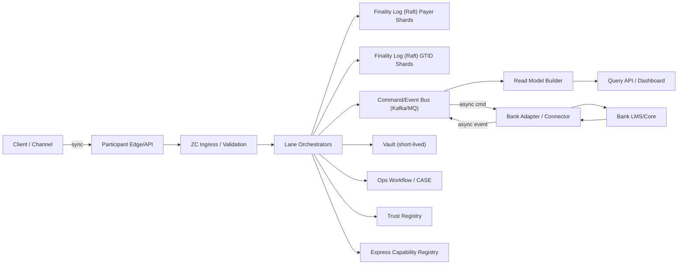


### 1.3 多拠点・可用性（規範）

#### 1.3.0 参照アーキテクチャ（全国システム：合意ログ＋バックアップセンター永続化）

本システムの強みは、 **Finality Log（Decision を記録する追記ログ）を単一の正（SoT）** とし、これを **地理分散の合意（Raft／代替として Multi-Paxos）** により確定させる点にある。  
したがって「全国システムとしての永続化」は、一般論ではなく **Decision の確定条件そのもの** である。

**固定点（規範）**
- `Decision` は、当該シャードの **合意ログがコミット（quorum 到達）** した時点でのみ成立する（以後、再起動・再構築でも揺らがない）。
- 合意ログの投票メンバーは、 **主系拠点とバックアップ拠点（DR）を跨いで配置** し、単一拠点喪失でも quorum を維持できること。
- quorum 喪失時は、誤決定を避けるため **Read-only（照会のみ）へ縮退** し、新規 Decision は行わない（レーン別の拒否規範は §2.1・§9.2）。

**参照配置（例）**
- 3 拠点（東日本DC／西日本DC／DR）× 各拠点 1 投票ノード（合計 3）  
  - 1 拠点喪失でも 2/3 の quorum を維持
- 5 ノード構成の場合は、主系 2 拠点 + DR に跨る配置とし、常に **過半数が“地理的に分散”** していることを保証

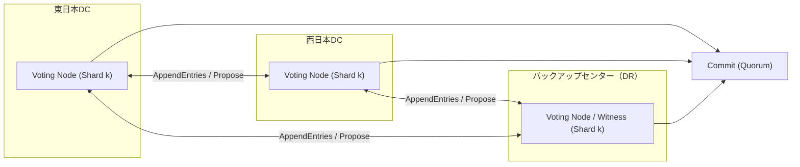

> **補足**
>合意方式の教科書的説明は行わず、本書では「 **Decision は地理分散 quorum のコミットでのみ成立** 」という規範を固定する。実装詳細（membership 変更、snapshot、log compaction 等）は `30_internal_design.md` 第16章（Raft運用）を正とする。

- **3地域×3AZ（例：東京・大阪・福岡×各3AZ）Active-Active** を前提とし、任意の1地域喪失でも継続可能に設計する。  
- Raftは **シャードごと** に構成し、過半数に到達できない場合は **Read-onlyへ遷移** （両側書込み禁止）する。  
- Express（POS用途）は Read-only時に原則REJECT（誤決定防止）。Standard/Bulkも **永続化不可（過半数喪失）** の場合はREJECTし、参加行側での再送・繰越で吸収する。

### 1.4 データの分離（ログ／照会／秘匿）
- **Finality Log** ：規範上の確定記録。監査・復旧の根拠。  
- **Read Model** ：照会用派生ビュー。破棄してもログから再構築できる。  
- **Vault** ：短期秘匿（AML評価等）。本体は削除しても、参照証跡（vault_ref、参照ハッシュ等）はログに残す。

### 1.5 高額即時レーン/IGS/DNSの整理（設計上の境界）

本基盤は、 **取引の完了（顧客視点の完了）** と、 **参加主体間の資金精算（参加主体視点の精算）** を混同しない。
特に「高額即時レーン」における清算は、日次ネット清算（DNS）とは別物であり、用語・状態・照会応答を明確に分離する。

#### 1.5.1 IGS（Immediate Gross Settlement：高額即時清算）
- **IGS = Immediate Gross Settlement（即時グロス清算）** ：高額即時レーンにおいて、ZCが **元取引の一部として** 清算依頼を起動し、結果を前提条件として b を成立させる。
- 高額即時レーンの規範順序は **a_HV → IGS確定 → b** （事故抑止のため固定）。
  - **a_HV** ：支払銀行内で「顧客口座→清算専用中継勘定」へ資金を隔離した完了点（状態はaと同一、証憑の `proof_type=PAYER_HV_ISOLATION_PROOF` で区別）。
  - **IGS確定** ：清算サービス側での振替確定（`boj_settle_ref` 等で証跡化）。
  - **b** ：受取銀行での入金完了（弁済完了の外形）。

#### 1.5.2 DNS（Daily Netting Settlement：日次ネット清算）
- **DNS = Daily Netting Settlement（日次ネット清算）** ：低コスト・運用整合を両立する基盤の基本。ZCは当日取引群を日次でネッティングし、参加主体の **ネット勝ち負け（純受取／純支払）** を確定する。
- **Kick（起動）はZCが実施（初回のみ）** ：営業日ごとに定めたカットオフ（例：16:30）で、ZCが当日分DNSサイクルを閉じ、 **DNS清算依頼（ネット明細＋digest）** を発行する。
- **再処理（再Kick相当）は清算サービス側で自動** ：資金手当て（市場調達／貸付）を最速に検知できる主体が清算サービス側であるため、HOLD解除後の再処理は清算サービス側で自動的に実行され、その結果のみがZCへ通知される。
- **中断（HOLD）の実体（内部要因）** ：参加主体が清算サービス側に保持する残高不足等により、DNS清算が完了できない状態として表現する。
- **事務必須の照会** ：参加主体は当日DNSについて、ZC照会で以下を取得できなければ運用が回らない。
  - 当日ネットポジション（純支払/純受取、金額）
  - DNSサイクル状態（OPEN / KICKED / SETTLED / HOLD_ACTIVE）
  - as_of（鮮度）/ watermark / next_action_hint（次アクション）

#### 1.5.3 重要（顧客影響の整理：規範）

> **参照**：本節は顧客影響の要旨。DNS HOLD／IGS HOLD 時のレーン別の照会応答の正準規範は §9.4.1.1 を正とする（本節と重複する詳細は同節に集約）。
- **高額即時レーン（IGS）** ：IGSは元取引の一部である。
  - IGSがHOLDの場合、元取引は `SUSPENDED`（b未成立）であり、顧客視点でも「未完了」として扱う。
- **通常レーン（Express/Standard/Bulk/RTP/HTLC/gtid）** ：DNSは元取引の完了後に実行される参加主体間精算である。
  - DNSがHOLDの場合でも、元取引は `SETTLED` のままであり、顧客視点で「未完了」に見せてはならない。

> **設計規範（対外説明の安全性）**
>DNS HOLD/IGS HOLD を理由に、顧客向け画面で「資金不足」等の表現を用いてはならない。
>ZCは `public_message_id`を参加主体へ提示するのみで、顧客への直接表示は行わない。
>顧客向け表示は参加主体が行い、必要に応じて以下のように**ぼかしたテンプレート**を用いる。
>例：「現在、一部のお振込処理が一時的に遅延しています」


## 第2章 業務フロー（正常系・例外系・障害系）

> **要旨**  
> 本章では、各レーンの正常系フローと、例外/障害時にどう状態化して収束させるかを図解する。同期応答の語義（INGRESS_ACCEPTED / DECISION_ACCEPTED）を固定し、取消と失敗、DNS_HOLD/IGS_HOLDと顧客影響の混同を防ぐ。


### 2.1 共通前提（規範）

> **設計規範（Read-only時の再送嵐防止）**
>Read-only（過半数喪失等）では永続化できないため、ZCは `REJECT_UNAVAILABLE` を返す。
>ただし参加行が即時リトライすると再送嵐となるため、応答には必ず `retry_after_ms` と `recommended_backoff_policy` を含め、参加行はCircuit Breakerに従う。

- 受付APIは **同期で受理/拒否** を返すが、 **決定（Decision）と実施確認（Execution）は原則非同期** 。  
- 同期応答は2段階に分けて語義を固定する。  
  - **INGRESS_ACCEPTED** ：入力が妥当で、かつ **RECEIVED（受領記録）がFinality Logへ永続化済み** であること（= 返した参照が消えない）。`ingress_ref` を返す。Decisionは未確定。  
  - **DECISION_ACCEPTED** ： **Decision（Raftコミット）まで完了** し、`decision_proof_ref` が発行済みであること（= 決定の立証が可能）。  
- Expressは原則 `DECISION_ACCEPTED` を返す（店舗要件）。Standard/Bulk/Deferred/RTP/HIGH_VALUE は `INGRESS_ACCEPTED` を返し、Decisionは後続イベント/照会で確定する。  
- **専用入口を持つレーンは応答値も専用である（規範）**：HTLC・HTLC_AUTH・gtid は `POST /api/transfers` を通らないため、同期応答は上記 2 語ではなく各エンドポイント固有の値を返す——HTLC は `CREATED`（`POST /api/htlc/create`）、HTLC_AUTH は `AUTH_REQUESTED`、gtid は **`GTID_ACCEPTED`**（`POST /api/gtid/register`、`state: GT_RECEIVED`）。**語義（受理までを同期で返し Decision は未確定）は `INGRESS_ACCEPTED` と同一**であり、異なるのは値だけである。値の正は `32_api_contracts.md` の各エンドポイント節とする。  
- **Read-only（シャード過半数喪失/基盤不可用）では永続化できないため、INGRESS_ACCEPTEDは返さず** `REJECT_UNAVAILABLE` / `REJECT_READONLY` を返す（参照番号なし、リトライ前提）。  
- 外部照会待ち・窓口保留・高額即時レーン介在等の **業務都合の停止** は、INGRESS_ACCEPTED後に `PRECHECKED_SUSPENDED` / `SUSPENDED` へ遷移し、`reason_code` と `next_action_hint` で説明する。  
- 顧客向け表示は a/b（第6章）を分離し、 **取消（CANCELLED）と失敗（FAILED_EXECUTION）を混同しない** 。  
- 例外は **CASE** として起票し、番号で照会導線を固定する（第10章）。

> **監査上の狙い**
>同期応答の語義を固定し、「いつ受理し」「いつ決め」「いつ実施が確定したか」を時系列で説明できるようにする。


### 2.2 正常系フロー一覧（レーン別）


#### 2.2.0 図解：基本送金類型（5類型）【規範補助図】

以下は、文章だけでは理解しづらい「典型フロー」を **5類型（Express / Standard / Bulk / HTLC / gtid）** に整理したものである。
本図は **外部設計の理解補助** を目的とし、厳密な契約は **I/F契約（`30_internal_design.md` 第12章（I/F契約））と状態機械（第3章）** を正とする。

> 各シーケンス図中のメッセージ名（`PAYER_EXEC_REQUEST` 等の UPPER_SNAKE 略記や `CMD`/`EVT` 接頭辞）は説明用の略記であり、cmd/event の正式名（`PayerExecRequested` 等）と正本の一覧は `30_internal_design.md` §12.1 に従う（略記と正式名の対応表は §12.1.5）。

> 記号：`a`＝PAYER不可逆確定（PAYER_EXEC_CONFIRMED）／`b`＝PAYEE不可逆確定（PAYEE_EXEC_CONFIRMED）

> **`next_action_hint` の予約（規範）**：`next_action_hint` は**照会応答（`GET /api/transactions/:txid`）専用の閉じた 4 値**であり、窓口の定型文言に 1:1 対応する（値域の正は `30_internal_design.md` §13.6）。cmd/event のペイロードが「次に何をすべきか」を運ぶ場合は**別名（例：`next_step`）を用いる**。同名で別値域を持ち込むと、窓口が「知らない hint を受け取る」経路が生まれ、文言固定という目的が壊れる。


#### (1) Express（店舗・即時課金：PSPR参照で宛先確定／受付結果を同期で返す）

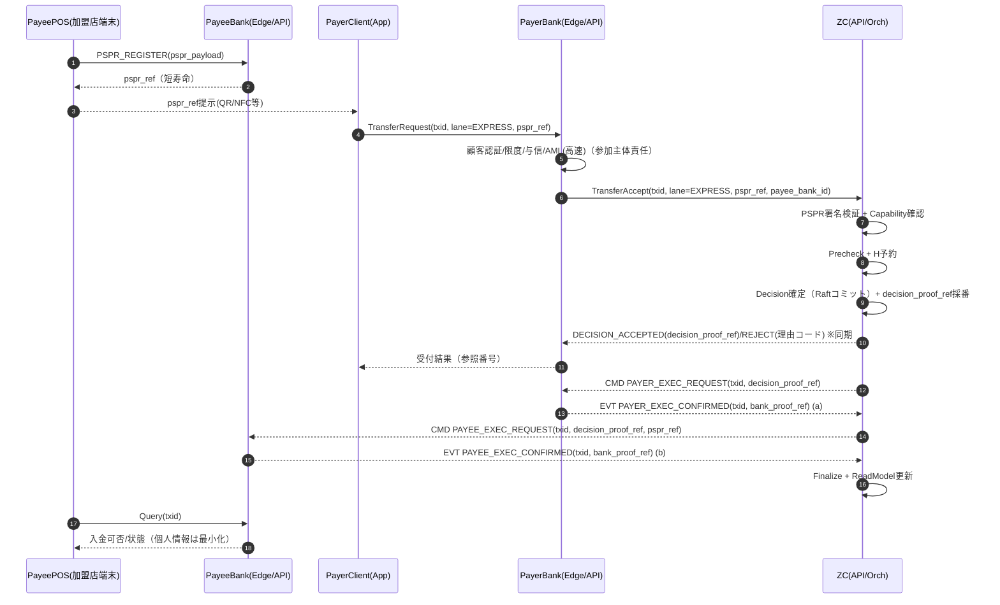

> **要点（規範）**
> - Expressは **受付結果（Decisionまで）を同期** し、店舗導線での再試行コストを最小化する。
> - POSが支払側銀行へ直結する設計は採らず、 **支払人は自分の銀行アプリ等（Client）から起動** する。
> - 名義照会の代替として、受取側が提示する **署名付き受取人情報（pspr_ref）** を宛先の正とする。
> - ただし **確定（a/b）は非同期** で進むため、照会で「今どこか／次に何をすべきか」を説明できることが必須。


#### (2) Standard（名義確認 → 支払人最終認可 → 実施：最も説明可能）

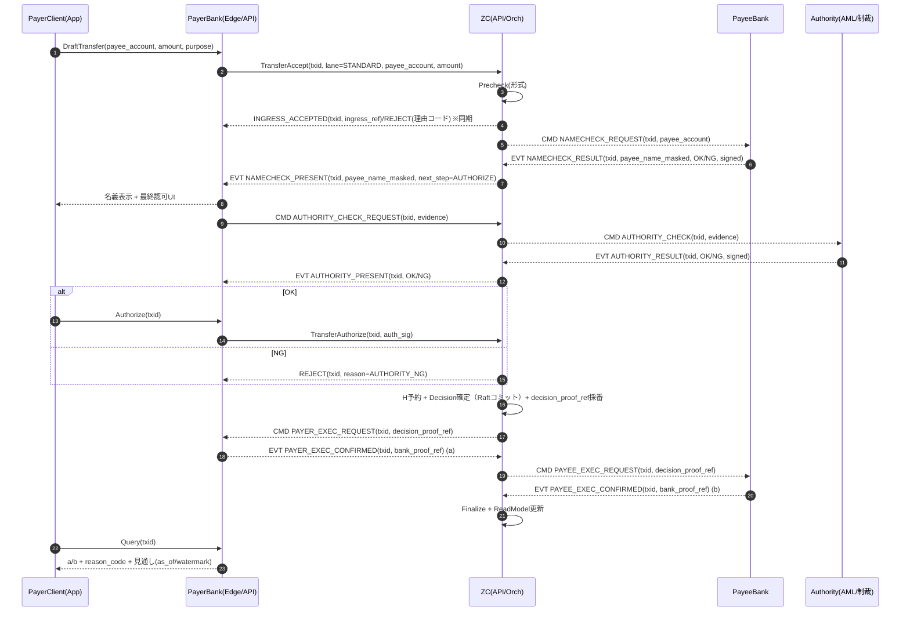

> **要点（規範）**
> - Standardは **誤送金抑止** と **説明可能性** を最優先し、「名義確認の結果を見てから支払人が最終認可」する。
> - 名義確認は **被仕向側（PayeeBank）の署名付き応答が正** 。ZCは証跡を固定し、判断基準は参加主体責任。
> - `TransferAuthorize` を設けることで、受理→名義確認→最終認可→Decision→実施、が一貫して追跡可能になる。


#### (3) Bulk/Deferred（締切ウィンドウ＋LSM：名義確認→最終認可も可能にする）

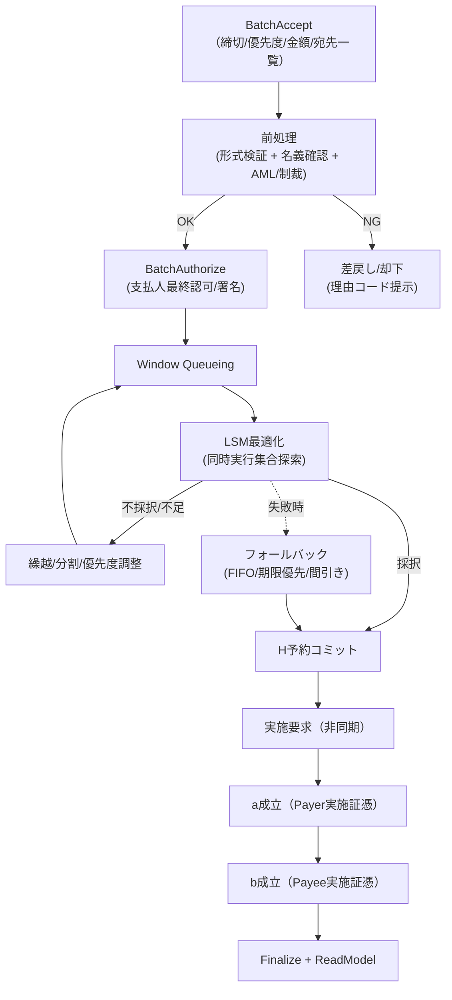

> **要点（規範）**
> - Bulkは「最短確定」より、 **締切までに最大数を成立させる** ことが価値。
> - 名義確認（宛先確認）は **前処理で実施可能** とし、差戻しを理由コードで説明できること。
> - 支払人の最終認可は `BatchAuthorize`（ファイル署名・承認ワークフロー等）として表現し、後日監査で立証できること。
> - LSMの採否はブラックボックスにせず、 **採択理由（目的関数・制約・追跡情報）を証跡化** する。
> - 典型的な確定時間の目安：ウィンドウ内で **数十秒〜数分** （締切・混雑に依存）。確定見込みは `next_action_hint` とSLA分類で提示する。


#### (4) 条件付き決済（HTLC：hashlock＋timelock：preimageは受取側が提示）

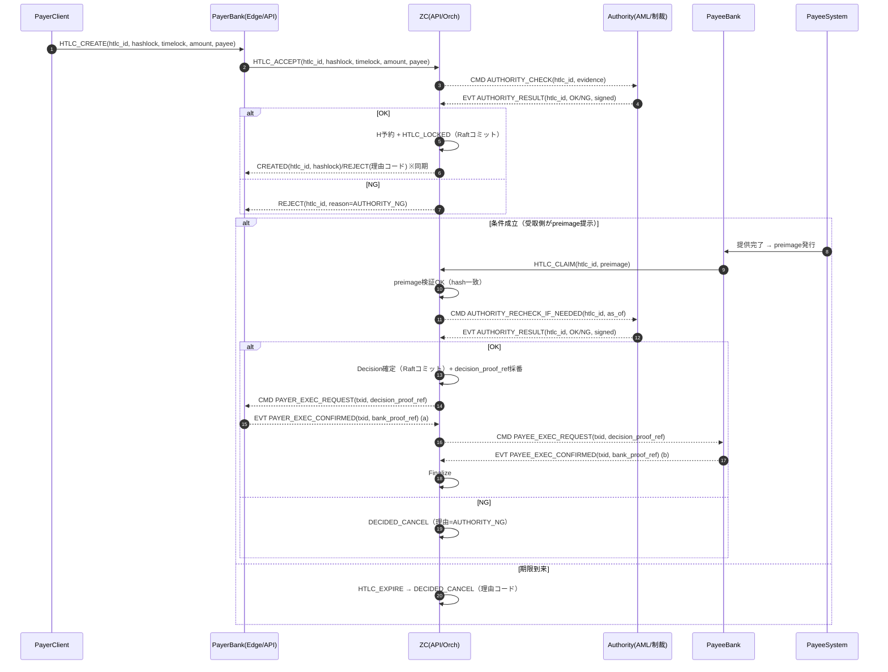

> **要点（規範）**
> - HTLCは「取消」ではなく **成立前の不確実性を構造化** する仕組み。
> - preimageは **受取側（PayeeBank側）が提示** し、ZCは検証して「条件が満たされた」事実のみ証跡化する。
> - Authority（AML/制裁）チェックは **lock時に必須** 。timelockが長い場合は **claim時に再チェック** し、経路上の規制変更・凍結指示に追随できること。
> - `HTLC_LOCKED` 中の取引は **DNS清算対象に入れない** （条件未成立）。条件成立後に通常のa/bへ進む。
> - ZCはpreimageを永続保持しない（hashと検証証跡のみ）。timelock超過は **必ずDECIDED_CANCELで収束** する。


#### (5) gtid（多者協調グループ：Decision一体）

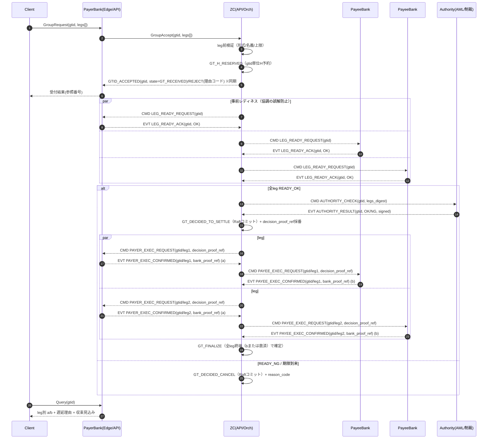

> **要点（規範）**
> - gtidは強力だが、無制限に適用すると制度・資金・説明責任の破綻を招くため、 **受付規範（上限・レーン制約）** を固定する。
> - gtidの正は **gtidシャードのFinality Log（＝SoTの一部）** 。各参加行は参照追記で整合する。
> - 一部遅延はCASEへ接続し、 **leg別に理由と見通しを出す** ことを規範とする。
> - GT_FINALIZE は「全legが終端した」ことを条件とし、終端は **PAYEE_EXEC_CONFIRMED(b)** または **救済確定（Reversal起票済）** のいずれかとする（救済legをゾンビ化させない）。


#### (6) 高額即時レーン（High-Value Immediate：Standard拡張＋中央銀行決済：a→中銀→b）

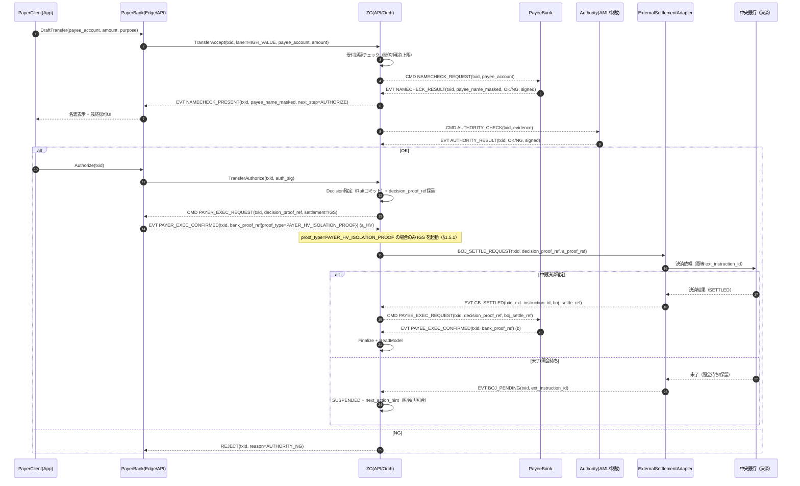

> **要点（規範）**
> - 高額即時レーンは **Standardの拡張** であり、名義確認・AML/制裁スクリーニング・支払人最終認可を必須とする。
> - **a_HV の識別（規範）** ：支払銀行が返す a の証憑は `proof_type=PAYER_HV_ISOLATION_PROOF`（顧客口座→清算専用中継勘定への資金隔離完了）でなければならない。**ZC はこの proof_type を受領した場合にのみ中銀決済（IGS）を起動する**。外形上の状態は `PAYER_EXEC_CONFIRMED`(a) と同一であり、**区別は proof_type だけが担う**（§1.5.1、`10_requirements.md` §1.2.3、`proof_type` の値域は `30_internal_design.md` §12.3.3）。
> - **H（仕向超過限度）の適用除外**：高額即時レーンは即時グロス決済（RTGS/IGS）であり、DNS（ネット清算）のリスク管理枠である H を消費しない。したがって、受付時に H_RESERVED の確保を行わず、完了時にも H_locked の解放操作を行わない。

> - **事故抑止の順序規範** ：ZCは中央銀行決済を **a成立（支払人減額の証憑確定）後にのみ起動** し、中銀決済確定後にb（受取側入金）へ進める。  
>   - これにより「中銀決済したがa減額できない」「中銀決済したがb入金できない」という最悪事故を構造的に抑止する。
> - 中央銀行側の内部方式は本書の対象外だが、ZCは **依頼の冪等（ext_instruction_id）** と **結果の状態化（CB_*イベント）** を規範化する。
> - 例外時は `SUSPENDED`＋CASEへ接続し、照会で「勝ち負け／保留理由／次アクション」を必ず説明可能にする。


#### 2.2.1 Express（店舗決済：pspr_ref＋Capability）
**目的** ：POS用途で「受取不可」事故を極小化し、同期応答で拒否できる条件を明確化する。

1) 加盟店/GW（受取側）が PSPR（署名付き受取人情報、短寿命）を生成し、 **受取銀行（PayeeBank）へ登録** する  
2) PayeeBankは PSPR本文の **保管責任（SoT）** を負い、参照番号 `pspr_ref` を払い出す（本文は短期保持／監査用にdigestを固定）  
3) 支払銀行CMSが `POST /api/transfers`（Express）でZCへ送信（`pspr_ref` 参照＋`payee_bank_id` 指定。PSPR本文は原則送らない）  
4) ZCは (a) PSPR署名・digest検証（発行主体＝PayeeBankまたは委任先）、(b) CapabilityState確認（宛先受入可否）  
5) 条件を満たせば **DECISION_ACCEPTED（同期）** 。満たさなければ **理由コード付きREJECT（同期）**  
6) ZCは Finality Log に受理・H予約・Decisionを記録し、非同期で **PayerExecRequested** を発行  
7) 仕向銀行が a（PAYER_EXEC_CONFIRMED）証憑発行  
8) **a成立後のみ** 、ZCが **PayeeExecRequested** を発行（必要情報は `pspr_ref` 参照で解決）。被仕向銀行が b（PAYEE_EXEC_CONFIRMED）証憑発行  
9) Read Model更新、照会・通知

> Expressは「受付結果まで同期」だが、 **ACCEPT＝Decision(Raftコミット)完了** を意味する（`decision_proof_ref` を返す）。a/bは非同期で確定し、照会で説明可能であることを規範とする。


#### 2.2.2 Standard（名義確認＋AML/制裁スクリーニング＋最終認可：規範）
1) 支払銀行CMSが受付（txid採番）  
2) ZCが名義照会要求 → 被仕向銀行が署名付き応答（NameChecked）  
3) Authority Check（AML/制裁）を必須実施（実装は参加主体内チェックでも良いが、 **Cleared証跡を必ず残す** ）  
4) 支払人が名義結果を確認し最終認可（TransferAuthorize）  
5) H予約 → Decision確定 → 実施要求 → a/b証憑回収


#### 2.2.3 RTP（請求：資金拘束なし→当日複数回 Attempt）
**現行の口座振替運用に近い** 形で、実行日まで資金拘束しない。

- 実行日当日：`PR-RTP-ATTEMPT-SCHEDULE` が定める時刻に Attempt を反復する（Attempt#1 は 0 時目安）
- 当日の Attempt 回数上限は `PR-RTP-ATTEMPT-MAX`（値は `30_internal_design.md` §12.9 PR-* パラメータ台帳。公開版では非公開）
- 上限到達後はFAILED（翌日持越しは新rtp_id）

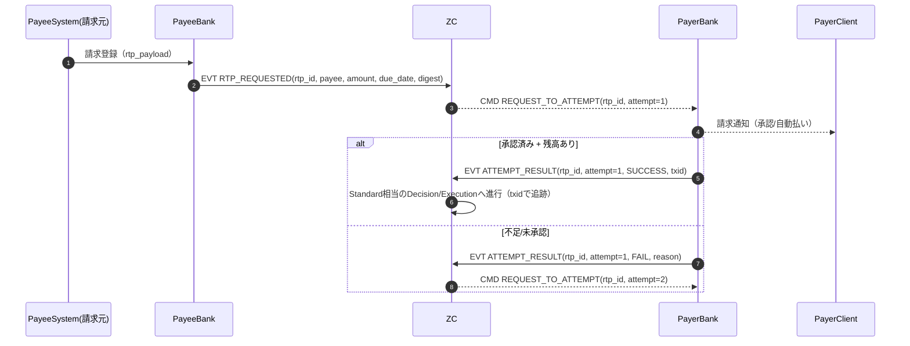

> **要点（規範）**
> - 請求データは **Payee→PayeeBank→ZC→PayerBank** の経路で配送する（PayerBankが顧客接点のUIを持つため）。
> - 実行は常に「支払側の最終認可（または事前合意の自動払い）」を前提とし、未承認はFAILとして説明する。
> - Attemptの履歴は照会・帳票で追跡可能とし、事務が回ることを最優先とする。

**RTP + Immediate Execution Profile（リアルタイム請求：即時チャージ型）**
- 上記の Attempt 反復プロファイル（`PR-RTP-ATTEMPT-MAX` 回）に加え、ウォレットチャージ等の即時性が必要な用途向けに **RTP + Immediate Execution Profile** を定義する。
- RTP + Immediate Execution Profileは、(1) Payee側からの請求（rtp_id）を即時配送し、(2) 支払側の最終認可（または事前合意）を得た時点で、(3) ExpressまたはStandard相当の`txid`を起動して即時処理する。
- つまりRTP + Immediate Execution Profileは「請求（RTP）」と「実行（Express/Standard）」の組合せで実現し、請求そのものに資金拘束を持ち込まない。

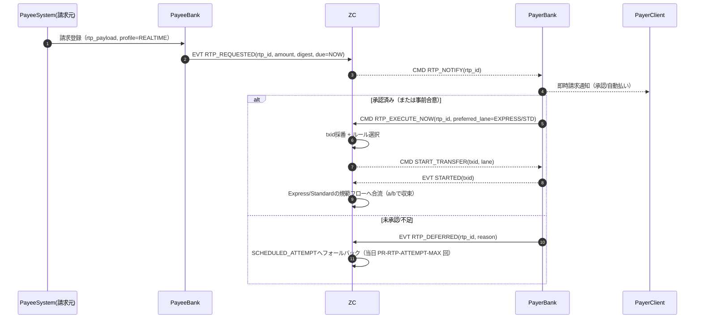


#### 2.2.4 Bulk/Deferred（ウィンドウ＋LSM）
- window単位でキューイングし、LSM（流動性節約）で実行集合を決定  
- 最終確定は H予約コミット成否（安全弁）  
- フォールバック（greedy等）を規範化（第11章でRFP化）


#### 2.2.5 gtid（多者協調：DNS領域で提供）
- gtidはDNS領域で提供し、GT_DECIDED_* をgtidシャードで確定  
- leg単位でExecution証憑（a/b）を収集  
- 期限切れ・一部失敗はGT_SUSPENDED＋CASEで収束（補償/再試行で終端へ）

> **規範（Decision 確定前の不変条件）**  
> 以下 2 点は GT-level Decision（`GT_PRECHECKED → GT_DECIDED_TO_SETTLE`）**確定前**に検証し、満たさない場合は `GT_DECIDED_CANCEL` に収束させる。Decision 確定後にこれらの整合性違反を発見した場合、不正な遷移が FinalityLog に残り監査説明が破綻する。  
> **1. 金額均衡（PAYER 総額 == PAYEE 総額）**：`sum(PAYER leg amounts) == sum(PAYEE leg amounts)`。違反は `reason_code=AMOUNT_BALANCE_MISMATCH` で取消。  
> **2. ロール完全性（PAYER と PAYEE が共に存在）**：片側のみの leg 集合は禁止（`reason_code=MISSING_LEG_ROLE`）。  
> **PAYER ↔ PAYEE 対応付け規範**：レッグ間の対応関係は **`leg_id` の辞書順位**で確定する（PAYER 配列・PAYEE 配列をそれぞれ `leg_id` ソートし、同一 index で対をなす）。`INSERT` 順や `ROWID` 順に依存すると取り違いの着金（A→B を A→C と誤実行）を招く。

##### 2.2.5.1 脚構成の正規化と、受理される脚の形（規範）

**PAYER と PAYEE の本数は一致していなくてよい。** 1×M（fan-out）も、両側とも複数の一般形
N×M も受理され、決済される。ただしそれは決済経路が任意の N×M を直接扱うからではなく、
**受付時に脚集合を正規化してから**決済経路へ渡すためである。この正規化は参加者が登録した
`leg_id` を書き換えるので、契約として明示する。

**1. 正規化（`POST /api/gtid/register` の時点で行う）**

| 登録された形 | 正規化 | 結果 |
|---|---|---|
| 1×1 ／ fan-in（N×1） | 何もしない | そのまま |
| **fan-out（1×M）**（単一通貨・均衡） | 支払人脚を PAYEE ごとの部分脚へ分割 | M×M の整列した組 |
| **一般形（N×M、両側とも複数）**（通貨ごとに均衡） | 通貨グループごとに貪欲な waterfall マッチで 1:1 の部分取引へ分解（K ≤ N+M−1 組） | 整列した組 |
| 整列した組（各順位で金額・通貨が一致） | 何もしない（`leg_id` を無用に変えない） | そのまま |
| 均衡していない形／**真のクロスカレンシー FX**（ある通貨が単独で均衡しない） | 何もしない | 下記 3. で安全に取消 |

**規範**

1. **通貨をまたいでネットしない。** 分解は**通貨グループごとに独立**して行う。ある通貨が単独で
   均衡しない構成（JPY を払って USD を受け取る等）は正規化の対象外であり、`AMOUNT_BALANCE_MISMATCH`
   として取消される。異種通貨を額面で相殺すれば、非代替な単位を等価とみなすことになる——
   クロスカレンシーは FX レーン（第17章、FXP を導管とする脚分解）が扱う。
2. **`leg_id` は書き換わり得る（規範・参加者向け）。** fan-out の部分脚は
   `{元のPAYER leg_id}~{連番}`、一般形の分解は `{通し番号}~P~{元のleg_id}` /
   `{通し番号}~Q~{元のleg_id}` になる。したがって **`GET /api/gtid/:gtid` が返す脚は、
   参加者が登録した脚と 1:1 とは限らない**（金額の総和は各口座について保存される）。
   §6.5 の「一体性の対象は Decision」という規範はこの分解の上でも変わらない——分解は
   受付時に一度だけ行われ、Decision は分解後の集合に対して一体として確定する。
   `leg_id` は脚ごとの `txid`（`TX-GT-{leg_id}`）の素にもなるため、参加者は**自分が付けた
   `leg_id` がそのまま照会キーになると仮定してはならない**。
   **由来は照会できる（規範）**：書き換えられた脚は `GtidLegs.origin_leg_id` に元の `leg_id` を
   持ち、`GET /api/gtid/:gtid` の `legs[]` で返る。由来は `leg_id` の書式にも現れるが、
   **書式は契約ではない**——「自分のどの脚がここで決済されたのか」に答えるのは列であって
   文字列の形ではない。正規化そのものが起きた事実は `GtidRegistered` の payload
   （`fanout_normalized` / `nm_decomposed` / `registered_leg_count`）にも残る。
3. **正規化後の残余に対する安全弁（`advanceGtid`）。** Decision 確定前に、脚集合が
   「fan-in（PAYEE がちょうど 1 本）」または「整列した組（本数一致かつ各順位で金額・通貨が一致）」の
   いずれかであることを確認し、**満たさない残余は決済せず** `GT_PRECHECKED → GT_DECIDED_CANCEL`
   へ収束させる（FinalityLog payload の `reason='GTID_SHAPE_UNSUPPORTED'`。GTID 側に
   `reason_code` 列は無い。§3.3.1 の `T_gt_deadline` と同じ形）。正規化が効いていれば、ここへ
   落ちるのは上表の最終行——均衡していない形と真のクロスカレンシー FX——だけである。
   **この安全弁は「どちらの支払人の資金がどちらの受取人へ渡ったか」が一意に定まらないまま
   資金を動かさないための最後の関門**であり、正規化の側を拡張したときに黙って誤配分へ倒れないよう残す。
4. **取消は H 予約より前**に起きる（この時点で保持しているのは leg-ready の予約確認だけであり、
   資金は動いていない）。取消は安全側であり、誤配分より優先する。
5. **`POST /api/gtid/register` は 1. の正規化のみを行い、均衡検査・ロール完全性・3. の安全弁は
   通らない。** 登録は形式が妥当なら常に `201 GTID_ACCEPTED` を返し、判定は非同期の `advanceGtid`
   で行う（`32_api_contracts.md § POST /api/gtid/register` のタイミング注記）。クライアントは
   `GET /api/gtid/:gtid` で終局状態を確認しなければならない。

検証は `test/integration/chaos_gtid.test.ts`（#14 fan-out・#18 一般形 N×M・#19 多通貨の一般形・
#18b 真の FX が安全に取消されること）が固定する。

#### 2.2.6 新機能プロファイル（QR決済・エイリアス送金・Rich Data・越境等）
Zenithは決済基盤内部の処理にとどまらず、利用者の利便性とコンプライアンスを最前線で拡張する以下の応用機能群（フロントエンド連携プロファイル）をサポートする。

**1. QR決済（動的・静的QRとHMAC署名）**
- **動的（DYNAMIC）/静的（STATIC）QR** の双方を発行可能とし、生成時に事前共有鍵（`QR_SECRET`）を用いた**HMAC署名**を付与する。
- 決済リクエスト時には中央または参加行エッジで署名を検証して改ざん・なりすましを排除する。検証成功後にのみ `Express` レーンでの支払指示（Event）を即座に起動し、シームレスな店舗決済を実現する。

**2. エイリアス送金（Proxy Directory / Alias）**
- 利用者の **電話番号** や **メールアドレス** などの「プロキシ値（エイリアス）」から、実際の銀行・口座情報を解決する機能を提供する。
- `POST /api/proxy/register` によりエイリアスと口座の紐付けを登録し、送金時には `GET /api/proxy/resolve` で宛先を解決することで、利用者は複雑な口座・店番入力を意識せずに送金が可能となる。

**3. Rich Data（商流情報・EDIの分離保存構造）**
- 金融のコアメッセージ（金額・宛先）と、商流取引による豊富なメタデータ（請求書明細、契約情報等）を分離して管理する。
- 巨大なデータを単一経路に詰め込むのではなく、事前に別パス（`POST /api/richdata/store` や `POST /api/edi/register`）へ保存し、取得した参照ID（`data_ref` / `edi_ref`）のみをコア決済メッセージに紐づけることで、効率性と完全なトレーサビリティを両立する。

**4. 越境送金（Cross-border）のトラベルルール対応**
- クロスボーダー送金（`/api/cross-border/send`）においては、FATF Recommendation 16（R16）に基づく発信人および受取人の詳細な本人情報検証を必須とする。
- 情報不備がある送金は `FATF_VALIDATION_ERROR` としてプレチェック段階で水際ブロックし、基盤レベルでのAML/CFTコンプライアンスを強制する。

**5. 口座確認・名義照会の一括処理（Account Verification Batch）**
- 単一の宛先照会だけでなく、企業の給与振込や大量支払などで要求されるバッチ形式の名義照会（`POST /api/account-verify/batch`）をサポートし、大量件数時の通信・参照オーバーヘッドを大きく削減する。

#### 2.2.7 継続収納（口座振替：資金拘束なし→振替日に一回きりの残高判定） <a id="direct-debit-flow"></a>

制度要件は [`10_requirements.md` §3.2.8](10_requirements.md#dd-layers)。本節は処理方式を固定する。

##### 2.2.7.1 RTP・HTLC Auth との差分（設計の起点）

三者はいずれも**受取人起点（プル型）**であるが、統制の置き方が異なる。混同すると資金フローを取り違えるため、先に固定する。

| | RTP | HTLC Auth | 継続収納 |
|---|---|---|---|
| 顧客の同意 | **都度**（`respondToRtp`） | **都度**（`approveAuthRequest`） | **継続**（`DebitMandate`、1 回だけ） |
| 資金の拘束 | しない | **する**（承認時に `reserve-funds`） | **しない** |
| 拘束の期間 | — | 承認〜Capture | — |
| 残高判定の時点 | 実行時 | 承認時 | **振替日当日、一回きり** |
| 受取人の適格性 | 都度同意が代替 | 事前登録 | 継続委任＋累計枠 |

> **規範**：継続収納は `reserve-funds` を発行しない。オーソリ型の実装（`src/zc/lanes/htlc_auth/approve.ts`）を流用してはならない。流用すると顧客の資金が振替日まで拘束され、口座振替の性質そのものを失う。共有できるのは preimage / hashlock / Vault という**認可証明の構造のみ**である。

##### 2.2.7.2 認可の検証と資金の検証を分離する（規範）

資金を拘束しないということは、**認可されていることが支払能力を何ら保証しない**ということである。したがって 2 つのゲートを時間的に分離し、それぞれ独立した証跡を残す。

```
予告受理時点                          振替日当日
─────────────                       ─────────────
委任状スコープの照合                    残高の判定
  ├ 範囲内 → preimage 解錠              ├ 足りる → 実行 → b
  │        （= 顧客が認可した範囲内で      └ 足りない → 未確定のまま
  │           あることの証明）                （24:00 で CONFIRMED_NG）
  └ 範囲外 → AWAITING_ADDITIONAL_AUTH
累計枠の予約
```

1. **preimage の解錠は予告時点で行う。** 解錠された事実そのものが「払出行が委任状の範囲内であることを検証した」証跡となり、FinalityLog に記録される。事後に受取人が「顧客は同意していた」と主張しても、解錠記録が無ければ成立しない。
2. **HTLC Auth では認可と資金確保が同一イベントに癒着している**ため「認可はされていたが払えなかった」を表現できない。継続収納ではそれが正常系であるため、分離が必須である。

##### 2.2.7.3 予告とラダーの状態

`ScheduledCollection` の状態。**`Transactions` の状態機械には辺を追加しない。**

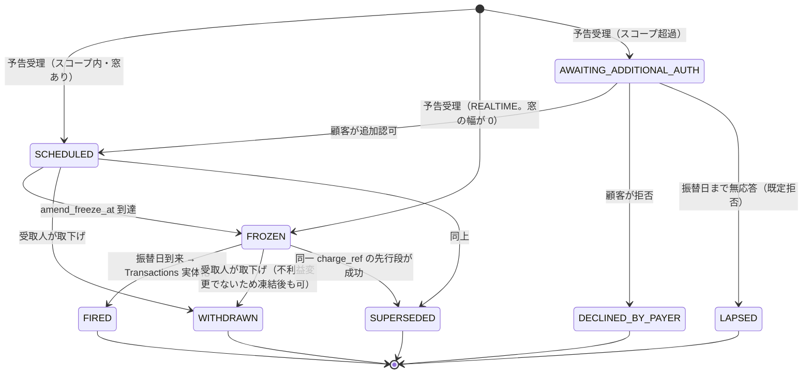

**規範**

0. **`REALTIME` は `FROZEN` で入場し、同一リクエスト内で `FIRED` まで進む。** `SCHEDULED` を経由しない——変更を受け付ける窓が存在しないため、変更可能な状態を一瞬でも通ることは実態に反する。`amend_freeze_at` は生成時刻に等しい（「窓が無い」を `NULL` ではなく**幅 0 の窓**として表現し、凍結判定のコードを分岐させない）。
1. **`SUPERSEDED` は行削除ではなく状態遷移として記録する。** 「5月13日の再請求は 4月27日に成功したため取り消された」と説明できなければならない。
2. **ラダーの段の発火は 2 条件の連言である**——前段が `CONFIRMED_NG` に**確定**していること、かつ予定日が到来していること。前段が `ACCEPTED`（窓の中）のあいだ後段は待機する。日付のみで駆動すると、窓の遅延時に二重引落を招く。
3. **`AWAITING_ADDITIONAL_AUTH → LAPSED` はラダー全体を終了させる。** 後段を発火させてはならない。
4. **排他は `(mandate_id, charge_ref)` の一意制約が担う。** b に到達できる収納は 1 費目につき高々ひとつである。二重収納の防止と、ラダーの「先行段が成功したら後段は成立しない」性質は、**同一の制約から導かれる**。別々の機構を設けてはならない。

##### 2.2.7.4 振替日の処理と所有権

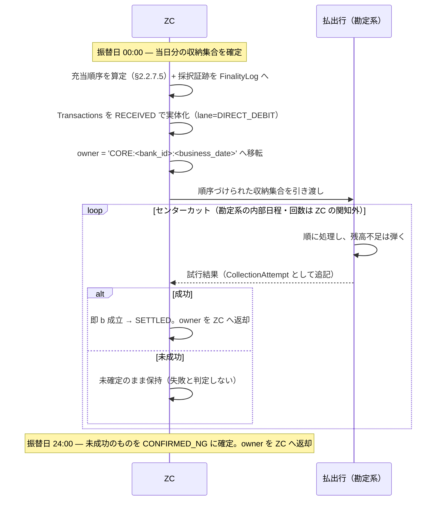

> **本図は `SCHEDULED` / `SCHEDULED_LONG` の経路である。** `REALTIME` はセンターカット窓を持たないため、所有権の移転も充当順序の算定も経ない。**その処理は EXPRESS レーンそのものである**——`RECEIVED → PRECHECKED → H_RESERVED → DECIDED_TO_SETTLE` を同期で走り（`reserveFundsForDebit` が残高不足を同期判定する）、`DECISION_ACCEPTED` を返し、デビットは enqueue されて a/b は非同期に成立する。実装は `processExpress`（`src/zc/lanes/express.ts`）と同じヘルパ連鎖を用い、確定点契約を再定義しない。
>
> 結果として `REALTIME` は**当日の整列済みの列に割り込む**。しかも単に先に処理されるだけでなく、任意の時刻に H 予約と銀行の資金予約を**先取りする**。これは本モードに内在する不公平であり、機構では解消できない（[`10_requirements.md` §3.2.8.9-5](10_requirements.md#dd-ordering)）。

**規範**

1. **確定は成功と失敗で非対称である。** 成功は **b の観測時点**で確定する（資金が動いた以上それ以上変わらない）。失敗は **`confirm_deadline_at` をもって確定**する。両者を分けるのは「後続の試行がありうるか」の一点であり、同期／非同期ではない——**b は全モードで非同期に成立する**。`SCHEDULED` では期限が振替日 24:00 であり、日中の残高不足は「まだ b に到達していない」だけで失敗ではない（顧客が日中に入金すれば後続のセンターカットで成功しうる）。`REALTIME` では試行が 1 回きりのため Decision の時点が期限となる。**24:00 はモードごとの導出値であってレーンの定数ではない**ため、掃引は `confirm_deadline_at <= now AND result IS NULL` の一様な述語で回す。
2. **勘定系への要求は「振替日を超えて記帳しないこと」の一点のみ。** 窓スケジュールの宣言も完了通知も要求しない（[`10_requirements.md` §7.2.2](10_requirements.md#req-tier) の Tier を引き上げない）。ZC は 24:00 まで待てばよく、コアの内部日程を知る必要がない。
3. **窓のあいだ所有者は勘定系である。** `Transactions.owner='CORE:<bank_id>:<business_date>'` とし、タイムアウト掃引（第3章 §3.3）が触らないようにする。所有権は**最初の成功時、または `confirm_deadline_at` の早い方**で ZC に返る。移転は FinalityLog に記録する。単一所有者則の適用は HIGH_VALUE の外部決済 venue と同型である（[`30_internal_design.md` §5](30_internal_design.md#single-owner)）。**`REALTIME` は窓を持たないため所有権を移転しない**（`owner='ZC'` のまま同期的に決着する）。
4. **コアの確定応答前に b を成立させない。** HIGH_VALUE における `external_settlement_status='SETTLED'` の不変条件（`src/zc/orchestrator.ts`）と同型の制約を課す。欠くと「受取人に入金済みだが顧客から引き落とせていない」乖離が生じる。
5. **試行は追記型の系列（`CollectionAttempt`）として保持し、現在状態は導出する。** 中間結果は確定ではないが、受取人にとっては行動の根拠となる（0 時に未成功が分かれば当日中に督促できる）。ただし督促そのものは ZC の外側で行われる（[`10_requirements.md` §3.2.8.8-7](10_requirements.md#dd-payee-eligibility)）。
6. **想定内の残高不足を CASE に収束させない。** 事前に資金を拘束しないため、レガシーアダプタの `LEGACY_CORE_INSUFFICIENT_FUNDS`（シャドウが承認済みなのにコアが拒否＝乖離）の判定式は本レーンに適用されない。CASE の対象は真の乖離に限る。

##### 2.2.7.5 同日競合時の充当順序

資金を拘束しないため、同一顧客・同一振替日に複数の収納が競合しうる。

1. **順序は ZC が決定し、勘定系は供給された順に処理する。** ZC は顧客残高を知らないが、順に処理して不足分を弾く動作がそのまま貪欲充当となる。**勘定系に新たな能力を要求しない。**
2. **比較器は Bulk LSM の `lexicographicOrder`（`src/zc/liquidity/bulk_lsm.ts`）と同一構造**とする。

   | 順位 | 項 | 目的 |
   |---|---|---|
   | 1 | 顧客の優先指定 | 残高不足時にどの債務を優先するかを顧客が決める |
   | 2 | 原請求の古さ（昇順） | ラダー滞留の逆進性を打ち消す |
   | 3 | 金額（昇順） | 成立件数の最大化 |
   | 4 | `collection_id` 辞書順 | 決定性 |

3. **第 3 項だけでは逆進する。** 同一予算下では小さい金額から充当したほうが成立件数が増えるが、ラダーで滞留した収納は遅延損害金のぶん金額が増えるため、金額のみで並べると**最も救うべきものが最も後回しになる**。第 2 項がこれを打ち消す。既存 LSM が `due_at → fairness → throughput` の順を採るのと同じ理由である。
4. **第 4 項は決定的でなければならない。** 到着順・`ROWID` 依存の対応付けを禁ずる（§2.2.5 の `leg_id` 辞書順と同じ理由）。
5. **採択順序と理由を FinalityLog に記録する**（`LsmRuns` と同じ作法）。「なぜ A 社が先で B 社が後だったか」に事後に答えられることが、本節の存在理由である。

##### 2.2.7.6 追加認可（再許諾）の処理

1. スコープ超過の検出は**予告受理時点**であり、振替日まで猶予がある。この猶予が救済可能性そのものである。
2. 復帰の機構は既存の mandate サスペンド／再開と同型である——`mandatePrecheckOrSuspend`（`src/zc/lanes/_mandate_precheck.ts`）が違反をハード拒否せず `PRECHECKED_SUSPENDED` へ落とし、`resume-*` が **mandate を再検証したうえで** CAS で復帰させる。継続収納では、この解決者が運用担当者ではなく**顧客本人**になる。
3. **無応答は拒否とする。** 沈黙を同意とみなすと、本機構そのものが過大請求の経路となる。
4. **追加認可は単発認可を既定とする。** `registerMandate` をそのまま用い、当該 `charge_ref`・当該金額・1 回限りにスコープした独立の委任状として登録する。**子 mandate では表現できない**——`assertMandateValid` は委任チェーンを逓減方向にのみ検証するため、子が親の上限を緩めることはできない（`src/shared/mandate.ts`）。
5. **単発認可は枠を迂回せず、枠に加算する。** 累計枠が「この受取人に通算いくら渡したか」の唯一の正であり続けなければならない。
6. `REALTIME` モードは猶予を持たないため、この救済経路を持たない。スコープ超過は即時拒否となる。

##### 2.2.7.7 累計枠の直列化（規範）

累計上限を「収納のたびに集計して判定する」方式で実装してはならない。

```
   ✗ SELECT SUM(amount) ... → 判定 → INSERT
```

これは check-then-act であり、並行する収納が上限を突き抜ける（本書群は同種の競合を
`test/integration/concurrent_races.test.ts` で明示的に検証対象としている）。

**規範**

1. **枠は予約可能な予算として状態で持つ**（設計思想 8「H は状態として管理し、絶対超過を許さない」と同じ理由）。予約は**予告受理時点**に行う。枠は資金ではなく認可の配分であるため、予告時点で押さえても顧客は何も失わない。
2. **全条件を単一行の条件付き UPDATE で同時に検査する。** `MandateBudget(dd_mandate_id, period_key)` の 1 行に各カウンタを持たせ、`meta.changes` を唯一の裁定者とする。これは `transitionWithLog`・H 予約・`FxTransfers.status` と同一の CAS 作法であり、**直列化点を単一行に閉じることでデッドロックを構造的に排除する**（複数の枠を個別に予約する設計は、取得順序の管理を要求してしまう）。

   **上限値は `DebitMandate` から相関副問合せで読む。** カウンタ側に写しを持たせない——上限は契約の途中で変更されうるため（[`10_requirements.md` §3.2.8.4-10](10_requirements.md#dd-budget)）、写しを置くと伝播漏れが「宣言された上限と実際に効いている上限の食い違い」を生む。副問合せは同一文の中で評価されるため、変更との競合も生じない。

   ```sql
   UPDATE MandateBudget
      SET month_amount    = month_amount + :amt,
          month_count     = month_count + 1,
          lifetime_amount = lifetime_amount + :amt,
          lifetime_count  = lifetime_count + 1,
          updated_at      = :now
    WHERE dd_mandate_id = :ddm AND period_key = :pk
      AND month_amount    + :amt <= (SELECT month_amount_cap    FROM DebitMandate WHERE dd_mandate_id = :ddm)
      AND month_count     + 1    <= (SELECT month_count_cap     FROM DebitMandate WHERE dd_mandate_id = :ddm)
      AND lifetime_amount + :amt <= (SELECT lifetime_amount_cap FROM DebitMandate WHERE dd_mandate_id = :ddm)
      AND lifetime_count  + 1    <= (SELECT lifetime_count_cap  FROM DebitMandate WHERE dd_mandate_id = :ddm)
      AND ...
   ```

   上限が未設定（`NULL`）の枠は制約として働かないため、比較は `cap IS NULL OR ... <= cap` の形を採る。

3. **拒否理由の特定は `changes = 0` の後に行う。** どの条件で落ちたかは CAS の戻り値から判らないため、拒否時のみ SELECT して理由を確定する二段構えとする。異常系であり、性能上の懸念はない。
   **上限変更は消費済みカウンタをリセットしない**（引き上げ→引き下げの往復による消費の洗浄を防ぐ）。カウンタの回復は下記 6 の規則にのみ従う。
4. **`period_key` を行の一部とすることで、リセット型は自然にリセットされる**（月が変われば新しい行が立つ）。消尽型は `period_key='LIFETIME'` の固定行に置き、回復させない。
5. **移動窓は連続 2 暦月の合計上限で近似する。** 厳密な移動窓は履歴集計を要し TOCTOU が復活するため、単一行 CAS の枠内に収まる近似を採る。これで暦月枠の境界攻撃（月末・月初にまたがって 2 か月分を 2 日で消費する）は塞がる。
6. **枠の回復**：収納失敗時は解放する（未収であるため）。返金時も解放する。**消尽型は解放しない**——使い切りをもって契約が終了する（「12 回払い」はこれで表現される）。

### 2.3 例外系フロー（規範：取消・失敗・救済）
#### 2.3.1 Decision前：取消（CANCELLED）で収束可能
- 受付後、Decision前の取消：`DECIDED_CANCEL`  
- 証跡：Cancel Proof（`30_internal_design.md` 第12章（I/F契約））

#### 2.3.2 a到達後：原則取消不可、救済はREVERSAL（別取引）
- 誤送金等は **Reversal（反対取引）** を別txidで起票  
- 因果リンク（correlation/causation）を必須とし、監査で辿れること

> **規範**  
> b（受取利用可能化）成立後の取消は禁止。対外説明・監督・訴訟で最も問題になるのは「後から取り消した」類型であるため。


### 2.4 障害系フロー（代表3類型）
#### 類型A：ZC/通信障害（再送・重複・欠番）
- at-least-once前提。idempotency_key と seq で収束（第5章）。  
- DLQ落ちはCASE起票（第10章）。

#### 類型B：DNS HOLD（当座預金残高不足による中断）
- 状態：DNS_HOLD_REQUESTED → DNS_HOLD_ACTIVE → DNS_RESUMED  
- HOLD中は取消せず **保留として積上げ** 、再開時に順序制御して処理（第9章）。


- **影響範囲の固定（重要）**：DNSはカットオフまでの清算債務を対象とするため、カットオフ後に到来した少額DNS取引は当該サイクルに追加計上せず、`scheduled_cycle_id = next_cycle` として次サイクルへ繰延計上する（受付は継続）。
- **IGS（高額即時）の扱い**：`igs_mode` の値域は `NORMAL | STOP | RINGFENCED | RINGFENCED_PLUS`（平時は `NORMAL`）。HOLD への入り方は **原因行集合が既に判明しているか**で 2 経路に分岐する（優先クラス分類は持たず全件 normal 扱い）。解消時は `→ NORMAL` へ復帰する。
  - `NORMAL → STOP`：**原因が未特定のまま HOLD を宣言した場合**（外部通知等）。IGS は全件停止する。
  - `NORMAL → RINGFENCED`：**清算実行でショートフォールを検出し、その場で原因行集合が確定した場合**。全件停止を経ずに直接リングフェンスへ入る（原因が判っているのに全件を止めないため）。
  - `STOP → RINGFENCED`：原因行集合が確定（`cause_identified=true`）
  - `RINGFENCED → RINGFENCED_PLUS`：`dns_recovery_reserve` が算定済みで、説明可能な形で成立（`reserve_explain_hash` 生成、`reserve_confidence` 閾値以上）
  - **Accept条件（例）**
    - Mode1（RINGFENCED）：`prefunded==true` または `igs_ringfenced_pool==true` かつ `available_liquidity_in_ringfence >= amount`（超過分はRejectではなく Defer）
    - Mode2（RINGFENCED_PLUS）：Mode1条件に加え、`counterparty ∉ HOLD_CAUSING_PARTICIPANTS` かつ `available_liquidity_after_tx >= dns_recovery_reserve` かつ `risk_flags==none`（公平性のため `igs_throttle_budget` 超過分は Defer）
- **リザーブ算定（方式）**：`dns_recovery_reserve` は制度の議論に委ねつつ、方式としては **ZCが算式に基づきリアルタイムに自動計算**し、監査再現性のため `reserve_explain_hash`（入力・算式・出力のダイジェスト）と `reserve_confidence` を必須記録する。`RINGFENCED → RINGFENCED_PLUS` の昇格は、この算定が**説明可能な形で成立した場合に限る**（`reserve_confidence` が閾値以上）。
- **Defer は捨てない（規範）**：Accept 条件を満たさない IGS は reject せず、**優先度と `scheduled_execution_window` を持つ専用キュー**（`IgsDeferQueue`）へ退避する。実行ウィンドウ到来分は優先度順に再投入する。
- **リングフェンスも Defer である（規範）**：原因行に触れる IGS の隔離は、拒否でも「ただの park」でもなく、**上記と同一のキューへの登録**とする。優先度は次の順（小さいほど先）——`IGS_DEFER_PRIORITY_THROTTLED=200`（Mode2 の公平性スロットル。本来 admissible な取引が予算超過で待たされているだけ）、`IGS_DEFER_PRIORITY_RINGFENCED=300`（隔離。**最劣後**。通せば原因行の中銀ポジションが動いてしまう、リングフェンスがまさに防いでいる事象である）。
  - 同一キューに載せることが、両者の順序関係を定義可能にしている。かつて隔離は `PRECHECKED_SUSPENDED` に置くだけでキューに載せず、毎分の再評価スイープ（`resumeRingfencedIgs`）だけが拾っていた。これは順序が未定義であるばかりか、実効的には**通せない取引を通せる取引より頻繁に再試行する**動作だった。毎分のスイープは liveness のバックストップとして残すが、成功時は `markDeferResumed` でキュー行も閉じる（さもないと step 15 が回収できない DEFERRED 行が残る）。
  - `STOP`（全面停止）はキューに載せない。原因が未特定である以上、個別の順序付けの対象ではなく、レール全体の保留だからである。
- **解除後の再開は exactly-once（規範）**：リングフェンスで `PRECHECKED_SUSPENDED` に積まれた IGS の再開は、その時点の admission を**再評価**したうえで CAS により exactly-once で行う。「HOLD 中に積んだものを解除時に一括で流す」実装は禁止する——解除時点で条件を満たさない取引まで通ってしまう。

> **制度合意待ち**：`dns_recovery_reserve` の**算式そのもの**（何をバッファとして積むか）は制度設計に委ねられており確定していない。[`30_internal_design.md` §10.3](30_internal_design.md#s10-roadmap) で追跡する。

#### 類型C：高額即時レーン介在で「決済完了/未了」が不整合
- ExternalSettlement Adapter は `ext_instruction_id` で冪等  
- 結果再照合によりRead Modelを再構築（第9章）。  
- 返し決済（高額即時レーン）は別ID・別証跡（Reversalではなく「返し決済」）として扱う（`10_requirements.md` 第4章 法制度・契約構造との整合性）。


## 第3章 取引ライフサイクルと状態遷移

> **要旨**  
> 本章では、txid/gtid/CASEを中心に、状態遷移（Decision/Execution/a/b）を最小集合として定義し、禁止遷移と収束ルールを明確化する。特に「b＝不可逆」の扱いと、SUSPENDED→CASEへの収束で、後からの説明と監査再現性を守る。


### 3.1 状態設計の基本（規範）
- 状態機械は暗黙にしない。 **遷移表＋禁止遷移** を規範として固定する。  
- Decision（ZC決定）と Execution（参加行実施確認）を同一状態に混在させない。  
- 「取消」「失敗」「救済（Reversal）」を相互排他として扱い、顧客表示・監査を破綻させない。

### 3.2 txid 状態（規範：最小集合）


#### 3.2.1 図解：txid状態遷移（最小・規範）

> **設計規範（曖昧経路の禁止）**  
> Decision（DECIDED_TO_SETTLE）へ進む経路は、必ず **予約（H_RESERVED もしくは等価の資源拘束）**を経由する。  
> PRECHECKED_SUSPENDED は「外部待ち／夜間停止／承認待ち」を表す前段状態であり、復帰後に **H_RESERVED をスキップして Decision へ直行することを禁止**する。


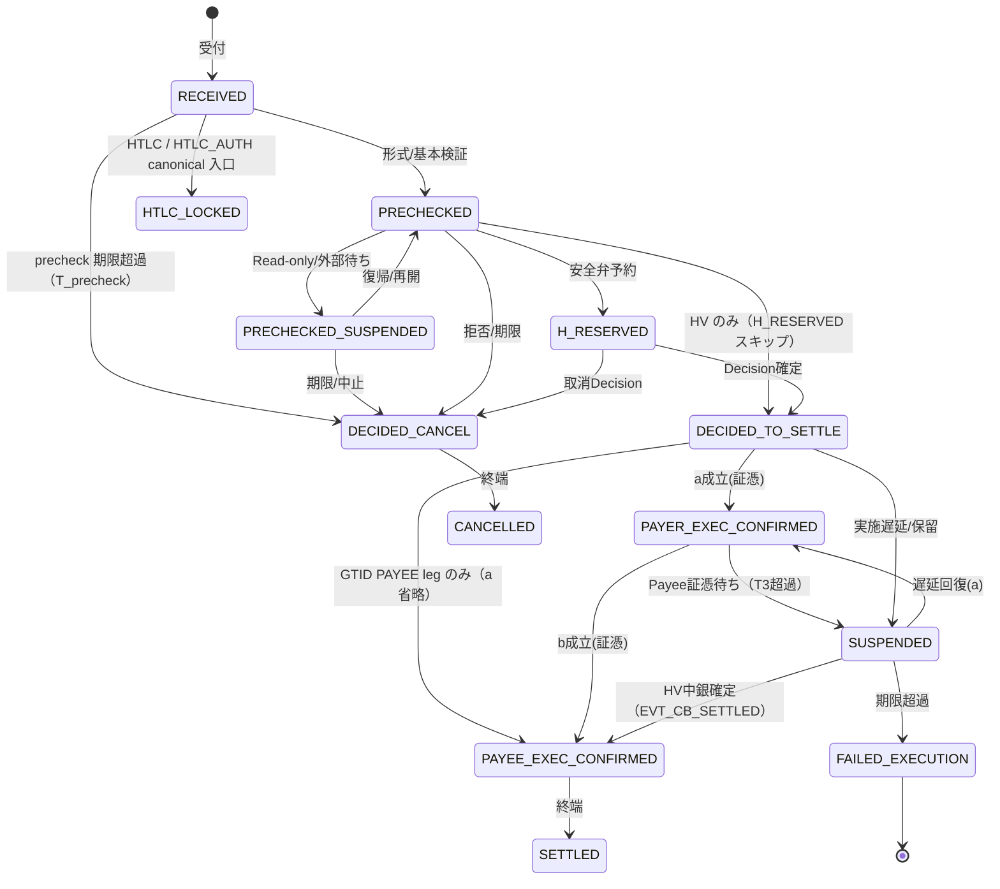

- **高額即時レーン（HIGH_VALUE）のみ**：
  - `PRECHECKED → DECIDED_TO_SETTLE` 直行を許容する（H 予約スキップ。`10_requirements.md` §1.2.3 参照）。実装上は `src/zc/orchestrator/state_machine.ts#ALLOWED_TRANSITIONS.PRECHECKED` に明示列挙し、HV 以外のレーンは `transitionWithLog({ fromState: 'H_RESERVED', ... })` で `fromState` を縛ることで間接的に禁止する。
  - `SUSPENDED` にある取引について、ExternalSettlementAdapter から `EVT_CB_SETTLED`（中銀決済完了）を受信した場合に限り、`SUSPENDED → PAYEE_EXEC_CONFIRMED` を許容する。**このガードの正は `external_settlement_status == 'SETTLED'` であり、`reason_code` ではない**（`10_requirements.md` §1.2.3 の不変条件と同一。実装は `src/zc/orchestrator.ts` の HV 不変条件チェック）。
    - **`reason_code` を遷移のガードに使わない（規範）**：`reason_code` は窓口向けの説明ラベルであって状態機械の条件ではない（`32_api_contracts.md § 状態 reason_code`)。かつて本項は `reason_code ∈ {SUSPEND_IGS_HOLD, SUSPEND_IGS_PENDING}` という条件で書かれていたが、**両値は実装に存在せず**、ガードは空文だった。判定に使ってよいのは、その目的のために置かれた列（`external_settlement_status`）だけである。
- **HTLC / HTLC_AUTH のみ**：`RECEIVED → HTLC_LOCKED` を canonical 入口とする。`HTLC_LOCKED` で直接 INSERT する経路は禁止し、`insertTxWithLog({ initialState: 'RECEIVED', ... })` で `RECEIVED` を経由してから `transitionWithLog` で `HTLC_LOCKED` に遷移する（`PaymentInitiated` の FinalityLog 痕跡を残すため。背景は `10_requirements.md` §3.2.3.1-5（HTLC 正準入口の必須性と、その経緯））。
- **GTID PAYEE leg のみ**：`DECIDED_TO_SETTLE → PAYEE_EXEC_CONFIRMED` の a 省略遷移を許容する。GTID は GT-level Decision 確定後、レッグ単位の `Transactions` 行を `insertTxWithLog({ initialState: 'DECIDED_TO_SETTLE', ... })` で直接生成する（`src/zc/lanes/_helpers.ts#ALLOWED_ENTRY_STATES` のホワイトリスト経由）。PAYEE 側は対応 PAYER leg の `onPayerExecConfirmed` から credit を受けるため、自身の `Transactions` 行を持たず Decision 直後に b を観測する。


- **Finality（法的弁済完了）は `PAYEE_EXEC_CONFIRMED`（b）にのみ紐付ける** 。
- `DECIDED_TO_SETTLE` はZCの **実施指示の確定（Raftコミット）** であり、資金の不可逆確定とは別軸。
- `RECEIVED` / `PRECHECKED` / `PRECHECKED_SUSPENDED`
- `H_RESERVED`（安全弁予約）
- `DECIDED_TO_SETTLE` / `DECIDED_CANCEL`（Decision）
- `PAYER_EXEC_CONFIRMED`（a成立：証憑）
- `PAYEE_EXEC_CONFIRMED`（b成立：証憑）
- `SETTLED`（照会上の終端）
- `SUSPENDED`（Decisionはあるが実施が遅延・保留）
- `FAILED_EXECUTION`（Decisionはあるが実施未確定で終端）
- `CANCELLED`（取消終端）

> 注：`REVERSAL` は状態ではなく、別txidとして起案される「救済取引」である。


#### 3.2.2 図解：HTLC状態遷移（規範）

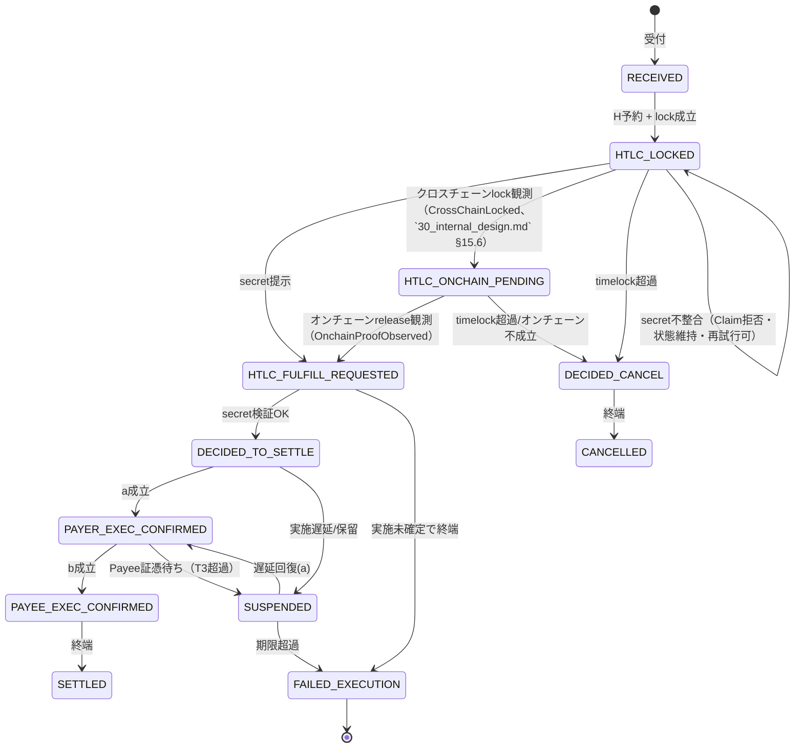

**規範（要点）**
- HTLCは「取消の代替」ではなく、 **成立前の不確実性（条件待ち）を状態化** する。
- `secret` はZCに永続保存しない。保持するのは `secret_hash` と **検証証跡** のみ。
- timelock到来は必ず `DECIDED_CANCEL` へ収束し、宙ぶらりんを残さない。
- **取消可能なのは `HTLC_LOCKED` / `HTLC_ONCHAIN_PENDING` まで**（timelock 到来で `DECIDED_CANCEL`）。preimage 不整合の Claim は `HtlcClaimRejected` を証跡化するだけで状態は `HTLC_LOCKED` のまま（期限まで再試行可）。secret 検証 OK で `HTLC_FULFILL_REQUESTED` に進んだ後は取消不可で、`DECIDED_TO_SETTLE`（成立）か `FAILED_EXECUTION`（実施未確定で終端）のいずれかへ収束する（`ALLOWED_TRANSITIONS.HTLC_FULFILL_REQUESTED`）。


#### 3.2.3 gtid/leg 状態遷移（規範）

> **参照**：GTID 集約状態（`GT_*`）の正準遷移表・SoT は §3.5。本節はその補足として、レッグ準備モデル（Try/Confirm／障害時の扱い）を述べる。

GTIDは多者間の整合性を重視するため、以下の「不整合排除モデル」を採用する。

- **Decision前の確保（Try）** ：`GT_PRECHECKED` 段階で、全Payerの「Hard Reservation（別段確保）」と、全Payeeの「受入体制」を確認する。
- **Decision後の確定（Confirm）** ：Decision確定後は、Payer/Payee共に「銀行別段間」の資金移動となるため、**口座状態（残高不足・凍結）に起因するExecution失敗は発生しない**。
- **システム障害時の扱い** ：
  - 通信障害・勘定系停止等によりExecutionが確認できない場合は、従来通り `GT_SUSPENDED` とし、**CASE（運用例外）**へ接続する。
  - **規範** ：この場合の解決策は「システム復旧後の再適用（Forward Recovery）」または「強制b成立（Custody化）」とし、**口座都合を理由としたReversal（組戻し）は行わない**。


### 3.3 タイムアウト制御（規範）

#### 3.3.1 タイムアウトと状態遷移（規範）
タイムアウトは“暗黙”にせず、 **どの状態を、どの理由で止めるのか** を固定する。

下表の `reason_code` は**状態 `reason_code`**（`32_api_contracts.md § 状態 reason_code`）である。
規範として先に固定したが未実装のものは `【未実装】` を付す（`30_internal_design.md` §10.0）。

| タイマ | 適用状態 | 期限超過時の遷移 | 状態 reason_code |
| --- | --- | --- | --- |
| T_precheck | RECEIVED | DECIDED_CANCEL | `CANCEL_PRECHECK_TIMEOUT` |
| T_namecheck | PRECHECKED | PRECHECKED_SUSPENDED | `SUSPEND_NAMECHECK_PENDING` |
| T_auth | PRECHECKED | PRECHECKED_SUSPENDED | `SUSPEND_AUTHORITY_PENDING` |
| T_batch_window | PRECHECKED | PRECHECKED_SUSPENDED | `COUNTERPARTY_WINDOW_CLOSED` |
| T2_exec | DECIDED_TO_SETTLE | SUSPENDED | `SUSPEND_EXEC_TIMEOUT` |
| T3_payee_proof | PAYER_EXEC_CONFIRMED | SUSPENDED | `SUSPEND_PAYEE_PROOF_TIMEOUT` |
| T_gt_deadline | GT_PRECHECKED | GT_DECIDED_CANCEL | `PRECHECKED_STUCK_TIMEOUT`（FinalityLog payload の `reason`。GTID 側に `reason_code` 列は無い） |

> ※ パラメータ値は第10章（運用設計）で定義し、変更時は所定の変更管理（合意・証跡）を要する。
>
> **`T_auth` の規範（AML/制裁照会は fail-closed）**：Authority Check の答えは OK / NG の 2 つでは
> なく、**「答えが返らない」が third case として存在する**（払い手銀行の Circuit が OPEN、
> ingress が判定を返さない等）。判定不能を「NG でなければ通す」と扱ってはならない——
> 到達できなかった照会が制裁非該当と同じ効果を持つことになり、審査そのものが無効化される。
> したがって判定不能は **取引を進めず** `PRECHECKED` に留置し、T_auth の起点とする。
>
> 一方で **判定不能は NG ではない**ので、その場で取消してもならない（一過性の障害で正当な
> 送金を落とすことになる）。期限超過で `PRECHECKED_SUSPENDED`（`SUSPEND_AUTHORITY_PENDING`）へ
> 落とし、人が扱える状態にする。留置の印は `Transactions.reason_code` に同じ
> `SUSPEND_AUTHORITY_PENDING` を先置きすることで表し、**要求時刻は専用列
> `Transactions.pending_since` が担う**。留置の印を持つ行だけを掃引するので、
> 別の理由で `PRECHECKED` に滞留した行が AML 待ちと誤って表示されることはない。
> 実装: `src/zc/lanes/_authority_check.ts`（留置）と `src/cron/timeout_sweep.ts`（掃引）。
>
> **なぜ専用列か（規範）**：本項はかつて「要求時刻は `updated_at` が担う（専用列は
> 設けない。他のタイマも同じ計り方である）」と定めていた。これは誤りで、しかも
> T_auth だけでなく**下表の 4 タイマすべてが誤っていた**。`updated_at` はこの行への
> あらゆる書込みで動き、進捗と無関係な書込みにも状態ガードが無い——CASE 起票時の
> `case_id`（`src/zc/cases/case.ts`）、送金内容データ連携時の `edi_ref`
> （`src/zc/richdata/edi.ts`）。したがって**滞留した取引に CASE を起票するという、
> まさにその滞留に対する運用者の動作が、当該取引自身の期限を後ろへずらしていた**。
> 繰り返せば無限にずれる。タイマを最も必要とする行ほど、待っている間に別の理由で
> 触られる機会が多いからである。
>
> 「留置の印を持つ行だけを掃引する」という上の一文は**どの行を掃くか**の保証であって、
> **経過時間をどう測るか**の保証ではない。両者を取り違えたことがこの誤りの原因である。
>
> 是正として `Transactions.pending_since` を新設した。書込み元はレーン共通
> プリミティブ（`insertTxWithLog` / `transitionWithLog`）と本節の留置印に限られ、
> 付随的な書込みからは構造上到達できない。掃引側は
> `COALESCE(pending_since, updated_at)` を読む（COALESCE は本列の導入前に
> 書かれた行のための後方互換）。回帰試験は `test/cron/pending_since.test.ts`、
> 形の固定は `test/invariants/pending_since.test.ts` にある。
>
> なお `GtidTransactions` の 2 タイマ（§3.5）は `updated_at` を読み続けてよい。
> 当該表への `UPDATE` はコード上すべて `state` の遷移を伴うため、`updated_at` が
> 状態への進入時刻と一致するからである。これは現在の呼出し側の性質であって
> スキーマの性質ではないので、非遷移の書込みが追加されたら検出されるよう
> `test/invariants/pending_since.test.ts` で静的に固定している。
>
> 同じ「判定不能を通さない」規範は **HTLC claim 直前の再照会**にも及ぶ。ただしそちらは待機
> 状態を持てない（待つことが timelock と競合する）ため、帰結は留置ではなく **claim の拒否**
> になる。`30_internal_design.md` §15.4 を正とする。
>
> `T_precheck` の掃引は `src/cron/timeout_sweep.ts` の先頭ステップにある。`T2_exec` と同じく
> BULK / DEFERRED は対象外（窓を待つ状態を滞留と見なさないため）で、`owner='ZC'` の行だけを
> 触る（第4章の単一所有者則）。`RECEIVED` には Decision がまだ無いので補償すべきものが無く、
> 掃引は中断ではなく `DecidedCancel` を経て終端 `CANCELLED` へ落とす。

### 3.4 禁止遷移（規範）
- **b成立後にCANCELLEDへ遷移してはならない** 。  
- **証憑なしにPAYER_EXEC_CONFIRMED / PAYEE_EXEC_CONFIRMEDへ遷移してはならない** 。  
- **FAILEDを黙って取消扱いにしてはならない** （顧客表示・監査が破綻）。

### 3.5 gtid/leg 状態（規範）
- gtidシャードで **GT_DECIDED_TO_SETTLE / GT_DECIDED_CANCEL** を確定（SoT）。  
- legは結果単位（特にPAYEE側の証憑）として保持。  
- 期限切れ（leg expires_at）等により一部が前進しない場合は、GTを `GT_SUSPENDED` とし、CASEに接続したうえで **Forward Recovery（復旧後の再適用/再照合）＋未実行証明による解放（必要に応じCustody化）** により収束させる。口座都合を理由としたReversalは行わない。物理的に資金移動が不能であると証明された場合に限り、別取引としてReversalを許容する。

> **実装（状態機械の単一の正）** ：GTID 集約の合法遷移は
> `src/zc/orchestrator/gtid_state_machine.ts` の `ALLOWED_GTID_TRANSITIONS`
> に宣言として固定する（`TxState` の `state_machine.ts#ALLOWED_TRANSITIONS`
> と対称）。終端化経路は `assertValidGtidTransition` で実行時検証し、
> 生 SQL の全 GTID 遷移は静的検査
> （`test/zc/gtid_state_machine.test.ts`）で宣言グラフに含まれることを保証する。
> 規範遷移: `GT_RECEIVED → GT_PRECHECKED → GT_DECIDED_TO_SETTLE → GT_SETTLED`、
> `GT_PRECHECKED → GT_DECIDED_CANCEL → GT_CANCELLED`、
> `GT_DECIDED_TO_SETTLE → GT_SUSPENDED`（terminal leg 失敗）、
> `GT_SUSPENDED → {GT_DECIDED_TO_SETTLE（resume）, GT_FAILED}`。

### 3.6 CASE 状態（規範）
- CASEは「例外処理のチケット」であり、取引状態と因果リンクを必ず持つ。  
- CASEは監査・当局・窓口照会の共通キー（case_id）となる。


## 第4章 メッセージング方式とI/F設計思想

> **要旨**  
> 本章では、接続境界（Clientは直接ZCに接続しない）と、非同期I/Fを採る理由を示す。I/F契約を固定するためのレイヤ分離、版管理・互換性・署名設計の原則を整理し、`30_internal_design.md` 第12章（I/F契約）・第13章（メッセージ定義）の読み方へつなげる。


### 4.0 接続境界（ClientはZCへ直接接続しない）【規範】

**結論（設計上の原則）** ：一般のClient（個人アプリ・POS・加盟店端末等）は、ZCへ直接メッセージを送信してはならない。
ZCが受け付けるのは、 **参加主体（Bank/認可事業者）のみ** とし、Clientは必ず参加主体の **Edge/API** を経由する。

- **セキュリティ** ：ZCを公開面に晒さず、DDoS/不正接続/鍵漏えいの影響面を縮小する。
- **責任分界** ：顧客認証・限度・与信・不正検知は参加主体責任。ZCは“決定と証跡”に専念する。
- **互換性** ：参加主体がチャネル差分（モバイル/店頭/法人）を吸収し、I/F契約を壊さず進化できる。
- **監査容易性** ：誰が送ったか（署名主体）が明確になり、争点を減らす。

> 例外：参加主体として認定された事業者（Licensed Participant）は、Bankと同等にZCへ接続できる。

以降の図表では、Client発の操作（受付/照会/HTLC secret提示）は **PayerBank(Edge/API)** を経由する前提で記述する。


### 4.1 非同期I/Fを採る理由（規範）
- **ピーク吸収** ：給与・自治体・EC等のピークを平準化し、参加行側の接続コストを下げる。  
- **運用分離** ：参加行障害が全体停止に直結しないようにする。  
- **低廉** ：共通基盤の再利用で単価を下げる。  
- 代償として、重複・遅延・欠番は「必ず起きる」。よって **I/F契約の固定** が前提。

> **規範**  
> I/F契約は“骨子”ではなく“固定”である。例示や口頭合意では、合同レビュー会・監督・RFPで必ず破綻する。

### 4.2 I/Fのレイヤ
- **同期API** ：受付（受理/拒否）、照会（Read Model）。  
- **非同期cmd/event** ：実施要求、実施確認、決定通知、例外・運用イベント。  
- **スキーマ管理** ：Schema Registry（互換性ポリシー）＋署名正規化（canonicalization）をセットで運用標準化。

### 4.3 版管理と互換性（規範）
- スキーマは `schema_version` を必須とし、破壊的変更は **メジャー更新** 。  
- 互換性は原則「後方互換（backward）」を採用し、移行期間は旧新版の併走を許容。  
- 署名対象（signed_fields）と正規化（canonicalization）は、破壊的変更を避けるため **強く固定** する（`30_internal_design.md` 第12章（I/F契約））。

### 4.4 署名と否認防止の立て付け（概要）
- 署名は「アルゴリズム」より先に「何を署名するか」を固定する。  
- 署名対象外のフィールドを勝手に増やすと、監査・訴訟で争点化するため禁止（`30_internal_design.md` 第12章（I/F契約））。


## 第5章 冪等性・順序制御・再送制御

> **要旨**  
> 本章では、at-least-once配送を前提に、重複・遅延・欠番を事故にしないための冪等性、seq、再送制御、DLQ→CASEの運用接続を定める。ログからのリプレイ/再構築まで含め、実装がぶれやすい固定点を押さえる。


### 5.1 前提（規範）
- 配送は at-least-once。重複・遅延・欠番は必ず起きる。  
- 全体順序は要求しない。 **同一aggregate内の順序のみ** を契約で固定する。

### 5.2 idempotency_key（規範：混線防止）
- 論理コマンド単位で一意・永続。再送時は同一キー必須。  
- スコープを強制的に分離し、txid/gtid/leg/attempt混線を防ぐ（`30_internal_design.md` §12.4）。

**例（固定フォーマット推奨）**
- `TX:{txid}:{name}:{issuer}`  
- `GT:{gtid}:{name}:{issuer}`  
- `LEG:{gtid}:{leg_id}:{name}:{issuer}`  
- `RTP:{rtp_id}:{attempt_id}:{name}:{issuer}`


#### 5.2.1 二重送信（重複）の収束規範

- COMMANDの重複：同一 `idempotency_key` は **同一要求** として扱い、副作用は1回のみ。
- EVENTの重複：同一 `bank_proof_ref`（または同一 `proof_digest`）は重複として無害化し、取り込み1回。
- 内容不一致：同一txidで不整合（amount/宛先/署名）がある場合は `PROOF_MISMATCH` としてCASEへ接続し、人手判断へ昇格。

> **規範** ：二重送信は異常ではない。二重計上が異常である。

### 5.3 command_seq / event_seq（規範）

- **永続・単調増加・巻戻り不可** 。欠番は許容するが再利用不可。  
- 粒度： **送信者×aggregate** （`30_internal_design.md` §12.5）。

### 5.4 再送制御（規範：枠）
- 再送は指数バックオフ＋ジッタ。上限回数（**`PR-RETRY-MAX`**。`30_internal_design.md` §12.9）を設ける。  
- 上限到達はDLQへ落とし、 **必ずCASEへ接続** （運用の入口）。  
- 再送時の副作用は禁止（冪等処理）。

### 5.5 順序制御（規範）
- Kafka等のキー順序に依存する場合でも、 **アプリ層でseq検証** を実施する。  
- seqギャップ（欠番）は許容だが、巻戻りは拒否（監査破綻）。  
- 直列化キーの推奨：`txid`、`gtid`、`RTP:{rtp_id}:{attempt_id}`、`CASE:{case_id}`。

### 5.6 リプレイと再構築（規範）
- Finality Logを起点にRead Modelを再構築可能であること。  
- 「二重適用」を避けるため、再構築処理もidempotentであること（同一ログの再適用で同一結果）。


## 第6章 整合性モデルとファイナリティ設計

> **要旨**  
> 本章では、SoT（Finality Log）とRead Modelの整合性モデルを示し、DecisionとExecutionの分離、a/b（二段階完了）と資金帰属の扱いを定義する。安全弁Hの更新規則、gtidの整合条件、高額即時レーン介在時の制約を整理し、設計上の「詰ませない」条件を固定する。


### 6.1 整合性モデル（規範）
- **SoTはFinality Log** 。Read Modelは派生であり、整合性は「最終的整合」を許容する。  
- ただし、決済は争点化し得るため、最終的整合を採りつつ **説明可能性** を最優先する。

> **精密化（原則1の射程）**  
> FinalityLog が「唯一の正（SoT）」であるのは **協調事実**——ZC の決定（Decision）・所有権移転（単一所有者則）・受領した署名付き証明——についてである。**金銭事実（実際に資金が動いたか）の正は各参加行の元帳にある**（ZC は元帳を持たず・触らない）。したがって ZC の正確な主張は「乖離しない（原子性）」ではなく「**すべての乖離は有界時間内に検出され、帰責される**（監査可能性）」である。これは原則1の**弱化ではなく精密化**であり、§6.3.3 の三層構造・単一所有者則（[`30_internal_design.md`](30_internal_design.md#single-owner)）と噛み合って法的な物語が一貫する。

### 6.2 Decision/Execution分離（規範：中核）
- **Decision** ：ZCが「実施指示を出すこと」を確定（Raftコミット）。  
- **Execution** ：参加行が「資金状態が不可逆に確定した」ことを証憑で示す。  
- これを混同すると、障害時に「決めたのに実行されていない」または「実行されたのに決めていない」の説明が破綻する。

### 6.3 a/b（二段階完了）の定義（規範）

#### 6.3.1 b（弁済完了）の再定義とCustody（別段預り）
本基盤では、口座状態（凍結・解約等）による不整合を排除するため、bの定義を以下の通り厳格化する。

- **a（支払人完了）** ：支払人資金が不可逆に銀行の決済処理領域（支払用別段預金等）へ移ったこと（`PAYER_EXEC_CONFIRMED`）。
- **b（弁済完了）** ：受取銀行の管理下（受取用別段預金等）に資金が着金し、受取銀行がこれを受領確認したこと（`PAYEE_EXEC_CONFIRMED`）。
  - **規範** ：顧客口座への入金（Credit）は、b成立後の受取銀行内部責務とする。
  - **Custody（別段預り）** ：顧客口座解約・凍結等により入金不能な場合は、受取銀行が **「預り金（Custody）」** として保全し、状態として管理する。**これを理由に決済自体を失敗（Reversal）させてはならない**。

#### 6.3.2 失敗と救済（Reversal）の適用範囲
b成立後の取消は禁止とし、b未成立時の扱いは以下の通り固定する。

1. **口座起因の不整合（禁止）** ：残高不足・口座なし等を理由とする b拒否は認めない（Hard Reservation / Hard Landing / Custody で吸収）。
2. **システム災害・不整合（CASE）** ：通信途絶・勘定系全損等により b証憑 が発行不能な場合に限り、CASE（例外）へ収束させる。  
   - **回復方針** ：原則として「Forward Recovery（復旧後の再適用・強制Custody化）」を優先する。  
   - **Reversal** ：物理的に資金移動が不能であると証明された場合（`CreditFailedProof`）にのみ、別取引として Reversal を許容する。

#### 6.3.3 ファイナリティの三層分離（債務確定・決済資産確定・証跡確定）【概念】

完了性（finality）は一枚岩ではなく、**三つの層**に分けて語る必要がある。§6.3.1 の b の定義はこのうち第1層（債務確定）を指しており、残る二層と混同してはならない。

- **(1) 債務確定（obligation finality）** ：参加者間で「この取引は成立したものとして扱う」ことが**規程上**不可逆になる点。**b（`PAYEE_EXEC_CONFIRMED`）はここに位置する**。確定点を定義するのは台帳ではなく**規程**であり、法がそれを保護する（全銀システムや CLS の PvP も同型）。規程上の正式名として **`ObligationFinal`** を与える。
- **(2) 決済資産確定（settlement finality）** ：中央銀行マネー（日銀ネット）ないし各行元帳での**実際の付替え**。ZC はこの資産を**保有も制御もしない**。実装上の対応事実は `Transactions.external_settlement_status`（IGS/BOJ 決済確認）・DNS サイクル決済事実・クロスチェーンの確認深度到達であり、これらを b とは**別の記録事実（`settlement_finality_ref` 相当）**として保持する。
- **(3) 証跡確定（evidential finality）** ：FinalityLog のハッシュ連鎖。「**何が起きたかの改ざん不能な記録**」であり、上記 (1)(2) の事実列そのものを固定する。

**含意** ：b は決済を*主張（assert）*するのをやめ、決済を*参照（reference）*する。この分離により「operational state を legal finality と混同している」という批判は解消する（主張を取り下げ、参照に変えたため）。

> **ゼロアワー問題への注記（法的限界）**  
> 参加行の破綻手続開始は、**当日朝に遡って**既了取引を無効化し得る（ゼロアワー・ルール）。ハッシュチェーンは改ざんを検出できても**破産管財人には対抗できない**。b の「不可逆」を法的に実在させるには、完了性保護（**指定システム化**等）の取得が前提であり、これは**技術では代替できない**制度事項である（制度面は [`10_requirements.md`](10_requirements.md) 第4章 を参照）。

### 6.4 Hモデル（絶対超過禁止：規範）

Hは「超過しない」ことが目的の安全弁であり、過検知を許容する。Hはtxid単位で管理し、`H_reserved` と `H_locked` の2層で表す。

- `H_reserved`：Decision前の予約枠（取消可能）
- `H_locked`：Decision後に凍結される枠（DNS清算完了まで解放しない）

#### 6.4.0 更新規則（規範：台帳更新を固定）
| トリガ（Finality Log） | 事前条件 | 予約/凍結更新 | 備考（監査説明） |
| --- | --- | --- | --- |
| HReservationPlaced | - | `H_reserved += amount` | 予約開始 |
| DECIDED_TO_SETTLE | H_reserved存在 | `H_reserved -= amount` / `H_locked += amount` | 予約→凍結へ移送（Decision確定） |
| DECIDED_CANCEL | Decision前 | `H_reserved -= amount` | 予約を取消（凍結は作らない） |
| DNS_CYCLE_SETTLED | - | `H_locked -= sum(amount where settled_in_cycle)` | DNS清算完了で枠解放（参加行単位） |
| NoDebitRecordedProofSubmitted | a未成立 | `H_locked -= amount` | 未実行証明に基づく解放（Decision後の救済） |
| HUnlockAuthorized | CASE承認 | `H_locked -= amount` | 運用二重統制による解放 |
| ReversalSettled | `reversal_of_txid` を伴う救済取引の成立 | `H_locked -= 0`（変化させない） | **意図した零**。救済取引は §6.4.2 により H チェックの対象外だが、それは*判定*の話であって*台帳更新*の話ではない。本行が無いと「表に無い＝変化しない」という既定に落ちるだけで、保守側へ倒した判断なのか書き漏らしなのかを後から区別できない。減少させない選択の理由は、元取引の `H_locked` は元取引自身の解放契機（DNS 清算完了・未実行証明・4 眼）で外すものであり、救済取引の成立をもって二重に外すと上限が破れるためである |

> **規範**  
> Decision後は「取消」ではなく「救済（補償）」で収束する。よって `DECIDED_CANCEL` をH_locked解放トリガとしてはならない。

> **関連（H を動かさない例外）**：`MisrecordCorrected`（誤記録訂正、`10_requirements.md` §4.4「唯一の超例外」）は、上表のどの行にも該当しない——「a が誤記録された」場合のみを対象に、時間窓・4 眼承認・evidence を必須とし、**取消ではなく記録訂正**として FinalityLog に追記して CASE へ収束させるものであり、H 台帳を巻き戻さない。b 成立後は不可逆につき Reversal へ誘導する（契約は `32_api_contracts.md § POST /api/transfers/:txid/misrecord-correct`）。


#### 6.4.1 H_locked解放（FAILED_EXECUTION時の詰み防止）【規範】
`DECIDED_TO_SETTLE` 到達後は当該枠を `H_locked` に移送し凍結するが、 **FAILED_EXECUTION（Decisionはあるがa未成立）** が長期化すると運用事故になり得る。
本書は、以下の **解放の証跡条件** を規範として固定する。

- **自動解放してよい条件（機械判定）**
  - 参加主体（PayerBank）が **未実行証明（NoDebitRecordedProofSubmitted）** を発行し、ZCが署名検証のうえ Finality Log に記録した場合

- **自動解放してはならない条件（補償が必要）**
  - a成立（PAYER_EXEC_CONFIRMED）済みの場合（資金は不可逆に移動している）
  - b成立（PAYEE_EXEC_CONFIRMED）済みの場合（弁済完了である）

- **運用解放（CASEで二重統制）**
  - 上記の証明が得られない場合は、CASEにおいて **二重統制（4眼）** で `HUnlockAuthorized` を発行する。
  - その際、根拠として **台帳照合ハッシュ／照会応答署名／Authority Check（AML/制裁）結果** のいずれかを添付し、監査で追跡可能にする。

> 目的：堅牢性（自動解放しない）と運用可能性（詰ませない）を両立する。


#### 6.4.2 救済取引（Reversal）のH特例【規範】
救済取引（Reversal）は「トラブル解消のための緊急避難」であり、H（Net Debit Cap）により起票不能となってはならない（救済のデッドロック防止）。

- **適用**：`reversal_of_txid` を伴い、かつ制度で定義された救済理由（誤入金・重複・物理的不可能等）に該当する取引のみ。
- **取扱い**：Reversalは **Hチェック（`H_reserved`/`H_locked`）の対象外** とし、H超過を理由に `REJECT` してはならない。
- **統制**：H超過状態でのReversal起票はCASE経路（運用二重統制）に接続し、監査証跡（承認記録）を必須とする。

### 6.5 gtid（多者協調）における整合条件（規範）
- **一体性の対象は「Decision（実施指示の確定）」である** 。Execution（a/b）はネットワーク・参加行都合により部分進捗が起き得るため、Decision後の不整合は **CASE＋補償で必ず収束** させる。
- GT_DECIDED_* はgtidシャードFinality Logで確定（SoT）。  
- 各payerシャードへ決定証明（decision_proof_ref）を参照追記し、監査で辿れること。  
- legの一部失敗・期限切れは **GT_SUSPENDED + CASE** とし、補償で全体を安全側に収束（Decision後の取消は禁止）。

#### 6.5.1 確定等級（Finality Grades）による多脚原子性の精密化【概念・未実装】

異種基底の多脚取引（GTID × HTLC × FX PvP など）では、脚ごとに**確定の強度が異なる**ため、基底を勘定に入れると素朴な「all-or-nothing」は成立しない。そこで脚ごとに**確定等級**を導入して精密化する（概念であり、**現時点で未実装**）。等級は §6.3.3 の三層分離および `30_internal_design.md` §15.6（`onchain_finality_class`：PROBABILISTIC / DETERMINISTIC）と対応する。

| 等級 | 意味 |
| --- | --- |
| `F0` | 取消可能（勘定系の日中仮記帳） |
| `F1` | 規程確定（b。倒産隔離は指定の有無に依存＝§6.3.3 の債務確定） |
| `F2` | 決済資産確定・確率的（パブリックチェーン。reorg 確率 ε 付き） |
| `F3` | 決済資産確定・決定的（日銀ネット・私設チェーン） |

- **上限則** ：GTID が主張できる原子性は **`min(全脚の等級)`** を超えられない。
- **運用則** ：最も不可逆な脚を**最後にコミット**する／無条件の不可逆脚は **GTID あたり最大 1 本**（2 本目以降はハッシュロックで条件化するか、PvP エージェント経由に強制する）。さもなくば二通貨 RTGS × RTGS が **Herstatt リスク**を再導入する。
- **正確なラベル** ：GTID の保証は「all-or-nothing」ではなく「**有界 unwind 集合付きの無損失協調**」と表現するのが正しい（多脚原子性の詳細は本書 第17章（クロスカレンシーFX 処理方式）を参照）。

### 6.6 高額即時レーン介在の制約と整合（規範）
- **規範** ：高額即時レーン介在時は多者協調の完了認定（全legのb一致）を保証しない。  
- **規範** ：高額即時レーンではgtidを用いない（txid単位）。  
- ExternalSettlement Adapterは `ext_instruction_id` を冪等キーとし、結果再照合でRead Modelを再構築する。

> **対外説明テンプレ（骨子）**  
> 「当基盤は、決定（Decision）と実施確認（Execution）を分離し、**どの時点で何が確定したのか**を監査証跡で説明できます。安全弁（H）により、障害時も上限超過による連鎖破綻を防ぎます。」


#### 6.6.1 高額即時レーンの取消要求（顧客要望）と行き違い防止（規範）

- **規範** ：高額即時レーンにおける顧客の「やめたい」は、元取引の取消ではなく **返金（b）で収束** させる。
- **参加主体側の受付** ：PayerBankは、顧客取消を受理した時点で `INTERNAL_CANCEL_ACCEPTED` をZCへ通知できる。

##### 6.6.1.1 行き違い防止ゲート（Must）
ZCが清算サービスへ **IGS振替依頼を送信済み** であり、まだ結果（`IGS_RESULT`/`BOJ_SETTLED` 等）を受理していない間、
**ZCはPayerBankへ内部取消の承認（CONFIRM/ACCEPT）を返してはならない** 。

- IGS結果が未確定の間（`external_settlement_status == 'REQUESTED'`）は `next_action_hint=WAIT` として保留する。**「まだ返ってきていない」の判定は `external_settlement_status` が担う**——`reason_code` は説明ラベルであって判定には使わない（`32_api_contracts.md § 状態 reason_code`）。`next_action_hint` の値域は `30_internal_design.md` §13.6 が正。
- IGS結果が「未成立（HOLD継続／不成立）」で確定した場合のみ、内部取消を確定し、返金（返し決済）へ遷移させる。
- IGS結果が「成立（SETTLED）」で確定した場合、元取引の取消は不可能であり、救済は返金取引（別txid）で行う。


## 第7章 セキュリティ・認証・署名・否認防止

> **要旨**  
> 本章では、メッセージ単位の検証（mTLS＋署名）を前提に、参加者アイデンティティ、鍵管理、署名対象の固定、否認防止を整理する。Express（PSPR）の短寿命性、個人情報最小化、Web3/外部台帳等への接続を「責任分界が崩れない範囲」に留める。

### 7.1 基本方針（規範）
- **ゼロトラスト前提** ：ネットワーク境界ではなく、メッセージ単位で検証する。  
- **mTLS＋メッセージ署名** ：通信路と内容の両面で改ざん・なりすましを防ぐ。  
- **否認防止** ：誰が何を送ったかを、署名とFinality Logで立証する。

### 7.2 アイデンティティ（参加主体の識別）
- 参加主体（org_id/system_id）を発行主体として固定し、証明書・鍵をTrust Registryで管理。  
- 鍵ローテーション・失効は運用イベントとしてログ化（監査）。

### 7.3 署名（規範：何を署名するかを固定）
- 署名アルゴリズム（alg）は要件で確定可。  
- ただし、 **署名対象（signed_fields）と正規化（canonicalization）は固定** （`30_internal_design.md` §12.6）。  
- 金額・識別子・時刻・相関ID・証憑参照は最低限署名対象とする。

### 7.4 Express（PSPR）の署名と短寿命性

> **設計規範（PSPR参照の可用性責務）**  
> PSPR本文のSoTはPayeeBankである。ただし Express の同期応答品質を担保するため、**pspr_ref参照は高可用であること**を参加条件とする。  
> さらに監査・障害時の参照断を防ぐため、PayeeBankはPSPR登録時に **要約（必須キー＋digest＋発行署名）をZCへ送付**し、ZCはこれを **WORM保全（規範）**する（本文そのものは原則保持しない）。  
> 参照障害時は、(1) Vault短期複製（許容）または (2) 同期応答を `INGRESS_ACCEPTED` に落として非同期処理へ切替（規範）し、**不完全な宛先情報でDecisionを確定しない**。


- PSPRは加盟店/GW（受取側）が生成し、 **PayeeBankが発行主体として登録・払い出し（pspr_ref）する。**  
- PSPR本文の **保管責任（SoT）はPayeeBank** に置く（短寿命・最小化）。ZCは `pspr_ref` と **digest（参照証跡）** を保持し、本文は原則保持しない。  
- PSPRは短寿命（例：60〜180秒）。nonceの再利用は禁止し、ZCはdigest単位で重複検知。  
- 受取銀行CapabilityStateがAcceptingでない場合は同期REJECT（事故防止）。

### 7.5 秘密情報・個人情報（個情法・業法）
- Vaultで短期保持し、最小化（必要最小限・目的限定）。  
- 監査・照会に必要な範囲は参照証跡（digest/参照番号）として保持し、本体は削除可能にする（第8章）。

### 7.6 Web3要件への接続（概要）
- HTLC（hashlock+timelock）を **外部参照なし** で提供し、Web3連携（秘密値提示等）に耐える。  
- **業務条件オラクル**（「納品された」等、取引の*成否そのもの*を外部主体に判定させる仕組み）は、制度・責任分界が不明確になるため本基盤の規範対象外とする（`10_requirements.md` 第4章 法制度・契約構造との整合性で整理）。  
- 他方、クロスチェーン決済は外部レールの**確定イベントの観測**を要するため、ZC は限定された権限のみを持つ **Watcher（外部レール観測オラクル）** を導入する。Watcher は取引の成否を判定せず、外部レールで起きた事実（エスクローのロック／解放）を署名付きで観測するだけであり、その信頼境界・可用性・残存リスクは **§7.7** で規範化する。両者（業務条件オラクル＝対象外／Watcher＝限定導入）を明確に区別する。


### 7.7 Watcher（外部レール観測オラクル）の信頼・可用性モデル（規範）

> **要旨**  
> クロスチェーン決済は外部レールの確定観測を要し、ZC コアはチェーンを直接検査しない（`recordCrossChainLock`/`recordOnchainFulfillment`）。本節は、その観測を担う **Watcher** の権限境界・信頼水準（k-of-n 定足数と equivocation）・可用性（ライブネス）設計・残存リスクを規範化する。§7.6 で規範対象外とした「業務条件オラクル」とは別物として明確に切り分ける。

#### 7.7.1 Watcher の定義と権限境界（規範）
- Watcher は、外部レール（オンチェーン／IGS／海外中銀レール）で**既に起きた確定事実**（エスクローのロック／プリイメージ公開による解放）を観測し、**署名付き `SettlementProofRef` として ZC に提出するだけ**の主体である。  
- Watcher は**取引の成否を判定しない**。式の真偽・条件成立の裁定は行わず、観測は append-only の事実申告にとどまる（だから §7.6 の「業務条件オラクル」の責任分界問題を負わない）。  
- ZC は Watcher 観測を**そのままでは終端化しない**：(a) `preimage` が `hashlock` に一致すること、(b) 確認深度ゲート通過、(c) 外側 timelock 未満了——を満たさない限り `DECIDED_TO_SETTLE`（b）に進めない。**Watcher の権限は「決済を進める提案」に限られ、「決済を確定させる権限」は持たない**。

#### 7.7.2 信頼水準：k-of-n 定足数と equivocation 検知（規範）

観測の信頼水準は、**「誰が署名したか」（認可）と「何人の独立した運用主体が一致したか」（定足数）の二段**で決まる。両方を規範として固定する。

1. **認可（署名検証）** ：Watcher は KeyRegistry に `owner_type='EXTERNAL_RAIL'|'ATTESTER'` で登録された鍵で署名し、ZC は署名・nonce・時刻スキューを検証する（`verifyExternalSignature`、`WATCHER_UNAUTHORIZED`）。`(source, external_ref)` を冪等キーとし、同一 Watcher による同一イベントの再報告は**重複排除**される（最初に検証成功した観測が記録され、以降は `deduped`）。

2. **定足数（k-of-n）【規範】** ：ひとつの外部イベントの終端化には、**相異なる Watcher 運用主体（`KeyRegistry.owner_ref`。鍵ではなく operator で数える）** による一致観測が `HtlcContracts.onchain_min_watchers` 個そろうことを要する。閾値未達の間、当該 HTLC は `HTLC_ONCHAIN_PENDING` に留まり、応答は `reason_code=ONCHAIN_QUORUM_PENDING`、証跡は `OnchainQuorumPending`（`have_watchers` / `required_watchers` を含む）として FinalityLog に残る。**単一の Watcher 鍵だけでクロスチェーン脚を決済させてはならない。**

3. **確認深度は「最も浅い独立観測」を採る【規範】** ：確認深度ゲート（`30_internal_design.md` §15.6 の `requiredConfirmations`）の判定には、定足数を構成する相異なる運用主体の申告のうち**最小値**を用いる。単独の Watcher が自己申告の深度を水増ししてゲートを解除することを構造的に封じるためである。

4. **equivocation は fail-closed【規範】** ：同一 `(source, external_ref)` に対し矛盾する主張（ロックあり／なし、異なる金額・受益者、異なる preimage）を観測した場合、当該観測は成立させず `WATCHER_EQUIVOCATION` で拒否し、`WatcherEquivocationDetected` を証跡化したうえで **CASE へ収束**させる（本書 §10.10）。当該外部イベントの終端化は保留される。

5. **定足数と equivocation の判定は一箇所に置く【規範】** ：「鍵ではなく operator で数える／不一致は一致でない」という判定は、Watcher 観測と Attestation（`30_internal_design.md` §11.2-c の `min_attester_quorum`）で**同一ポリシーを共有**する。二つの経路が別々の判定を持つと、片方だけが緩む形の劣化が起きる。

> **既定値はレール別（規範）**：`onchain_min_watchers` は作成時に確定種別から決める——
> `onchain_chain_class='PUBLIC'`（確率的確定）は **2**、`PRIVATE` / `PERMISSIONED`（決定的確定）は
> **1**。明示の `cross_chain.min_watchers` は常に優先する（`src/zc/lanes/htlc/create.ts`）。
> reorg し得る解放を単独の Watcher が申告する構成が最も弱いため、そこにだけ既定で定足数を課す。
> 列の DDL 既定（1）はこの経路を通らない行のための保険であって、既定構成の水準ではない。
>
> **未分類の脚は作らせない（規範）**：`cross_chain` を指定する要求に `onchain_chain_class` が
> 無ければ `ONCHAIN_CHAIN_CLASS_REQUIRED` で拒否する。既定値が確定種別から導かれる以上、
> 種別を欠いた脚は最弱の既定に落ちるので、既定を選ばせるより宣言を求めるほうが安全である。
> 列の DDL 既定（1）と NULL 許容は、この経路を通らない既存行のために残る。
>
> **未充足**：**Watcher の独立性（鍵・運用組織・ネットワーク・チェーンノード）は制度側の
> 要件であり、系として検証していない**——定足数は「相異なる operator」で数えるが、
> 相関障害には無力である（本書 §7.7.3）。`10_requirements.md` §8.5 の要件 S-4 に残るのはこの 1 点で、
> 「機構が無い」でも「既定が 1 である」でもない。`30_internal_design.md` 第10章 Roadmap で追跡する。

#### 7.7.3 本番拡大の前提（規範TODO：機構ではなく運用条件）

§7.7.2 の機構は規範として固定済みであるため、残る課題は**機構の新設ではなく、その有効化と独立性の担保**である。

- **確定種別の権威** ：指定の必須化そのものは §7.7.2 の規範に含む（`ONCHAIN_CHAIN_CLASS_REQUIRED`）。制度側に残るのは、**どの `source` をどの種別とみなすかの権威**（チェーン登録）で、種別は要求者の申告のまま検証されない（`30_internal_design.md` §10.3）。閾値の決定・変更は `10_requirements.md` §3.2.7（HIGH_VALUE 閾値のガバナンス）と同じ 4 眼の制度行為として扱う。
- **Watcher 独立性要件** ：鍵・運用組織・ネットワーク・チェーンノードの独立を参加要件（第14章）として規定する。**定足数は「相異なる operator」で数えるが、operator が異なっても同一のチェーンノード／同一のクラウドリージョンに相乗りしていれば、相関障害（同一ノード障害で全 Watcher 沈黙・同一ノードの誤情報で全 Watcher が同時に誤観測）に対して k-of-n は無力である。** 独立性は制度で担保するほかない。
- **接続認定試験への組込み** ：上記独立性の申告を、`10_requirements.md` §7.2.7.2 の参加行接続認定試験（certification suite）で実地検証する対象に加える。

#### 7.7.4 可用性・ライブネスと安全側縮退（規範）
- **ライブネス障害＝安全側に倒れる** ：解放観測が**届かない**場合、外側 ZC timelock の満了で `cancelHtlc`→**H 解放→refund** となり、資金は失われない（`recordOnchainFulfillment` の timelock 背骨）。すなわち Watcher 沈黙は**「取引の失敗（refund）」であって「資金喪失」ではない**。  
- **Watcher ライブネス SLO** ：にもかかわらず沈黙は取引失敗率を上げるため、観測到達遅延を SLI とし、SLO 逸脱を自動エスカレーション（第10章 10.9 SLA・障害対応Runbook）に接続する。timelock 余裕（`onchain_timelock` と外側 `timelock` の差）は観測 SLO を吸収できる値に設定する。  
- **深い reorg の巻き戻しは未設計（残存リスク）** ：確認深度ゲートは「浅い解放を終端化しない」ことで*事前*の reorg を防ぐが、**深度充足後に確定済み解放が reorg で消えた場合**の事後 unwind 経路は現状無い。発生時は Reversal（別取引、`10_requirements.md` §4.3 取消・組戻し・救済）＋ CASE で人手収束する暫定運用とし、自動 unwind の要否・方式は制度合意の上で別途設計する。

#### 7.7.5 鍵侵害時の手当（規範）
- KeyRegistry の失効は**非遡及**（失効前に検証成立した観測は有効のまま。`10_requirements.md` §3.3.4-3）。したがって Watcher 鍵の侵害は、失効操作だけでは既に成立した観測を巻き戻さない。
- **k-of-n による構造的緩和** ：`onchain_min_watchers >= 2` が有効な脚では、単一鍵の侵害だけでは終端化に至らない（相異なる運用主体の一致が必要）。逆に **既定の `onchain_min_watchers = 1` で運用している脚は、鍵 1 本の侵害がそのまま不正終端化に直結する**——これが §7.7.3 で既定値の引き上げを本番前提に置く理由である。
- **手順** ：侵害判明時の初動・影響範囲確定・救済は §10.9.3.5 Runbook に規定する（影響調査は `idx_watcher_observation_key` により鍵別に追跡可能）。

> **設計の一貫性（§7.6 との関係）**：Watcher は「事実の署名付き観測」に権限を限定し、決済の確定権は ZC 側の hashlock 一致・深度ゲート・timelock 背骨が握る。これにより、§7.6 が忌避する「外部主体が業務の成否を裁定し責任分界が崩れる」事態を回避しつつ、クロスチェーン確定の観測という不可避の外部依存を、**限定された・監査可能な・安全側に縮退する**形で取り込む。


## 第8章 監査・ログ・証憑設計

> **要旨**  
> 本章では、Decision/Execution/運用操作を一貫した証跡連鎖として残し、後から誰でも検証できる監査設計を示す。Finality LogとWORM保全、Proof参照の粒度、照会と監査が同じ根拠に収束するための要件を固定する。


### 8.1 監査設計の原則（規範）
- **後日「なぜその判断か」を再現できること** を必須とする。  
- 決済は紛争・誤作動・監督対応の対象となるため、監査が弱い設計は必ず事務が破綻し、結果としてコストが跳ね上がる。

### 8.2 Finality Log（規範）
- Decision（DecideToSettle/Cancel）、H予約/凍結/解放、Execution確認（a/b）、運用操作（cap変更、停止/再開）を追記で記録。
- Read Modelはログから再構築可能であること。

#### 8.2.1 ハッシュチェーン（規範：改ざん検知）

> **設計規範**  
> FinalityLog は **WORM（追記専用）かつ tamper-evident**。同一 chain 内の各エントリは SHA-256 で直前エントリの `entry_hash` を参照する。chain identifier は `COALESCE(txid, gtid, 'GLOBAL')`。

- **アルゴリズム**: `SHA-256 hash-chain v2`（`algorithm` フィールドで明示）
- **entry_hash の決定式**:
  ```
  entry_hash = SHA-256(
      prev_hash | log_id | txid | gtid | event_type | state_from
    | state_to  | payload_json | event_seq | occurred_at
  )
  ```
  パイプ `|` 連結。フィールド順は契約（プロトコル変更不可、必要時は v3 として別アルゴリズム名で導入）。

- **prev_hash**: 同 chain の直前エントリの `entry_hash`。新規チェーン先頭は文字列 `'GENESIS'`。

- **書込み原子性（規範）**: 状態 CAS UPDATE と FinalityLog INSERT は同一 `db.batch()` で発行する。INSERT は `changes() > 0` ガード付きの条件付き INSERT で、CAS に勝った呼び出しのみがログを書く。バッチ内例外は両方ロールバック。「状態だけ進んで監査ログが残らない」窓は存在しない。実装: `src/zc/lanes/_helpers.ts#transitionWithLog` および `src/zc/orchestrator/finality.ts`。

- **event_seq の単調性（規範）**: `FinalitySeq.next_seq` を `UPDATE ... RETURNING` でアトミック増分し、その戻り値を `event_seq` として割当てる（`src/zc/orchestrator/finality.ts#allocateEventSeq`）。旧方式（`Date.now()*1000 + random` + UNIQUE 衝突 retry）は廃止。シード行（`id=1`）が未投入の環境では `MAX(event_seq)+1` を defensive bootstrap として返す。
  - 全体 UNIQUE 索引 `idx_fl_event_seq_unique` は **belt-and-braces**（カウンタが冪等に動かない事象に対する保険）であり、主たる単調性保証ではない。

- **検証 API**:
  - `GET /api/transactions/:txid/verify` — TX チェーン検証
  - `GET /api/gtid/:gtid/verify` — GTID チェーン検証
  - `GET /api/transactions/:txid/explain` — 検証結果を timeline と一緒に返す（運用での標準）

- **break_reason 区分**（検証失敗の理由）:
  - `LEGACY_UNCHAINED_ENTRY` — チェーン導入前の旧データ（`entry_hash IS NULL`、`src/zc/finality/finality_chain.ts`）
  - `PREV_HASH_MISMATCH` — チェーン分岐（部分 UNIQUE 索引 `idx_fl_chain_prev_hash` / `idx_fl_gtid_chain_prev_hash` が事前に防ぐ）
  - `ENTRY_HASH_MISMATCH` — 内容書き換え（DB 直接編集等）

- **並列書込みの安全性（規範）**: 同 chain への並列 INSERT は部分 UNIQUE
  索引（`idx_fl_chain_prev_hash`：TX チェーン用 ／
  `idx_fl_gtid_chain_prev_hash`：GTID 専用チェーン用）で
  分岐を防ぐ。負けたワーカーは UNIQUE エラーを受け取り、`writeFinalityLog`
  の retry ループ（最大 5 回）で chain tip を再読し追従する。
  `transitionWithLog` 経路では条件付き INSERT (`changes() > 0` ガード) と
  バッチの implicit transaction が retry 自体を不要にする — `writeFinalityLog`
  の retry は単独 INSERT 経路（GTID 系の `GtidRegistered` 等、CAS UPDATE を
  伴わないログ）向けに残されている。

#### 8.2.2 説明可能性 API（規範）

- **`GET /api/transactions/:txid/explain`**: FinalityLog の各エントリに、日本語の `reason` と `actors`（`ZC | PAYER_BANK | PAYEE_BANK | CUSTOMER | IGS`）を付与した timeline と、`integrity.chain_verified` を含めて返す。**監査性は「別エンドポイント呼び出し」ではなく「読み出しに同梱する」**。
- **`GET /api/transactions/:txid/story`**: 同データを「ナラティブ段落 + Mermaid sequenceDiagram + 健全性（OK / WATCH / STUCK / TERMINAL）」として返す。窓口・コールセンターが個別 TX を画面で確認する用途。
- 実装: `src/zc/query/explain.ts`, `src/zc/query/story.ts`, `src/zc/finality/finality_chain.ts`。

### 8.3 Proof参照（bank_proof_ref）（規範）
- a/b/Lock/Refund/外部決済完了/返し決済/取消 等の重要イベントは、必ずProof参照で追跡可能。  
- **証憑の正（真正の発行主体）は銀行** 。ただし参照可用性・監査性のため、ZC側で複製/WORM保全を許容（運用で確定）。

### 8.4 金額説明可能性（規範）
- amount_components（内訳）、calculation_version（算定ロジック版）、trace_digest（改ざん検知）を保持。  
- gtidの場合は total_amount と leg列挙の整合を検証する。

### 8.5 運用イベントの監査（規範）
- 受付制限、cap変更、circuit breaker、強制停止/再開、誤記録訂正等は、必ず evidence_ref（根拠）と承認者を付してログ化する。  
- 「誰が、なぜ、いつ」操作したかが対外説明・監督の主戦場となるため、ここは機能以上に重要。


## 第9章 障害時・災害時の動作

> **要旨**  
> 本章では、障害・災害時に「何を止め、何を続け、何を示すか」を状態遷移として定義する。Read-only縮退、再送嵐防止、DNS_HOLD/IGS結果の再照合、顧客表示での混同禁止など、危機時に説明可能性を失わないための固定点を整理する。


### 9.1 障害設計の基本（規範）
- 「止めない」ではなく「誤らない（誤決定しない）」を優先する。  
- 曖昧な状態は「保留（SUSPEND）＋CASE」で収束させ、後から説明可能にする。

### 9.2 多拠点障害（地域喪失）
- 任意の1地域喪失でも過半数が成立する配置を前提。  
- 過半数に到達できない場合はRead-onlyへ遷移し、**全レーンにおいて新規受付を `REJECT_UNAVAILABLE`（または `REJECT_READONLY`）として拒否**する。
- 参加行は、Gateway/Edge側でリトライ制御（Exponential Backoff）を行うか、復旧後に再送する責務を負う。
- ZCは **永続化できない要求を内部キューに保持しない**（「保留」で抱えない）。


### 9.3 メッセージ基盤障害（Kafka/MQ）
- 重複・順序乱れ・遅延は想定内。第5章の冪等・seqで収束。  
- DLQは必ずCASEへ接続し、人手介入の入口を固定。

### 9.4 DNS（Daily Netting Settlement）とDNS HOLD（清算未完了による中断：内部要因は残高不足等）

#### 9.4.1 DNSとは何か（略語・目的）
- **DNS = Daily Netting Settlement（日次ネット清算）** 。参加主体間で発生した多数の取引を当日内に集計し、 **純支払/純受取（ネットポジション）** に圧縮して清算する方式。
- 目的は (1) 清算回数の削減による低コスト化、(2) 参加主体の資金効率（流動性消費の抑制）、(3) 事務運用の整合（当日締め）である。


#### 9.4.1.1 DNSサイクルと元取引の関係（規範：混同禁止）

DNSは **参加主体間の精算サイクル** であり、原則として **元取引（txid/gtid）の完了状態** とは独立である。
ただし、 **高額即時レーン（IGS）** のみは例外で、清算が元取引の完了条件に組み込まれる。

- **高額即時レーン（IGS）** ：
  - IGS清算（即時グロス清算）は **元取引の一部** として実行される
  - 規範順序： **a_HV成立 → IGS確定 → b成立**
  - IGS HOLD時：元取引は `SUSPENDED`（b未成立）となり、顧客視点でも「未完了」

- **通常レーン（Express/Standard/Bulk/RTP/HTLC/gtid）** ：
  - DNS清算は **元取引の完了後** に実行される参加主体間精算である
  - 規範順序： **b成立 → 元取引SETTLED → DNS清算**
  - **H_lockedの解放はDNS清算完了（`DNS_CYCLE_SETTLED`）で行う**（b成立では解放しない）
  - DNS HOLD時：元取引は既に `SETTLED` であり、顧客視点で「未完了」にしてはならない

> **設計規範（顧客への影響説明）** ：通常レーンのDNS HOLDは「銀行間の精算が遅れている」状態であり、「取引が未完了」ではない。元取引の完了（b成立）と銀行間精算（DNS）を混同しないこと。

#### 9.4.2 DNSサイクル（ZCが初回Kick、中央銀行が内部協調清算を実行）
DNSは、参加主体間で発生した多数の取引を束ね、 **中央銀行内部で「全負け→全勝」へ資金を配賦する協調清算（内部gtid相当）** として実行される。
このため、 **勝ち参加主体だけを先に確定させる（部分確定）** ことは原理的に成立しない（サイクル全体で確定/保留が決まる）。

ZCは営業日ごとにDNSサイクルを管理し、カットオフ到来時に **初回Kick** を行う。
資金手当て完了の検知や再処理の最速主体は中央銀行であるため、 **HOLD解除後の再処理（再Kick相当）は中央銀行側が自動で実行** し、ZCは結果通知を状態化する。

> **日内複数回カットオフ（24/365 への拡張）**  
> カットオフは日次1回に限らない。`runIntradayDnsCutoff`（`POST /internal/dns/intraday-cutoff`）が現 OPEN ウィンドウを kick+settle して直ちに次の正規形サイクル `DNS-{CCY}-YYYYMMDD-NN`（NN+1）を開き、新規取引を新ウィンドウへ振り向ける。これにより「日次1回 → 日内複数回 → ローリング」へ段階的に拡張できる。settle が HOLD（ショートフォール）となっても次ウィンドウは開き、受付は継続する（保留されるのは資金であってレールではない）。各カットオフは `DnsIntradayCutoff` で証跡化する。バリューデート・カットオフの意味論、休日・タイムゾーンまたぎの確定日、ネット債務者手当てプロトコルへの影響は制度設計側の論点として残す。

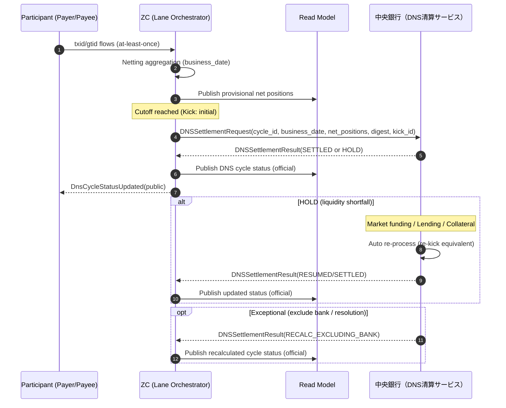

- **ZC→中央銀行** への依頼は、参加主体別ネットポジション（純支払/純受取）と根拠（digest/参照証跡）を添えて行う。
- DNS清算結果（SETTLED/HOLD/RECALC等）は、ZCがFinality Logに証跡化し、Read Modelへ反映する。

#### 9.4.3 DNS HOLD（中断）の実体と扱い（規範）

> **設計規範（DNS HOLD＝重大事象の扱い）**  
> DNS HOLDは、参加主体の資金手当て（市場調達／貸付／担保）を要する重大事象であり、**当局・中央銀行・ZC・資金不足を起こした負け参加主体**で緊急連絡（電話/会議）を開始する。  
> ただし、**緊急会議の対象は「資金不足を起こした負け参加主体のみ」**であり、その他参加主体は**公式ステータス/公式発表**に従う（原因行の推測・照会を誘発しない）。


- **HOLDの実体** ： **中央銀行側に参加主体が預けている当座預金（預け金）残高不足** 等により、清算が完了できない状態として表現する。
- **原則は即日解消** ：負け参加主体は市場調達・貸付・担保等により当日中の解消を目指し、中央銀行は解消検知後に自動再処理する。
- **翌日持越しは例外** ：当日解消不能（＝貸付不可等）に至る場合、
  - 中央銀行は当該参加主体をDNSサイクルから除外し、精算額を再計算（RECALC_EXCLUDING_BANK）
  - 当該参加主体は前日から継続するH（担保拘束）を維持し、担保処分・破綻対応フェーズへ接続する
  - 破綻対応フェーズでは、公的資金供給等により最終精算（H精算）へ収束させる
- **顧客要望への対応** ：HOLD中に“決定をなかったことにする取消”は監査・顧客対応を破綻させるため禁止する。顧客の「やめたい」要望には、**取消ではなく救済（Return/Reversal）**で応答し、`CUSTOMER_CANCEL_REQUESTED` を状態化して次サイクルの救済へ接続する。

#### 9.4.4 事務必須のDNS照会（当日勝ち負けの把握）

参加主体は当日DNSについて、以下を **Query API** で取得できることを規範とする（事務が回るための必須要件）。

##### (A) 全参加主体（公式ステータスに一致）
- `GET /api/dns/{business_date}/position`（応答の項目名は `32_api_contracts.md § GET /api/dns/:business_date/position` を正とする）
  - ネットポジション（+受取/−支払）
  - グロス送信／グロス受信（参考）
  - `as_of` / `watermark`（鮮度）
- `GET /api/dns/{business_date}/status`
  - サイクル状態（値域は `src/types/states.ts#DnsState` を正とする：`OPEN` / `KICKED` / `SETTLED` / `HOLD_ACTIVE`。サイクル未生成時の特例値 `NOT_STARTED` を含む応答契約は `32_api_contracts.md § GET /api/dns/:business_date/status`）
  - `hold_reason` の**類型のみ**（下記の規範。不足額の内訳は載せない）
  - `public_message_id`（公式発表と突合するID）
  - `next_action_hint`（待機・再照会時刻等）

> **規範（値域の混同禁止）** ：`RECALC_EXCLUDING_BANK` は**サイクル状態ではない**。これは中央銀行が返す清算結果（`DNSSettlementResult`）の種別であり（§9.4.2 のシーケンス図・§9.4.3）、ZC 側のサイクル状態は上記 4 値に閉じる。除外再計算の結果は、再計算後のネットポジションと新しいサイクル状態（`KICKED` / `SETTLED` / `HOLD_ACTIVE`）として観測する。

> **規範** ：このレベルの照会は、**公式発表・公式ステータスと完全一致**させる。原因行の特定や不足額など、風評・市場混乱を誘発しうる情報は返さない。

> **規範（`hold_reason` の粒度）**：`hold_reason` は「なぜ止まっているか」の**類型**（現行の実値は `BOJ_INSUFFICIENT_FUNDS`）までとし、**原因行の特定情報と不足額の内訳を全参加主体向けの `status` に載せてはならない**。当事者はこれらを §9.4.4 (B) の `hold_detail`（閉域）から取得する。`public_message_id` は HOLD 突入時に採番し（`DNS_HOLD_{business_date}`）、解消・清算完了で NULL に戻す。
>
> **注意（`DnsCycles.hold_reason` 列はスカラーではない）**：同列は `{reason, shortfalls}` の **JSON** であり、`shortfalls`（参加行別の不足額）を含む。すなわち**列そのものが閉域情報を抱えている**ため、`status` 応答へ列の値をそのまま透過してはならない——載せてよいのは `reason` の類型だけである（`31_schema.md § DnsCycles`）。

> **未充足**：`as_of` / `watermark`（鮮度）はネットポジション照会に付与されず、`next_action_hint` は取引照会（`GET /api/transactions/:txid`）にのみ付く——いずれも DNS サイクル照会には無い（応答の実形は `32_api_contracts.md § GET /api/dns/:business_date/position`）。**本節の規範は「事務が回るための必須要件」として書かれているため、この差分を充足済みとして扱ってはならない**。`30_internal_design.md` 第10章 Roadmap で追跡する。

##### (B) 資金不足を起こした負け参加主体（閉域：当局/中央銀行/ZCと共有）
- `GET /api/dns/{business_date}/hold_detail`（閉域認可がある場合のみ。契約は `32_api_contracts.md § GET /api/dns/:business_date/hold_detail`）
  - `shortfall_amount`（不足額）
  - `collateral_call_amount`（必要担保）
  - `recommended_actions`（市場調達／貸付申請／担保差入）
  - `contact_channel`（緊急連絡経路）

ZCは照会結果に **next_action_hint** を必ず付与し、オペレーションを定型化する。

> **規範（閉域統制：本照会に固有の 4 点）** 契約は `32_api_contracts.md § GET /api/dns/:business_date/hold_detail`。
> 1. **拒否は常に 404**：目的コード欠落／主体不明／当日 HOLD 無し／当事者でない参加行——4 つすべてが**同一の 404 本文**を返さなければならない。`403` は「無い」と「見せない」を区別してしまい、**「あの行は今日ショートしているのか」という取り付けの引き金そのものを答えてしまう**。
> 2. **目的コードが無ければ実時間で遮断**する（`10_requirements.md` §3.3.2.2.1）。事後監査ではなく遮断が規範であり（同 §3.3.2.2.1.1-2）、`DataAccessViolationDetected` を GLOBAL チェーンへ記録する。
> 3. **許可した読み取りも記録する**（`ClosedDomainAccessGranted`）。原因行の特定情報と不足額は ZC が提供する中で最も機微であり、「誰が・どの目的で・いつ見たか」を残す。
> 4. **正当な非当事者を違反として記録しない**：目的コード付きで照会した無関係の参加行は 404 を受けるが、違反ログには載せない——本物の違反が埋もれるため。


#### 9.4.4.1 DNS HOLD時の照会：レーン別の応答規範（規範）

DNS HOLDは「精算サイクル」の状態であるため、 **元取引（txid/gtid）の応答** はレーンにより変わる。

##### (A) 高額即時レーン（IGS）でのHOLD（元取引がSUSPENDED）
- `GET /api/transactions/{txid}`
  - `state: SUSPENDED`
  - `reason_code: IGS_FAILED`（値域は `32_api_contracts.md § 状態 reason_code`）
  - `decision: DECIDED_TO_SETTLE`（決定済み）
  - `execution.a: OK`（a_HV成立済み）
  - `execution.b: NONE`（入金未了）
  - `next_action_hint: WAIT`（`next_action_hint` は窓口の定型文言に 1:1 対応する閉じた 4 値であり、事象ごとに新しい値を作らない——値域は `30_internal_design.md` §13.6 が正）
  - `public_message_id: IGS_HOLD_{business_date}`（公式発表と突合。IGS リングフェンスで止まった HIGH_VALUE にのみ付与する）

> **規範（HOLD と不成立を `reason_code` で見分けようとしない）**
> 中銀決済が **HOLD**（一時的な流動性不足。再試行で解消しうる＝「待てば済む」）で返っても、
> **不成立**（＝「待っても済まない」）で返っても、取引に付く状態 `reason_code` は同一の
> `IGS_FAILED` である。両者は顧客に対して**正反対の説明**を要求するにもかかわらず、
> `reason_code` はその区別を運ばない。
>
> したがって窓口の分岐は **`external_settlement` フィールド**で行う（規範）——
> `{status, retriable}` を返し、`retriable=true`（`HOLD` / `TIMEOUT`）なら「待てば進みうる」、
> `false`（`FAILED`）なら「待っても済まない」である。`reason_code` を見て「失敗した」と説明しては
> ならない。
>
> **`retriable` を ZC 側で導出する理由（規範）**：清算状態から「待って意味があるか」への写像は
> スキームルールであり、参加行ごとに実装させると**危機時の答えを取り違える機会が参加行の数だけ
> 生まれる**。導出は一箇所に置く。
>
> **中銀の生の失敗理由は運ばない（規範）**：`IgsRequests.failed_reason` は相手方の不足を名指しし得る
> ため、閉域（§9.4.4 (B)）に留める。本応答が返すのは類型（`status`）と分岐（`retriable`）までである。
>
> `public_message_id` は引き続き公式発表テンプレとの突合キーとして併記されるが、
> **窓口の分岐根拠ではなくなった**——「無関係な事実からの推論」に危機時の説明を賭けない。

##### (B) 通常レーンのDNS HOLD（元取引はSETTLED）
- `GET /api/transactions/{txid}`
  - `state: SETTLED`（完了）
  - `execution.a: OK` / `execution.b: OK`
  - `dns_settlement_status: HOLD_ACTIVE`（参考情報として付与可）
  - `next_action_hint: WAIT` かつ `next_retry_at: null`（**終端であること自体は `state: SETTLED` が示す**。「完了」を表す専用の hint 値は作らない——値域は `30_internal_design.md` §13.6 が正）

> **規範** ：通常レーンの取引について、DNS HOLDを理由に「取引未完了」と表示してはならない。

#### 9.4.4.2 公開メッセージIDと推奨表示テンプレ（参加主体→顧客）

ZCは顧客へ直接表示せず、参加主体に `public_message_id` を提示する。
参加主体は顧客向け表示において、 **原因（資金不足等）を断定する表現を避け** 、公式発表に整合させる。

> **規範（ZC が担保する範囲の限界）** サイクル状態には `DNS_HOLD_{business_date}`、IGS で止まった HIGH_VALUE には `IGS_HOLD_{business_date}` が付き、参加主体はこの ID に対応する事前承認テンプレへ顧客表示を限定する。**テンプレ本文そのものの承認・配布は制度側の手続**であり、ZC が担保するのは「どのテンプレを使うべきか」の機械可読な指示までである。この線を越えて ZC が顧客向け文面を配信することはしない。

- 推奨テンプレ（例）
  - 「○○銀行への振込は、障害により一時中断しております。」
  - 「ただいま処理状況を確認しております。しばらくしてから再度ご確認ください。」
  - 「本件は決済処理の都合により遅延しております。完了次第お知らせします。」

- 禁止例
  - 「○○銀行は資金不足です」
  - 「○○銀行が負けています」

> **規範** ：顧客向け表示は、原因行の推測・取り付け騒ぎ等を誘発しうる文言を避ける。


### 9.5 高額即時レーン結果の再照合
- ExternalSettlement Adapterは結果（完了/未了）を再取得可能であること。  
- ZCはRead Modelを再構築し、取引ごとに「決定済み/実施未確定」の説明状態を維持する。  
- 返し決済（高額即時レーン）は別ID・別証跡で記録し、元取引の履歴を書き換えない。

### 9.6 RTO/RPO（提出用の枠）
- 数値は制度・RFPで確定するが、枠として以下を固定する：  
  - RPO：Finality LogはRaftコミットを唯一正とし、コミット済みは消えない。  
  - RTO：Read Modelはログから再構築できることをもって復旧要件を満たす。


## 第10章 運用設計（監視・エスカレーション・事務対応／SLA・障害対応Runbook／CASE運用テンプレ）

> **要旨**  
> 本章では、監視・エスカレーション・事務対応をCASE中心に組み立て、電話とExcelに依存しない運用を設計する。照会メタ情報（as_of/watermark/next_action_hint）、Runbookの分岐固定、CASE自動収束やCircuit Breakerなど、現場を回すための仕組みをまとめる。


### 10.1 運用の基本方針（規範）
- 例外・遅延・未応答・不整合を「人が読むログ」ではなく **状態＋ワークフロー** で収束させる（事務レス）。  
- そのために、CASEが中心概念となる（第3章）。

### 10.2 監視（SLO/SLAの扱い）
- 絶対表現（所定水準）は採用しない。SLO（目標）とSLA（保証）を分離。  
- SLA逸脱は自動エスカレーションと理由コードを付し、事務処理を定型化。

### 10.3 エスカレーション（規範）
- 重大障害は「取引影響（件数/金額/レーン）」「安全弁（H）への影響」「当局連携要否」で分類。  
- 連絡系統：ZC運用→参加行運用→当局連絡→広報対応をテンプレ化。

### 10.4 事務対応（窓口・コールセンター）
- 照会画面は Decision/Execution/a/b を分離し、理由コードと次アクションを提示。  
- 取消（CANCELLED）・失敗（FAILED）・救済（REVERSAL）は表示文言を固定し、誤認を防ぐ。  
- RTPのAttempt履歴（`PR-RTP-ATTEMPT-MAX` 回まで）を照会可能にし、現行運用との整合を取る。

#### 10.4.1 参加主体の事務が回るための照会メニュー（最低限）
参加主体（銀行）がZCと接続する以上、 **日々発生する事務は「照会で回る」ことが必須** である。最低限、以下はZC照会（Query API / Dashboard）で提供する。

- **取引照会（txid/gtid/rtp）** ：Decision／a／b、理由コード、次アクション、鮮度（as_of/watermark）、次リトライ（next_retry_at）
- **H状況照会** ：H_reserved/H_locked の推移、超過回避のための見通し
- **DNS照会（当日）** ：ネット勝ち負け（純受取/純支払）、サイクル状態（OPEN/KICKED/SETTLED/HOLD_ACTIVE）、HOLD理由
- **未収束一覧** ：SUSPENDED、AUTHORITY_WAIT、PROOF_MISMATCH、DLQ等
- **加盟店/PSPR照会（Express）** ：pspr_refの有効期限、受入可否、失効理由

> **規範** ：運用担当者が「電話とExcel」で追跡し始めた時点で事故は拡大する。照会とCASEで閉じる。


#### 10.4.1.1 照会メタ情報（as_of / watermark / next_action_hint / next_retry_at）【規範】

照会（Query API / Dashboard）は、 **「取引の状態」そのもの** （Decision/a/b/証憑）を返すだけでなく、
運用・窓口が不安にならないように、 **“見えている情報の鮮度と、次に何をすべきか”** を明示する。

> 重要：これらは「曖昧にするための項目」ではない。
> **最終的整合（Read Modelの遅れ）を許容しつつ、説明責任をむしろ強化するための項目** である。

| 項目 | 意味（事務向けに一言） | 規範（どう使うか） | 代表例 |
| --- | --- | --- | --- |
| `as_of` | **この表示が“いつ時点”のものか** （画面の鮮度） | 画面・帳票の脚注として必ず出す。照会回答の「今の状況」を固定する。 | `2026-01-17T12:34:56+09:00` |
| `watermark` | **どこまでログ反映できているか** （反映位置） | 監査・再現性のために返す。複数チェーン（シャード）にまたがる場合は `watermark_detail.shards` に“複数”を返す（キー書式は `30_internal_design.md` §13.6）。 | `{"TX:TX-2026-0001": 12345, "GT:GTID-7": 67890}` |
| `next_action_hint` | **次に取るべき行動** （定型応対の根拠） | 窓口・コールセンターはこれを“テンプレ回答”に変換して返す（文言固定）。**閉じた 4 値**であり、事象ごとに新値を作らない（値域の正は `30_internal_design.md` §13.6、実装は `src/types/api/transfers.ts#QueryResponse`）。事象固有の含意は `reason_code` が担う。 | `WAIT` / `RETRY_LATER` / `CONTACT_PAYER_BANK` / `OPEN_CASE` |
| `next_retry_at` | **次に照会すべき時刻** （過剰照会を防ぐ） | 連続照会を抑止し、CASE爆発・電話増加を防ぐ。再試行の最短時刻として扱う。 | `2026-01-17T12:36:00+09:00` |

##### 10.4.1.1.1 事務の安心ポイント（誤解を防ぐための規範）

- `as_of` が古い＝取引が危ない、ではない。
  - **Decision（Raftコミット）と証憑（bank_proof_ref）は不変** であり、Read Modelの遅延は“表示の遅れ”に過ぎない。
- `watermark` は“内部の難しい数値”ではなく、監査用の **説明材料** である。
  - 窓口が顧客に説明する必要はない（監査・運用の再現性のために保持する）。
- `next_action_hint` は「担当者の経験」に頼らず、 **設計で固定した分岐（Runbook）** に沿って案内するための鍵である。
- `next_retry_at` は“いつまでに終わる”の確約ではない。
  - ただし、 **この時刻より前に再照会しても状態が進まない** ことを意味する（無駄な照会・電話を止める）。

##### 10.4.1.1.2 窓口回答のテンプレ（例）

- `next_action_hint=WAIT` の場合：
  - 「処理は進行中です。次の更新見込みは **{next_retry_at}** です。更新後に再度ご確認ください。」
- `next_action_hint=CONTACT_PAYER_BANK` の場合：
  - 「支払側の確認が必要です。支払側金融機関へお問い合わせください。」
- `next_action_hint=OPEN_CASE` の場合：
  - 「例外処理に入りました。受付番号 **{case_id}** で対応状況を確認できます。」

> **規範** ：運用担当者が “次にどうすればよいか” を迷う余地を残さない。

#### 10.4.2 帳票・データエクスポート（監査・分析のための規範）
参加主体は、事務・監査・経営のために一定のデータ抽出が必要となる。ZCは個人情報の最小化を前提に、以下の提供を規範化する。

- **CSV/Parquetダウンロード（期間指定）** ：自社起因の取引、相手先内訳、理由コード分布
- **集計ビュー** ：銀行別の件数/金額（受取/支払）、RTP成功率、Bulk成立率、H逼迫回数
- **監査用パッケージ** ：決定証跡（decision_proof_ref）と証憑参照（bank_proof_ref）の突合せ一覧

> **注意** ：他行の個別顧客情報は開示しない。必要な範囲は「自社起因＋統計化」で提供する。

#### 10.4.3 H（仕向超過限度）のモニタリングは必須か
必須である。Hは本システムの **安全弁（絶対超過禁止）** であり、超過の兆候が見えない設計は運用破綻する。

- モニタリング対象：`H_reserved` / `H_locked` / 解放待ち（FAILED_EXECUTION等）
- アラート：閾値超過ではなく「逼迫率」と「滞留時間」で出す
- 事務導線：逼迫→優先度調整（Bulk）→CASE起票→関係先連携

### 10.5 運用操作の統制（4眼・証跡）
- cap変更、circuit breaker、強制停止/再開、誤記録訂正は4眼承認＋evidence_ref必須。  
- 実施者単独で不可とし、内部監査・当局への説明に耐える。

### 10.6 インシデント時の対外説明（説明骨子）
- 何が起きたか：Decision/Executionのどちらの軸で遅延・未確定が生じたか  
- 利用者影響：a/bのどこまで到達しているか  
- 安全性：H超過は起きていない（または安全側に凍結）  
- 復旧見込み：SLO/SLAと再構築方針（ログから復旧）  
- 再発防止：運用操作・監査証跡に基づく改善計画


### 10.7 CASE自動収束（大量頻発を前提とした規範）

CASEは「人手のチケット」ではなく、 **例外を自動で収束させるワークフロー** として扱う。
大量に起票される前提で、必ず以下を備える。

#### 10.7.1 CASE分類（Auto-Resolvable / Auto-Progress / Manual-Only）

| 区分 | 趣旨 | 代表例 | 原則 |
| --- | --- | --- | --- |
| Auto-Resolvable | 自動で解決して閉じる | 一時通信障害、重複受信、Read Model遅延 | 自動Closeがデフォルト |
| Auto-Progress | 自動で進展するが時間待ち | 夜間停止、相手証憑待ち、DNS HOLD | next_retry_atで“待ち”を管理 |
| Manual-Only | 判断が必要なものだけ人手 | 不一致（Misrecord）、法令凍結、争訟 | ごく少数派に隔離 |

#### 10.7.2 CASE集約（チケット爆発を防ぐ規範）

- 同一原因（例：Adapter停止）で多数txidが発生しても、
  **CASEは1件（障害CASE）に集約し、txidは関連付け** で管理する。
- 集約キー：`CAUSE:{cause_party_id | detection_path}:{reason_code}`

集約の入口は `src/zc/cases/case.ts#openOrAggregateCase` である。同一の集約キーを持つ
**未解決**（§10.7.2.1）の CASE が既に在れば、新規起票せずに当該 CASE へ関連付ける。
関連付けの内訳は `CaseRelatedTransactions`、件数は `Cases.occurrence_count`、最終発生
時刻は `Cases.last_occurred_at` が保持する（`31_schema.md` § Cases）。

- **原因主体が未特定のときは検出経路を鍵に用いる**：原因主体（`cause_party_id`）が
  検出時点で判らない場合、集約キーの当該要素には検出経路（`detection_path`）を用いる。
  「判らないから集約しない」とすると、**最も件数を生む障害**（Adapter 不通、監査チェーン
  破断）がちょうど集約から外れる。原因主体が事後に特定された場合は、当該識別子へ
  置き換えたうえで CASE を分割してよい。
- **原因主体も検出経路も無い起票は集約しない**：`CAUSE::{reason_code}` を鍵にすると、
  原因の判らない CASE が理由コードだけで束ねられ、「1 原因 1 件」ではなく
  「1 単語 1 件」になる。当該 CASE は単独で立てる。
- **件数は取引の数であって検出の数である**：`occurrence_count` の増分は
  `CaseRelatedTransactions` への行挿入が成功した場合に限る。同一 txid の再検出（再送・
  スイープの再走）で件数を動かしてはならない——動かすと、下記 §10.7.2.2 の件数閾値が
  被害の広がりではなく再送量を測ることになり、閾値の意味が失われる。

##### 10.7.2.1 「既に起票済みか」の判定（規範）

集約は「同じ原因の CASE が既に在るか」を問う判定に依存する。この判定の基準は
**未解決**であり、その値域は **`OPEN` / `IN_PROGRESS` / `ESCALATED` の 3 値**である
（`RESOLVED` だけが「対処済み」を意味する）。

> **規範**：重複判定に `OPEN` のみ、または `OPEN`/`IN_PROGRESS` のみを用いてはならない。

これは保守的な近似ではなく、**必ず破れる**判定である——§10.7.4 の昇格スイープは
`PR-CASE-SLA` の経過とともに CASE を `OPEN`/`IN_PROGRESS` から必ず外す。したがって
`ESCALATED` を含まない判定は、**ちょうど 1 SLA 期間で一致しなくなり**、以降スイープの
たびに同じ原因の CASE を起票し続ける。しかも SLA 期間を生き延びる原因は重大なもの
（監査チェーン破断・所有権の乖離など）に偏るため、**最も人が見ている案件が最も重複する**。
「人手が増えないことを、誰も見ないことで達成してはならない」（§10.7.4）の裏返しで、
**人が見ている案件を、機械が水増ししてはならない**。

判定の値域は実装上も一箇所に閉じる（`src/zc/cases/case.ts#UNRESOLVED_CASE_STATES`。
各所での手書きを `test/invariants/case_dedup.test.ts` が機械検査する）。
昇格スイープ自身（`OPEN`/`IN_PROGRESS` のみを昇格対象とする）と GTID 収束時の自動 Close
（`ESCALATED` を自動で閉じない＝人の判断を機械が取り消さない）は、**意図的に狭い**
別の述語であり、その理由を同ファイルに併記する。

##### 10.7.2.2 二次エスカレーション（人が持っている CASE の膨張を可視化する規範）

§10.7.2.1（`ESCALATED` も未解決として集約先にする）と §10.7.4（`ESCALATED` を自動 Close
しない）は、いずれも単独では正しい。両者の交点に死角がある——**人が CASE を持っている間、
同一原因の新規発生は既存 CASE へ関連付けられるだけで、CASE 件数にも状態にも現れない。**
被害が 10 件から 10,000 件へ広がっても、系の側では何も変わらない。

> **規範**：`ESCALATED` の CASE について、次のいずれかが成立したら、**状態を変えずに**
> あらかじめ定めた通知先へ再度通知する（二次エスカレーション）。
>
> - `occurrence_count` が `PR-CASE-SECONDARY-COUNT`（既定 100 件）を超えた——原因の広がり
> - `last_occurred_at > escalated_at`——**人を呼んだ後もなお発生し続けている**

- **状態を変えない**：`ESCALATED` は既に終端の処理状態であり、さらに昇格させても意味が
  無い。`OPEN` へ戻すのは §10.7.4 が呼んだ人の判断を機械が取り消すことになる。emit する
  のは事実（`EntityStateLog` の `CaseSecondaryEscalated`、`state_from = state_to`）のみで
  あり、通知の実行はこのログを購読する側が行う。
- **`escalated_at` は昇格時に打刻し、以後動かさない**：判定は「人を呼んだ後も発生して
  いるか」を問うものであるから、基準は行の最終更新時刻ではなく呼んだ瞬間でなければ
  ならない（§10.9 の保留開始時刻列と同じ理由による）。
- **再通知は新規発生があったときだけ**：`last_notified_at` 以降に `last_occurred_at` が
  進んだ場合に限る。広いが静かになった CASE を毎スイープ通知すると、二次エスカレーション
  自体が §10.7.2 の防ごうとしているノイズになる。

実装は `src/zc/cases/case.ts#sweepSecondaryEscalations`、駆動は timeout sweep の第19段。
検査は `test/zc/case_aggregation.test.ts`。

#### 10.7.3 Circuit Breaker（再送嵐を止める規範）

- Adapter疎通不能を検知したら、該当参加行向けの実行要求を停止し、
  `SUSPENDED` + `reason_code=SUSPEND_ADAPTER_DOWN` で束ねる（`32_api_contracts.md § 状態 reason_code`）。**「相手が拒否した」失敗（`EXEC_DEBIT_FAILED` / `EXEC_CREDIT_FAILED`）と同じ値に落としてはならない**——両者を区別できないと、1 行の不通が実行失敗 CASE を大量に生み、§10.7.2 の集約が効かなくなる。
- 復旧検知後は、段階的に再開（レート制限）し、DLQを増やさない。

##### 10.7.3.1 ブレーカー状態モデル（規範）

| 状態        | 意味                                                | 遷移トリガー                                           |
|-------------|----------------------------------------------------|---------------------------------------------------------|
| `CLOSED`    | 通常運転                                            | 連続失敗 N 回（既定 5 回） → `OPEN`                      |
| `OPEN`      | 全リクエスト即拒否                                  | クールダウン経過（既定 30 秒） → `HALF_OPEN`             |
| `HALF_OPEN` | 限定数のリクエストのみ通過させ、成否で判定          | 成功 → `CLOSED` ／ 失敗 → `OPEN`                         |

##### 10.7.3.2 観測指標（規範）

参加行ごとに以下のカウンタを保持する（`31_schema.md` § CircuitBreakerState）：
- `total_requests` / `total_successes` / `total_failures` — 累計
- `total_denied` — `OPEN` 状態で拒否した数（ホストの呼出抑止効果の計測）
- `half_open_inflight` — `HALF_OPEN` 中の進行中呼び出し数
- `last_success_at` — 直近成功時刻（復旧監視）

##### 10.7.3.3 運用 API（規範）

- `GET /api/circuit-breaker` — 全行の状態 + メトリクス一覧（OPS ダッシュボード用）
- `GET /api/circuit-breaker/:bank_id` — 個別行の詳細（未登録なら初期値 `CLOSED` を返す）
- `POST /api/circuit-breaker/:bank_id/reset` — 強制 `CLOSED` リセット。4 眼制御の対象とし、操作者 ID と理由を `BankAuditLog` に残す。

#### 10.7.4 自動Close条件（規範）

- 同一idempotency_keyの再処理により状態が進展した場合、CASEは自動Closeしてよい。
- **期限（`sla_deadline`）を超えても `OPEN` / `IN_PROGRESS` のままの CASE は、`ESCALATED` へ昇格させる**（Auto-Progress → Manual-Only）。判定は定期スイープが行い、期限は起票時に必ず設定する（§10.10.2）。
  - **昇格は「解決」ではない**：`ESCALATED` は「人が見る必要がある」を意味し、CASE を閉じない。
  - **昇格は取引の状態に触れない**：CASE のライフサイクルと決済のライフサイクルは別軸である（§3.6）。

> **規範** ：CASEが増えるのは正常。人手が増えるのは異常。
> ただし**「人手が増えない」を「誰も見ない」で達成してはならない**——期限を持たない CASE は
> 昇格判定から落ちるため、統計上は人手ゼロに見えて実際には放置されている。期限の設定は
> この規範の前提条件である。

### 10.8 参加行制約と例外収束（バッチ遅延／二重送信／夜間停止／Adapter不通）【規範】

参加行の勘定系・運用制約は現実として存在する。ZCはそれを前提にしつつ、
**状態・証跡・次アクションで曖昧さなく収束** させる。

#### 10.8.1 「a証憑をバッチ後にしか出せない」場合

- **許容レーン** ：Standard / Bulk（許容）
- **非許容レーン** ：Express / 高額即時レーン（不可）

規範：a証憑が遅延する場合、取引は `DECIDED_TO_SETTLE` のまま **a未確定** として扱い、
`reason_code=SUSPEND_EXEC_TIMEOUT`（T2 タイマの満了。§3.3.1）、`next_action_hint=WAIT`、`next_retry_at` を返す。

> Express/高額即時は「aを同期確定できる参加行のみ提供可」とし、Capability Registryで制御する。

#### 10.8.2 「勘定系が二重送信してくる」場合

規範：配送はat-least-once前提であり、 **二重送信は正常系の一部** として吸収する。

- COMMAND重複：同一 `idempotency_key` は同一要求として扱い、副作用は1回のみ。
- EVENT重複：同一 `bank_proof_ref`（または同一digest）は重複として無害化する。
- 内容不一致：同一txidで内容が異なる場合は `PROOF_MISMATCH` としてCASEへ接続する。

#### 10.8.3 「夜間バッチ停止中のStandard処理」

規範：入口（受領）は可能だが、Executionは停止する。状態は明確に保留する。

- 遷移：`PRECHECKED → PRECHECKED_SUSPENDED`
- `reason_code=COUNTERPARTY_WINDOW_CLOSED`（相手行の稼働ウィンドウ外。復帰スイープがこの値を鍵に再開する）
- `next_action_hint=RETRY_LATER`
- `next_retry_at=バッチ明け時刻`

#### 10.8.4 「Adapterが落ちたまま復旧しない」場合

規範：曖昧なまま放置しない。Decision前はCancel収束、Decision後はCASE＋補償で収束する。

- Decision前（RECEIVED/PRECHECKED/H_RESERVED）：`DECIDED_CANCEL → CANCELLED`（自動解放）
- Decision後（DECIDED_TO_SETTLE以降）：
  - `SUSPENDED` + `reason_code=SUSPEND_ADAPTER_DOWN` へ
  - 期限超過で `FAILED_EXECUTION` へ昇格
  - 収束は **補償（Reversal/返し決済）** または **未実行証明（NoDebitRecordedProof）** で行う

> **規範** ：Decision後の失敗を“取消”にすり替えない（監査・顧客説明が破綻する）。


### 10.9 SLA・障害対応Runbook（Operations & Resilience Runbooks）

#### 10.9.1 SLI/SLO（レーン別）

| レーン | SLI | 目標SLO（例） | 算定母集団（SoT） | 証跡 |
| --- | --- | --- | --- | --- |
| Standard | end-to-end latency | p99 ≤ X秒 | Finality Log（b到達） | 指標ログ + 日次集計 |
| RTP | acceptance-to-b latency | p99 ≤ Y秒 | Finality Log（b到達） | 状態遷移ログ |
| Bulk | completion time | 期限内完了率 ≥ Z% | Bulk Window Close | バッチ証跡 |
| DNS | cycle close time | サイクル閉鎖 ≤ T | DNS Cycle Close | DNS証跡 |

※数値（X,Y,Z,T）は `PR-SLO-STANDARD-P99` / `PR-SLO-RTP-P99` / `PR-SLO-BULK-COMPLETION` / `PR-SLO-DNS-CYCLE-CLOSE` として `30_internal_design.md` §12.9（PR-* パラメータ台帳）で固定し、変更時は **evidence_ref** と周知を必須とする。

##### 10.9.1.1 算定式（規範）
- latency：`b_timestamp - received_timestamp`（`received_timestamp` は ZC Ingress の受理時刻）
- availability：`1 - (error_budget_breach_minutes / total_minutes)`（算定はレーン別）
- Read Model 健全性：`inconsistency_rate = inconsistent_reads / sampled_reads`
- DNS cycle：`cycle_close_timestamp - cycle_open_timestamp`

> **規範**  
> SLIは必ず **Finality Log（SoT）** と突合可能な形で算定する。Read Modelのメトリクスは補助であり、SoTの代替にしてはならない。


#### 10.9.2 監視・アラート（最低限）
- backlog（未確定滞留）、DLQ増、再送率、署名失敗率、Read Model不一致率、quorum状態、外部接続（Adapter）遅延
- 閾値超過時はIncidentを自動起票し、 **Commander** / **Comms** / **Tech** / **Legal** を同時召集する。

##### 10.9.2.1 重大度（Severity）分類（運用規範）
- Sev-1：Finality Log 書込不能、quorum割れ継続、DNS Cycle Close不能、広域影響の署名異常
- Sev-2：特定レーンのSLO継続逸脱、Read Model広域劣化、外部Adapterの結果不確定が増大
- Sev-3：一部参加者の不適合、局所障害（隔離で封じ込め可能）

#### 10.9.3 Runbook

##### 10.9.3.0 共通フォーマット（必須）
各Runbookは、公開版では『運用手順書』ではなく『設計上の収束戦略』として記述する。最低限、以下を含む。
- 発火条件（Trigger）／検知（Detection）／初動（初期対応）
- 役割： **Commander** / **Comms** / **Tech** / **Legal** / **Participant Liaison**
- 収束戦略：状態遷移の方針、判断分岐（Go/No-Go）、段階的な復帰方針
- 成功判定（Success Criteria）
- 証跡（Evidence）： **incident_id** 、タイムライン、発行イベント、関連 **proof_ref** 、顧客表示ログ


##### 10.9.3.1 DNS_HOLD（System Runbook：証跡採取・通知・表示）

<!-- SoT: Annex / References: （本文表示は省略） -->

**対象** ：本書 2.4 類型B（DNS HOLD）および 制度の DNS_HOLD 規程・運用プロトコル（`10_requirements.md` 第3章）。

**運用骨格**
- 検知→ **incident_id** 採番→状態遷移（`DNS_HOLD_REQUESTED` → `DNS_HOLD_ACTIVE`）→解消（`DNS_RESUMED`）を、 **単一路線の証跡** として固定する。
- HOLD中はDNS関連の新規 **Decision** を停止し、受付中の取引は `SUSPENDED` 系状態に収束させる（取消は原則禁止、救済はReversal/CASEとして扱う）。
- 制度上の初動連絡・公表統制・顧客表示の規範は `10_requirements.md` 第3章（制度・ガバナンス要件）を正とする。本書ではフェーズ移行に伴う **開始/終了イベント** の記録（方式・証跡）のみを扱う。
- 顧客表示は、`public_message_id` に対応する定型文に限定し、原因断定・参加者名・定量情報の露出を抑制する。
- 再開時は「サイクル順→取引時刻順→同一取引の因果順（correlation/causation）」の順序制約を守り、Read Model を再構築する。

- カットオフ後の少額DNS取引は当該サイクルに追加計上せず、`scheduled_cycle_id=next_cycle` として繰延計上する（受付継続）。対外説明は「受付済み（次サイクル計上）」に固定する。
- IGS（高額即時）は `igs_mode` により制御する（優先クラス分類は設けない）。段階遷移（NORMAL/STOP/RINGFENCED/RINGFENCED_PLUS）と Accept 条件の規範は §2.4 を正とし、本節はその Runbook 適用に限る。
  - `NORMAL`（平時）→ HOLD 宣言で `STOP`（初動）→原因行集合確定で `RINGFENCED` → リザーブ算定が説明可能な形で成立したら `RINGFENCED_PLUS` → 解消で `NORMAL`
  - Accept条件（例）は本書 2.4 に従う。拒否ではなく Defer を原則とし、`scheduled_execution_window` を付与する。
- `dns_recovery_reserve` はZCが算式に基づきリアルタイム自動算定し、`reserve_explain_hash` と `reserve_confidence` を必須で証跡化する。


**Success Criteria**
- DNS Cycle Close が収束し、`DNS_RESUMED` 後の未確定残高が0に収束
- 顧客表示が規範通り（誤原因表示なし）
- 監査用証跡が一貫（ **incident_id** により全イベントが連結）

**Evidence**
- `igs_mode` の変更履歴（NORMAL/STOP/RINGFENCED/RINGFENCED_PLUS）
- `dns_recovery_reserve` / `reserve_explain_hash` / `reserve_confidence`
- IGSのDefer件数・実行件数・スロットリング適用状況（集計参照ID）
- カットオフ後の繰延計上（`scheduled_cycle_id`）件数（集計参照ID）
- `incident_id`
- 状態遷移イベント：`DNS_HOLD_REQUESTED` / `DNS_HOLD_ACTIVE` / `DNS_RESUMED`
- 不足額・件数等の算定根拠ダイジェスト（参照ID）
- 対外表示ログ（参照ID）
- 閉域連絡ログ（参照ID）


##### 10.9.3.2 署名異常（Signature Anomaly：攻撃/運用逸脱の切り分け）

**目的** ：署名検証の異常を『参加者単独の運用逸脱』『複数参加者に跨る系統障害』『特定メッセージ型に偏る改ざん/再送異常』として切り分け、 **安全側へ収束** させる。

**収束戦略**
- 異常のスコープ（参加者×レーン×メッセージ型）を確定し、影響範囲を限定する。
- 影響範囲の新規Decisionを停止し、受付は `SUSPENDED` へ収束させる（Read-only/隔離の選択肢を持つ）。
- 原因が確定しない段階での対外説明は `public_message_id` による定型に限定し、原因断定を禁止する。

**Success Criteria**
- 署名検証異常が収束し、再開しても再発しない
- 改ざん疑義が解消、または捜査/当局連携へ適切に移管

**Evidence**
- `incident_id`
- 失敗率/対象/時刻/型のダイジェスト（参照ID）
- 隔離/遮断の操作ログ（参照ID）
- 鍵イベント（参照ID）


##### 10.9.3.3 quorum割れ・split-brain（Read-only 遷移の運用）

**Trigger**
- quorum未達（過半数合意が成立しない）
- shard間でリーダが二重化（split-brain兆候）

**収束戦略**
- 自動で書込停止（`READ_ONLY_ENTERED`）へ遷移し、確定点を固定する。
- 影響範囲（どの txid/gtid 範囲が未確定か）を確定し、再同期の単位を明確化する。
- 最終確定点（Finality Log の確定済み範囲）を基準に単一リーダへ収束し、欠落分をSoTから再適用して整合を回復する。
- 整合性サンプルが合格した段階で `READ_ONLY_EXITED` を発行し、段階的に書込を再開する。

**Success Criteria**
- 単一リーダが確立し、書込が再開
- Read Model の再構築が完了し、整合性サンプルが合格

**Evidence**
- `incident_id`
- quorum状態の時系列（参照ID）
- リーダ収束の根拠（参照ID）
- Read Model再構築の結果（参照ID）


##### 10.9.3.4 Read Model障害（照会系劣化運転）

**Trigger**
- SoT（Finality Log）とRead Modelの差分が増大
- 照会遅延が継続的に悪化

**収束戦略**
- 参照APIを劣化モードへ：結果を『最終確定のみ』または『受付状態まで』に限定し、誤表示の拡大を防ぐ。
- SoTとRead Modelの差分を測定し、インクリメンタル再投影またはフル再構築で整合を回復する。
- 再構築中はキャッシュを短期化し、誤表示の固定化を避ける。

**Success Criteria**
- 差分が収束し、通常モードへ復帰

**Evidence**
- `incident_id`
- 差分レポート（参照ID）
- 再構築実施ログ（参照ID）
- 顧客表示切替ログ（参照ID）


##### 10.9.3.5 外部署名鍵の侵害（KeyRegistry：Watcher／アテスター／参加行）

**対象** ：`KeyRegistry` に登録された鍵（`owner_type` ＝ `EXTERNAL_RAIL` / `ATTESTER` / `PARTICIPANT` / `ZC`）の漏えい・不正使用が疑われる、または確認された場合。§7.7.5 の受け皿。

**Trigger**
- 鍵所有者からの侵害申告、または ZC 運営による職権判断（異常な観測パターン・equivocation の多発）
- `WatcherEquivocationDetected` / `ATTESTATION_EQUIVOCATION` の急増

**収束戦略**
- **失効は非遡及であることを前提に組む** ：`revoked_at` の設定は「以後を止める」操作であって「既往を無効化する」操作ではない（`10_requirements.md` §3.3.4-3）。したがって初動は失効と**侵害ウィンドウの確定**を必ず対で行う。
- **侵害ウィンドウの確定** ：`[侵害開始の推定時刻, revoked_at)` を確定し、当該区間に当該 `key_id` で成立した観測・表明を洗い出す（`idx_watcher_observation_key` による鍵別追跡、`Attestation` の `attester_key_id` 別追跡）。
- **影響取引の分類** ：洗い出した観測が終端化に寄与した取引を、(a) 定足数 `>= 2` で他の独立主体の一致もあった＝**影響なし**、(b) 定足数 1 で当該鍵のみが根拠＝**要再検証**、に分ける。この分類ができること自体が §7.7.2 の k-of-n を持つ運用上の利益である。
- (b) の取引は個別に CASE を起票し、外部レール側の原本再照会で事実を再確認する。事実が異なっていた場合の救済は Reversal（別取引、`10_requirements.md` §4.3）とし、**元取引の履歴は書き換えない**。
- 同一 `owner_ref` の他の鍵・他の運用主体へ波及の疑いがある場合は、当該 `owner_ref` を定足数の計数から一時的に除外する（k-of-n の分母を落とすため、閾値の一時引き下げは行わず**保留側に倒す**）。

**Success Criteria**
- 侵害ウィンドウが確定し、区間内の全観測が (a)/(b) に分類済み
- (b) 全件が再検証を完了し、CASE が Close または救済取引へ接続済み
- 失効・再登録が `10_requirements.md` §3.3.4 の 4 眼で記録されている

**Evidence**
- `incident_id`
- 失効・再登録の承認記録（承認者 ID・`evidence_ref`、`10_requirements.md` §3.3.4-5）
- 侵害ウィンドウの定義とその根拠（参照ID）
- 影響取引一覧と (a)/(b) 分類（参照ID）
- 再検証結果と救済取引の `txid` 一覧


##### 10.9.3.6 参加行 Adapter の長期不通（Circuit Breaker 常時 OPEN）

**対象** ：特定参加行の Adapter が復旧せず、Adapter 不通を理由とする `SUSPENDED` の滞留が積み上がる状態（§10.8.4 の運用面）。

**Trigger**
- Circuit Breaker が `OPEN` のままクールダウン→`HALF_OPEN`→`OPEN` を反復（`total_denied` の単調増加）
- 当該参加行宛の `SUSPENDED` 滞留件数・金額が Sev 分類（§10.9.2.1）の閾値を超過

**収束戦略**
- **Decision 前後で分岐を固定する**（§10.8.4）：Decision 前は `DECIDED_CANCEL → CANCELLED` で自動解放。Decision 後は `SUSPENDED` に束ね、期限超過で `FAILED_EXECUTION` へ昇格させる。**Decision 後の失敗を取消にすり替えない。**
- **CASE は集約する** ：`CAUSE:{participant_id}:{reason_code}` を集約キーとして障害 CASE 1 件に束ね、txid は関連付けで管理する（§10.7.2）。**集約キーに埋め込む `reason_code` は実在する状態 `reason_code` でなければならない**——実在しない値を鍵にすると、集約そのものが成立しない。参加行 1 行の障害で CASE が数万件生まれることを構造的に防ぐ。
- **H_locked の滞留を放置しない** ：Decision 後に a が成立しないまま長期化した枠は、§6.4.1 の解放経路（`NoDebitRecordedProofSubmitted` による自動解放、または CASE 4 眼の `HUnlockAuthorized`）で解放する。**H の詰まりは当該参加行だけでなく相手方参加行の送金余力にも波及する**ため、滞留時間を SLI として監視する（§10.4.3）。
- **段階的再開** ：復旧検知後は `HALF_OPEN` の限定通過からレート制限付きで再開し、滞留分を一気に流して二次障害を起こさない（§10.7.3）。
- **参加要件への接続** ：不通が規程の許容を超えて継続する場合は、第14章 §14.3 の段階制裁（警告 → レーン制限 → 取引上限制限 → 参加停止）へ接続する。

**Success Criteria**
- 当該参加行宛の `SUSPENDED` 滞留が 0 に収束し、Circuit Breaker が `CLOSED` に復帰
- 滞留していた `H_locked` が全件、証跡付きで解放済み
- 昇格した `FAILED_EXECUTION` 全件が救済（Reversal／返し決済）または未実行証明で終端

**Evidence**
- `incident_id`
- Circuit Breaker 状態遷移履歴とメトリクス（`total_denied` / `last_success_at`、§10.7.3.2）
- 集約 CASE の `case_id` と関連 txid 一覧
- `H_locked` 解放の根拠（`NoDebitRecordedProof` / `HUnlockAuthorized` の承認記録）
- §14.3 の措置を発動した場合はその決裁記録

#### 10.9.4 DR/BCP（整合条件）
- RPO：Finality Logは0、Read Modelは再構築許容。
- 訓練：年次、Step-in/復元試験（制度編の規定と整合）。


### 10.10 CASE（例外収束）運用テンプレ【規範】

#### 10.10.1 CASE起票条件（自動）

- `DECIDED_TO_SETTLE` 到達後に `b` がSLA逸脱
- 証憑（bank_proof_ref）不整合（署名検証失敗／参照不能）
- Authority Check（AML/制裁）がタイムアウトし、保留が長期化
- Misrecord（誤記録）疑義

#### 10.10.2 CASEの最低限フィールド

| field | 必須 | 説明 | 実体 |
| --- | --- | --- | --- |
| case_id | 必須 | 共通キー | `Cases.case_id` |
| related_txid/gtid | 必須 | 因果リンク | `Cases.related_txid` / `related_gtid` |
| 分類 | 必須 | 何の例外か。**CASE `reason_code`** が担う（`32_api_contracts.md § 状態 reason_code`） | `Cases.reason_code` |
| owner | 必須 | 一次対応組織 | `Cases.opened_by`（`ZC`/`BANK`/`OPS`） |
| sla_deadline | 必須 | 期限。超過で ESCALATED へ昇格する（§10.7.4） | `Cases.sla_deadline` |
| evidence_refs | 必須 | 根拠 | `Cases.evidence_refs`（JSON 配列） |

> **規範（期限の無い CASE を作らない）**：`sla_deadline` は起票時に必ず埋める。呼び出し側が
> 指定しない場合は既定値（`PR-CASE-SLA`。`30_internal_design.md` §12.9）から計算する（`31_schema.md § Cases`）。**期限が無い CASE は
> Auto-Progress → Manual-Only の昇格判定（§10.7.4）の対象から落ち、「待ち続けたまま誰にも
> 気づかれない」状態になる**——それは §10.7.4 が防ごうとしている事態そのものである。
>
> なお、分類は当初 `category`（`EXEC_DELAY` / `PROOF_MISMATCH` / `AUTHORITY_WAIT` / `MISRECORD`）
> という専用列を想定していたが、実装は `reason_code` 1 列に統合した。**分類軸を 2 本持たない**
> という判断であり、本表はそれに合わせてある。

**規範** ：CASEの更新は `CaseUpdated` としてFinality Logに残し、後日監査で追跡可能とする。


## 第11章 ベンダ実装観点での妥当性整理

> **要旨**  
> 本章では、RFPや実装計画に落とすために、外部設計として固定すべき要素（状態機械・I/F・証跡・運用手続）を再整理する。参加者側の実装プロファイル、テスト戦略、コストとリスクの現実的な要点をまとめる。


### 11.1 RFP化の粒度（規範）
- 外部設計として固定すべきは：状態機械、I/F契約、署名、証憑、運用手続、監査ログ、例外（CASE）、レーン仕様。  
- 内部実装はプロファイル化し、参加行多様性を吸収する（固定しない）。

### 11.2 主要サブシステム（WBSの骨子）
- ZC：Ingress/API、Lane Orchestrators、Finality Log（Raft）、Read Model、Bus、Vault、Ops Workflow、Trust Registry、Capability Registry、ExternalSettlement Adapter（協議事項含む）  
- 参加行：Bank Adapter（cmd/event）、Execution証憑生成（bank_proof_ref）、照会UI（a/b/Decision/Execution）、CASE連携、鍵管理（HSM）  
- 共通：Schema Registry、監査基盤（WORM/保全）、監視・SRE

### 11.3 参照実装プロファイル（参加主体側：例）
本書の規範は「参加主体の内部がどう作られているか」ではなく、 **外部に対して立証できる証憑（bank_proof_ref）と状態遷移** である。
したがって参加主体は、内部方式に応じて以下のプロファイルで参加できる。

- **Profile-M（Modern）** ：
  - ドメインイベントを内部でも保持し、`a/b` を内部確定境界として自然に生成できる構造（推奨）
  - API/Adapterは薄くし、証憑生成・監査再現が容易

- **Profile-L（Legacy）** ：
  - 別段・内部中継・バッチ確定等を用い、外部I/Fだけ規範に合わせる参加形態
  - 内部が即時に見えない場合でも、 **証憑の発行と照会の整合** で参加可能にする

- **Profile-H（Hybrid）** ：
  - 一部はモダン、重要区間は既存勘定系に委譲する構成（現実解）

**規範（不変）** ：ZCに対しては「結果の契約（Decision/Execution/a/b）」を守ること。
内部の勘定方式差はプロファイルで吸収し、全体として相互運用性を確保する。


### 11.4 テスト戦略（RFPに必須）
- 契約テスト（Contract Test）：`30_internal_design.md` 第12章（I/F契約）を自動検証。  
- 冪等・順序乱れ試験：重複/遅延/欠番を注入し、正しく収束すること。  
- DR試験：地域喪失、Read-only遷移、再構築（ログ→Read Model）。  
- 監査再現試験：「なぜこの金額か」「誰がいつ決めたか」「証憑は何か」を再現できること。

### 11.5 コストとリスクの現実的整理（設計メモ）
- 本設計は「作れる」設計だが、成功条件は **I/F固定と運用設計（CASE）** を最初に固めること。  
- 逆に、I/Fが骨子のまま進むと、後工程で共通化作業が爆発し、最終的に事故リスクもコストも跳ね上がる。


## 第12章 移行・切替・共存

### 12.1 移行原則
- 段階導入：参加者群・レーン・取引種別のいずれかを軸にフェーズを刻む。
- 後戻り可能：各フェーズでロールバック条件と手順を明文化し、実地リハーサルを義務化する。
- 二重運用の事故抑止：冪等性とID空間統一を最優先し、二重送金・照会不整合を設計で封じる。

### 12.2 フェーズ計画（標準）

| Phase | 対象 | 目的 | 成果物 | Go/No-Go |
| --- | --- | --- | --- | --- |
| 0 | 影響分析 | 業務/照会/帳票の差分確定 | 差分台帳、用語統一 | 参加者合意 |
| 1 | 影響小レーン | Standardの低リスク取引 | 互換ゲートウェイ | 不一致率閾値 |
| 2 | 参加者拡大 | 業態別ロールアウト | 移行Runbook | リハーサル合格 |
| 3 | DNS連携 | DNS計上/証跡一体化 | DNS証跡ダイジェスト | 監査合格 |
| 4 | RTP等 | 追加レーン導入 | SLO/監視設定 | SLO達成 |
| 5 | 旧系縮退 | 共存解消 | 切替報告書 | ロールバック不要 |

### 12.3 共存アーキテクチャ（必須）
- Coexistence Gateway：旧系/新系の相互変換、署名検証、冪等キー変換、監査ログ統合を担う。
- ID空間：旧txidと新txidのマッピングは **決定的（deterministic）** であること。ランダム割当は禁止。
- 二重送金防止：
  - 旧→新、 新→旧のいずれでも「副作用は1回」の冪等規約を契約（`30_internal_design.md` §12.4 idempotency_key のスコープ）で強制。

### 12.4 Cutover Runbook（要約）
- 事前条件：鍵ローテーション完了、監視正常、リハーサル合格、当局連絡経路確認。
- 実施：Freeze（書込停止）→ Finality Log整合確認 → Switch → Soak（観測）→ 通常運転。
- ロールバック：不一致率/遅延が閾値超過、署名不正、quorum不安定時に発動。


## 第13章 ZC Communicator / ZC Adopter 導入モデル

### 13.1 目的と適用範囲【規範】
本章は、参加銀行が ZC に接続するための実装を **ZC Communicator** と **ZC Adopter** の二層に分離し、共通化（ZC保守）と個別化（各銀行保守）の境界を固定する。

- **ZC Communicator**：ZCが提供する共通コンポーネント（保守責任：ZC）
- **ZC Adopter**：各銀行が実装する個別コンポーネント（保守責任：各銀行）

> **規範** ：参加銀行は、ZC接続にあたり **ZC Communicator** と **ZC Adopter** を必ず併設しなければならない。  
> **規範** ：ZC Communicator は勘定系更新（資金移動・残高更新）を実施してはならない。実施は ZC Adopter の責務とする。

### 13.2 用語と平仄（既存の「Adapter」との整合）【規範】
本書で既に用いる「Adapter（アダプター）」は、参加銀行境界に配置される接続要素の総称である。本章では、責任分界を明確化するため、これを以下に分解して呼称する。

- Adapter（総称）＝ ZC Communicator（共通）＋ ZC Adopter（個別）

> **規範** ：以後、「共通部分」は **ZC Communicator** 、「銀行固有部分」は **ZC Adopter** と表記し、両者を混用してはならない。  
> **推奨** ：文脈上、総称としてのAdapterが必要な場合は「Adapter（総称）」と明記する。

### 13.3 責任分界（保守・障害・監査）【規範】

| 区分 | 機能 | 保守責任 | 障害一次切分 | 監査責任（一次） |
| --- | --- | --- | --- | --- |
| ZC Communicator | ZC接続終端、Inbox/Outbox、投影、DLQ/CASE接続、共通暗号要件 | ZC | ZC | ZC（共通部） |
| ZC Adopter | 勘定系実行、資金隔離、行内AML/名義、証跡材料生成、行内運用統合 | 各銀行 | 各銀行 | 各銀行（行内） |

> **規範** ：ZC Communicator の更新は ZC が版管理し、後方互換と移行期間を規定する。  
> **規範** ：ZC Adopter の更新は各銀行が版管理し、Conformance（適合性評価）を満たすことを保証する。

### 13.4 配置（データ境界）【規範】（図説）

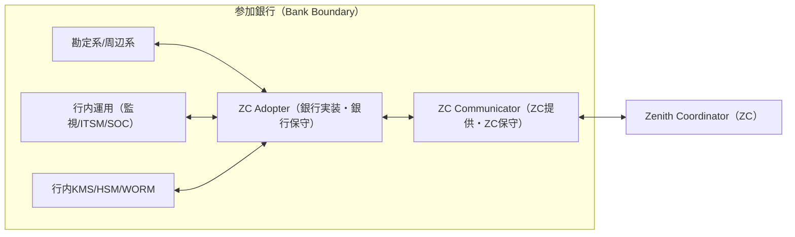

> **規範** ：ZCとの通信は必ず ZC Communicator が終端する。ZC Adopter が直接 ZC と通信してはならない。  
> **推奨** ：ZC Adopter は行内ネットワーク境界（行内統制の適用範囲）に配置し、ZC Communicator は「共通ランタイム」として標準運用する。

### 13.5 Communicator ⇄ Adopter I/F 契約（最小）【規範】
ZC Communicator と ZC Adopter のI/Fは、「冪等」「順序非依存」「説明可能」を満たす最小要件として固定する。詳細スキーマは **`30_internal_design.md` 第12章（I/F契約）§12.1〜§12.6** に従う。

#### 13.5.1 冪等キーと再送（共通規範）【規範】
- すべての要求は `request_id`（冪等キー）を持つ。
- 同一 `request_id` の要求に対し、ZC Adopter は **同一結果** を返し、二重に勘定系副作用を発生させてはならない。
- ZC Communicator は Outbox により EVT の確実送達（再送）を担保する。

#### 13.5.2 最小API（要約）【規範】
ZC Adopter は最低限以下を提供する（詳細は **`30_internal_design.md` 第12章（I/F契約）** ）。

- `ReserveFunds` / `ReleaseReserve`（資金隔離）
- `ExecuteDebit`（a：支払実行）
- `ExecuteCredit`（b：入金実行）
- `LegReadyCheck`（GTIDの事前レディネス）
- `AuthorityCheck`（AML/制裁等：必要時）
- `NameCheck`（名義応答：必要時）
- `BuildProofArtifact`（証跡材料生成）

> **規範** ：ZC Communicator は上記以外の銀行固有I/Fへ依存してはならない。

### 13.6 資金隔離（顧客預金と別段預金）【規範＋推奨】

#### 13.6.1 原則【規範】
資金隔離（Reservation/Isolation）は ZC Adopter の責務である。方式は固定しないが、隔離の成立・解除・再拘束は冪等に収束し、照会で説明可能でなければならない。

- パターンA：メモ拘束（available減、振替なし）
- パターンB：別段預金への振替（予約口）
- パターンC：サブ台帳隔離（隔離残高）

> **規範** ：取消・期限超過・CASEにより、隔離は必ず解除できなければならない。

#### 13.6.2 別段振替を推奨する局面【推奨】
- HTLC の timelock が長い（数時間〜日跨ぎ）
- GTID の leg数が多い、または成立日跨ぎがあり得る
- チャネル競合が多い（アプリ＋窓口＋API）
- 監査・補償説明で「拘束の実体」が必要

#### 13.6.3 図説（別段振替：Reserve→Execute→Release）
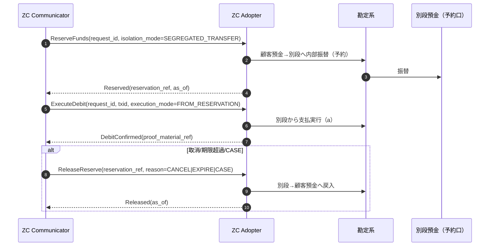

### 13.7 レーン別プロファイル（必須＋Express例外）【規範】

#### 13.7.1 Standard / GTID / High-Value（Hard Reservation必須）
不整合リスクを排除するため、以下の実装を必須とする。

1. **Hard Reservation（支払）** ：Accept時点で顧客口座から引き落とし、銀行内部の「未決済為替別段（支払口）」へ移動させること（§13.6 パターンB）。
2. **Hard Landing（受取）** ：入金指図を受け取った時点で、銀行内部の「未決済為替別段（受取口）」へ計上し、即座に `b` 証憑を発行すること。顧客口座への入金はその後に行う。

#### 13.7.2 Express（条件付きSoft Reservation許容）
即時性が極めて重要となるExpress（店舗決済）に限り、以下の条件を全て満たす場合のみ、論理拘束（Soft Reservation / §13.6 パターンA）を許容する。

1. **上限額** ：1取引あたり `PR-SOFT-LIMIT`（例：5万円）以下であること。
2. **補償合意** ：万が一の残高不足（Decision後の引落失敗）発生時は、**参加銀行が立替払いを行い、決済を成立させる**こと。
3. **事後求償** ：立替分は銀行・顧客間で事後解決し、ZC上の取引を失敗させてはならない。

> **注** ：§13.6は「資金隔離の方式（パターン定義）」として残し、推奨・必須の文言は本節（§13.7）へ集約する。
### 13.8 証跡（bank_proof_ref）と秘匿【規範】
- `PAYER_EXEC_CONFIRMED` / `PAYEE_EXEC_CONFIRMED` は必ず `bank_proof_ref` を付与する。
- `bank_proof_ref` は参照であり、個人情報・秘密（HTLC preimage）・AML詳細を本文に含めてはならない（参照化のみ許容）。

> **規範** ：秘匿情報は Vault/WORM 等の行内統制下に保全し、外部には参照番号として提示する。

### 13.9 Conformance（適合性評価）【規範】
Conformance は、ZC Communicator（共通）と ZC Adopter（個別）の結合として実施し、以下を機械的に検証する。

- 冪等性（同一 request_id の収束）
- 順序非依存（逆順・遅延・重複の収束）
- 説明可能性（ `as_of` と `next_action_hint` の常時提示）
- 証跡（a/b の `bank_proof_ref` 付与）
- 例外収束（DLQ→CASE）

> **推奨** ：Conformance はCIで常時実行し、ZC Communicator の更新時に破壊的変更がないことを検出する。  
> **規範** ：SLO・TTL・閾値等のパラメータは **`30_internal_design.md` §12.7（パラメータ統制）と §12.9（PR-* 台帳）** により固定し、変更時は版管理と周知を必須とする。


## 第14章 参加要件・適合性評価

### 14.1 接続要件（技術）
- 回線/冗長：二経路、遅延/パケット損失のSLO
- 時刻：NTP/PTP、監査ログの時刻整合
- 鍵：HSM推奨、ローテーション、失効・再発行手順

### 14.2 適合性評価（Conformance）
- 契約テスト：`30_internal_design.md` 第12章（I/F契約）に対する自動検証
- 障害訓練：DNS_HOLD/隔離/復元を含む統合演習
- 合格証跡：test_report_ref、監査ログ、是正計画

### 14.3 不適合時の措置
- 段階制裁：警告 → レーン制限 → 取引上限制限 → 参加停止
- 全て証跡化し、監督当局に提出可能とする。


## 第15章 相互運用と段階導入ロードマップ

### 15.1 外部相互運用（Adapter / Gateway）
- BoJ連携：IGS結果の取り込み、DNS清算のKick/結果証跡
- 他スキーム：口座確認、Addressing、将来の新基盤（仮にCBDC等）とのI/Fを「周辺ゲートウェイ」で吸収

#### 15.1.1 周辺ゲートウェイの責務（必須）
周辺ゲートウェイ（ExternalSettlement Adapter / Interop Gateway）は、次を必ず満たす。
- 変換：外部I/FとZC I/Fの差分吸収（型、桁、コード体系）
- 冪等：`ext_instruction_id` による外部指図の冪等送信
- 再照合：外部結果の再取得（pull）とZC状態の照合
- 証跡：外部由来の証跡を **検証可能な形** でZCへ取り込み、Finality Logにダイジェストを残す

> **規範**  
> 相互運用の失敗で最も揉めるのは「外部では処理されたが、ZCでは未了（または逆）」の類型である。周辺ゲートウェイは、結果の再照合と証跡の連鎖を **必ず** 提供する。


#### 15.1.2 相互運用の証跡モデル（Evidence Chain：規範）

<!-- SoT: Annex / References: （本文表示は省略） -->

ZC内部のSoTは **Finality Log** である。外部相互運用では、外部証跡を以下のモデルで連鎖させる。

**(1) 外部証跡レコード（External Evidence Record）**
- `ext_system`：外部系識別子（BoJ/他スキーム等）
- `ext_instruction_id`：外部指図ID（冪等の鍵）
- `ext_status`：外部状態（SENT/ACCEPTED/SETTLED/FAILED/UNKNOWN）
- `observed_at`：観測時刻（pull/notifyの別も含む）
- `payload_digest`：外部メッセージのハッシュ
- `verification`：署名検証結果または検証不能理由
- `evidence_blob_ref`：原本保管先（WORM等）

**(2) 因果リンク（correlation / causation の継承規則）**
- ZC→外部：送出時に `correlation_id = txid` 、 `causation_id = last_event_id` を付与（可能な範囲）
- 外部→ZC：受信/観測した外部結果は、必ず `correlation_id = txid` に正規化し、外部の `ext_instruction_id` を副キーとして保持

**(3) Finality Logへの反映（ダイジェスト）**
外部結果は、次の2段で扱う。
1. `EXT_RESULT_OBSERVED`：外部状態を観測した事実（ **外部の真偽はまだ断定しない** ）
2. `EXT_RESULT_RECONCILED`：ZC側の状態と照合し、整合（または不整合）を確定した結果

**(4) 不整合の扱い（規範）**
- 不整合は「例外」ではなく **状態** として扱い、 `SUSPENDED` + CASE に収束させる
- 不整合解消には、外部証跡（原本）とZC証跡（Finality Log）の双方が必要

#### 15.1.3 典型フロー（外部清算/高額即時）
1. ZCが外部へ指図送出：`EXT_INSTRUCTION_SENT`（`ext_instruction_id` を含む）
2. 外部結果を観測：`EXT_RESULT_OBSERVED`（External Evidence Record を添付）
3. 照合（pull再照会を含む）：`EXT_RESULT_RECONCILED`
4. 整合：ZC状態を進める（必要に応じて `DECIDED_TO_SETTLE` 等へ合流）
5. 不整合：`SUSPENDED` とし CASE を起票（制度の救済/補償へ接続）

### 15.2 参加行における導入順序（推奨）
1. Standard、DNS（証跡・監査の確立のため、一律導入が必須）
2. RTP（商流連携）
3. 条件付き（HTLC等）はプロファイルとして段階導入

### 15.3 互換性ポリシー
- 破壊的変更は禁止。
- 例外的に必要な場合は、制度の変更管理に従い、周知・共存期間・変換ゲートウェイを必須。


## 第16章 試験戦略

### 16.1 試験ピラミッド
- Unit → Contract（`30_internal_design.md` 第12章（I/F契約））→ Integration（相互）→ Soak（長期）→ Crisis（危機演習）

### 16.2 受入基準（例）
- SLO達成（`PR-SLO-*`、`30_internal_design.md` §12.9）
- 監査再現性：任意の取引をFinality Logから再現可能
- 危機演習：DNS_HOLDの通知・証跡・公表統制が規程通りに動く

### 16.3 試験環境
- 参加者向けSandbox
- 監督向け監査環境（証跡閲覧）
- データ：匿名化、再現用シナリオデータセット

## 第17章 クロスカレンシーFX 処理方式（Project Agorá / Icebreaker 参照）

> 機能別索引：FXは要件定義（`10_requirements.md`）・処理方式（本書 第17章）・内部設計（`30_internal_design.md`）の3文書にまたがる。本章は方式（役割・レート形成・取引構造・決済・流動性・ワークドエグザンプル）を扱う。

> **参照**: BIS *Project Agorá*（統合台帳・トークン化準備/預金・原子決済）と
> BIS/Bank of Israel/Riksbank *Project Icebreaker*（ハブ&スポーク・FXプロバイダ・
> HTLC PvP・ブリッジ通貨）。本書のFXはIcebreakerの考え方を参照点としつつ、
> 実装は既存の GTID（複数の取引をひとつのグループとして束ね、一括して確定させる仕組み）
> レーンの上に最小限の追加で構築する（既存コードへの接地は `30_internal_design.md` §17.4）。

---

### 17.1 設計方針

| 論点 | 採用 |
|---|---|
| アトミシティ機構 | **デフォルトはGTIDのみ**: FXPを導管とする脚分解により各通貨が両側で均衡し、既存のGTID多脚協調がそのまま原子性を担う（HTLC不要）。**任意で** `bind_htlc=true` を指定すると、共有ハッシュロック＋段階タイムロックを上乗せし、決済を secret 公開（claim）まで遅延させるクロスレール原子性レイヤを追加できる |
| 為替レート | **Icebreaker 方式**: 複数 FXP が方向別レートを提示、ZC が最良実効レートの経路を選定、**ブリッジ通貨（中間通貨1つ、PvPvP）** に対応 |
| FXP 主体 | **参加銀行が FXP を兼務**（複数通貨に事前流動性を保有） |
| 中銀ファイナリティ | **脚ごと独立確定**（JPY→BOJ-Net/DNS、非JPY→トークン化中銀当座/CB_TOKEN）。経済的な原子性はデフォルトでは導管GTIDの多脚協調、`bind_htlc=true` 使用時はそれに加えてHTLCハッシュロックが担保する |

---


### 17.2 役割

- **Payer / Payee**: 参加銀行の顧客。payer が支払う通貨をA、payee が受け取る通貨をBとする。
- **FX プロバイダ (FXP)**: **参加銀行**が兼務する。2通貨以上について事前に流動性
  （各通貨の中銀当座／CBT 残高＋通貨別 H 枠）を保有しておき、レートを提示する。
- **ZC**: Icebreaker でいう「ハブ」に相当する役割を担う。具体的には、**公平なブローカー**
  （レートの集約・最良経路の選定・事前提示を行う）と、**コーディネータ**（導管GTIDの登録・
  前進、および任意で HTLC の lock/claim/refund の起動を行う）を兼ねる。デフォルト経路での
  原子性（取引が「全部成立」か「全部不成立」のどちらかにしかならない性質）は通常の GTID
  協調がそのまま担い、`bind_htlc=true` を使う場合はそこにハッシュロックが上乗せされる。
  つまり ZC 自身が原子性を単独で支える単一障害点になる設計ではない。

> **規範（透明性）**: ZC は payer が承認する前に「採用 FXP・実効レート・総コスト・経路・
> 見積有効期限」を提示する（Icebreaker が求める中立ブローカーの要件）。ただし
> `POST /api/fx/transfers` で確定する際には ZC が経路を**必ず再計算**するため
> （本書§17.5・`30_internal_design.md` §17.2「権威的再プライシング」）、事前に提示した内容がレート変動なしにそのまま確定する
> という保証ではない点に注意が必要である（`min_effective_rate` を指定すれば防御できる）。

---

### 17.3 FX レート・マーケットプレイス

> **前提（重要）: レート形成はZCのスコープ外。ZC は価格を作らない。**
> このシステムは **FXP がレートを決定する場所ではない**。実効レートのプライシング
> （建値・スプレッド・ヘッジ・在庫/市場リスク判断）は、各 FXP が**系の外**で自らの
> 裁量により行う。ZC 側には為替オラクル・参照レートフィード・レート算出ロジックは
> **一切存在しない**。
>
> ZC が行うのは次の3つだけ:
> 1. **投入の受理**: FXP が外で決めた方向別レートを `PUT /api/fx/rates` で受け取り、
>    `FxQuotes` にそのまま保存する（形式検査と FXP 資格ゲートのみ。値は補正しない）。
> 2. **集約と最良選定**: 投入済みの ACTIVE 見積を読み、最良実効レートの経路を選ぶ
>    （`routing.ts`。直接＋ブリッジ合成。価格は作らず、並べて選ぶ）。
> 3. **凍結と逆行ガード**: 見積有効期限（`valid_to`）と、確定時の `min_effective_rate`
>    による不利方向ガード（`api.ts`）。
>
> これは Icebreaker の中立ブローカー思想に忠実な役割分担であり、ZC は意図的に
> **価格形成の信頼点にならない**（原子性の信頼点にもならない＝本書§17.2）。丸め益の帰属
> （デフォルトでFXP）や流動性連動の動的上限といった「レート周りで系内に踏み込む余地」は
> 任意の発展として `30_internal_design.md` §17.4「将来課題」に分離してある。

#### 17.3.1 レート表現（整数固定小数）
本コードベースは整数マネー前提。レートも**固定小数（`RATE_SCALE = 1e8`）**の整数で持つ
（`src/zc/fx/rates.ts`、内部演算はオーバーフロー回避のため BigInt）。

- **方向別レート** `rate(X→Y)` = 1 単位 X が何単位 Y になるか（×`RATE_SCALE`）。
  bid/ask は「A→B」と「B→A」の2方向の見積として表現する。
- 変換（payer 建て、`convertForward`）: `amount_B = floor(amount_A × rate(A→B) / RATE_SCALE)`。
- 変換（payee 建て、`convertBackward`）: `amount_A = ceil(amount_B × RATE_SCALE / rate(A→B))`。
- ブリッジ合成（`composeRates`）も同様に **floor**（下振れ方向）で丸める。
- 端数は常に **FXP に不利にならない方向**へ丸める（payer/payee 保護）。差分（丸め益）の
  帰属はスキームルールで定義（デフォルト: FXP。明示的な帰属ルールの実装は `30_internal_design.md` §17.4「将来課題」）。

#### 17.3.2 `FxQuotes`
`FxQuotes`（FXP の方向別レート市場）のスキーマ定義（列・索引）は **`31_schema.md § FxQuotes` を正とする**（二重管理を避けるため本節ではDDLを再掲しない）。要点のみ：`quote_id` 主キー、`fxp_bank_id`／`from_currency`／`to_currency`／`rate`（×`RATE_SCALE`）／`valid_to`（有効期限）／`status`（ACTIVE|WITHDRAWN）を持ち、索引は `idx_fxq_pair`・`idx_fxq_fxp`。

FXP は `PUT /api/fx/rates` で自行・自ペアの見積を upsert する（`src/zc/fx/quotes.ts` の
`upsertQuote`。同一 FXP＋同一通貨ペアの ACTIVE 行を in-place 更新し `version` を進める。
同名の REST 動詞での認可は、参加銀行向けの汎用 API ゲート（同一オリジン/APIキー等の既存
仕組み）に加えて、ハンドラ内で `Participants.is_fx_provider=1` かつ `is_active=1` を検査する
だけであり、レート値自体に対する HMAC/KeyRegistry のような追加の暗号的署名検証は無い。

#### 17.3.3 最良経路エンジン（routing、`src/zc/fx/routing.ts`）
要求: `(from_currency, to_currency, amount, denomination, max_bridge_hops?)` → 最良経路。
1. **直接経路**: `from→to` の ACTIVE 見積から、payee 受取最大（payer 建て）/
   payer 支払最小（payee 建て）となる FXP を選ぶ。`amount` が見積の `[min_amount, max_amount]`
   内であること。
2. **ブリッジ経路**: `max_bridge_hops`（デフォルトは1、リクエストの任意パラメータ）が 1 以上のとき、
   from から到達できる中間通貨 C を1つだけ挟む合成を試す:
   `rate(from→C) × rate(C→to) / RATE_SCALE`（例: `rate(JPY→EUR)=1,500,000`＝0.015 と
   `rate(EUR→USD)=110,000,000`＝1.1 を合成すると `1,650,000`＝0.0165。本書§17.8.2）。
   各ホップで別 FXP を許容し、両ホップの `[min_amount, max_amount]` を満たす必要がある。
3. **選定**: 直接とブリッジの実効レート（`amount_to`/`amount_from`）を比較し最良を採用
   （同額なら脚数が少ない方＝直接を優先、`isBetter()`）。
4. 出力 = `FxRoute { hops: FxHop[]; effective_rate; amount_from; amount_to; expires_at }`。
   `FxHop = { fxp_bank_id, from_currency, to_currency, amount_in, amount_out, quote_id }`。

> ブリッジは**中間通貨1つ（2ホップ）まで**という構造的な上限がある。これは
> `max_bridge_hops` に2以上の値を渡しても変わらない —
> 実装は「直接 1 つ」と「中間通貨 1 つのブリッジ 1 つ」しか評価しないため、再帰的な
> 多段ブリッジは存在しない（`max_bridge_hops=0` を渡すと直接のみに制限できる）。

---

### 17.4 取引構造（デフォルトはGTID、任意でHTLCレイヤを追加）

#### 17.4.1 デフォルト経路: FXP導管GTID（HTLCなし、即時進行）
FX 取引の本体は「FXP を導管とする GTID」である。`src/zc/fx/transfer.ts` の
`buildFxEdges` が経路を脚（edge）に分解し（payer→fxp₀→…→payeeの順）、各脚を
`buildFxGtidLegs` が GTID の PAYER/PAYEE 脚ペア（`leg_id = ${gtid}~L<NN>P` /
`~L<NN>Q`）に変換する。各脚は単一通貨で、FXP が両側に立つため通貨ごとに
payer 合計 == payee 合計が自動的に成り立つ（`10_requirements.md` §6.1.2 解決原理・本書§17.5）。

`initiateFxTransfer` は次を行う:
1. 経路上の全ホップの quote が ACTIVE かつ有効期限内であることを検証（失効していれば
   `FX_QUOTE_EXPIRED`）。
2. `FxTransfers` に事実を記録（`status='INITIATED'`、`hashlock` は未指定なら生成するが
   この経路では決済の進行を制御しない）。
3. `registerGtid` で導管 GTID を登録する。

`initiateFxTransfer` 自身は `advanceGtid` を呼ばない。`registerGtid` が積む
`ZC_BANK_LEG_READY` キューメッセージを消費する `processQueueMessage`
（`src/zc/orchestrator.ts`）が `advanceGtid` を呼び、GTID を前進させる。GTID が
`GT_SETTLED` に達すると `checkAndFinalizeGtid`（`src/zc/orchestrator/gtid.ts`）が
`FxTransfers.status` を `'SETTLED'` に更新する（FXとは無関係なGTIDには無害な no-op）。

#### 17.4.2 任意レイヤ: HTLC によるクロスレール原子性（`bind_htlc=true`）
`POST /api/fx/transfers` に `bind_htlc: true` を指定すると、決済を即時に進めず
`lockFxTransfer`（`src/zc/fx/htlc.ts`）が起動する。

- **lock**: 経路上の全 quote の生存（ACTIVE・有効期限内）だけを検査し、各脚を独立表
  `FxLegLocks` に `LOCKED` として記録する。**この時点では GTID は登録されず、H予約も
  一切起きない**（流動性検査は無い。本書§17.7）。全脚が同一 `hashlock`（=`SHA-256(secret)`）を
  共有し、`timelock` は脚ごとに段階的（上流ほど後に満了、本書§17.4.3）。
##### 17.4.2.1 claim/refund のシリアライズ：`FxTransfers.status` を単一の権威ゲートにする

claim と refund はいずれも複数オペレーション（FxLegLocks の一括更新、`registerGtid`／
`advanceGtid` による GtidTransactions/GtidLegs・H 予約・レーン行の生成）にまたがり、
これらを単一トランザクションに包むことはできない（クロスレールの境界）。そこで両者の
**決定そのもの**を、`FxTransfers.status` 列に対する **1行・1回の CAS** に集約して相互排他
させる:

```
LOCKED ──claim──▶ SETTLING ──▶ SETTLED
   └────refund──▶ REFUNDED
```

`LOCKED` を離脱できるのは claim（`LOCKED→SETTLING`）か refund（`LOCKED→REFUNDED`）の
**どちらか一方だけ**で、これは単一ノードでもCASを内包する分散SQLでも原子的に成り立つ。
ゲート通過後の各ステップ（脚の `WHERE state='LOCKED'` CAS 更新・冪等な
`registerGtid`/`advanceGtid`・最後の `SETTLING→SETTLED` CAS）はすべて冪等なので、
途中でクラッシュしても `SETTLING` のまま残り、**再試行が再開（resume）**する（その間
refund は割り込めない）。分散トランザクションを使わずに「部分決済も二重決済もしない」を
担保するサーガ型の作法である。並行・割り込みの検証は
`test/integration/concurrent_races.test.ts`（`Promise.all` による await 境界での
インターリーブ）が固定する。

- **claim**: payee が知り得た `secret` を `POST /api/fx/transfers/{gtid}/claim` に渡す。
  まず `sha256(secret) == hashlock` を検証（誤 secret は `PREIMAGE_MISMATCH` で、状態を
  一切変えずに拒否）。次に `LOCKED→SETTLING` の CAS でゲートを取得した勝者だけが、全
  `LOCKED` 脚を **1回のバッチで一括** `CLAIMED` に更新し（1回の secret 公開で全脚が同時に
  解放される）、`registerGtid` ＋ `advanceGtid` で導管 GTID を起動して決済を進め、最後に
  `SETTLING→SETTLED` を CAS する。ゲートを取れなかった呼び出しは確定済み status を見て
  分岐する: `REFUNDED` なら `FX_ALREADY_REFUNDED` で拒否、`SETTLED` なら冪等成功
  （`already: true`）、`SETTLING` なら冪等に決済を再開する（勝者のみ `already: false`）。
  実際の進行状況は応答の `gtid_state`（`GtidTransactions.state` の生値）で追う。
- **refund**: secret が来ないまま、**全脚の中で最も遅い（最上流の）timelock**が経過した
  場合に限り `POST /api/fx/transfers/{gtid}/refund` で払い戻す。claim と対称に、まず
  `LOCKED→REFUNDED` の CAS でゲートを取得した場合のみ全脚を **1回のバッチで一括**
  `REFUNDED` にする。スナップショット時点で脚が `LOCKED` に見えても、claim が先にゲートを
  取って `SETTLING`/`SETTLED` に進んでいればこの CAS は失敗し、refund は `STATE_GUARD` で
  拒否される（脚ごとの CAS だけでは閉じられなかった多オペレーション境界をここで閉じる）。
  1脚でも `CLAIMED` の場合の早期 `STATE_GUARD` ガードも併存する。GTID は一度も登録されない
  ため資金は一切動かない。
- **sweep**: 期限切れのまま放置されたロックは `sweepExpiredFxLocks` が検出して
  `refundFxTransfer` を呼ぶ。`runTimeoutSweep`（`src/cron/timeout_sweep.ts`）に毎分
  接続する（`30_internal_design.md` §17.4）。claim と sweep が競合した場合は上記の `FxTransfers.status` ゲートで
  一方だけが成立し、敗者は安全にスキップされる。

##### 17.4.2.2 `SETTLING` に期限を置く（規範）

上のゲートは claim と refund を相互排他にすることで「部分決済も二重決済もしない」を
担保するが、**その代償として `SETTLING` は refund が割り込めない区間**でもある。claim が
途中でクラッシュしたまま再試行が恒久的に失敗すると（下流レールの長期障害など）、当該
gtid は決済も払戻もされないまま滞留する。`sweepExpiredFxLocks` はこれを拾えない——
同 sweep の抽出条件は `FxLegLocks.state='LOCKED'` であり、ゲートを取った勝者は既に脚を
`CLAIMED` へ落としているためである。**サーガの中で唯一、有界な帰結を持たない窓**が
ここに開く。

- **期限（規範）**：`SETTLING` へ入った時刻から、次の 2 つのうち**早い方**を期限とする。
  (a) `FX_SETTLING_TIMEOUT_MS`（6h）、(b) **最上流の脚の timelock から 1 ホップ分
  （`FX_HTLC_HOP_MARGIN_MS`）を差し引いた時刻**。実効的に効くのは (b) である——当該
  timelock は上流を claim できる最後の時点であり、これを越えてなお決済中であることは、
  §17.4.3 が防いでいるはずの「下流に払ったのに上流から回収できない」そのものだからである。
  実装は `settlingDeadline`（`src/zc/fx/htlc.ts`）。
- **開始前の残余検査（規範）**：claim は、ゲートを取る**前に**上記の残余時間を検査し、
  零以下であればゲートを取らずに**払戻側へ倒す**（`FX_CLAIM_WINDOW_EXPIRED`）。間に合わないと
  判っている決済を開始して `SETTLING` に置くことは、refund が割り込めない区間を無駄に作る。
- **超過時の収束（規範）**：期限を過ぎた `SETTLING` は `sweepStuckFxSettling` が拾い、
  GTID を `GT_SUSPENDED` へ落として **CASE を起票**する。決済も払戻も強制しない——この
  時点で脚は `CLAIMED` であり、いずれかのレールで資金が動いている可能性があるため、
  安全な収束は宣言済みの経路（中断＋例外）である。回帰試験は `test/zc/fx_htlc.test.ts`
  §「SETTLING is bounded」。

#### 17.4.3 タイムロック（`bind_htlc=true` の場合のみ）
**上流ほど長く**する。downstream（payee 側、最終脚）を基準 `T_base` とし、上流の脚ほど
`Δ` を多く加算する。脚の総数を `total`、脚 `index`（0始まり、0が最も上流）として:

```
timelock(index) = now + T_base + (total − 1 − index) · Δ
```

定数は `FX_HTLC_BASE_TIMEOUT_MS`（24h）・`FX_HTLC_HOP_MARGIN_MS`（12h）
（`src/zc/fx/htlc.ts`）。これにより「下流がクレームされたら上流は必ずクレーム可能」
「上流が払う前に下流の払いが確定する」を保証する（FXP が払い損ねない）。`Δ` は脚の
中銀確定レイテンシ（非JPY CBT のチェーン確定時間を含む）の最悪値以上に取る想定。

#### 17.4.4 ライフサイクル
1. **Quote**: payer が `POST /api/fx/quote` を呼び、ZC が最良経路を返す（`FxRoute`、確定ではない）。
2. **Initiate**: payer が `POST /api/fx/transfers` を呼ぶ。ZC は渡された経路を信用せず
   `findBestRoute` を**再実行**（権威的再プライシング、本書§17.5・`30_internal_design.md` §17.2）。`fxp_accounts` で経路上の
   全 FXP×全通貨の決済アカウントが揃っているか検査（不足は 400 `FX_FXP_ACCOUNT_MISSING`）。
   `min_effective_rate` を指定していれば悪化していないか検査（409 `FX_RATE_MISMATCH`）。
3. **(デフォルト) 即時導管GTID**: `bind_htlc` を指定しない場合、`initiateFxTransfer` が
   `FxTransfers`（`status='INITIATED'`）を記録し導管 GTID を登録する。201
   `FX_TRANSFER_INITIATED` を返す。以降はキュー経由の `advanceGtid` / `checkAndFinalizeGtid`
   が進め、`GT_SETTLED` になった時点で `FxTransfers.status` が `SETTLED` になる。
4. **(任意) HTLCロック**: `bind_htlc: true` の場合、`lockFxTransfer` が `FxTransfers`
   （`status='LOCKED'`）と全脚の `FxLegLocks`（`LOCKED`）を記録するだけで止める。201
   `FX_TRANSFER_LOCKED`、`hashlock` と（生成した場合）`secret` を返す。
5. **Claim（HTLC経路のみ）**: payee が `secret` で `POST /api/fx/transfers/{gtid}/claim`
   を呼ぶ。一致すれば全脚が一括 `CLAIMED` になり、導管 GTID が登録・前進する。200
   `FX_TRANSFER_CLAIMED`。
6. **Refund（HTLC経路のみ）**: secret が来なければ、`POST /api/fx/transfers/{gtid}/refund`
   （または cron の `sweepExpiredFxLocks`）が最遅 timelock 経過後に全脚を一括 `REFUNDED`
   にする。200 `FX_TRANSFER_REFUNDED`。資金は一切動いていない。
7. **Status**: `GET /api/fx/transfers/{gtid}` でいつでも `FxTransfers` の事実＋
   `GtidTransactions.state`（`gtid_state`）＋（HTLC経路なら）`leg_locks` を確認できる。

#### 17.4.5 状態（実装の実値）
- 導管 GTID 自体は**FX専用の状態を持たない**。通常の `GtidState`（`GT_RECEIVED` →
  … → `GT_SETTLED` / `GT_CANCELLED` / `GT_SUSPENDED` 等）がそのまま使われる。
- `FxTransfers.status`: `INITIATED`（即時経路で作成直後）｜ `LOCKED`（HTLC経路でロック直後）｜
  `SETTLING`（HTLC claim の権威ゲート `LOCKED→SETTLING` を取った勝者が決済を実行している間の
  **過渡状態**。本書§17.4.2 のサーガ図 `LOCKED→SETTLING→SETTLED` の中間で、勝者だけがこの値を書く）｜
  `SETTLED`（GTID が `GT_SETTLED` に達した、または HTLC claim が成立した）｜
  `REFUNDED`（HTLC経路でタイムアウト払戻）。実際に存在する値は上記の 5 つ（うち `SETTLING` は
  claim 実行中にのみ現れる過渡値）であり、`CANCELLED` は実装では一度も書かれない。
  DDL コメント（`migrations/0001_consolidated_schema.sql` / `31_schema.md § FxTransfers`）は
  かつて `INITIATED|SETTLED|CANCELLED` という歴史的な誤りを残していたが、本 5 値へ是正済み。
- `FxLegLocks.state`（HTLC経路でのみ行が存在する）: `LOCKED` → `CLAIMED` ｜ `REFUNDED`。
- `SETTLED` の書き込みタイミングは経路で異なる（本書§17.4.1・§17.4.2 で述べた非同期/即時の違い）。
  どちらの経路でも、実際の決済進行を正確に追うには `gtid_state` を見るのが確実。

---

### 17.5 均衡検査の置換（FXP 導管不変条件）

> **本節の結論（先に述べる）**：**FX 専用の均衡検査は設けない。**
> FXP を明示的な導管として両側に置く脚分解（`buildFxEdges` / `buildFxGtidLegs`）を採るため、
> 各通貨は脚の中で payer 合計 == payee 合計に**自動的に**一致し、既存の
> `AMOUNT_BALANCE_MISMATCH` 検査をそのまま通る（接地は `30_internal_design.md` §17.4）。
> 以下は、当初「置換すべき」と考えた 4 つのガードについて、**なぜ不要になったか**を
> 個別に示すものである（同じ検討を繰り返さないための経緯）。

1. **脚内ゼロサム**: 各脚は単一通貨の振替＝銀行元帳で通貨別ゼロサム（`amount_currency`）。
   FXPの導管化により自動的に成立し、専用の検査は不要。
2. **レート整合**: 当初は「`amount_out == convert(amount_in, quoted_rate)` をホップごとに
   検査し、違反は `FX_RATE_MISMATCH`」という独立ガードを想定した。実装では `routing.ts`
   が `amount_out` を常に quote から計算して生成する（クライアントから受け取った
   `amount_out` を後から検査するのではない）ため、この種の不整合はそもそも作れない。
   `FX_RATE_MISMATCH` という reason_code 自体は実在するが役割が異なり、
   `POST /api/fx/transfers` で**価格発見から確定までの間にレートが不利な方向へ動いていないか**
   を、呼び出し側が任意で渡す `min_effective_rate` と再プライシング結果の比較で守る
   用途に使われている（`api.ts`、`30_internal_design.md` §17.2）。
3. **導管整合**: 当初は「経路の連結性（脚 k の出側 == 脚 k+1 の入側）」を検査し、違反を
   `FX_ROUTE_INCONSISTENT` とする想定だった。実装では `buildFxEdges` が経路の連結を
   **構築時に**保証するため、構築後に壊れた経路を検査する出番がない。
   `FX_ROUTE_INCONSISTENT` は `REASON_CODE_CATEGORY` に予約されているが、現在どこからも
   投げられていない。
4. **見積有効性**: これだけは**専用の検査が要る**——採用した経路の全 quote が確定（または
   HTLC ロック）の**直前に** ACTIVE かつ有効期限内であることを検査し、違反は
   `FX_QUOTE_EXPIRED` とする。1〜3 と違い、時間の経過で後から壊れる性質のものは、
   構築時の保証では閉じられない。

> 流動性不足（FXP の通貨残高/H 不足）も同様に専用ガードを置く必要がなかった。これは
> 導管 GTID が実際に前進する際、既存の GTID レーンの H 予約失敗パスがそのまま検出し、
> GTID 自体を安全にキャンセル/中断するためである（`chaos_fx.test.ts` #1, #7）。
> 予約済みの `FX_LIQUIDITY_INSUFFICIENT` reason_code は、この汎用パスに乗るため
> 現在どこからも投げられていない。

---

### 17.6 決済・ファイナリティ（脚ごと・通貨別レール）

各脚は claim（デフォルト経路では GTID 前進時、HTLC経路では claim 成立時）に**自通貨のレール**で
独立確定する（既存の決済基盤をそのまま再利用）：
- **JPY 脚**: BOJ-Net / 通貨別 DNS サイクル、または HIGH_VALUE 相当の IGS（即時グロス）。
- **非JPY 脚**: トークン化中銀当座（CBT）。`settlementAccountId(bank, ccy, chain)` で
  `{bank}-CBT-{CCY}-{CHAIN}` へ。確定の信頼アンカーは **`venue='CB_TOKEN'` の発行体署名付き
  `SettlementProofRef`**（`KeyRegistry` 検証、`source='CB_TOKEN:{中銀}:{チェーン}'`）。

**経済的原子性**は経路によって担う層が異なる。デフォルト（HTLCなし）経路では、GTID レーン
自体の多脚協調が原子性を担う：いずれかの脚が確定前に失敗すれば `GT_SUSPENDED` 等へ
遷移し、`FxTransfers.status` は **`SETTLED` に到達しない**（途中半端な決済は起きない、
`chaos_fx.test.ts` #5）。`bind_htlc=true` の経路では、これに加えて共有ハッシュロックが
「secret 公開まで一切の GTID 登録・資金移動を起こさせない」という保証を上乗せする
（同一 secret で全脚が一括解放されるため、部分クレームは構造的に存在しない）。

**中銀ファイナリティ自体は脚ごと（結果整合）**：各脚が各々のレールで確定し、HTLC使用時の
段階的タイムロック設計が「上流は下流の確定を見てから確定/払戻を判断できる」ことを保証する。

> FXP の市場リスク（レート変動）は見積をロック/確定した時点で FXP が負う
> （`chaos_fx.test.ts` #3: ロック後に quote が失効しても claim はロック時のレートで決済される）。
> 決済リスク（相手方の不履行）は、デフォルト経路では GTID の中断（`GT_SUSPENDED`、資金は動かない）
> で吸収され、HTLC 経路ではタイムロック払戻で吸収される（Icebreaker / Agorá と同じ結論）。

---

### 17.7 流動性・H枠

- 各脚の**出側当事者**がその通貨で H 予約する（通貨別 H＝`ParticipantCurrencyLimits`、
  `reserveH` は GTID 脚の `role==='PAYER'` のものにのみ適用、`src/zc/lanes/gtid/advance.ts`）。
  payer は通貨A、FXP は通貨B（ブリッジでは通貨Cも）を予約する。
- この H 予約は導管 GTID が**実際に `advanceGtid` で前進する時点**で起きる。デフォルト経路では
  `initiateFxTransfer` 直後（キュー経由）、HTLC 経路では **claim 成立後**（`registerGtid` +
  `advanceGtid` を呼ぶのは claim 時）。つまり `lockFxTransfer` 自体は H 予約も流動性検査も
  一切行わない — 検査するのは経路上の quote が生きているかだけである（本書§17.4.2・§17.5）。
- FXP の通貨残高/H 不足は、GTID が前進する段階で既存の GTID レーンの仕組みが検出し、
  その脚を含む GTID 全体を安全にキャンセル/中断する。脚は一切前進しない
  （`chaos_fx.test.ts` #1: FXP に USD の H 枠が無い、#7: ブリッジ中間 FXP の資金不足）。
- FXP は各通貨の中銀当座/CBT 残高で事前資金手当て（prefund）しておく必要がある
  （脚確定時に保有していない通貨は払えない）。
- H は脚確定（DNS_CYCLE_SETTLED 相当 / CBT 確定）で解放される（既存ポリシー踏襲、FX固有の変更なし）。

---


### 17.8 ワークドエグザンプル

以下は、実際の数値を使って処理の流れを最初から最後まで追った具体例である。ここまでの
説明を、数字レベルで裏付けることを目的とする。

#### 17.8.1 直接・デフォルト経路（JPY→USD, payer 建て 1,000,000 JPY、HTLCなし）
- FXP=銀行002 が `rate(JPY→USD)=670,000`（=0.0067、`RATE_SCALE=1e8`）を提示する。
- これにより `amount_USD = floor(1,000,000 × 670,000 / 1e8) = 6,700 USD` となる。
- 脚0: payer(001の顧客) −1,000,000 JPY / FXP(002) +1,000,000 JPY。JPY レールで確定する（BOJ/DNS）。
- 脚1: FXP(002) −6,700 USD / payee(...) +6,700 USD。USD レールで確定する（CBT, CB_TOKEN）。
- 各脚は通貨別にゼロサムになっている。原子性は、導管GTIDの通常の多脚協調がそのまま担う
  （`test/integration/fx_settlement.test.ts` で実際の顧客残高を使って検証済み）。

#### 17.8.2 ブリッジ（JPY→USD via EUR、中間通貨1つ）
- `rate(JPY→EUR)=1,500,000`（=0.015）、`rate(EUR→USD)=110,000,000`（=1.1）とする。
- これらを合成すると `rate(JPY→USD)=floor(1,500,000×110,000,000/1e8)=1,650,000`（=0.0165）
  となる。直接見積よりもこちらのレートが有利であれば、ブリッジ経路を採用する。
- 脚0 payer→FXP_a（JPY, 1,000,000）、脚1 FXP_a→FXP_b（EUR, 15,000=floor(1,000,000×0.015)）、
  脚2 FXP_b→payee（USD, 16,500=floor(15,000×1.1)）という3脚に分解される。
- 直接経路が合成レートと同額（タイ）の場合は、脚数が少ない直接経路の方を優先する
  （`routing.ts` の `isBetter()`）。
- これらの数値は `test/zc/fx_routing.test.ts` で検証済みである。

#### 17.8.3 HTLC経路（`bind_htlc=true`、決済を claim まで遅延）
- §17.8.1 と同じ経路を HTLC で束ねる場合、まず `lockFxTransfer` が2脚を `FxLegLocks` に
  `LOCKED` として記録し、共有 `hashlock` と段階的な timelock（脚0が脚1より長い）を割り
  当てる。この時点では資金は一切動かない。
- payee が `secret` を知り `POST /api/fx/transfers/{gtid}/claim` を呼ぶと、
  `sha256(secret)==hashlock` であることが確認され、2脚が一括で `CLAIMED` になり、その場で
  導管 GTID が登録・前進して決済が進む。
- secret が誰にも明かされなければ、両脚のうち遅い方の timelock が経過した後に
  `refundFxTransfer`（手動呼び出し、または `sweepExpiredFxLocks` cron による自動実行）が
  2脚を一括で `REFUNDED` にし、資金は動かないまま終わる。
- この一連の流れは `test/zc/fx_htlc.test.ts` で検証済みである。

---


## 第18章 レガシー勘定系アダプタ 処理方式

> 機能別索引：レガシー勘定系アダプタは要件定義（`10_requirements.md`）・処理方式（本書 第18章）・内部設計（`30_internal_design.md`）の3文書にまたがる。本章は方式（6つの施策・ベンダー接続可否）を扱う。

### 18.1 6つの施策と、その検証

#### #1 能力プロファイル（異機種を設定として飲む）
`LegacyProfiles` に role / reservation_mode / settlement_mode / notify_mode /
sync_reserve / realtime_name_check / batch_ingest / window を宣言。アダプタは
毎 call これを読んで分岐する。バッチ専業行は `PAYEE_ONLY` + `PREFUNDED_SHADOW`
などに落ち、送金系コマンドは `PARTICIPANT_CANNOT_SEND` でクリーンに拒否
（クラッシュしない）。`isCoreOnlineAt()` は日跨ぎの窓も扱う純関数。

**能力の宣言は互いに独立ではない**：`sync_reserve=false` の行で
`reservation_mode='SUSPENSE'` を宣言しても、予約は `NONE` に縮退する
（`10_requirements.md` §7.2.6）。宣言の組み合わせに矛盾があるとき、
アダプタは強いほうではなく**弱いほう＝実際に履行できるほう**を採る。

#### #2 プレファンド・シャドウ（同期呪縛を外す）
`settlement_mode='PREFUNDED_SHADOW'` の行では、`AdapterShadow` の
available に対して承認し、**コアに一切触れず** ZC へ即答する。実 posting は
`AdapterOutbox` に積み、コアがオンライン復帰したら `drainOutbox` が適用。
バッチ窓中でも即時着金が回る。

#### #3 照合 → 実際の CASE（シャドウの代償を必ず捕まえる）
シャドウを持った瞬間ドリフトの可能性が生まれる。`reconcile.ts` が全口座で
次の不変条件を検査し、残差を `AdapterReconDrift`（status=OPEN）に記録**する
と同時に、実際の `openCase()`（ZC 本体が使うのと同じ `Cases` テーブル）を
呼び出して CASE を開く**:

```
core.balance == shadow.available + shadow.reserved
                 + Σ(pending DEBIT) − Σ(pending CREDIT)
```

「説明できない状態は禁止（未決は CASE へ）」という ZC の原則を、アダプタ層に
そのまま降ろしたもの。out-of-band なコア変更（lost posting）は OPEN ドリフト
として検出され、`drift.case_id` で実際のオペレーション監視対象になる。

#### #4 無予約 + Reversal 補償（予約すら持てないコア）
`reservation_mode='NONE'` では reserve は純粋な残高チェック（hold 無し）。
下流の失敗は hold の解放ではなく、**補償 Reversal（別 posting）** で戻す。
ZC が Reversal（取消ではなく、反対仕訳を積んで元に戻す組戻し）を第一級の
概念として扱うのと同じ考え方であり、結果として payer の残高は net zero
（差引ゼロ、つまり最初の状態）に戻る。
補償 Reversal は元の debit と**同じ txid** を持ち、`LegacyCoreJournal.txid`
で対になっていることが追跡可能。

#### #5 プル型通知（push 口を作らせない）
`creditNotify` は `AdapterNotifications` に格納するだけで、コアへ push しない。
銀行は `pullNotifications` で取りに来る（取得後 READ 化、二度読みは空）。

#### #6 バッチ取込（file 志向コア）
`ingestBatchCredits` が N 件の credit を一括で outbox へ。オフライン中でも
受け、window オープンで一度だけ drain。


### 18.2 ベンダー接続可否（勘定系ベンダーの目線で） <a id="vendor-connectability"></a>

「監査に耐える実装か」と「勘定系ベンダーとして実際にこれへ接続できるか」は
別の問いである。前者はコードの正しさ、後者は**契約の形が現実の勘定系の
制約・組織的現実と噛み合うか**を問う。ここでは後者を、`LegacyAdapter`/
`LegacyCore` の公開契約に即して評価する。

#### 良い点（そのまま RFI に使える設計判断）

- **13 コマンドへの絞り込み**と、予約を「別段預金3操作」に分解する発想は、
  実在のどの勘定系にも既にある操作（借記・貸記・残高照会）だけを要求して
  おり、**ベンダー側の新規開発をほぼ要求しない**——ここは高く評価できる。
- **能力プロファイル（#1）**は、ベンダーごとの差異を「コードで分岐」ではなく
  「宣言」で吸収する枠組みとして正しい形。RFI で各ベンダーに
  `sync_reserve`/`realtime_name_check`/`batch_ingest`/`window_*` を
  埋めさせれば、接続前に地雷が可視化できる。
- **プル型通知（#5）**は、ベンダー側に新規の受信エンドポイントを要求しない
  という点で、現実の接続コストを正しく見積もっている。

#### コア境界の規範：公開面は不透明な呼出しに限る

**規範**：アダプタはコアの内部テーブル名を知ってはならない。コアの公開面は
`postCredit(bankId, accountId, amount, meta)` / `postDebit(...)` という**不透明な呼出し**に限り、
戻り値は `{applied: boolean, reason?: 'INSUFFICIENT_FUNDS'}` のみとする。
資金十分性の判定は `postDebit` の**内部**（コア自身のテーブルだけを使う、コア自身の
トランザクション）で完結させる——これは現実のどの勘定系も既にやっていること
（自分の元帳を更新する際に残高チェックを伴うのは当たり前）であり、**ベンダーに新しい能力を
要求しない**。

この規範が要る理由は、一度破ったことがあるからである。オーバードラフト防止のために
「アダプタがコアのテーブルへ直接 SQL を組み立て、自分の `AdapterOutbox` 更新と同一
トランザクションに載せる」実装を通したことがあり、これは**アダプタとコアが同一 DB・
同一トランザクションを共有する**ことを暗黙の前提にしていた。ベンダーのコアは別システム
（多くはメインフレーム、あるいは別ネットワークのサーバ）であり、外部の協調層と
トランザクションを共有できない——それを要求した時点で「RFI に出せる契約」ではなくなる。
しかも「勘定系には開発を追加させない」という本章の設計思想そのものと矛盾する
（経緯は `30_internal_design.md` [§ 監査で見つかった問題と是正](30_internal_design.md#audit-fixes) #8）。

#### この規範が受け入れる、現実の統合が必ず持つトレードオフ

不透明な API 呼出しである以上、「コア呼出しが成功したが、アダプタ側の
`outbox` フラグが確定する前にクラッシュした」場合、**二つのシステムを
またぐアトミック性は保証できない**。これは実装の不備ではなく、
**物理的に分離した2システムを統合する際に本質的に避けられない現実**
そのものである（分散トランザクションの限界）。

冪等性を一切持たないコア（制約#2）に対しては、この窓を**アダプタ側の
工夫だけで完全に閉じることはできない**——コア側が「このリクエストはもう
処理済みか」を答えられる手がかり（冪等キーの受理、または受付番号の
照会）を持たない限り。`test/bank/legacy/adversarial.test.ts` の
「residual risk: crash between core-apply and outbox-flip」テストは、
この窓で実際に二重記帳が起きること、そして**照合（#3）だけがそれを
捕まえる**ことを実際に再現して固定している——「ドキュメントに書いただけの
限界」ではなく、動くコードで検証済みの限界である。

#### RFI で各ベンダーに追加で確認すべき、本サブシステムが未対応の論点

以下は「実装すべきだったのに漏れていたバグ」ではなく、**この参照実装の
射程外**として明示すべき、実接続で必ず問題になる論点である。

1. **プロトコル／トランスポート**: 本モデルは `LegacyCore` の呼出しを
   同一プロセス内の非同期メソッドとして扱っているが、実際のベンダー接続は
   MQ、専用線、固定長バッチファイル（EBCDIC/Shift-JIS）、メインフレーム
   RPC などになる。文字コード・電文フォーマット・エラーコード体系の
   マッピングは、実際の統合コストの大部分を占めることが多いが、本モデルは
   これを「DB 接続がその代わり」として意図的に捨象している。RFI では
   各ベンダーに実際の接続プロトコルと電文仕様を問う必要がある。
2. **ベンダー側の冪等性の粒度**: 本モデルは「コアの冪等性はゼロ」
   （制約#2）と「アダプタの `IdempotencyKeys` が唯一の防波堤」の2択しか
   扱っていない。実際には、一部の中堅ベンダーコアは**受付番号を発行し
   状態照会 API で追跡できる**（冪等キーを受理はしないが、結果照会で
   二重処理を検知できる）という中間パターンを持つ。この中間パターンへの
   対応は未実装（プロファイルにフィールドを足す余地はあるが、現状は
   ゼロ冪等ケースのみ検証している）。
3. **手動承認・保留ワークフロー**: 本リポジトリのグリーンフィールド側
   （`bank/ingress/execute.ts`）には、フィルタ判定で `PENDING_APPROVAL`
   （テラー承認待ち）に落とす経路が既にあるが、Legacy アダプタ側には
   **同等の経路が無い**。実際の勘定系は、一定額以上や疑わしい取引に対して
   人手承認を要求することが珍しくなく、これは「即時 OK/NG」だけを
   前提にした現状のアダプタでは表現できない。
4. **電文の情報量**: `PostingCmd`/`NotifyCmd` は
   `(bank_id, account_id, amount, request_id, txid)` という最小限の項目
   しか持たない。実際の勘定系への振込指図は、取扱店番・摘要・EDI情報・
   目的コードなど、遥かに多くの項目を要求することが多く、ベンダーごとの
   拡張フィールドをどう扱うかは未検討。
5. **営業日・カットオフ時刻**: 休業日・営業日跨ぎの value date 算定は
   一切モデル化していない。23:50 の DEBIT と 00:10 の DEBIT で、どちらの
   営業日に計上されるかは、実接続では即座に問われる論点である。

#### 本章が達したところと、達していないところ

「**勘定系に何を要求すべきか**」——13コマンドへの絞り込み、能力プロファイルによる
異機種の吸収、プル型通知——は、そのまま各ベンダーへの質問票の骨格になる形で固定できている。

「**そのまま接続できるか**」は別問題であり、まだ閉じていない。上記 5 論点
（プロトコル翻訳層、電文の情報量、ベンダー側冪等性の中間パターン、手動承認経路、
営業日ロジック）は**統合コストの本体**であり、個別の RFI／PoC で詰める領域として残る。
この 2 つの問いを混同しないこと——前者に良い答えが出ていることは、後者の答えにならない。

---

